# 006：函数工具与智能体 🛠️🤖

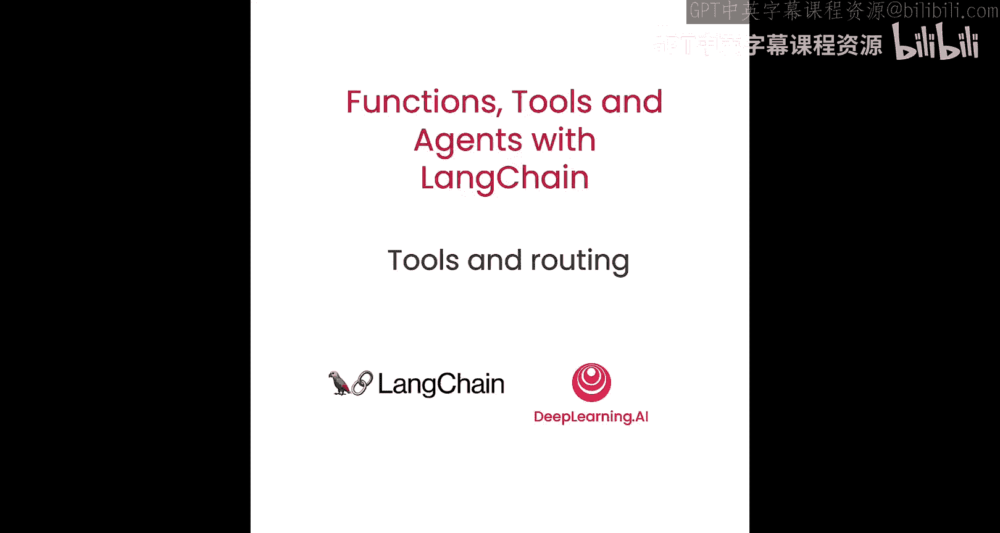

## 概述

在本节课中，我们将学习LangChain中一个重要的应用场景：工具的使用。我们将首先介绍LangChain中“工具”的概念，然后详细讲解如何使用OpenAI函数来选择并执行合适的工具。通过本课的学习，你将能够创建自定义工具，并让语言模型智能地决定何时以及如何使用它们。


---

## 什么是工具？🔧

上一节我们介绍了OpenAI函数的基本概念。本节中，我们来看看如何让语言模型实际使用这些函数。

当我们考虑让语言模型使用函数时，实际上包含两个组成部分：
1.  让语言模型决定使用哪个函数，以及该函数的输入应该是什么。
2.  使用这些输入实际调用该函数。

LangChain将这两个想法结合成一个称为“工具”的概念。一个工具本质上包含两部分：
*   函数的模式定义（可转换为OpenAI函数规范）。
*   一个可调用对象，用于实际执行该函数。

LangChain包内置了许多工具，例如搜索工具、数学工具、SQL工具等。但在本实验中，我们将重点学习如何创建自己的工具。这是因为，当你创建自己的链和智能体时，很大程度上依赖于创建自己的工具，因为你的任务通常是非常具体的。

接下来，我们将学习如何轻松创建自己的工具，然后学习如何使用语言模型来选择并调用这些工具。

让我们开始看代码。

---

## 创建自定义工具 🛠️

我们将从常规的设置开始，然后从LangChain导入一个工具装饰器。

```python
from langchain.tools import tool
```

这个装饰器可以放在我们定义的函数之上。它的作用是自动将此函数转换为一个可以在后续使用的LangChain工具。

### 基础工具创建

以下是一个简单的工具创建示例：

```python
@tool
def search(query: str) -> str:
    """用于搜索互联网的工具。"""
    return “执行搜索：” + query
```

现在，这个`search`函数拥有了名称、描述和参数。所有这些信息在创建OpenAI函数定义时都会被使用。

### 改进：定义输入模式

我们还可以通过为输入模式定义更明确的结构来改进工具。这通常很重要，因为输入描述是语言模型用来确定输入内容的依据。

我们可以通过定义一个Pydantic模型来实现：

```python
from pydantic import BaseModel, Field

class SearchInput(BaseModel):
    query: str = Field(description=”用于搜索互联网的查询词”)

@tool(args_schema=SearchInput)
def search(query: str) -> str:
    """用于搜索互联网的工具。"""
    return “执行搜索：” + query
```

`SearchInput`类与我们函数的参数结构匹配，主要区别在于我们为`query`参数添加了描述。这是一种将描述和其他信息传递给工具参数模式的方法。

现在，如果我们查看这个工具：

```python
print(search.name)
print(search.description)
print(search.args)
```

我们可以看到传入的描述信息。这个工具仍然是可调用的：

```python
result = search.run(“LangChain”)
print(result) # 输出：执行搜索：LangChain
```

目前这个工具内部并没有执行任何实际操作，稍后我们将看到如何让它真正工作。

---

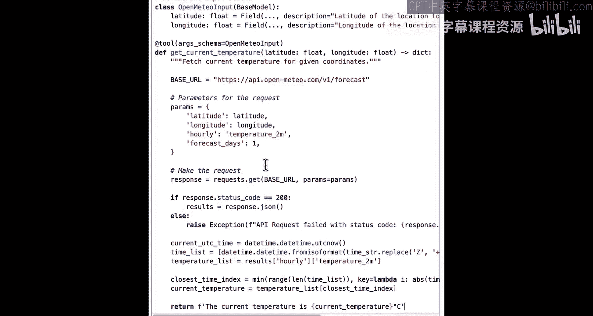

## 创建真实工具示例 🌡️📚

现在，我们来创建两个具有实际功能的工具。

### 工具一：获取当前温度

第一个工具是根据给定的经纬度获取当前温度。我们将使用Open-Meteo API。

以下是创建步骤：

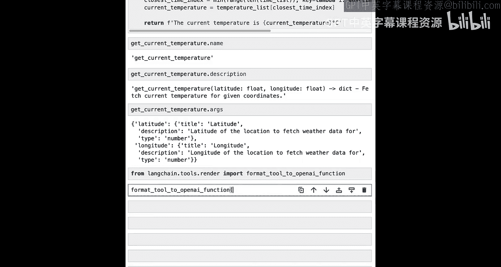

1.  **定义输入模式**：使用Pydantic模型定义经纬度参数。
2.  **定义函数**：使用`@tool`装饰器，并传入参数模式。
3.  **实现逻辑**：在函数内部调用Open-Meteo API获取天气预报，并解析出当前温度。

```python
import requests
from pydantic import BaseModel, Field

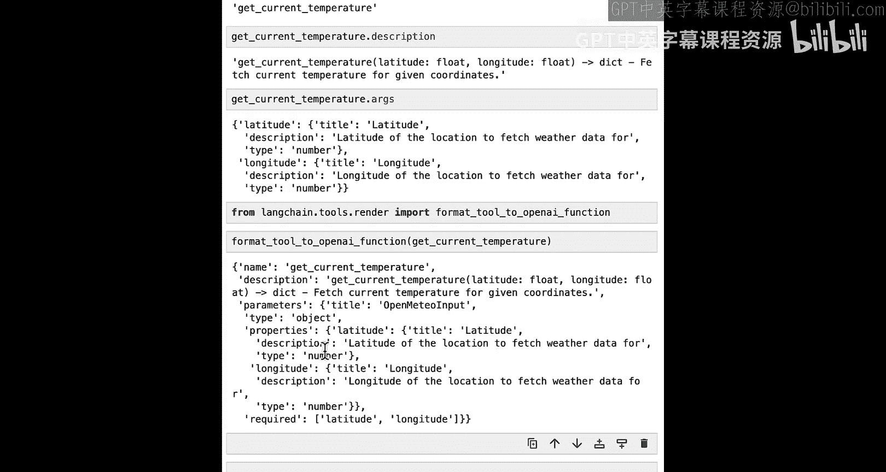

class OpenMeteoInput(BaseModel):
    latitude: float = Field(description=”地点的纬度”)
    longitude: float = Field(description=”地点的经度”)

@tool(args_schema=OpenMeteoInput)
def get_current_temperature(latitude: float, longitude: float) -> str:
    """获取给定经纬度的当前温度。"""

    # 调用Open-Meteo API
    url = “https://api.open-meteo.com/v1/forecast”
    params = {
        “latitude”: latitude,
        “longitude”: longitude,
        “hourly”: “temperature_2m”,
        “forecast_days”: 1,
    }
    response = requests.get(url, params=params)
    data = response.json()

    # 解析响应，找到最接近当前时间的温度
    hourly = data[“hourly”]
    temperatures = hourly[“temperature_2m”]
    time = hourly[“time”]
    # … (此处省略具体的时间匹配逻辑，例如找到当前时间对应的索引)
    current_temperature = temperatures[0] # 假设第一个就是当前温度

    return f”当前温度是 {current_temperature}°C”
```

现在，我们可以查看这个工具的信息，并将其转换为OpenAI函数定义所需的格式：

```python
from langchain.tools.render import format_tool_to_openai_function

# 查看工具属性
print(get_current_temperature.name) # 输出：get_current_temperature
print(get_current_temperature.description)

# 转换为OpenAI函数定义
openai_function_def = format_tool_to_openai_function(get_current_temperature)
print(openai_function_def)
```

`format_tool_to_openai_function`函数会返回一个JSON对象，其中包含了名称、描述以及包含经纬度属性的参数字典。这正是OpenAI函数所期望的格式。

这个工具现在是可调用的，它会向Open-Meteo API发出真实请求并获取准确的响应：

```python
result = get_current_temperature.run({“latitude”: 37.7749, “longitude”: -122.4194})
print(result) # 输出类似：当前温度是 22.9°C
```

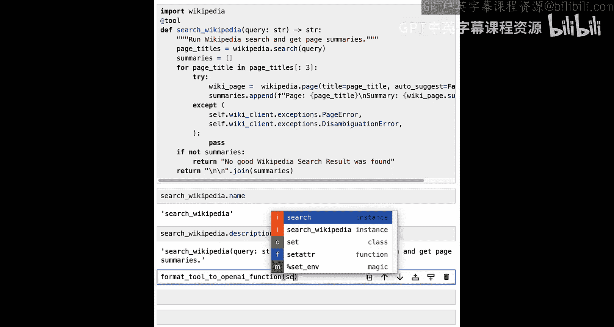

### 工具二：维基百科搜索工具

第二个工具用于在维基百科中搜索内容。

以下是创建步骤：

1.  函数接收一个查询词。
2.  使用`wikipedia` Python库进行搜索，获取页面列表。
3.  获取前几个页面的详细信息并拼接摘要返回。

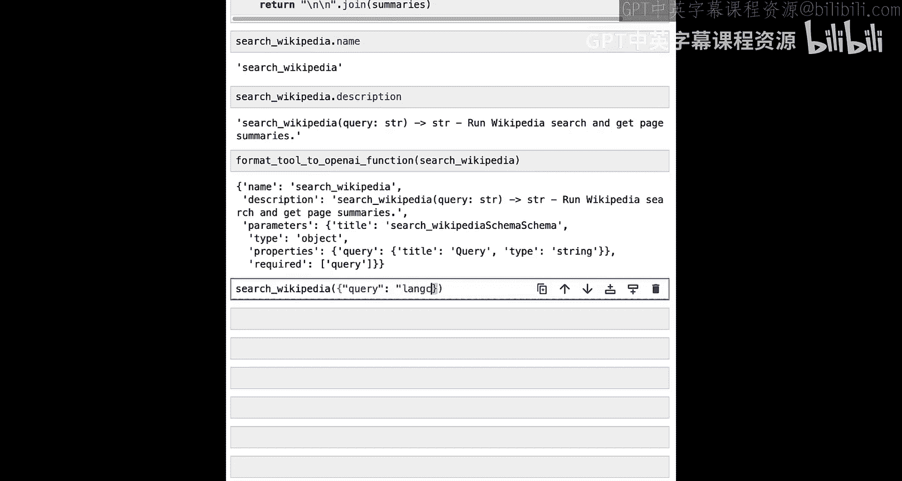

```python
import wikipedia
from pydantic import BaseModel, Field

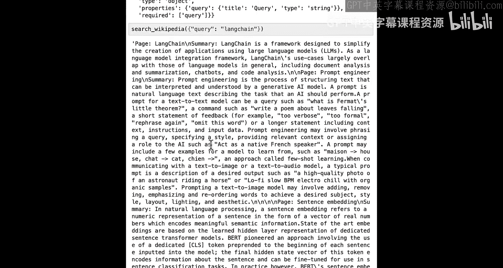

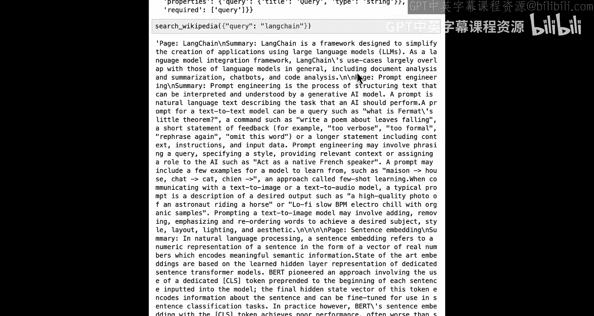

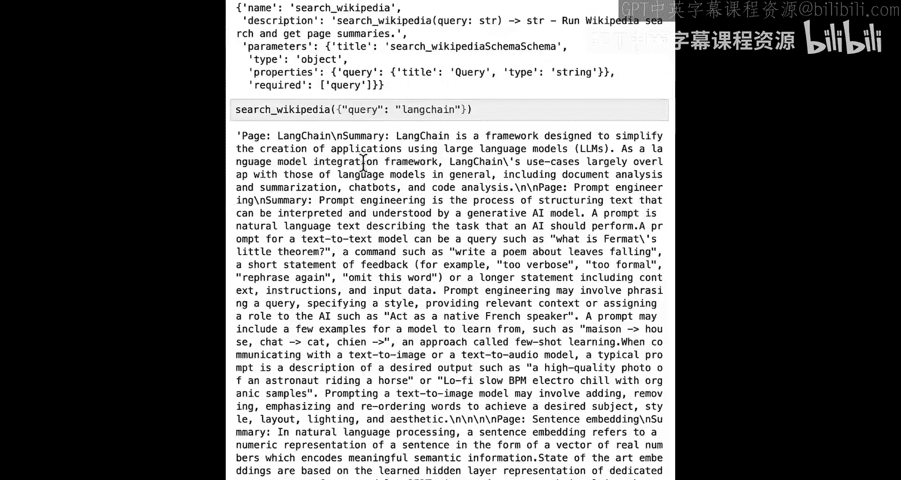

class WikipediaInput(BaseModel):
    query: str = Field(description=”用于搜索维基百科的查询词”)

@tool(args_schema=WikipediaInput)
def search_wikipedia(query: str) -> str:
    """在维基百科中搜索一个主题。"""
    # 执行搜索
    page_titles = wikipedia.search(query)
    summaries = []
    # 获取前3个结果的摘要
    for page_title in page_titles[:3]:
        try:
            page = wikipedia.page(page_title, auto_suggest=False)
            summaries.append(f”页面: {page_title}\n摘要: {page.summary}”)
        except wikipedia.exceptions.DisambiguationError:
            # 处理歧义页面
            continue
        except wikipedia.exceptions.PageError:
            # 处理页面不存在的情况
            continue
    if not summaries:
        return “未找到相关结果。”
    return “\n\n”.join(summaries)
```

同样，我们可以检查并调用这个工具：

```python
# 查看工具
print(search_wikipedia.name)
print(search_wikipedia.description)

# 调用工具
result = search_wikipedia.run(“LangChain”)
print(result) # 输出关于LangChain、提示工程、句子嵌入等页面的摘要
```

---

## 从OpenAPI规范创建工具 🌐

到目前为止，我们是在笔记本中创建函数，然后为其生成OpenAI函数定义。然而，我们想要交互的许多功能是通过API暴露的，而API通常使用一种称为OpenAPI规范的特定规范来定义其输入和输出。

接下来，我们将展示如何获取一个OpenAPI规范，并将其转换为一组OpenAI函数调用。这非常有用，因为许多功能都封装在API后面，拥有一种通用且简单的方式来与这些API交互将非常方便。

我们需要导入两个辅助函数：

```python
from langchain.utilities.openapi import OpenAPISpec
from langchain.tools.openapi.utils import openapi_spec_to_openai_fn
```

*   `OpenAPISpec`：用于加载OpenAPI规范。
*   `openapi_spec_to_openai_fn`：接收一个OpenAPI规范，并返回一个OpenAI函数列表。

假设我们有一个示例OpenAPI规范文本（例如，描述了一个宠物商店API，包含`GET /pets`， `POST /pets`， `GET /pets/{petId}`等端点）。

```python
# 示例OpenAPI规范文本
openapi_text = “””
openapi: 3.0.0
…
paths:
  /pets:
    get:
      summary: List all pets
      operationId: listPets
    post:
      summary: Create a pet
      operationId: createPet
  /pets/{petId}:
    get:
      summary: Info for a specific pet
      operationId: showPetById
“””

# 加载规范
spec = OpenAPISpec.from_text(openapi_text)

# 转换为OpenAI函数
openai_fns, callables = openapi_spec_to_openai_fn(spec)

print(len(openai_fns)) # 输出：3
for fn in openai_fns:
    print(fn[“name”]) # 输出：listPets, createPet, showPetById
```

`openapi_spec_to_openai_fn`返回两个东西：
1.  `openai_fns`：我们可以使用的OpenAI函数定义列表。
2.  `callables`：一组实际可调用来执行这些函数的对象（如果规范对应真实的API，这些对象将可用；对于这个虚构的规范，它们不是真实的）。

---

## 让语言模型选择工具 🧠➡️🛠️

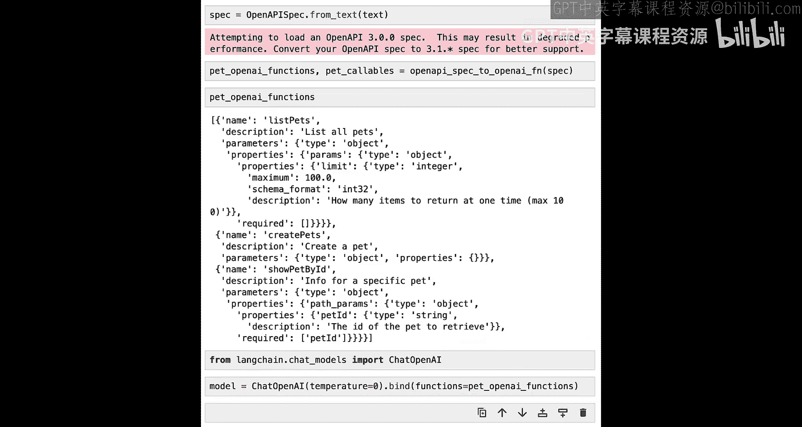

现在，我们将展示如何使用语言模型来决定调用这些函数中的哪一个。

首先，我们导入OpenAI模型，并创建一个简单版本，将温度设置为0（因为在选择函数时，我们可能希望以确定性的方式进行）。然后，我们将上面得到的函数列表绑定到这个模型上。

```python
from langchain.chat_models import ChatOpenAI

# 创建模型并绑定函数
model = ChatOpenAI(temperature=0).bind(functions=openai_fns)
```

现在，我们可以在几个不同的句子上尝试，看看会发生什么：

```python
# 示例1：询问宠物名字
response = model.invoke(“What are 3 pets names?”)
print(response.additional_kwargs) # 可能会显示它决定调用 listPets 函数，并带有限制参数 limit=3

# 示例2：询问特定宠物信息
response = model.invoke(“Tell me about pet with id 42”)
print(response.additional_kwargs) # 可能会显示它决定调用 showPetById 函数，并带有参数 petId=42
```

**现在是暂停的好时机，尝试用更多示例句子测试一下，看看会发生什么。**

---

## 应用于真实工具：路由机制 🧭

在上面的例子中，我们展示了如何使用OpenAI模型在不同函数之间进行选择。现在，我们将使其更具应用性。我们将把它应用到之前创建的两个真实工具上：天气工具和维基百科工具。我们将使用OpenAI模型来决定调用哪个函数，然后实际执行调用步骤。

这就创建了一种称为“路由”的机制，即我们使用语言模型来确定采取哪条路径以及该路径的输入。

首先，我们为两个工具创建OpenAI函数规范列表，并绑定到模型：

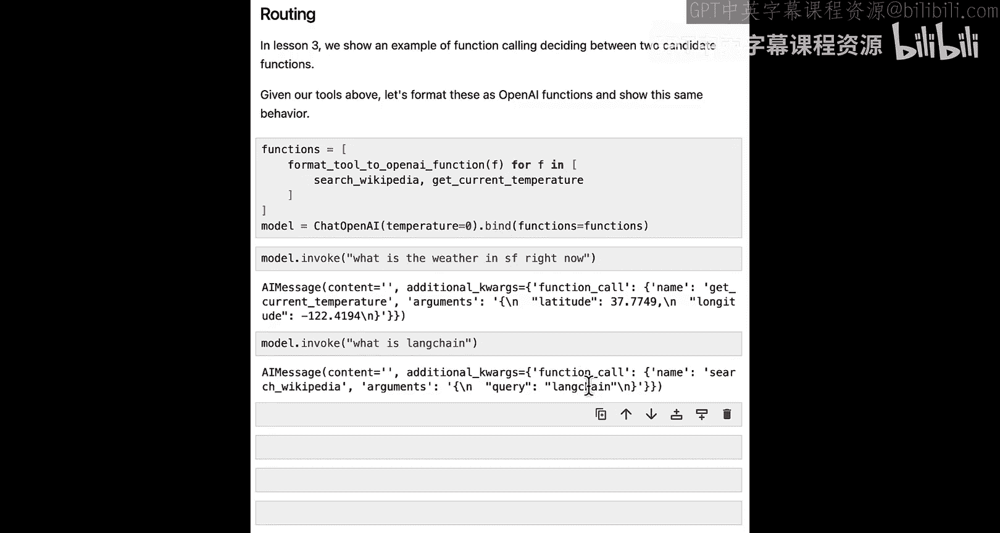

```python
# 获取两个真实工具的OpenAI函数定义
tools = [search_wikipedia, get_current_temperature]
openai_fns_for_tools = [format_tool_to_openai_function(t) for t in tools]

# 创建模型并绑定函数
model_with_tools = ChatOpenAI(temperature=0).bind(functions=openai_fns_for_tools)
```

让我们用几个句子调用这个模型：

```python
# 询问天气
response = model_with_tools.invoke(“What is the weather in SF right now?”)
print(response.additional_kwargs)
# 输出可能显示它使用了 get_current_temperature 工具，并带有经纬度参数。

# 询问LangChain
response = model_with_tools.invoke(“What is LangChain?”)
print(response.additional_kwargs)
# 输出可能显示它使用了 search_wikipedia 工具，并带有查询参数 query=LangChain。
```

---

## 构建完整的链：提示、模型与输出解析 ⛓️

我们可以更进一步，在语言模型调用之前添加一个提示。我们将创建一个超级简单的链，只包含这个提示和模型。

```python
from langchain.prompts import ChatPromptTemplate

# 创建一个简单的提示
prompt = ChatPromptTemplate.from_messages([
    (“system”, “You are a helpful but sassy assistant.”),
    (“user”, “{input}”),
])

# 创建链：提示 -> 模型
chain = prompt | model_with_tools
```

现在，如果我们用相同的输入调用这个链，可以看到返回了相同的响应。这很好，但输出格式仍然有点不方便处理，因为它是一个包含`additional_kwargs`等的复杂消息对象。

我们更希望将其转换为一个更易用、更易处理的格式，同时考虑语言模型响应的两种可能最终状态：
1.  **决定调用工具时**：我们感兴趣的是它决定调用的工具以及该工具的输入（最好不是JSON字符串，而是解析好的字典）。
2.  **不决定调用工具时**：我们感兴趣的是`content`字段的值。

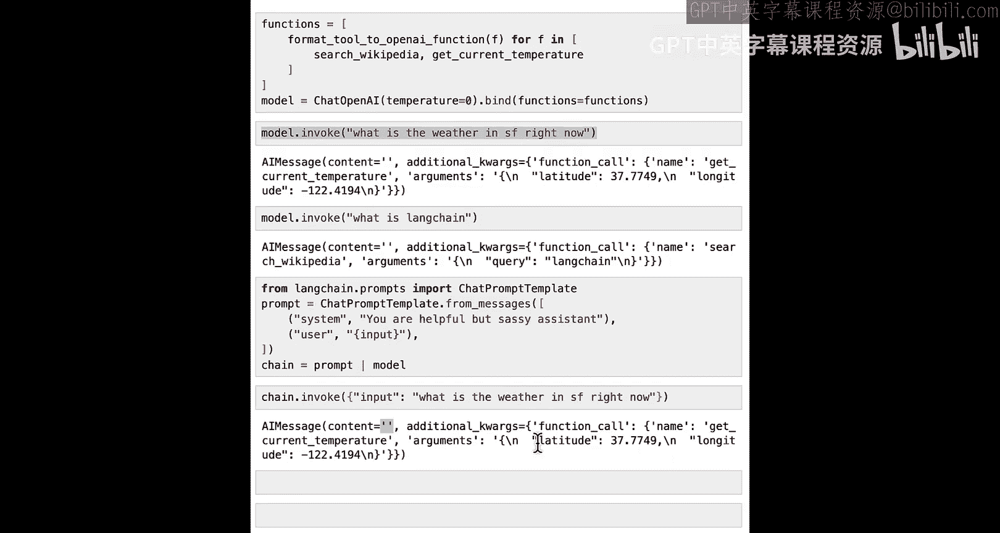

我们可以使用一个新的输出解析器来实现这一点：`OpenAIFunctionsAgentOutputParser`。

```python
from langchain.agents.output_parsers import OpenAIFunctionsAgentOutputParser

# 创建链：提示 -> 模型 -> 输出解析器
chain_with_parser = prompt | model_with_tools | OpenAIFunctionsAgentOutputParser()

# 调用链
result = chain_with_parser.invoke({“input”: “What is the weather in San Francisco right now?”})
```

现在，让我们看看`result`是什么：

```python
print(type(result)) # 输出：<class ‘langchain.schema.agent.AgentAction’>
```

它是一个`AgentAction`对象，因为它将要调用一个工具。

```python
print(result.tool) # 输出：get_current_temperature
print(result.tool_input) # 输出：{‘latitude’: 37.7749, ‘longitude’: -122.4194}
```

现在，我们可以轻松地将这些输入传递给工具本身：

```python
# 根据工具名称找到对应的工具对象（这里假设我们有一个工具字典）
tool_to_use = {t.name: t for t in tools}[result.tool]
tool_response = tool_to_use.run(result.tool_input)
print(tool_response) # 输出：当前温度是 22.9°C
```

那么，当没有工具需要调用时呢？例如，我们只是说“hi”。

```python
result = chain_with_parser.invoke({“input”: “hi”})
print(type(result)) # 输出：<class ‘langchain.schema.agent.AgentFinish’>
```

我们得到了一个`AgentFinish`对象。

```python
print(result.return_values) # 输出：{‘output’: ‘Hello! How can I assist you today?’}
```

总结一下底层逻辑：
*   如果调用了函数，则将其视为`AgentAction`。
*   如果没有调用函数，只是一个普通响应，则将其表示为`AgentFinish`。

---

## 最终步骤：执行路由与动作 🏁

我们已经展示了如何使用语言模型来确定要采取什么行动（或者是否采取行动），并将其表示为`AgentFinish`或`AgentAction`。

我们要添加的最后一件事是，在适当时实际执行该动作。为此，我们将定义一个路由函数。这个函数将根据语言模型的结果执行相应的步骤。

以下是路由函数的逻辑：
1.  检查结果是否为`AgentFinish`。如果是，则直接返回输出值。
2.  如果不是`AgentFinish`（即`AgentAction`），则查找正确的工具并使用指定的工具输入运行它。

```python
def route(result):
    if isinstance(result, AgentFinish):
        # 如果是最终结果，直接返回
        return result.return_values[‘output’]
    else:
        # 如果是工具调用动作，执行工具
        # 假设我们有一个工具名称到工具对象的映射
        tools_by_name = {tool.name: tool for tool in tools}
        tool_to_call = tools_by_name[result.tool]
        # 调用工具并返回结果
        observation = tool_to_call.run(result.tool_input)
        return observation
```

现在，我们创建一个新的链，它包含提示、模型、输出解析器，最后加上这个路由函数步骤：

```python
# 构建完整链：提示 -> 模型 -> 输出解析 -> 路由执行
full_chain = prompt | model_with_tools | OpenAIFunctionsAgentOutputParser() | route
```

让我们在几个例子上测试这个完整的链：

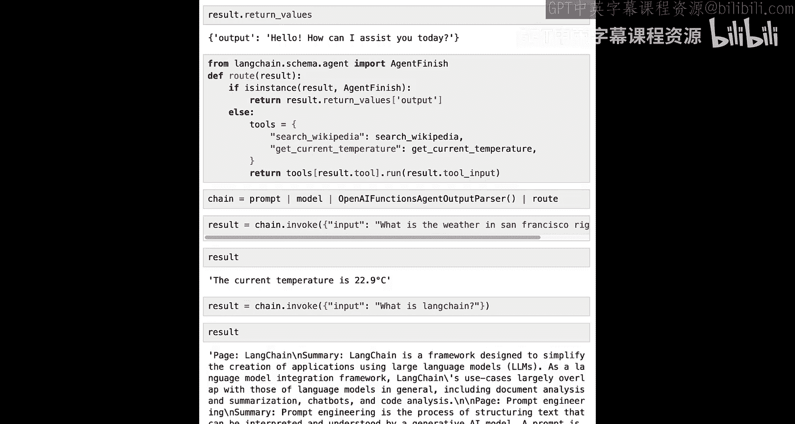

```python
# 示例1：询问天气
response = full_chain.invoke({“input”: “What is the weather in San Francisco right now?”})
print(response) # 输出：当前温度是 22.9°C

# 示例2：询问LangChain
response = full_chain.invoke({“input”: “What is LangChain?”})
print(response[:200]) # 输出维基百科搜索结果的摘要（前200个字符）

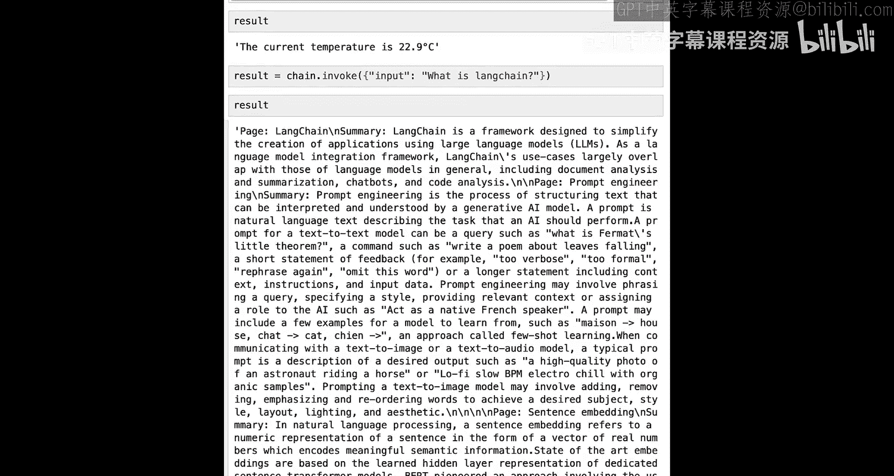

# 示例3：简单问候
response = full_chain.invoke({“input”: “hi”})
print(response) # 输出：Hello! How can I assist you today?
```

**现在是暂停的好时机，尝试用几个不同的输入来测试这个完整的链。这也是尝试创建新工具并将其添加到可调用函数列表中的好时机。**

---

## 总结 📚

本节课中，我们一起学习了：
1.  **工具的概念**：将函数模式定义与实际可调用对象结合，便于语言模型使用。
2.  **创建自定义工具**：使用`@tool`装饰器和Pydantic模型来定义具有清晰输入模式的工具。
3.  **从OpenAPI规范生成工具**：如何将现有的API规范快速转换为LangChain可用的工具集。
4.  **让模型选择工具**：通过将工具定义为OpenAI函数并绑定到语言模型，使其能够智能地选择需要调用的工具。
5.  **构建智能体工作流**：结合提示、模型、输出解析器（`OpenAIFunctionsAgentOutputParser`）和路由逻辑，创建了一个能够理解用户意图、选择正确工具、执行工具并返回结果的完整链。

我们展示了如何使用语言模型在不同工具之间进行路由，不仅决定采取什么行动，还通过路由步骤实际执行该行动。

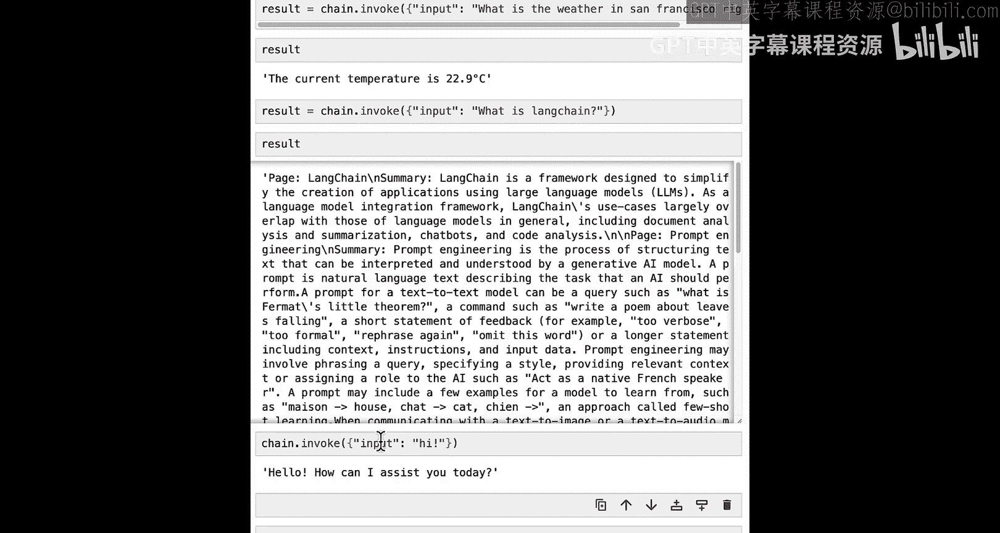

在下一节课中，我们将展示如何将其组合成一个循环，该循环持续迭代直到达到`AgentFinish`状态。敬请期待！