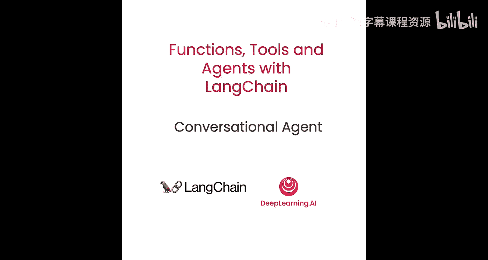
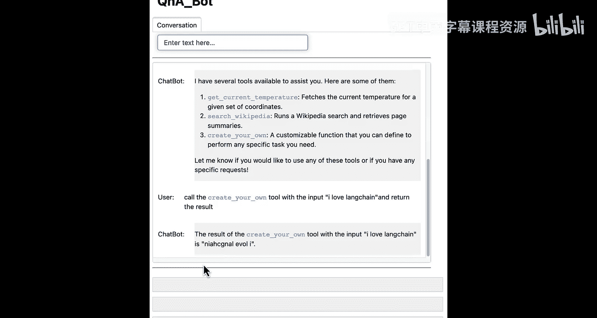
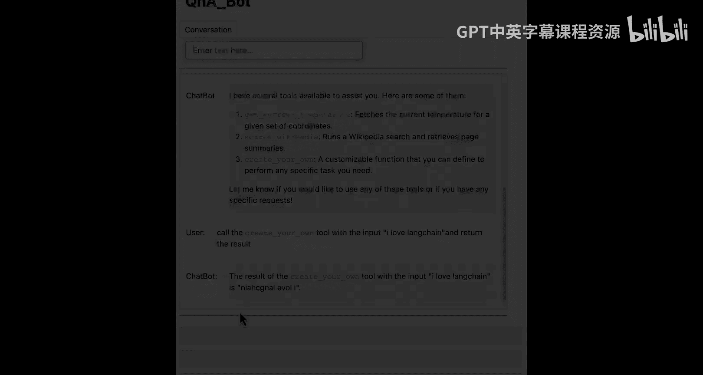

# 007：构建对话式智能体 🚀




在本节课中，我们将学习如何构建一个对话式智能体。我们将结合之前学到的工具使用、聊天记忆和智能体循环，创建一个类似ChatGPT的交互式应用。课程将涵盖智能体的核心概念、如何手动构建智能体循环，以及如何使用LangChain内置的`AgentExecutor`类来简化流程并增加错误处理等功能。

## 智能体基础概念 🤖

上一节我们介绍了工具的选择和调用。本节中，我们来看看如何将这些功能整合成一个能够自主决策和行动的“智能体”。

智能体是语言模型与代码的结合体。其核心工作流程如下：
1.  **推理**：语言模型分析当前情况，决定下一步应采取什么**行动**（调用哪个工具），以及该行动的**输入**是什么。
2.  **执行与观察**：智能体循环根据模型的决策**选择并调用工具**，然后**观察工具的输出结果**。
3.  **循环**：将行动和观察结果反馈给语言模型，重复步骤1和2，直到满足**停止条件**。

停止条件可以是：
*   **语言模型自行决定停止**：例如，当模型认为已经回答了用户问题，并输出`AgentFinish`时。
*   **硬编码规则**：例如，达到最大迭代次数。

在本实验中，我们将使用上一课构建的工具，并将路由、选择和调用工具的概念，通过LangChain表达式语言（LCEL）整合到我们自己的智能体循环中。我们还将展示如何使用LangChain的`AgentExecutor`类，它不仅实现了智能体循环，还增加了错误处理、提前停止和跟踪等功能。

## 环境与工具设置 ⚙️

首先，我们需要设置环境并导入必要的库。我们将使用与上一课相同的两个工具。

以下是需要导入的模块和工具定义：

```python
# 导入工具装饰器
from langchain.tools import tool

# 定义获取当前天气的工具
@tool
def get_current_temperature(location: str) -> str:
    """获取指定地点的当前温度。"""
    # 模拟返回数据
    return f"The current temperature in {location} is 22.9 degrees Celsius."

# 定义维基百科搜索工具
@tool
def search_wikipedia(query: str) -> str:
    """在维基百科中搜索查询内容。"""
    # 模拟返回数据，例如搜索“LangChain”
    return f"LangChain is a framework designed to simplify the creation of applications using large language models."

# 创建工具列表
tools = [get_current_temperature, search_wikipedia]
```

## 构建智能体链 🔗

接下来，我们需要构建智能体的核心逻辑链，它负责根据输入决定使用哪个工具。这部分我们在上一课已经实现过。

以下是构建智能体链的步骤：

```python
from langchain.chat_models import ChatOpenAI
from langchain.prompts import ChatPromptTemplate, MessagesPlaceholder
from langchain.agents.output_parsers import OpenAIFunctionsAgentOutputParser
from langchain.agents.format_scratchpad import format_to_openai_functions

# 1. 将工具格式化为OpenAI函数格式
functions = [format_tool_to_openai_function(t) for t in tools]

# 2. 初始化语言模型，并绑定函数
model = ChatOpenAI(temperature=0).bind(functions=functions)

# 3. 构建提示模板。注意新增的`agent_scratchpad`占位符，用于存放行动和观察的历史记录。
prompt = ChatPromptTemplate.from_messages([
    ("system", "You are a helpful but sassy assistant."),
    ("user", "{input}"),
    MessagesPlaceholder(variable_name="agent_scratchpad"), # 新增：历史记录占位符
])

# 4. 将各个部分组合成链
agent_chain = prompt | model | OpenAIFunctionsAgentOutputParser()
```

现在，如果我们用某个输入调用这个链，它会返回一个推荐使用的工具和工具输入。但此时它还没有形成循环。

## 实现智能体循环 🔄

我们的目标是创建一个循环：决定使用哪个工具 -> 调用该工具 -> 将结果反馈给模型 -> 重复，直到满足停止条件。

为了实现这个循环，我们需要将每次“行动”和对应的“观察”结果转换成消息列表，并传递回提示模板的`agent_scratchpad`中。`format_to_openai_functions`函数可以帮助我们完成这个转换。

让我们手动模拟一步循环：

```python
# 第一步：初始调用，历史记录为空列表
result1 = agent_chain.invoke({
    "input": "What's the weather in San Francisco?",
    "agent_scratchpad": []  # 初始无历史
})
# result1 可能是一个 `AgentAction` 对象，指示调用 `get_current_temperature` 工具。

# 第二步：根据结果调用工具，并获取观察结果
tool_to_use = result1.tool
tool_input = result1.tool_input
observation = tool_to_use.invoke(tool_input) # 例如：调用天气工具

# 第三步：将 (行动, 观察) 对格式化为消息列表，以便传回链中
from langchain.agents.format_scratchpad import format_to_openai_functions
agent_scratchpad = format_to_openai_functions([(result1, observation)])

# 第四步：带着历史记录再次调用链
result2 = agent_chain.invoke({
    "input": "What's the weather in San Francisco?", # 原始问题不变
    "agent_scratchpad": agent_scratchpad # 传入上一步的历史
})
# result2 这次可能是一个 `AgentFinish` 对象，包含最终答案。
```

## 封装智能体运行函数 📦

我们将上述循环逻辑封装成一个函数，使其能够自动运行多步。

```python
def run_agent(user_input):
    """运行智能体的主循环函数。"""
    intermediate_steps = [] # 存储 (行动, 观察) 对的列表
    while True:
        # 调用链，传入用户输入和历史步骤（经过格式化）
        result = agent_chain.invoke({
            "input": user_input,
            "agent_scratchpad": format_to_openai_functions(intermediate_steps)
        })
        # 检查结果类型
        if hasattr(result, 'return_values'): # 如果是 AgentFinish
            return result.return_values['output']
        else: # 如果是 AgentAction
            # 1. 查找对应的工具
            tool_to_use = next(tool for tool in tools if tool.name == result.tool)
            # 2. 调用工具
            observation = tool_to_use.invoke(result.tool_input)
            # 3. 将步骤存入历史
            intermediate_steps.append((result, observation))
            # 循环继续...
```

为了让链更自包含，我们可以使用LCEL的`RunnablePassthrough`将格式化步骤整合到链内部。

```python
from langchain.schema.runnable import RunnablePassthrough

# 创建新的链，内部处理 intermediate_steps 的格式化
agent_chain_with_scratchpad = RunnablePassthrough.assign(
    agent_scratchpad=lambda x: format_to_openai_functions(x['intermediate_steps'])
) | prompt | model | OpenAIFunctionsAgentOutputParser()

# 更新后的运行函数
def run_agent_v2(user_input):
    intermediate_steps = []
    while True:
        result = agent_chain_with_scratchpad.invoke({
            "input": user_input,
            "intermediate_steps": intermediate_steps
        })
        if hasattr(result, 'return_values'):
            return result.return_values['output']
        else:
            tool_to_use = next(tool for tool in tools if tool.name == result.tool)
            observation = tool_to_use.invoke(result.tool_input)
            intermediate_steps.append((result, observation))
```

现在，我们可以测试这个智能体：

```python
print(run_agent_v2("What's the weather in SF?"))
# 输出：The current temperature in San Francisco is 22.9 degrees Celsius.

print(run_agent_v2("What is LangChain?"))
# 输出：LangChain is a framework designed to simplify the creation of applications using large language models.
```

## 使用AgentExecutor类 🛠️

手动管理循环虽然有助于理解，但LangChain提供了更强大、更完善的`AgentExecutor`类。它封装了循环逻辑，并增加了以下功能：
*   **更好的日志记录**：方便调试。
*   **错误处理**：如果语言模型输出无效的JSON，或工具调用出错，它能捕获错误并让模型尝试纠正。
*   **提前停止**：支持最大迭代次数等限制。

使用`AgentExecutor`非常简单：

```python
from langchain.agents import AgentExecutor

# 使用之前定义的 agent_chain_with_scratchpad 和 tools
agent_executor = AgentExecutor(
    agent=agent_chain_with_scratchpad,
    tools=tools,
    verbose=True, # 开启详细日志
    # max_iterations=3, # 可以设置最大迭代次数防止无限循环
)

result = agent_executor.invoke({"input": "What is LangChain?"})
print(result["output"])
```
运行时会看到详细的思考过程和工具调用日志。

## 添加对话记忆 💬

目前的智能体虽然能调用工具，但无法记住对话历史。要构建真正的聊天机器人，需要添加记忆功能。

我们需要修改提示模板，加入`chat_history`占位符，并使用`ConversationBufferMemory`来保存历史消息。

以下是修改步骤：

```python
from langchain.memory import ConversationBufferMemory

# 1. 更新提示模板，在系统消息和用户输入之间加入聊天历史占位符
prompt_with_history = ChatPromptTemplate.from_messages([
    ("system", "You are a helpful but sassy assistant."),
    MessagesPlaceholder(variable_name="chat_history"), # 新增：聊天历史
    ("user", "{input}"),
    MessagesPlaceholder(variable_name="agent_scratchpad"),
])

# 2. 重新构建包含历史的智能体链
agent_chain_with_history = RunnablePassthrough.assign(
    agent_scratchpad=lambda x: format_to_openai_functions(x['intermediate_steps'])
) | prompt_with_history | model | OpenAIFunctionsAgentOutputParser()

# 3. 创建记忆对象，返回消息格式（而非字符串）
memory = ConversationBufferMemory(memory_key="chat_history", return_messages=True)

# 4. 创建带有记忆的AgentExecutor
agent_executor_with_memory = AgentExecutor(
    agent=agent_chain_with_history,
    tools=tools,
    verbose=True,
    memory=memory,
)

# 测试对话
print(agent_executor_with_memory.invoke({"input": "Hi, my name is Bob."})["output"])
print(agent_executor_with_memory.invoke({"input": "What's my name?"})["output"])
# 输出应该能正确回答“Bob”。
```

## 创建交互式聊天界面 🎨

最后，我们可以将所有功能整合，并使用`panel`库创建一个简单的图形界面来与我们的智能体聊天。

我们首先添加一个新工具作为示例：

```python
@tool
def reverse_string(query: str) -> str:
    """将输入的字符串反转。"""
    return query[::-1]

# 更新工具列表
tools = [get_current_temperature, search_wikipedia, reverse_string]
```

然后，使用Panel构建一个简单的Web应用界面（代码框架）：

```python
import panel as pn
pn.extension()

# 初始化所有组件（链、执行器、记忆）的代码与前面相同
# ...

# 定义聊天回调函数
def callback(contents: str, user: str, instance: pn.chat.ChatInterface):
    # 调用带有记忆的agent_executor
    response = agent_executor_with_memory.invoke({"input": contents})
    # 将响应发送回聊天界面
    return response["output"]

# 创建聊天界面对象
chat_interface = pn.chat.ChatInterface(callback=callback)
chat_interface.send("Hello! I'm your AI assistant. How can I help you?", user="System", respond=False)

# 将界面定义为可服务的对象
dashboard = pn.Column(chat_interface)
dashboard.servable()
```
运行此脚本会启动一个本地Web服务器，你可以在浏览器中与你的智能体进行多轮对话，并看到它调用工具的过程。

## 总结与练习 🎯

本节课中我们一起学习了如何从零开始构建一个对话式智能体。我们涵盖了以下核心内容：
1.  **智能体的概念**：它是语言模型推理与工具执行的循环结合。
2.  **构建智能体链**：使用LCEL将提示、模型和输出解析器组合起来。
3.  **实现循环逻辑**：手动管理`intermediate_steps`，实现“行动-观察”的循环。
4.  **使用`AgentExecutor`**：利用LangChain内置的高级执行器，获得错误处理和日志功能。
5.  **集成对话记忆**：通过`ConversationBufferMemory`使智能体具备多轮对话能力。
6.  **创建交互界面**：使用Panel库为智能体打造一个可视化的聊天窗口。

现在，你可以尝试以下练习来巩固所学：
*   **添加新工具**：创建一个计算器工具或查询当前时间的工具。
*   **修改系统提示**：改变AI助手的性格（如更正式或更幽默）。
*   **测试复杂任务**：提出需要连续调用多个工具才能解决的问题（例如，“获取旧金山的天气，然后搜索一下这个温度下适合进行的户外活动”）。
*   **探索不同记忆类型**：尝试使用`ConversationSummaryMemory`来压缩长对话历史。





你已成功构建了一个功能接近ChatGPT核心交互机制的智能体。它能够理解你的意图、调用外部工具、并记住对话上下文。期待看到你用这项技术创造出更多有趣的应用！