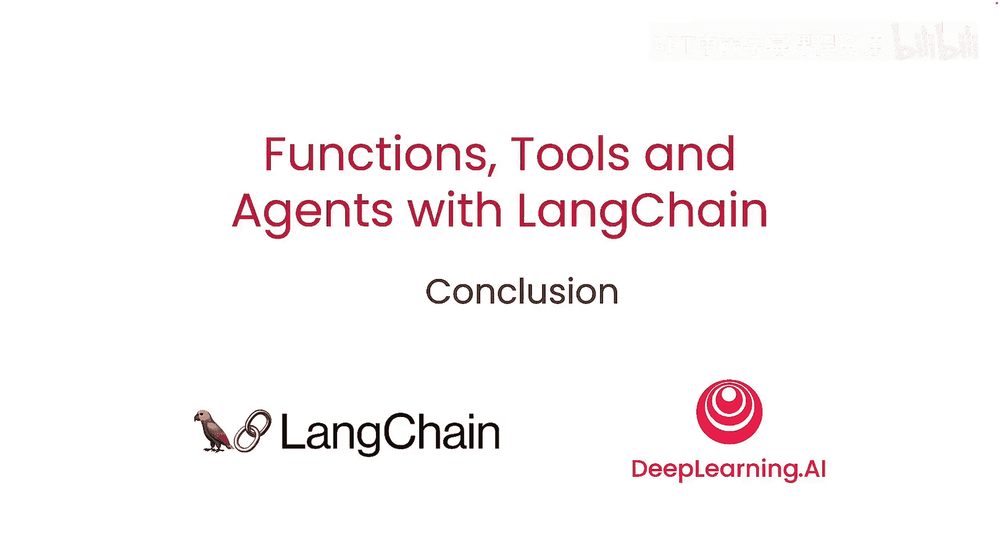

# 008：课程总结

在本节课中，我们将对这门课程进行总结，回顾所学到的核心概念与技术，并展望如何将这些知识应用到实际项目中。

---

以上内容为本课程的结尾。当前是人工智能领域一个非常激动人心的时期，许多技术正在快速发展。在本课程中，我们重点介绍了其中的两项关键技术：OpenAI的函数调用功能以及LangChain表达式语言。

我们展示了如何利用这些技术进行结构化数据提取，以及如何使用和选择工具。最后，我们将所有知识整合在一起，构建了一个对话式智能体。

掌握了所有这些知识后，唯一剩下的事情就是将它们应用到现实世界的具体用例中。