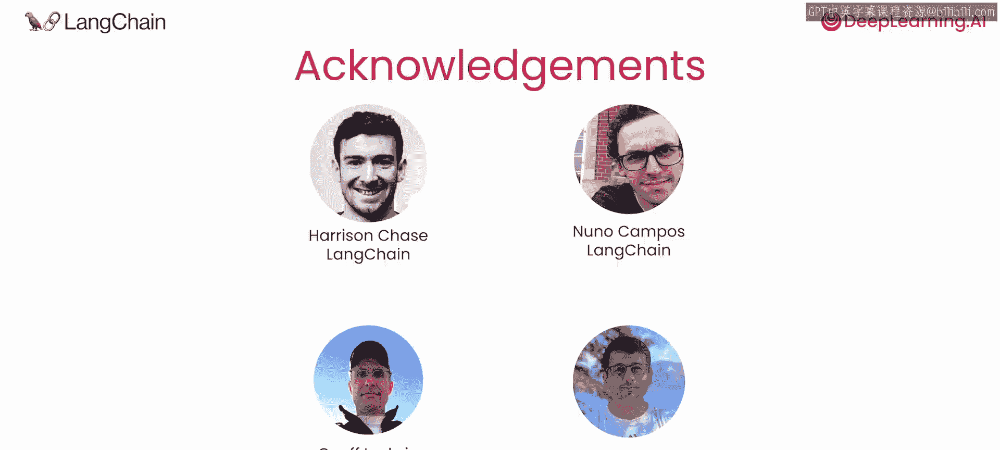

# 001：课程介绍 🚀

## 概述

在本节课中，我们将了解大型语言模型应用的重要性，并介绍一个能帮助JavaScript开发者更高效构建此类应用的工具——LangChain。

---

大型语言模型应用正变得日益重要和主流。我认为，对于JavaScript开发者而言，学会使用这些工具并将其集成到自己的应用中至关重要。我希望本课程能在这方面为你提供帮助。

在构建使用大型语言模型的应用时，开发者通常会遵循一些通用步骤。LangChain能让JavaScript开发者更轻松地完成这些步骤。

例如，如果你正在构建一个检索增强生成应用，你需要：选择一个语言模型来执行任务；找到如何检索相关文本来填充模型的上下文；调整提示词；并且可能还需要将模型的文本输出解析为更结构化的格式，以供应用的下游步骤使用。

有些工具能帮助你连接这些步骤，并让你能快速调整整个工作流程，例如轻松更换不同的语言模型。这类工具被称为“编排器”。

LangChain是一个非常流行的、用于LLM应用的开源编排器，它将帮助你更快地构建LLM应用。

本课程的讲师是Jacob Lee，他是LangChain的创始软件工程师，也是开源项目LangChain.js的维护者。

Jacob曾与许多开发者合作，帮助他们将语言模型集成到Web和移动应用中。

感谢Andrew的介绍。我对大家在本课程中将能学到的内容感到非常兴奋。

---

## 你将学到的核心内容

以下是本课程将涵盖的、在LLM应用中常见的几个核心元素：

*   **数据加载器**：让你能方便地从PDF、网站、数据库等常见数据源提取数据，以增强LLM的生成能力。
*   **解析器**：语言模型处理自然语言，而编程语言处理格式化数据。解析器能提取并格式化自然语言输出，为你的下游代码创建结构化的处理形式。
*   **提示词**：用于为语言模型提供上下文。
*   **模型**：在特定语言模型之上提供一个抽象层，使你编写的应用本身不依赖于特定供应商。
*   **其他模块**：支持RAG应用的其他模块，例如文本分割器以及与向量数据库的集成。

你还将学习使用**LangChain表达式语言**来轻松组合这些模块，形成复杂的处理链。

---

## 课程贡献者

许多人共同促成了这门课程。我们感谢LangChain的创始人兼首席执行官Harrison Chase，以及同样来自LangChain的Noa Comfor。在DeepLearning.AI方面，Jeff Ludwig和Ashwin Gagari也为本课程做出了贡献。

这里有很多很棒的内容值得学习。完成本课程后，我希望你能够用JavaScript构建出一些非常酷的基于语言模型的应用。

Jacob，LangChain标志里的鹦鹉是怎么回事？Andrew，我也不太确定，但它已经成为我们标志性的一部分了。

---

## 总结

本节课我们一起了解了LLM应用的发展趋势，认识了能大幅提升开发效率的编排工具LangChain及其核心组成模块，并对本课程的内容和讲师有了初步认识。接下来，我们将开始深入学习如何使用这些工具。