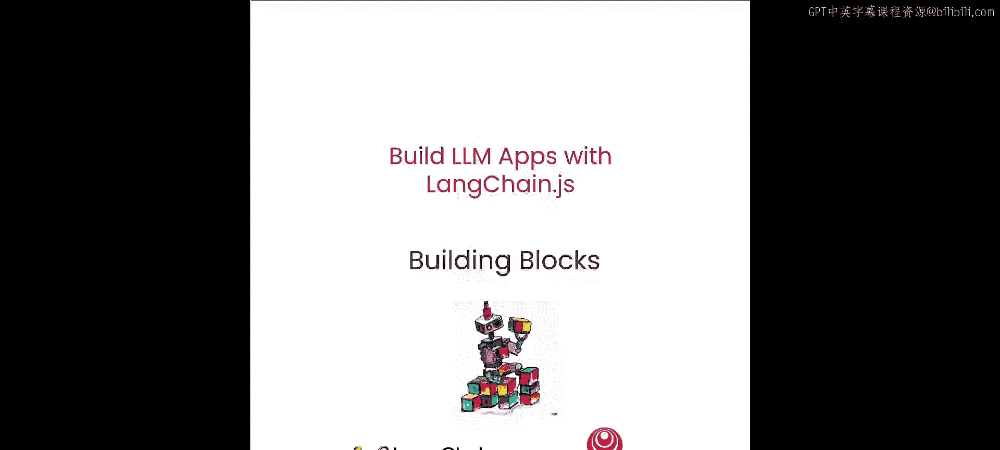
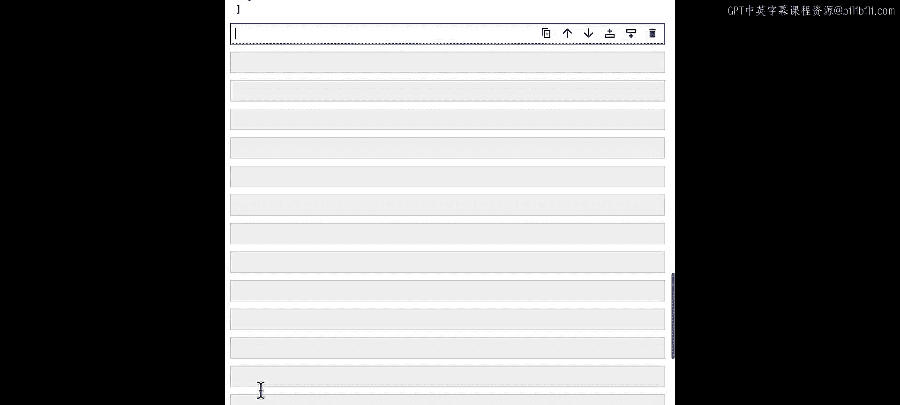
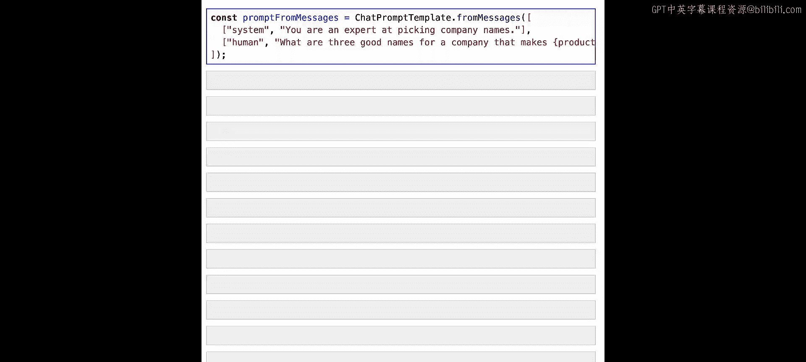
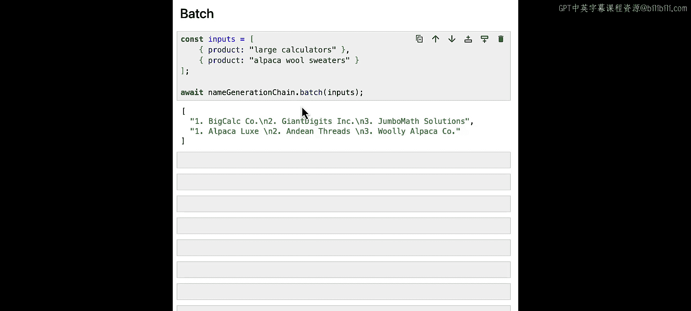

# 002：核心构建模块 🧱




在本节课中，我们将学习LLM应用的一些基本构建模块，即**提示模板**、**模型**和**输出解析器**。同时，你将了解如何使用LangChain表达式语言将它们组合在一起，创建功能链。


---

## 为什么选择LangChain.js？🤔

在深入学习之前，我们先探讨一个重要问题：为何选择LangChain.js？JavaScript拥有全球最大的开发者生态系统，许多开发者更倾向于使用JavaScript。选择它也可能是因为其便捷的部署工具、强大的扩展特性（如Next.js的云服务、边缘函数或Cloudflare Workers），以及随之而来的先进工具链。此外，如果你需要为多个平台（如浏览器扩展、React Native移动应用、Electron桌面应用）进行开发，JavaScript也是一个理想选择。

一个注意事项：本教程使用Deno Jupyter内核，这是一个与Node和Web环境略有差异的JavaScript运行时。在大多数情况下，你可以直接将代码复制粘贴到不同环境中，如有差异，我们会特别指出。

---

## LangChain表达式语言简介 🔗

LangChain使用表达式语言来组合各个组件。与这种语言兼容并可用的组件被称为**Runnable**。它们定义了一些核心方法、允许的输入和输出类型，并让你可以直接使用`invoke`、`stream`和`batch`等方法，这些是构建和使用LLM应用时的常用方法。你还可以使用`bind`方法在运行时修改参数。

一个具体的例子就是本节课将介绍的“提示-LLM-输出解析器”三元组。Runnable协议的其他好处包括：通过`batch`方法获得回退和并行处理能力，以及通过LangSmith（一个追踪和可观测性工具）内置的日志记录和追踪功能。在整个课程中，我们将链接到一些可探索的LangSmith追踪记录，以说明不同链的工作原理。

---

## 语言模型 🧠

让我们从LangChain最基础的组件之一——语言模型开始。LangChain支持两种类型的语言模型：
1.  **文本LLM**：接收字符串输入，返回字符串输出。即 `string -> string`。
2.  **聊天模型**：接收消息列表作为输入，返回单个消息作为输出。例如流行的ChatGPT和GPT-4。

文本LLM的输入和输出易于可视化。让我们看看直接调用聊天模型是什么样子。

首先，我们导入环境变量。本课程主要使用OpenAI的GPT-3.5 Turbo（一个聊天模型）。我们导入其LangChain包装器，并导入`HumanMessage`类来包装和创建聊天模型输入。

```javascript
import { ChatOpenAI } from "langchain/chat_models/openai";
import { HumanMessage } from "langchain/schema";
```

然后初始化模型：

```javascript
const chatModel = new ChatOpenAI({
  modelName: "gpt-3.5-turbo",
  temperature: 0,
});
```

现在尝试查询它，传入一个消息列表（这里只是一个对应我们输入的`HumanMessage`）：

```javascript
const response = await chatModel.invoke([
  new HumanMessage("Tell me a joke"),
]);
console.log(response);
// 输出示例: AI消息，包含笑话内容
```

你会注意到，聊天模型输出的消息包含一个`content`字段（存放消息的文本值）和一个`role`字段（对应发送者）。这里，我们从发送原始消息的`human`（我们）开始，AI用`ai`消息回应。

虽然我们使用GPT-3.5 Turbo，但LangChain支持来自不同供应商的模型，你可以在任何代码示例中尝试替换提供的类。

---

## 提示模板 📝

虽然像上面那样单独调用模型很有用，但通常更便捷的做法是将模型输入背后的逻辑提取成可复用的、参数化的组件，而不是每次都输入完整的查询。为此，LangChain包含了**提示模板**，它负责为用户输入格式化，以便后续模型调用。

让我们看看它的样子。导入`ChatPromptTemplate`类并初始化：

```javascript
import { ChatPromptTemplate } from "langchain/prompts";

const promptTemplate = ChatPromptTemplate.fromTemplate(
  `What are three good names for a company that makes {product}?`
);
```

这里，我们使用花括号`{product}`表示一个输入变量。传入提示的任何内容都会被注入并格式化到这个部分。

提示模板对于平滑处理模型输入类型的差异也很有用。这里我们直接从字符串构造了一个提示模板。我们可以使用这个提示模板的`format`方法为LLM生成字符串输入，并传入输入变量：

```javascript
const formattedString = await promptTemplate.format({
  product: "colorful socks",
});
console.log(formattedString);
// 输出: "Human: What are three good names for a company that makes colorful socks?"
```

我们也可以使用`formatMessages`方法将提示格式化为消息数组，这适用于调用聊天模型：

```javascript
const formattedMessages = await promptTemplate.formatMessages({
  product: "colorful socks",
});
console.log(formattedMessages);
// 输出: [ HumanMessage { content: "What are three good names for a company that makes colorful socks?" } ]
```

为了更精细地控制传递给提示的消息类型，我们可以直接为消息创建提示模板。例如，许多模型和供应商依赖**系统消息**来定义特定行为。这是一个格式化输入的好方法。

以下是示例：

```javascript
import { SystemMessagePromptTemplate, HumanMessagePromptTemplate } from "langchain/prompts";

const prompt = ChatPromptTemplate.fromMessages([
  SystemMessagePromptTemplate.fromTemplate("You are a helpful assistant that generates company names."),
  HumanMessagePromptTemplate.fromTemplate("What are three good names for a company that makes {product}?"),
]);

const messages = await prompt.formatMessages({
  product: "shiny objects",
});
console.log(messages);
// 输出包含系统消息和人类消息的数组
```

一个方便的简写是使用元组，无需导入那些消息提示模板类：

```javascript
const prompt = ChatPromptTemplate.fromMessages([
  ["system", "You are a helpful assistant that generates company names."],
  ["human", "What are three good names for a company that makes {product}?"],
]);
```

运行`format`会得到完全相同的输出。这在后面传递历史记录时很有用，因为你可以直接将历史消息注入提示中。



---



## 使用LCEL组合链 🔄

虽然我们可以将这些格式化后的值直接传递给模型，但实际上有一种更优雅的方式将提示和模型结合使用，那就是**LangChain表达式语言**。LCEL是一种用于链接LangChain模块的可组合语法。同样，与LCEL兼容的对象称为**Runnable**。

我们可以使用`pipe`方法从上面声明的提示和模型构造一个简单的链：

```javascript
const chain = promptTemplate.pipe(chatModel);
```

这将创建一个链，其中输入与序列中的第一步（这里是提示）相同，即一个具有`product`属性的对象。提示模板使用此输入，并将正确格式化的结果作为输入传递给链的下一步（这里的聊天模型）。

实际操作如下：

```javascript
const response = await chain.invoke({
  product: "colorful socks",
});
console.log(response);
// 输出: AI消息，包含三个有趣的公司名
```

---

## 输出解析器 🎯

本节课要讨论的最后一个核心概念是格式化输出。例如，通常使用聊天模型输出的原始字符串值比使用AI消息对象更方便。LangChain中用于此目的的抽象称为**输出解析器**。

我们导入一个将聊天模型输出（单个消息）强制转换为字符串的解析器：

```javascript
import { StringOutputParser } from "langchain/schema/output_parser";

const outputParser = new StringOutputParser();
```

现在，让我们用这个输出解析器重新声明我们的链：

```javascript
const chain = promptTemplate.pipe(chatModel).pipe(outputParser);
```

如果我们再次运行这个链（换一个产品），这次你会看到我们得到的是字符串，而不是聊天消息对象：

```javascript
const result = await chain.invoke({
  product: "fancy cookies",
});
console.log(result);
// 输出示例: "1. Delicate Crumbs\n2. Gourmet Cookie Creations\n3. Elegant Sweet Scoop"
```

提示模板、模型和输出解析器这三个部分构成了许多复杂链的核心，因此现在熟练掌握它们非常重要。

---

## Runnable的实用方法 ⚙️

所有Runnable及其序列本身也是Runnable，它们免费获得了一些有用的方法。

**1. 流式传输**
对于Web开发社区的许多人来说，流式传输非常重要。`stream`方法以可迭代流的形式返回链的输出。由于LLM响应通常需要很长时间才能完成，这在需要快速显示反馈的情况下非常有用。

以下是我们刚刚组合的链的示例：

```javascript
const stream = await chain.stream({
  product: "really cool robots",
});

for await (const chunk of stream) {
  console.log(chunk);
  // 逐块输出字符串，例如 "RoboTech Innovations", "FutureBot Solutions", "MechanoWorks Unlimited"
}
```

输出解析器会在模型生成时转换这些块，从而产生字符串输出块，而不是模型原始输出。

**2. 批量处理**
这对于同时执行多个并发操作和生成非常有用。我们将输入定义为一个数组，每个输入都应匹配提示模板的语法。

```javascript
const inputs = [
  { product: "large calculators" },
  { product: "alpaca wool sweaters" },
];

const results = await chain.batch(inputs);
console.log(results);
// 输出: 包含两个字符串的数组，分别是为两个不同产品生成的公司名列表
```

---

## 总结 📚

在本节课中，我们一起学习了LangChain.js的核心构建模块：
*   **语言模型**：分为文本LLM和聊天模型，是应用的核心。
*   **提示模板**：用于参数化和格式化用户输入，提高代码复用性。
*   **输出解析器**：用于将模型输出转换为更易处理的格式（如字符串）。
*   **LangChain表达式语言**：使用`pipe`方法或`RunnableSequence.from`将这些组件优雅地组合成链。
*   **实用方法**：Runnable协议免费提供了`invoke`、`stream`（用于流式响应）和`batch`（用于并行处理）等方法，极大地简化了开发。



这些模块是构建更复杂LLM应用的基础。在继续下一课之前，建议你尝试修改这些提示、模板甚至表达式语言链，以更好地理解它们是如何协同工作的。下一节课，我们将介绍检索增强生成的基础知识，并讨论如何加载和准备数据。