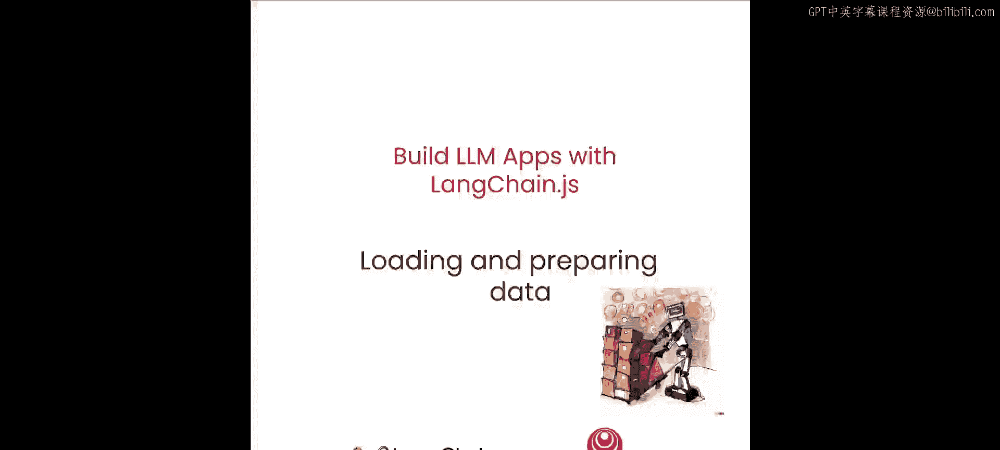
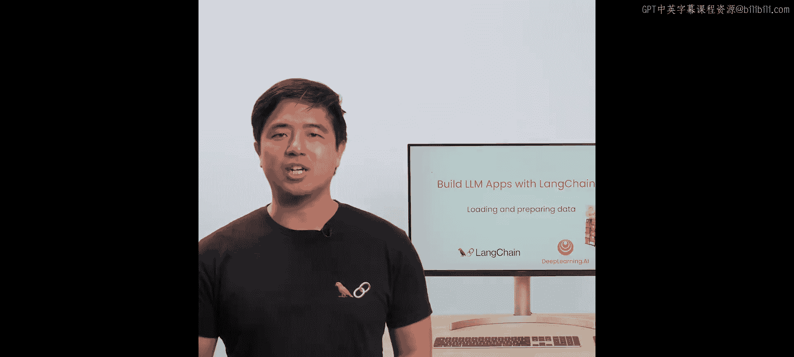
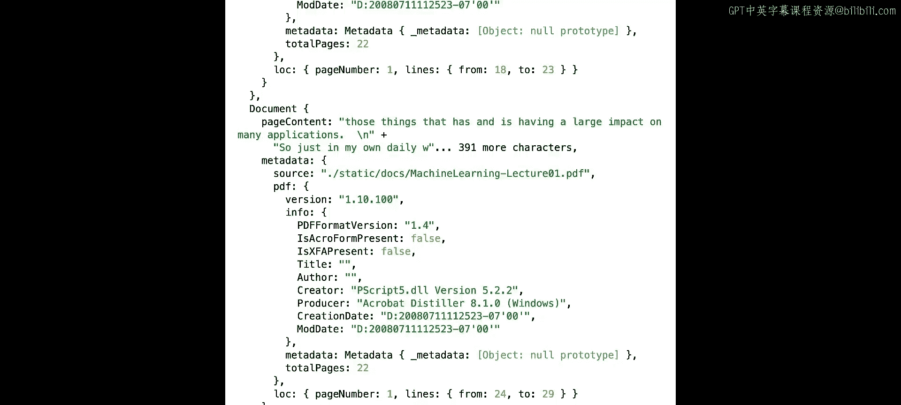

# 003：加载与准备数据 📚



在本节课中，我们将学习如何为构建“与你的数据对话”应用准备数据。具体来说，我们将介绍检索增强生成（RAG）的基本流程，并学习如何使用LangChain.js的文档加载器和文本分割器来加载和预处理文档。



## 概述

检索增强生成（RAG）是大型语言模型（LLM）的一个非常流行的应用。在本课中，你将初步了解RAG，并学习一些让构建过程更简单的LangChain模块：文档加载器和文本分割器。

上一节我们学习了如何将模块链接在一起。本节中，我们将继续构建“与你的数据对话”应用，学习一些技术来存储我们自己的文档，以便后续检索，从而为LLM的生成提供上下文基础。这通常被称为检索增强生成，简称RAG。

## RAG的基本流程

基本流程如下：
1.  从源（如PDF、数据库或网络）加载文档。
2.  将文档分割成足够小的块，以适应LLM的上下文窗口，以避免干扰。
3.  将这些块嵌入到向量存储中，以便后续基于输入查询进行检索。
4.  当用户想要访问某些数据时，检索那些相关的、先前分割好的块，并以这些块为上下文生成最终输出。

本节课将涵盖此流程中的前两个步骤。

## 第一步：使用文档加载器

为了完成第一步，我们将使用LangChain的一些文档加载器。LangChain拥有多种文档加载器，可以从网络上的各种来源或专有公司引入数据。

以下是使用文档加载器的步骤：

1.  **导入并初始化加载器**：首先，我们需要导入所需的加载器并实例化它，通常需要指定数据源路径或URL。
2.  **加载文档**：调用加载器的加载方法，将原始数据转换为LangChain可以处理的文档对象。
3.  **查看结果**：加载的文档通常包含内容和元数据，元数据可用于更高级的查询和过滤。

让我们从加载一个示例开始。LangChain的众多加载器之一是Github加载器。

```javascript
import { GithubLoader } from "langchain/document_loaders/web/github";
```

这个特定的加载器需要一个对等依赖项。一旦加载，我们将用一个Github仓库（当然是LangChain.js的仓库）来实例化它。为了演示目的，我们不会深入探讨包的内容，因此我们将关闭递归选项，然后忽略某些路径，如Markdown格式的文档和很长的yarn.lock文件。

```javascript
const loader = new GithubLoader(
  "https://github.com/langchain-ai/langchainjs",
  { recursive: false, ignorePaths: ["*.md", "yarn.lock"] }
);
```

接下来，实例化后，我们将加载它。

```javascript
const docs = await loader.load();
```

然后让我们记录一些输出。

```javascript
console.log(docs.slice(0, 3));
```

我们可以看到，我们确实从LangChain仓库的顶层返回了一些文件。所以有一个`.editorconfig`文件，`.gitattributes`，大多是元数据，然后是`.gitignore`。这些是直接从LangChain的Github仓库拉取的，我们也可以在这里看到内容。

所以数据的定义可以相当宽泛。它不一定只是结构化的PDF，可以是Github文件、代码，也可以是SQL行，非常广泛。但PDF是一个相当大的用例。

让我们看看加载PDF会是什么样子。当然，考虑到这是一门深度学习AI课程，我们为什么不用吴恩达著名的机器学习课程CS229的转录稿呢？

与上面的Github示例非常相似，我们将导入它，这次需要一个对等依赖项`pdf-parse`。

```javascript
import { PDFLoader } from "langchain/document_loaders/fs/pdf";
```

我已经在笔记本文件系统的这个文件路径下准备了这份转录稿的副本。

```javascript
const loader = new PDFLoader("cs229_transcript.pdf");
const cs229Docs = await loader.load();
```

然后让我们只记录我们将得到的前三页。

```javascript
console.log(cs229Docs.slice(0, 5));
```

这次我们看到，我们得到了转录稿的标题“Machine Learning Lecture 01”，以及我们著名的讲师Andrew Ng，然后是之后的页面。所以这个加载器是按页分割的：第1页、第2页、第3页、第4页，最后是第5页。这后面还有很多页，我们只展示了前五个加载的文档，还有元数据，这对于更高级的查询和过滤很有用，但这有点超出了本课的范围。

## 第二步：使用文本分割器

现在我们已经加载了一些数据，让我们进入分割环节。这里的想法和目标，作为提醒，是尝试将语义上相关的想法保持在同一块中，这样LLM就能获得一个完整的、自包含的想法，而不会分心。

你注意到之前CS229转录稿的例子，有很多很多页，文本量很大，而我们的LLM对每个块只能给予固定的注意力。因此，对于数据分割有许多不同的策略，这实际上取决于你加载的内容。

对于Github JavaScript示例，我们可能希望基于代码特定的分隔符进行分割，因为这些分隔符倾向于将输入文档分组为函数定义或类，以便LLM处理，而不是在中间某个地方分割。

为了展示这是什么样子，我们将导入一个文本分割器，然后像这样初始化它。

```javascript
import { RecursiveCharacterTextSplitter } from "langchain/text_splitter";

const splitter = new RecursiveCharacterTextSplitter({
  language: "js", // 指定为JavaScript语言
  chunkSize: 30,  // 为演示设置较小的最大块大小
  chunkOverlap: 0 // 块重叠设置为0
});
```

你会注意到我们在这里设置了一些参数：使用来自语言JavaScript的初始化器，它知道使用一些常见的JS语言特性作为块之间的分隔符；我们为演示设置了一个很小的最大块大小（30个字符），这比你在实践中可能想要使用的小得多；我们将块重叠设置为0。在某些情况下，设置重叠可能有用，可以让块之间更自然地衔接，但同样为了演示目的，我们将其设置为0。

初始化后，让我们给它一些代码。我们将使用一个简单的“hello world”函数，包括声明和一个带注释的调用。

```javascript
const code = `function helloWorld() {
  console.log("Hello, world!");
}
// This is a comment
helloWorld();`;

const chunks = await splitter.splitText(code);
console.log(chunks);
```

你可以看到这里的结果是四个块，分割得非常自然：我们得到一个函数定义`helloWorld`，日志语句单独一行，注释单独一行，然后调用也单独一行。

为了展示这里的替代方案，如果我们天真地分割，例如使用空格作为分隔符，我们可能会得到一些块，例如，只包含半个日志语句，这会使LLM在最终生成时的工作更加困难。

为了展示这是什么样子，让我们看看一个更天真的字符分割器。

```javascript
import { CharacterTextSplitter } from "langchain/text_splitter";

const naiveSplitter = new CharacterTextSplitter({
  chunkSize: 30,
  chunkOverlap: 0,
  separator: " " // 仅使用空格作为分隔符
});

const naiveChunks = await naiveSplitter.splitText(code);
console.log(naiveChunks);
```

正如你所看到的，我们确实在第一行得到了函数定义，这还不错，但我们分割了函数的参数。你可以想象，如果LLM得到一个只有半个函数调用的块，它不一定知道另一半是什么，从而丢失一些上下文。我们还分割了注释块，是的，这只会让LLM处理起来更困难一些。

为了快速展示一些调整方法以提高性能，假设我们想将函数体的一些内容也包含到声明中，因为我们有一个单独的函数声明，这很好，但也许我们也希望将一些函数体作为上下文。

我们可以尝试与上面类似的方法，使用我们的递归字符文本分割器，但让我们调大一点块大小，同时也给它一些重叠。

```javascript
const tunedSplitter = new RecursiveCharacterTextSplitter({
  language: "js",
  chunkSize: 100, // 增加块大小
  chunkOverlap: 20 // 增加块重叠
});

const tunedChunks = await tunedSplitter.splitText(code);
console.log(tunedChunks);
```

这次你可以看到，即使这在某种程度上效率较低，因为我们把冗余信息放入了这些块中，但我们确实在同一个块中得到了整个函数定义和函数体。这意味着接收此数据的LLM将拥有关于该函数的完整上下文。

LangChain为不同类型的内容包含了几种不同的选项，包括你刚刚看到的Markdown、JavaScript、Python等。但对于通用的书面文本，递归字符文本分割器是一个很好的起点，因为它以段落作为自然边界进行分割，人们通常在这些地方分隔他们的想法和观点。

因此，让我们初始化一个，用于我们之前加载的CS229课程。

```javascript
const textSplitter = new RecursiveCharacterTextSplitter({
  chunkSize: 512, // 使用稍大的块
  chunkOverlap: 64 // 设置字符重叠
});
```

让我们分割我们之前摄入的吴恩达课程转录稿，看看会发生什么。

```javascript
const splitDocs = await textSplitter.splitDocuments(cs229Docs);
console.log(splitDocs.slice(0, 5)); // 再次取前五个，以免输出太长
```

这次我们可以看到，我们在第1页上得到了一个块，然后在第1页上又得到了另一个块。所以，比一页小，并且理想情况下仍然应该是我们将传递给LLM的自包含的想法。我们得到了一些关于Paul Bom Stark在机器学习方面做什么的信息，其他人Daniel Rammage将学习算法应用于自然语言问题，以及一些关于工程中深度学习日常应用的想法。是的，我认为这是一个相当不错的开始。

## 总结

在本节课中，我们一起学习了为RAG应用准备数据的前两个关键步骤。首先，我们使用LangChain的文档加载器从不同来源（如Github和PDF）加载原始文档。接着，我们深入探讨了文本分割的重要性，并使用递归字符文本分割器将长文档分割成语义连贯、大小合适的块，以便LLM处理。我们比较了不同分割策略的效果，并学习了如何通过调整块大小和重叠来优化分割结果。



在下一节中，我们将展示如何嵌入这些块并将它们添加到向量存储中，以便更容易地进行搜索和查询。