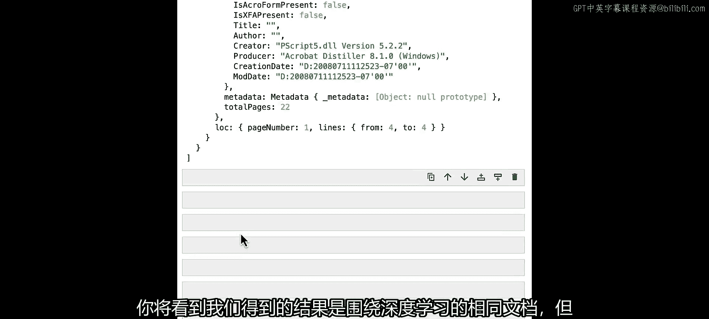

# 004：向量数据库与嵌入


## 概述
在本节课中，我们将学习检索增强生成流程中的关键环节：向量数据库与嵌入。我们将了解如何将文档块转换为向量表示，并将其存储在向量数据库中，以便后续根据用户查询进行高效检索。


---

## 向量数据库与嵌入简介

上一节我们介绍了如何加载和分割文档。本节中，我们来看看如何将这些文档块转换为向量并存储起来，以便进行语义搜索。

向量数据库是一种具有自然语言搜索能力的专用数据库。当用户提出查询时，我们将在向量数据库中搜索与查询语义相似的文档块，并将相关结果返回给大语言模型用于最终生成。

## 嵌入模型

实现上述功能的第一步是使用嵌入模型。嵌入模型是一种特殊的机器学习模型，用于将文本内容转换为一种称为“向量”的数字表示。

我们将使用OpenAI托管的嵌入模型，因此需要导入环境变量来获取API密钥。

```javascript
import { OpenAIEmbeddings } from "@langchain/openai";
const embeddings = new OpenAIEmbeddings();
```

为了演示，我们将使用一个内存中的向量数据库。在生产环境中，您可能需要替换为其他持久化方案。

让我们尝试嵌入一个简短的查询，看看结果是什么样子。

```javascript
const vector = await embeddings.embedQuery("What are vectors useful for in machine learning?");
```

结果是一个数字数组形式的向量。这些生成的数字可以被视为捕获了被嵌入文本的各种抽象特征，我们之后可以通过搜索这些向量来找到语义相近的文档块。

## 向量相似度比较

为了具体展示这个搜索过程，我们可以使用一个JavaScript库来比较不同嵌入向量之间的相似度。

首先，我们创建一个向量，对应查询“What are vectors useful for machine learning?”。

然后，我们创建一个不相关的查询向量进行对比，并计算它们的相似度得分。

```javascript
// 假设有计算余弦相似度的函数 cosineSimilarity
const score = cosineSimilarity(vector1, unrelatedVector); // 得分约为 0.69621
```

现在，让我们尝试用一个更相关的向量进行比较，看看得分有何不同。

```javascript
const similarVector = await embeddings.embedQuery("Vectors are representations of information.");
const newScore = cosineSimilarity(vector1, similarVector); // 得分显著高于 0.69621
```

我们使用的度量标准称为**余弦相似度**，它是比较两个向量相似度的众多方法之一。由于两个文本包含相似的信息，因此它们的相似度得分会更高。

## 准备文档并存入向量数据库

接下来，我们将使用上一节课介绍的技术来准备我们的文档。为了演示，我们将设置一个较小的块大小。

以下是准备文档的步骤：

1.  使用PDF加载器加载文档。
2.  使用文本分割器将文档分割成小块。

```javascript
import { PDFLoader } from "@langchain/community/document_loaders/fs/pdf";
import { RecursiveCharacterTextSplitter } from "langchain/text_splitter";

const loader = new PDFLoader("path/to/transcript.pdf");
const docs = await loader.load();

const splitter = new RecursiveCharacterTextSplitter({
  chunkSize: 128,
});
const splitDocs = await splitter.splitDocuments(docs);
```

现在，让我们初始化我们的向量数据库。我们继续使用内存向量数据库进行演示。

```javascript
import { MemoryVectorStore } from "langchain/vectorstores/memory";

const vectorStore = await MemoryVectorStore.fromDocuments(
  splitDocs,
  embeddings
);
```

请注意，我们在初始化时传入了嵌入模型。这是因为LangChain的向量数据库实现将使用此模型为每个添加的文档内容生成之前看到的数字数组（即向量）。

现在，让我们将分割后的文档添加到向量数据库中。

```javascript
// fromDocuments 方法已经完成了添加操作
```

至此，我们拥有了一个已填充、可搜索的向量数据库。

## 执行搜索

由于LangChain的向量数据库暴露了直接用自然语言查询进行搜索的接口，我们可以立即尝试并查看结果。

让我们使用 `similaritySearch` 方法，查询“What is deep learning?”，并返回4个最相关的文档。

```javascript
const results = await vectorStore.similaritySearch("What is deep learning?", 4);
console.log(results.map(doc => doc.pageContent));
```

我们期望看到的是四个与深度学习、机器学习、学习算法相关的小文本块，结果符合预期。

## 检索器抽象

我们刚刚展示了如何直接使用相似度搜索从向量数据库返回文档。但这实际上只是为大语言模型获取数据的多种方式之一。

LangChain用一个更广泛的“检索器”抽象封装了这种区别，它能根据给定的自然语言查询返回相关文档。

我们可以方便地通过一个简单的函数调用，从现有的向量数据库实例化一个检索器。

```javascript
const retriever = vectorStore.asRetriever();
```

检索器的一个优点是，与向量数据库不同，它们实现了 `invoke` 方法，并且本身是我们在第一课中学到的“表达式语言可运行对象”。因此，它们可以与其他模块（如LLM、提示词等）链接起来。

为了展示这一点，我们用 `invoke` 方法运行刚刚实例化的检索器，使用相同的查询。

```javascript
const retrieverResults = await retriever.invoke("What is deep learning?");
```

我们看到的结果是与之前相同的关于深度学习的文档。但现在，我们可以在一个链中将其与其他模块一起使用，这将在下一课关于构建检索链时发挥巨大作用。

---



## 总结
本节课中，我们一起学习了检索增强生成流程的核心组成部分：向量数据库与嵌入。我们了解了如何使用嵌入模型将文本转换为向量，如何将文档块存储到向量数据库，以及如何执行语义搜索来查找相关信息。最后，我们介绍了检索器这一更高级的抽象，它为构建复杂的LLM应用链奠定了基础。在下一课中，我们将利用检索器来构建完整的检索增强生成链。