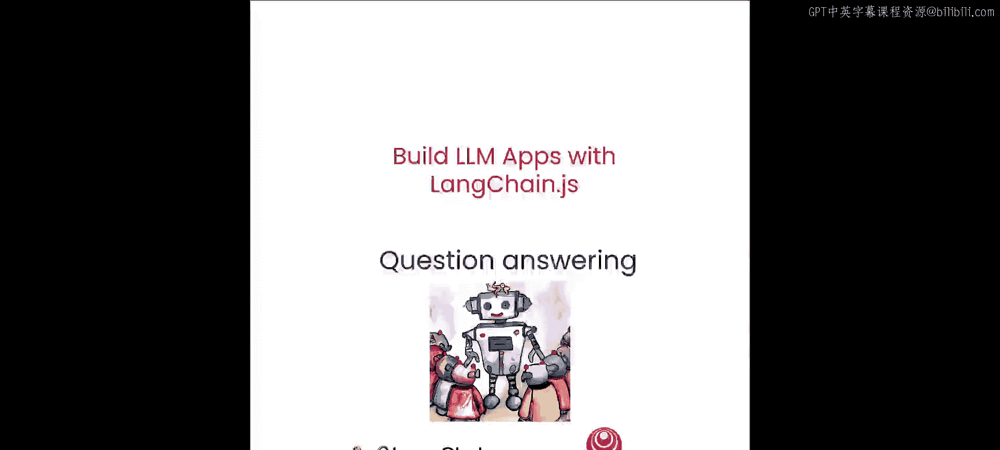
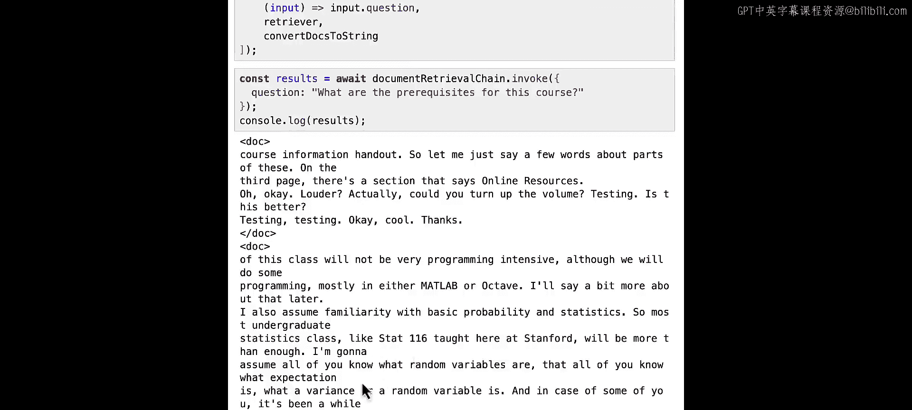
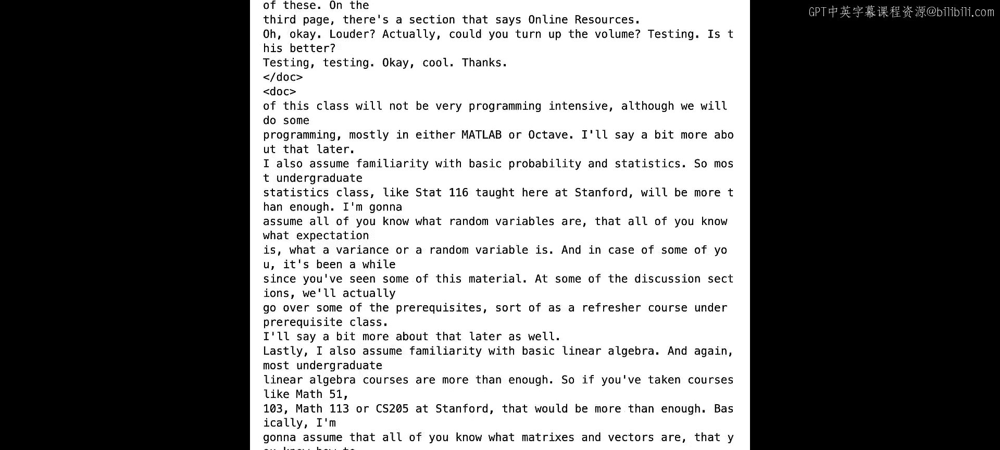
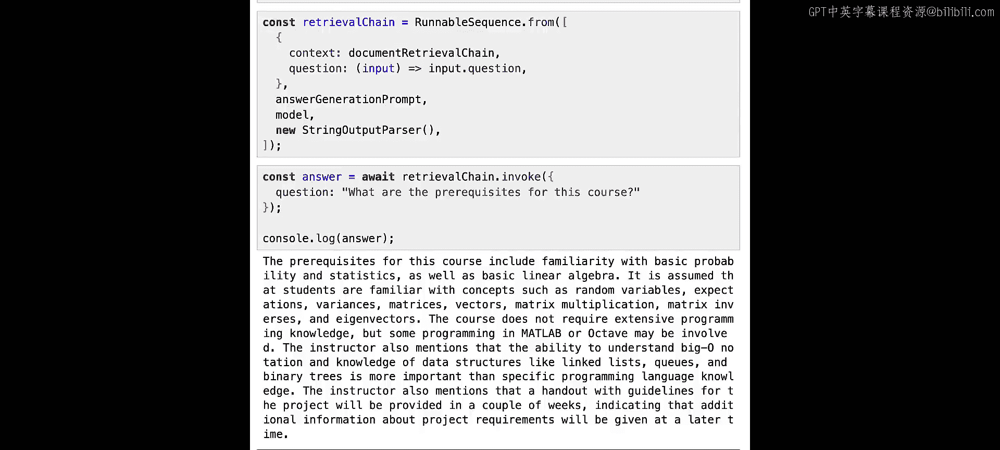
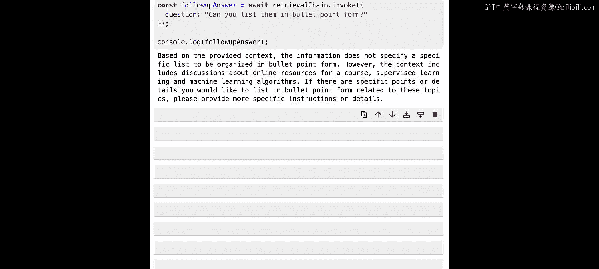
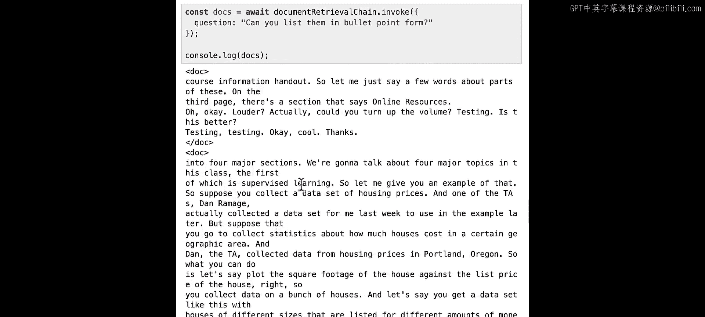
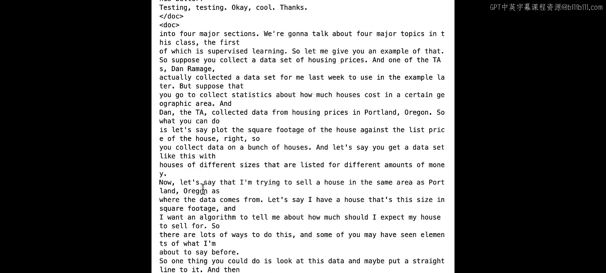
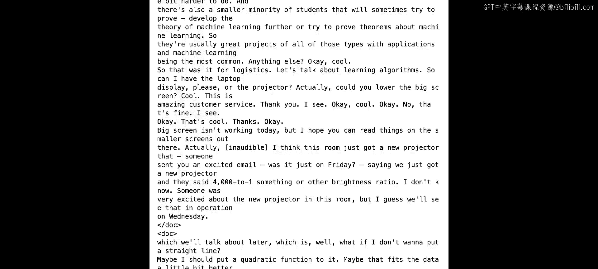

# 005：问答系统构建 🧠




在本节课中，我们将综合运用前几节课的知识，构建一个能够利用外部数据作为上下文的对话式问答LLM应用程序。

## 概述

我们将创建一个链，通过向量相似性搜索检索与输入查询最相似的文本块，然后将它们作为上下文提供给LLM，以生成最终的答案。

## 加载文档与初始化向量存储

首先，我们需要加载环境变量，并分割、加载之前使用的CS229课程PDF转录本。为了模拟生产环境，我们将使用更大的文本块（1536个字符）和一定的重叠（128个字符）。

以下是初始化向量存储的代码：

```javascript
// 初始化向量存储的辅助函数
async function initializeVectorStore(documents, chunkSize = 1536, chunkOverlap = 128) {
  // 分割文档
  const splitter = new RecursiveCharacterTextSplitter({
    chunkSize: chunkSize,
    chunkOverlap: chunkOverlap,
  });
  const docs = await splitter.splitDocuments(documents);

  // 创建向量存储
  const vectorStore = await MemoryVectorStore.fromDocuments(
    docs,
    new OpenAIEmbeddings()
  );
  return vectorStore;
}
```

我们使用OpenAI嵌入模型将分割后的文档加载到向量存储中，并从中创建一个检索器，用于根据自然语言查询获取相关文档。

## 构建文档检索链

接下来，我们开始构建检索链。第一步是创建一个包装检索器的步骤，用于格式化其他步骤的输入和输出，我们称之为“文档检索链”。

以下是构建文档检索链的步骤：



1.  定义一个格式化文档内容的函数，使用XML标签分隔不同文档，以帮助LLM区分不同的信息。
2.  创建一个可运行序列，该序列接受一个包含`question`字段的对象作为输入。
3.  使用一个lambda函数从输入对象中提取问题字符串，并将其传递给检索器。
4.  将检索器返回的文档通过管道传递给格式化函数。



以下是代码示例：

```javascript
// 格式化文档内容的函数
const formatDocumentsAsString = (docs) => {
  return docs.map(doc => `<doc>${doc.pageContent}</doc>`).join('\n');
};

// 创建文档检索链
const documentRetrievalChain = RunnableSequence.from([
  (input) => input.question, // 提取问题
  retriever, // 检索相关文档
  formatDocumentsAsString // 格式化文档
]);
```

现在，我们可以测试这个链。例如，询问“这门课程的先修要求是什么？”，链将返回格式化的文档内容，其中包含了关于CS229课程先修要求的信息。

## 构建答案生成链

上一节我们构建了文档检索链，本节中我们来看看如何将检索到的信息合成为人类可读的答案。

首先，我们需要定义一个提示模板，指导LLM基于提供的上下文回答问题。

以下是构建答案生成链的步骤：

1.  创建一个聊天提示模板，要求LLM扮演经验丰富的研究员角色，仅使用提供的资源回答问题。
2.  由于我们的文档检索链输出的是字符串，而提示模板需要一个包含`context`和`question`字段的对象，因此我们需要使用`RunnableMap`来处理输入和输出的转换。
3.  `RunnableMap`可以并行调用多个可运行对象，并将结果组合成一个对象。
4.  最后，将`RunnableMap`、提示模板、LLM模型和输出解析器组合成一个序列链。

以下是代码示例：

```javascript
// 定义提示模板
const answerGenerationPrompt = ChatPromptTemplate.fromTemplate(`
  你是一位经验丰富的研究员，擅长根据资料解读和回答问题。
  请仅使用以下资源来回答问题。

  上下文：
  {context}

  问题：
  {question}
`);

// 使用 RunnableMap 处理输入
const map = RunnableMap.from({
  context: documentRetrievalChain,
  question: (input) => input.question,
});

// 构建完整的问答链
const qaChain = RunnableSequence.from([
  map,
  answerGenerationPrompt,
  new ChatOpenAI({ temperature: 0 }),
  (output) => output.content,
]);
```



现在，我们可以用同样的问题“这门课程的先修要求是什么？”来调用这个完整的问答链。LLM将生成一个更清晰、更人性化的回答，总结出课程需要熟悉基础概率统计和线性代数等先修知识。

## 处理后续问题与当前局限

当我们尝试提出后续问题，例如“你能用项目符号列出它们吗？”，系统可能无法正确理解“它们”所指代的内容。这是因为LLM本身没有记忆，并且我们的向量存储检索也无法理解指代关系。

如果我们直接用这个后续问题查询向量存储，检索到的文档可能与“先修要求”无关，导致回答不准确。这揭示了当前简单检索问答系统在对话上下文处理上的局限性。







## 总结



本节课中我们一起学习了如何使用LangChain.js构建一个基础的检索增强生成（RAG）问答系统。我们完成了从文档加载、向量存储检索到利用LLM生成答案的完整流程。然而，该系统目前还无法有效处理涉及对话历史的后续问题。在下一节关于对话式问答的课程中，我们将探讨如何解决这个问题。