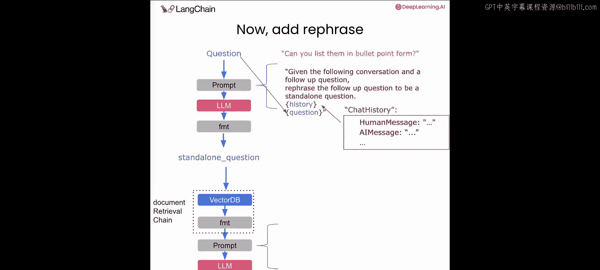
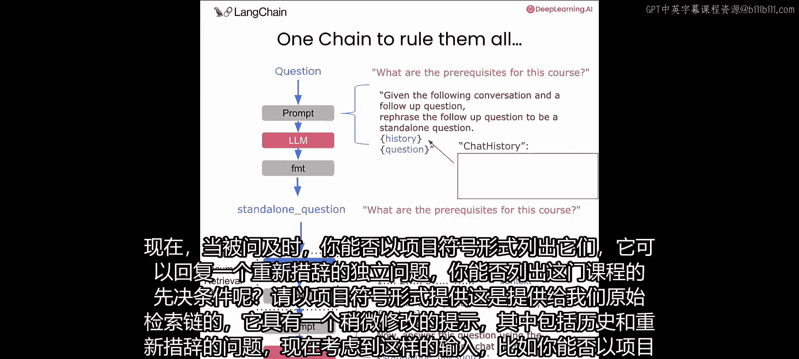
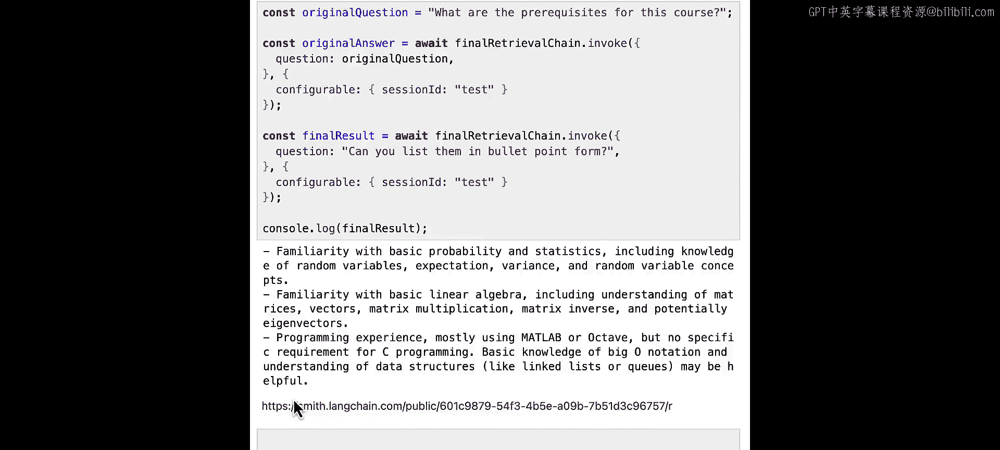
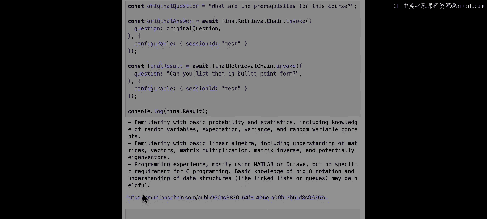

# 006：对话式问答 🗣️💬

## 概述
在本节课中，我们将学习如何为之前构建的问答链添加对话记忆能力。上一节我们构建的问答链无法记住过去的对话历史，导致无法回答涉及上下文的问题。本节中，我们将通过一系列技术来解决这个问题，使我们的链能够进行连贯的对话。

## 问题分析
上一节构建的问答链遵循以下步骤：
1.  使用问题查询向量数据库。
2.  向量数据库返回四个相关文档（称为上下文）。
3.  将上下文和问题一起填入提示词，发送给大语言模型。

例如，我们问：“这门课程的先修要求是什么？”，模型根据检索到的上下文给出了很好的答案。

然而，当我们接着问：“你能用项目符号列出它们吗？”，大语言模型回复说它没有看到具体的问题或提示。问题出在第二个问题引用了过去的对话信息，但大语言模型没有记忆，因此无法回答。

## 解决方案：问题重写
解决此问题的一种方法是，在了解过去聊天历史的情况下，将新问题重写或改述为一个独立的、不依赖外部引用的问题。

如果我们这样做，大语言模型可能会将问题重写为：“你能用项目符号列出这门课程的先修要求吗？”。这样，上面的链就可以根据这个输入从向量数据库中获取正确的数据，大语言模型也能生成合适的答案。

以下是实现此方案的关键步骤：

### 第一步：保存聊天历史
基本思路是，每次我们运行链时，都将用户提出的问题作为“人类消息”，将大语言模型格式化的回复作为“AI消息”存储在一个历史变量中。之后，你可以将其作为额外上下文提供给大语言模型的提示词。

### 第二步：添加问题重写逻辑
我们将使用一个大语言模型来重写问题。首先，我们需要清理之前的链，为新的起点腾出空间。

接下来，我们将添加一个提示词、一个大语言模型和一个输出解析链，以形成一个独立的问题。提示词大致如下：
> 给定以下对话和一个后续问题，请将该后续问题改述为一个独立的问题。

现在，当被问到“你能用项目符号列出它们吗？”时，它可以回复一个新的、改述后的独立问题：“你能用项目符号列出这门课程的先修要求吗？”。然后将这个独立问题提供给我们的原始检索链。

### 第三步：修改原始检索链的提示词
原始检索链的提示词也需要稍作修改，以包含聊天历史和重写后的独立问题。

现在，给定一个像“你能用项目符号列出它们吗？”这样的输入，它可以提供如下答案。请注意，我们正在创建一个可以反复用于多个问题的链。即使对于第一个还没有任何历史记录的问题，我们的步骤也能正常工作，只是不会进行太多重写。

## 代码实现
现在，让我们进入代码并开始实现。

### 重建基础组件
首先，你需要从上一个实验中重建一些组件。
以下是需要重建的步骤：
1.  加载配置。
2.  加载文本分割器。
3.  加载包含文档的向量存储。
4.  定义检索器。
5.  构建一个文档检索链，用于提取输入问题，将其发送给检索器，最后将输出转换为字符串。

### 构建检索链
然后，你可以构建你的检索链，该链将使用一个问题以及向量数据库查找的结果来调用大语言模型。
以下是构建检索链的步骤：
1.  构建一个提示词模板。注意，它有一个用于向量数据库上下文的输入变量和一个用于问题的位置。
2.  初始化你的模型。
3.  构建你的链。它从文档检索链获取上下文和输入问题，并将所有这些传递给提示词，最后传递给模型和输出解析器。

### 创建问题重写链
现在，我们准备制作新的链。我们将创建一个新链，专门负责将用户可能包含对过去聊天历史引用的输入，重写为一个没有引用的、我们的向量存储和后续大语言模型调用都能理解的问题。

为了实现这一点，我们将定义一个新的提示词，使用一个叫做“消息占位符”的东西来传递历史记录。我们将使用一种更复杂的方式从消息声明模板，因为我们希望将历史记录作为一系列消息传递。

以下是创建重写链的步骤：
1.  声明一个系统提示词模板：“给定以下对话和一个后续问题，请将该后续问题改述为一个独立的问题。”
2.  使用消息占位符来传递实际的聊天消息作为历史记录。
3.  添加一个小的人类提示词，要求它将问题改述为独立问题，并传递问题本身。
4.  创建一个使用此提示词的链，使用我们熟悉的 `RunnableSequence.from` 方法，传入我们的提示词、模型和输出解析器。

### 整合所有组件
现在，让我们把所有部分整合到一个新的链中。

首先，提醒一下我们之前定义的文档检索和格式化链。

然后，定义我们的答案生成提示词，使其也使用消息占位符来接收聊天历史。它将看起来与我们现有的答案链非常相似，但使用 `fromMessages` 方法，以便我们可以有一个聊天历史的占位符。这使我们的最终答案生成链也能考虑聊天历史。

这个最终的提示词需要三个输入：上下文、聊天历史和最终问题。

### 使用 RunnablePassthrough.assign 传递状态
我们将使用一种新的 Runnable 类型，它在视觉上更容易描述。有时，链中的某个处理步骤可能希望将其部分输入原封不动地传递给下一步。实现这一点的一种方法是使用方便的 `RunnablePassthrough.assign` 方法。

在图中，步骤1是获取历史和问题并输出一个独立问题。但步骤2中的提示词也需要接收原始输入历史以及步骤1输出的修订后的独立问题。本质上，我们希望在传递旧属性的同时，为链的当前状态分配一个新属性。

在代码中，我们使用 `RunnablePassthrough.assign` 方法。这个模式非常常见，例如我们从原始输入中提取一个属性，然后将其作为对象属性传递给下一步（即我们的文档检索链）。你可以把它看作是获取原始输入并为其添加一个额外的字段，这是一个有用的小捷径。

我们的步骤是：
1.  首先重写我们的问题，使其成为一个独立的问题，不引用聊天历史。
2.  然后将这个去引用的（独立）问题传递到我们的向量存储中，以获取与查询相关的上下文文档。
3.  最后，利用所有这些信息生成答案。

### 使用 RunnableWithMessageHistory 管理会话历史
我们可以使用 `RunnableWithMessageHistory` 类来简化聊天历史的跟踪和会话管理。它包装另一个链，并通过更新和注入聊天历史来添加持久状态。

以下是 `RunnableWithMessageHistory` 的工作原理：
1.  它通过将链输入的一部分（在你的例子中是输入中用户定义的问题字段）保存为新的“人类消息”来自动更新聊天历史。
2.  它还将链的输出保存为新的“AI消息”。
3.  此外，它将当前的历史消息添加到被包装链的输入中，放在一个 `history_messages` 键下，我们将把它用作历史记录。
4.  注意，在 RAG 应用中，向量数据库查找的结果不会存储在聊天历史中。

在代码中，我们初始化一个聊天历史对象，然后将我们刚刚定义的对话式检索链包装在这个新类中。它会自动添加一个由 `history_messages` 键给出的额外属性，这正是我们的答案生成提示词所期望的历史记录。它会在聊天消息历史对象中存储和更新聊天历史，将作为 `input_messages_key`（本例中是 `question`）传入的值追加为人类消息，并将链的最终输出追加为 AI 消息。

`getMessageHistory` 是一个函数，它根据过去的会话 ID 返回一个新的聊天历史对象。在演示中，我们每次都将使用同一个消息历史对象，但在生产环境中，你需要为每个会话分配一个新对象，以避免混淆不同用户的对话历史。

### 测试最终版本
现在，让我们尝试最终版本。我们将使用原始问题“这门课程的先修要求是什么？”来调用我们的最终检索链，以获取原始答案。因为我们使用了 `RunnableWithMessageHistory` 类，所以需要给它一个会话 ID（尽管我们暂时还没用到它）。然后，我们将再次调用它，使用后续问题“你能用项目符号列出它们吗？”，并记录结果。

最终，我们得到了格式良好的答案，例如：“熟悉基础概率与统计、线性代数和一些编程经验”。这正是我们期望的用项目符号列出的形式。

## 可视化追踪
这是一个追踪功能真正派上用场的例子。为了直观地了解幕后发生了什么，我们可以使用 LangSmith 追踪来可视化探索。

在追踪视图中，你可以看到 `RunnableWithMessageHistory` 类包装了我们的 RunnableSequence（即对话式检索链）。它会插入并将那些历史消息作为参数加载到该链中。

具体步骤包括：
1.  问题重写步骤：接收从管理器加载的历史记录，并将“你能用项目符号列出它们吗？”重写为“你能用项目符号列出这门课程的先修要求吗？”。
2.  文档检索步骤：检索与这个独立问题相关的文档，得到关于课程先修要求的上下文。
3.  最终合成步骤：将所有信息（来自向量存储的上下文、聊天历史）传递进去，生成最终答案列表。

## 总结与展望
在本节课中，我们一起学习了如何为问答链添加对话记忆能力。我们通过引入问题重写逻辑、使用消息占位符传递历史、利用 `RunnablePassthrough.assign` 管理状态流，以及最终通过 `RunnableWithMessageHistory` 类自动化会话历史管理，构建了一个能够进行连贯多轮对话的检索增强生成链。

检索是一个非常深入的主题，没有一种适用于所有情况的通用方法。加载、分割和查询数据的方式很大程度上取决于数据的格式、信息密度和其他因素。因此，我们鼓励你针对不同的模型和数据类型修改上述提示词和参数。

在下一课中，我们将展示如何将这个检索链投入生产，包括展示一些与常见 Web API 和 HTTP 的交互。