# 007：部署为Web API 🚢

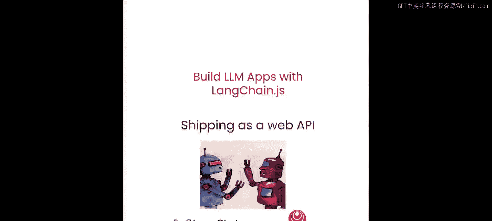

在本节课中，我们将学习如何将构建好的LangChain对话链部署为一个实时的Web API。我们将重点探讨流式响应和个性化聊天会话的实现，确保应用能够处理多用户并发请求。

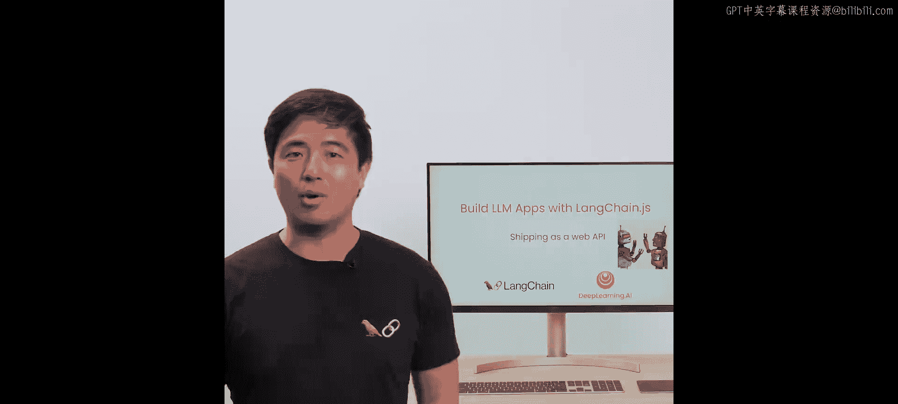

---

## 概述

上一节我们完成了对话检索链的构建。本节中，我们将把该链部署为一个Web服务，使其能够通过HTTP接口被调用。我们将关注两个核心方面：**流式输出**以提升客户端响应速度，以及**会话隔离**以确保不同用户间的聊天历史不会混淆。

---

## 加载与准备组件

首先，我们延续上节课的工作，加载CS229课程讲稿并将其处理为向量存储以供检索。为简化代码，之前的步骤已被封装到一个辅助函数中。

```javascript
// 辅助函数：加载文档、分割并初始化向量存储
async function loadAndPrepareVectorStore() {
  // 1. 加载文档
  // 2. 分割文本
  // 3. 使用OpenAI嵌入初始化向量存储
  // 4. 将向量存储转换为检索器
  return retriever;
}
```

该函数内部使用了OpenAI的嵌入模型。完成向量存储的初始化后，我们加载对话链的各个子组件。

以下是对话链的三个核心部分，它们也被封装成了辅助函数：

1.  **文档检索链**：包装检索器，用于根据问题查找相关文档。
2.  **问题重述链**：将后续问题重述为独立的、不依赖上下文的问句。
3.  **答案合成链**：整合所有信息，生成最终答案。

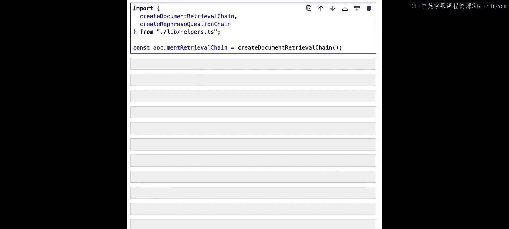

现在，让我们重新构建答案合成链。我们将使用与之前相同的提示模板，但会做一个关键调整。

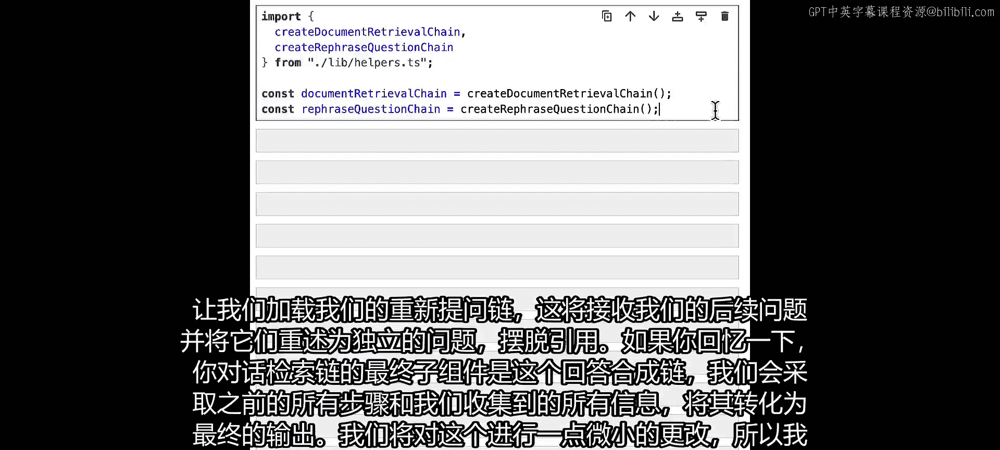

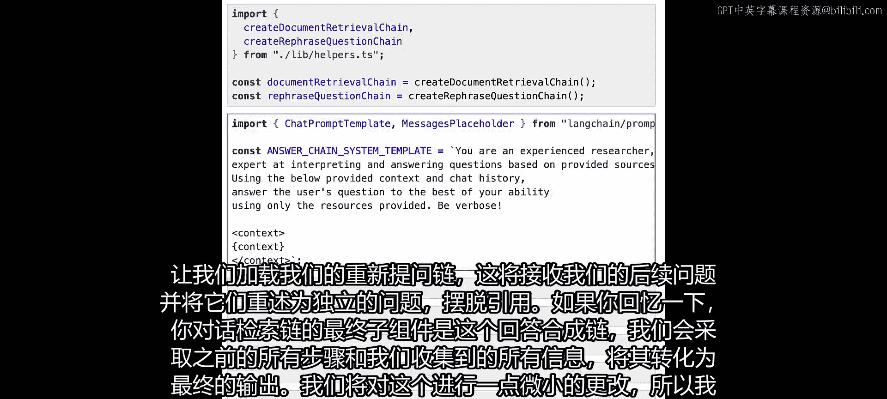

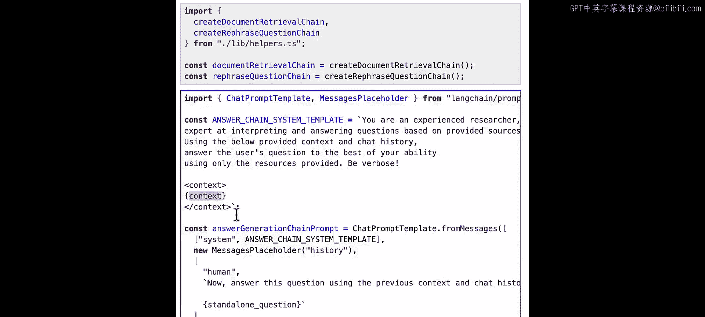

```javascript
import { ChatPromptTemplate } from "@langchain/core/prompts";

const answerSynthesisPrompt = ChatPromptTemplate.fromMessages([
  ["system", "你是一位经验丰富的研究员，擅长根据提供的资料解读和回答问题。"],
  ["placeholder", "{chat_history}"],
  ["human", `基于以下上下文和独立问题，请给出答案。
  上下文：{context}
  独立问题：{standalone_question}`]
]);
```

在将所有组件组装在一起之前，需要注意一个关键点。

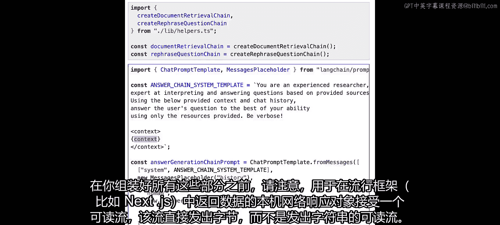

---

## 实现流式响应

流行的Web框架（如Next.js）的原生响应对象期望接收一个直接发射字节的`ReadableStream`，而不是发射字符串的流。我们之前使用`StringOutputParser`输出的是字符串块。

为了能直接将LangChain的流传递给服务器响应，LangChain提供了一个`HttpResponseOutputParser`。它能够将聊天模型的输出解析成符合多种内容类型的字节块。

使用它的方法是，像之前一样构建对话检索链，但跳过最后的`StringOutputParser`步骤。

```javascript
import { HttpResponseOutputParser } from "langchain/output_parsers";

// 1. 创建不包含字符串解析器的可运行序列（与上节课类似）
const retrievalChainWithoutParser = ... // 包含历史处理器、重述链、检索链、答案合成链

// 2. 创建HTTP响应输出解析器
const parser = new HttpResponseOutputParser();

// 3. 创建最终的链：将序列的输出通过管道传递给解析器
const finalConversationalChain = retrievalChainWithoutParser.pipe(parser);
```

我们将解析器放在链的末端，而不是中间，是因为历史管理器需要最终的输出是字符串或聊天消息，而不是解析器转换后的字节流。

---

## 管理用户会话

另一个需要考虑的重点是，在Web环境中，多个用户可能同时访问我们的端点。我们不能像上节课演示那样复用同一个消息历史对象。

我们需要为每个用户会话创建一个新的消息历史对象，这样不同用户的消息就不会混在一起。用户不应共享聊天历史，我们必须为每个会话创建新对象。

为此，我们将重写`getMessageHistory`函数。

```javascript
import { ChatMessageHistory } from "langchain/stores/message/in_memory";

const messageHistoryMap = new Map(); // 用于存储不同会话的历史

function getMessageHistory(sessionId) {
  if (messageHistoryMap.has(sessionId)) {
    // 如果会话ID已存在，返回已有的历史
    return messageHistoryMap.get(sessionId);
  }
  // 否则，创建一个新的聊天历史对象
  const newHistory = new ChatMessageHistory();
  messageHistoryMap.set(sessionId, newHistory);
  return newHistory;
}
```

然后，我们使用这个新的`getMessageHistory`函数来重新创建最终链，确保每个用户都有独立的聊天上下文。

---

## 设置Web服务器与端点

现在，让我们设置一个简单的服务器，并创建一个处理程序来调用我们的链并返回流式响应。

```javascript
import { serve } from "http/server"; // Deno 示例，其他框架类似

const port = 8087;

const handler = async (request) => {
  // 1. 从请求体中解析问题和会话ID
  const { question, sessionId } = await request.json();

  // 2. 使用链的.stream方法创建流
  const stream = await finalConversationalChain.stream({
    question: question,
    configurable: { sessionId: sessionId }, // 传入会话ID
  });

  // 3. 将流直接作为响应返回
  return new Response(stream, {
    headers: { "Content-Type": "text/plain; charset=utf-8" },
  });
};

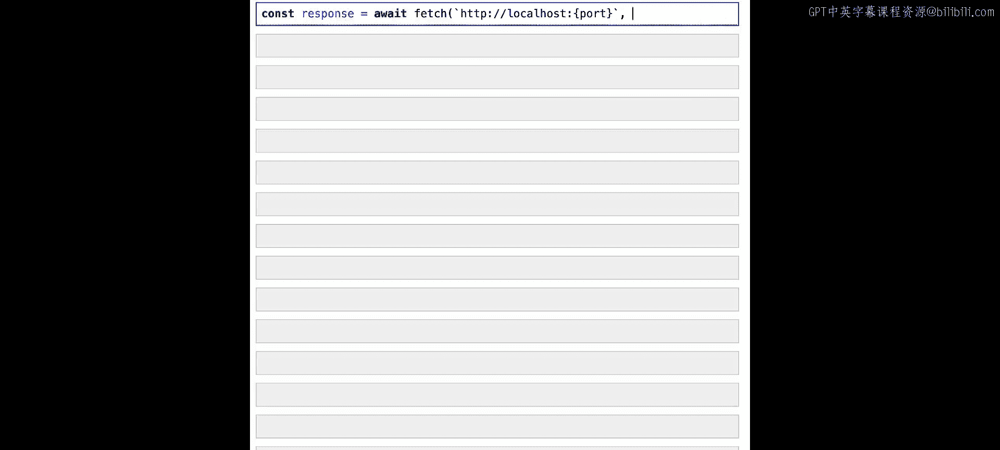

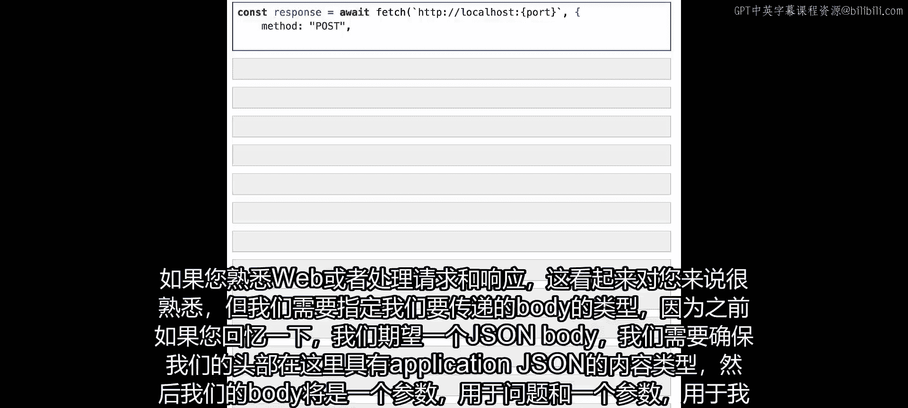

// 启动服务器
serve(handler, { port });
console.log(`Server live on http://localhost:${port}`);
```

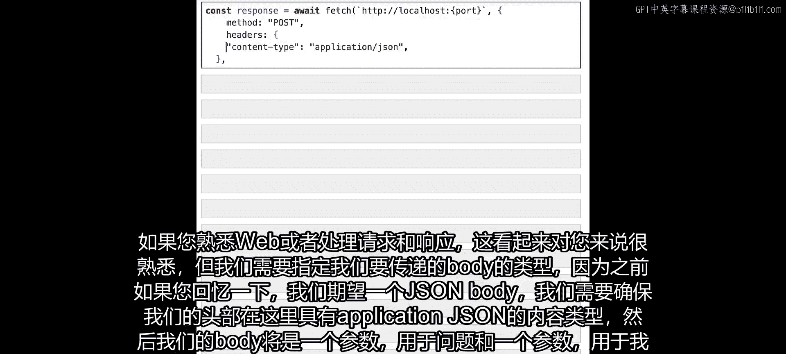

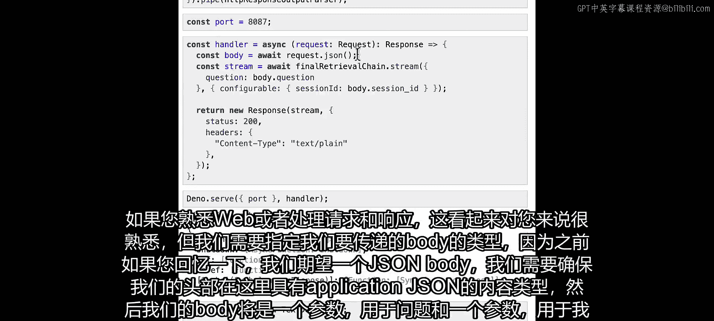

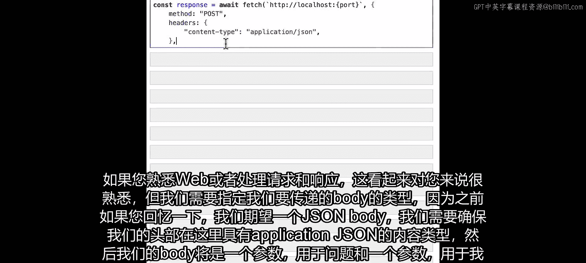

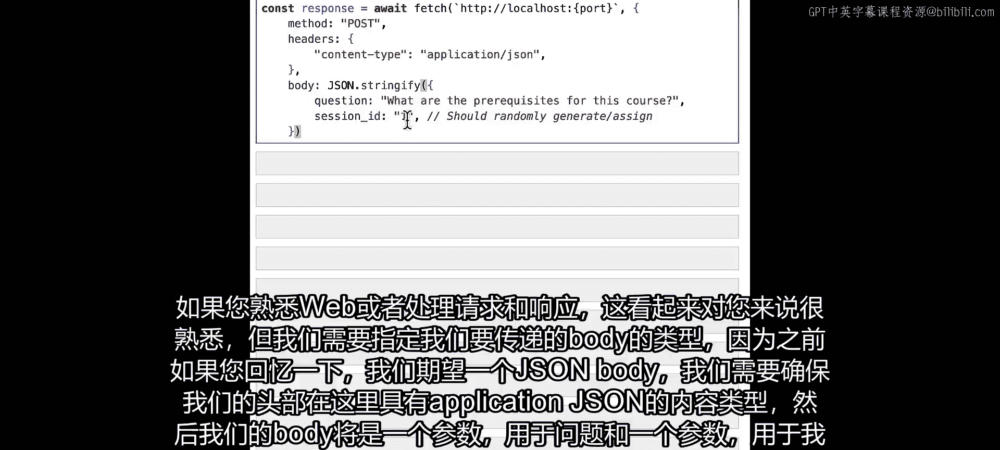

在实际生产部署中，您可能需要添加身份验证或输入验证中间件，但为了简单起见，这里我们暂时跳过。

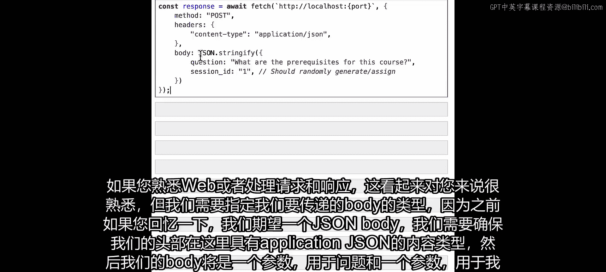

---

## 测试API端点

服务器运行后，我们可以使用`fetch` API来测试它。以下是测试步骤：

1.  **发送第一个问题**：询问课程的先决条件。
2.  **发送后续问题**：测试聊天记忆功能。
3.  **使用新的会话ID**：测试会话隔离，确保不会获取到其他用户的聊天历史。

以下是测试第一个问题的示例代码：

```javascript
// 辅助函数：消费流式响应
async function readStream(reader) {
  while (true) {
    const { done, value } = await reader.read();
    if (done) break;
    console.log(new TextDecoder().decode(value)); // 解码并打印字节块
  }
}

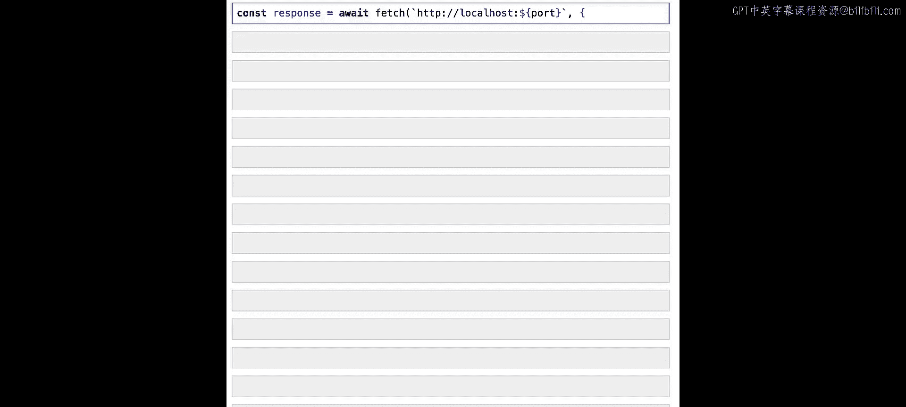

// 发起请求
const response = await fetch(`http://localhost:${port}`, {
  method: "POST",
  headers: { "Content-Type": "application/json" },
  body: JSON.stringify({
    question: "这门课程的先决条件是什么？",
    sessionId: "session_001", // 用户A的会话ID
  }),
});

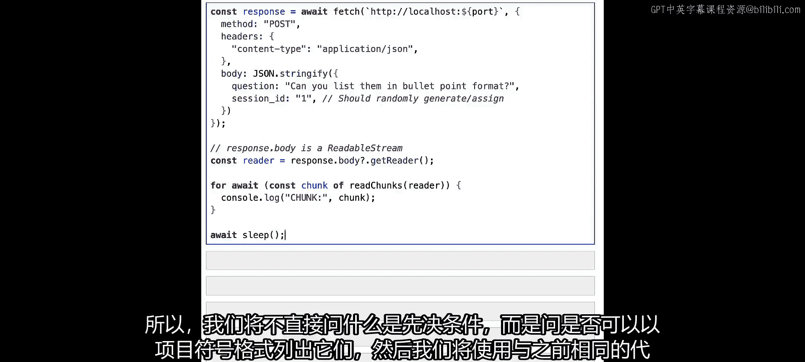

const reader = response.body.getReader();
await readStream(reader);
```

运行后，我们将收到关于课程先决条件的流式回答。

接着，我们使用**相同的会话ID**发送一个后续问题：“能用要点列表的形式列出它们吗？”。链应该能记住上下文，并将先决条件以列表形式重新表述。

最后，我们使用一个**新的会话ID**（如`session_002`）发送问题：“我刚才问你什么了？”。由于会话隔离，我们应该得到一个提示，表明在当前会话中没有之前的聊天历史，从而证明不同用户的对话是独立的。

---

## 总结

本节课中，我们一起学习了如何将LangChain对话链部署为Web API。我们实现了两个关键功能：

1.  **流式响应**：通过`HttpResponseOutputParser`将模型输出转换为字节流，直接传递给Web响应，使得客户端能够更快地显示部分结果。
2.  **会话隔离**：通过为每个用户会话创建独立的`ChatMessageHistory`实例，确保了多用户环境下聊天历史的私密性和准确性。

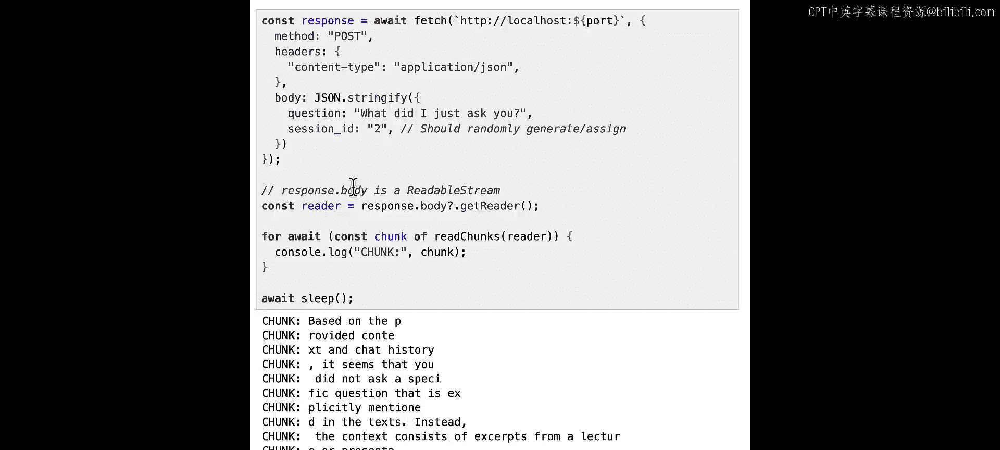

您现在拥有了一个可以处理并发、支持流式对话的LLM应用后端。鼓励您尝试提出不同的问题、使用不同的会话ID进行测试，并将这些概念应用到您自己的项目中。