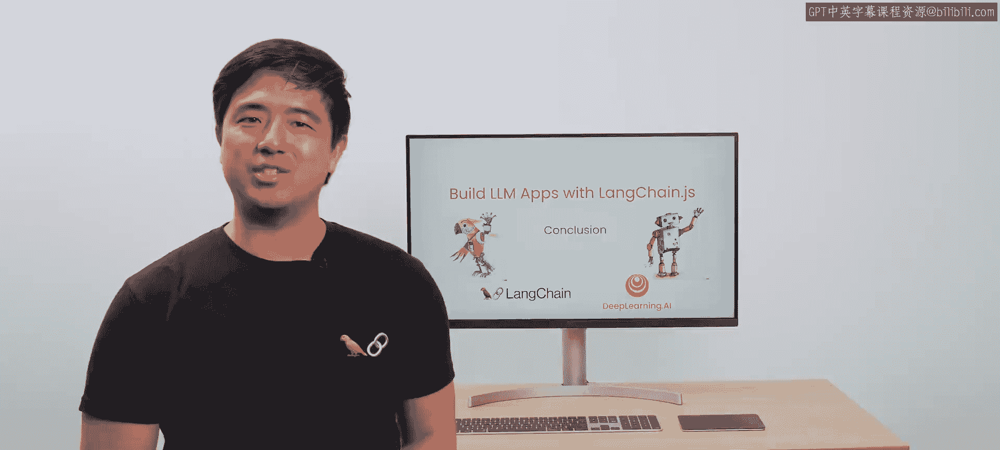
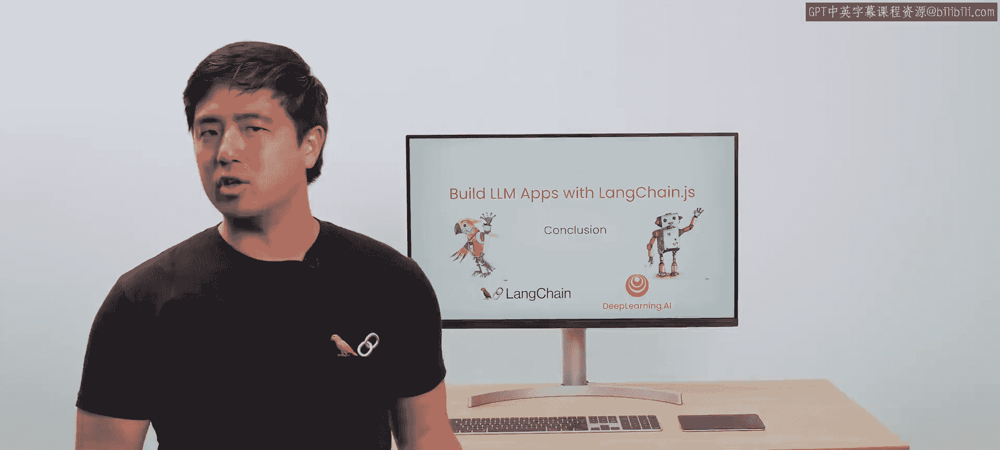
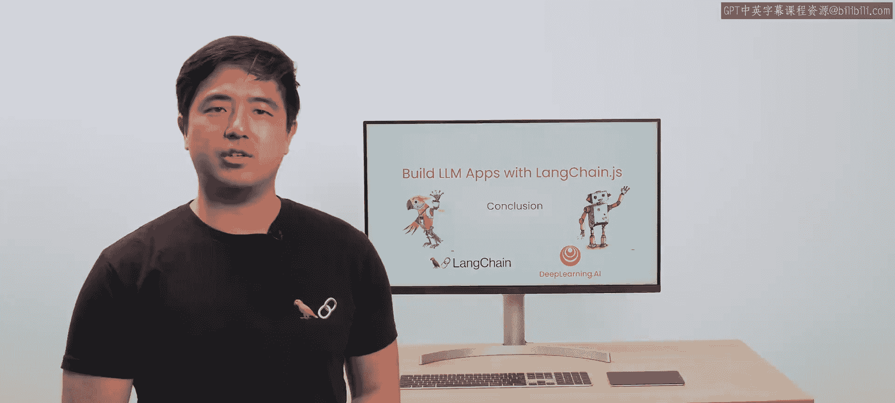
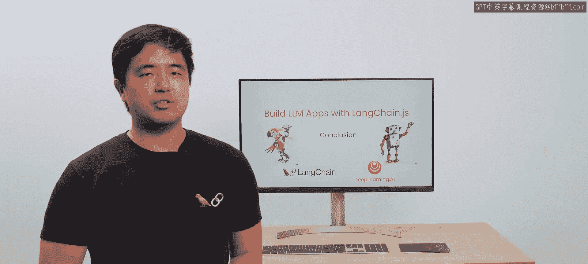

# 008：总结 🎓

在本节课中，我们将对使用LangChain.js构建大型语言模型应用程序的整个课程进行总结，回顾所学到的核心知识与技能。

---

恭喜你完成本课程。现在你已经积累了一些经验，掌握了使用大型语言模型构建复杂、具备上下文感知能力的应用程序所需的基础知识。

同时，你也学习了一些关于如何将这些应用投入生产环境的知识。

对于Web开发者社区而言，利用他们独特的技能组合，结合这些强大的模型来开发出色的应用，存在着巨大的潜力。

我希望这门课程能对你的学习之旅有所帮助。

再次感谢你的观看，祝你使用LangChain开发愉快。

---

本节课中，我们一起学习了构建LLM应用程序的完整流程，从基础概念到生产部署。我们回顾了如何利用LangChain.js框架，结合开发者自身的技能，将大型语言模型的能力转化为实际可用的、智能的应用程序。希望这些知识能成为你未来开发之旅的坚实基础。