# 001：LangChain 简介 🚀

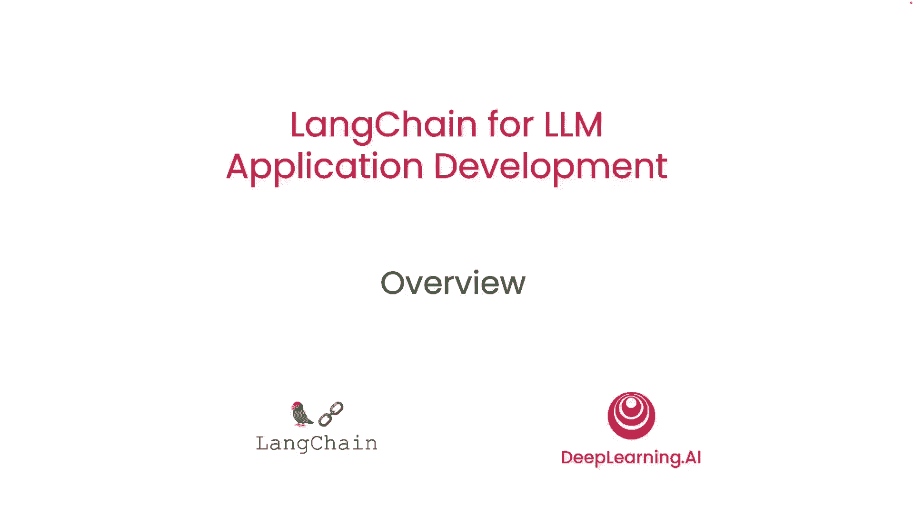

在本节课中，我们将学习什么是LangChain，它为何被创建，以及它的核心价值与主要组件。LangChain是一个用于构建大语言模型应用的开源框架，旨在简化开发流程。

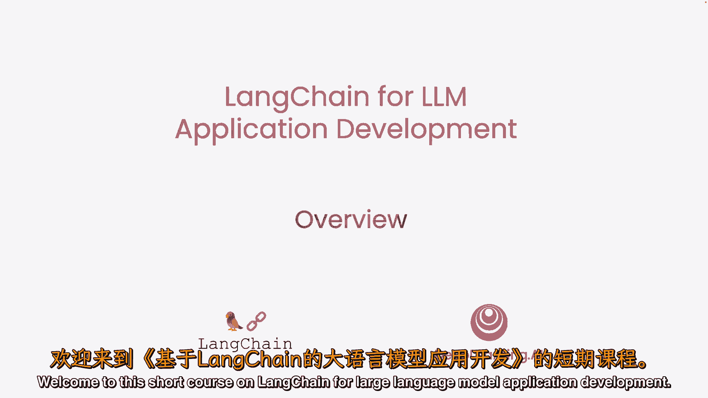

---

通过提示大语言模型来开发应用，如今变得更快。然而，应用通常需要多次提示模型并解析其输出，这导致开发者需要编写大量“胶水代码”。Harrison Chase创建的LangChain正是为了简化这一过程。

我们很高兴Harrison能参与本课程。DeepLearning.AI与他合作开发了这门课程，旨在教授如何使用这个强大的工具。

感谢邀请，我非常高兴来到这里。LangChain最初是一个开源框架。当我与领域内的一些人交流时，发现他们正在构建更复杂的应用程序，并看到了开发过程中的一些共同抽象模式。

我们一直对LangChain社区的广泛采纳感到兴奋，因此期待与大家分享，并期待看到人们用它构建出什么。实际上，作为LangChain核心动力的标志，还有数百名开源贡献者，这对快速开发至关重要。团队以惊人的速度发布代码和功能。

因此，希望在这门短期课程后，你能快速使用LangChain开发出很酷的应用。也许你甚至会决定回馈开源LangChain社区。

LangChain是用于构建大语言模型应用的开源框架，它有两个不同的包：一个是Python包，另一个是JavaScript包。其设计专注于**组合性**和**模块化**。

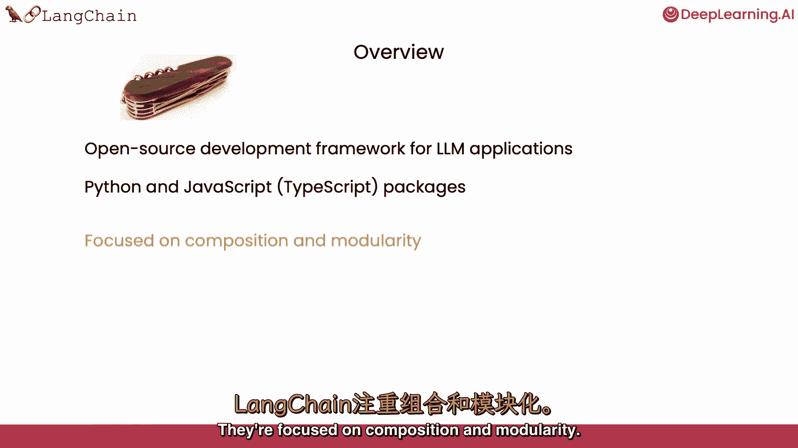

它们包含许多可以单独使用或相互结合的独立组件，这是其关键价值之一。

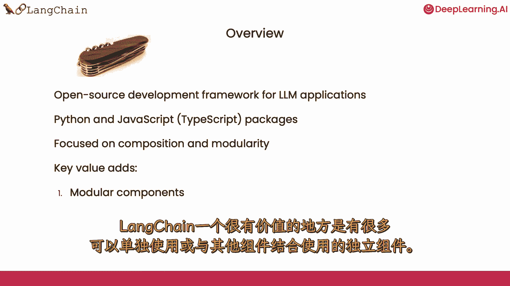

另一个关键价值是它支持一系列不同的用例。这些模块化组件可以组合成更多端到端的应用程序，并且使得开始使用这些用例变得非常容易。

---

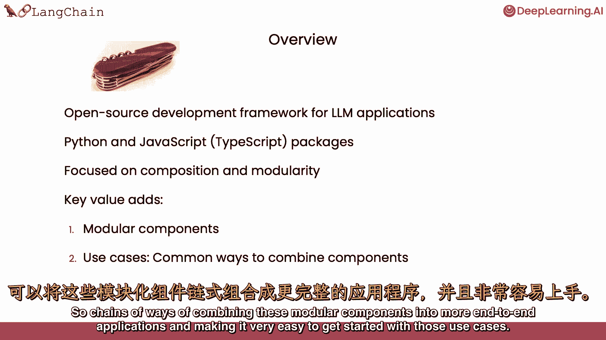

在接下来的课程中，我们将涵盖LangChain的常见组件。

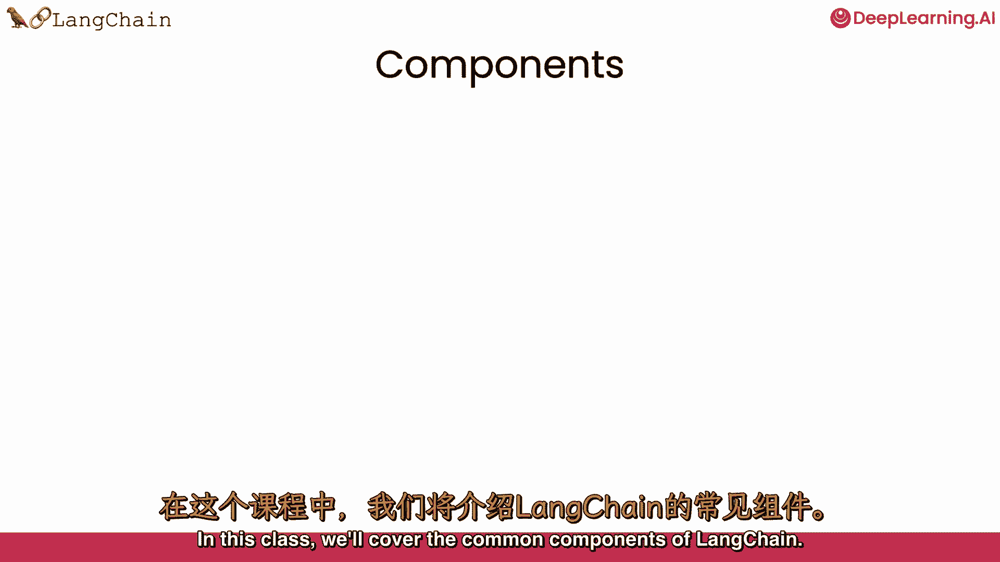

我们将讨论**模型**，这是应用的核心。

我们将讨论**提示**，这是如何让模型执行有用和有趣任务的关键。

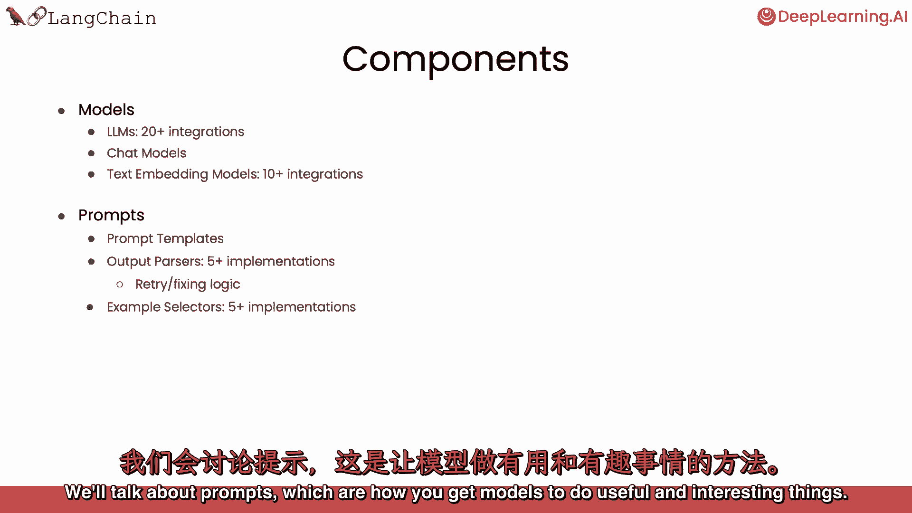

我们将讨论**索引**，即数据摄入的方式，以便你能将其与模型结合使用。

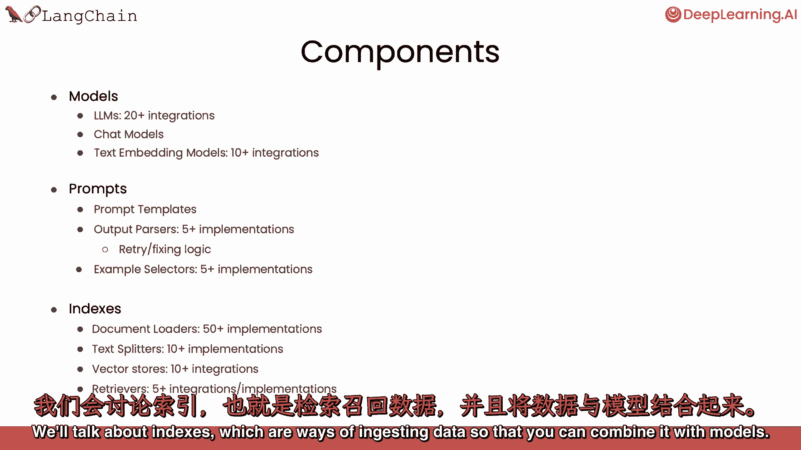

然后，我们将讨论用于端到端用例的**链**，以及**代理**。这些都是令人兴奋的端到端用例类型，它们将模型用作推理引擎。

---

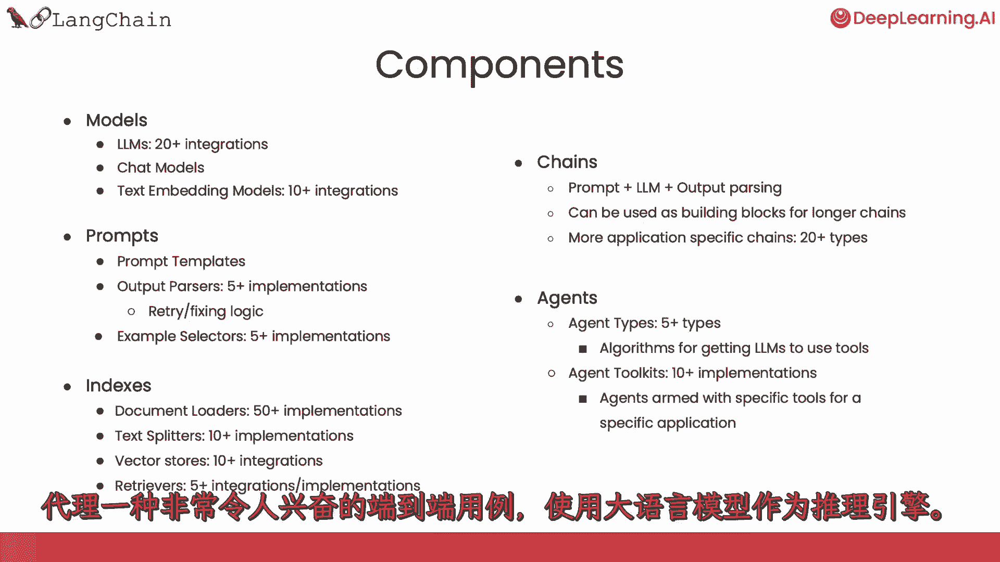

我们也感谢Anish Gola，他与Harrison Chase共同创办了公司，深入思考了这些材料，并协助制作了这门短期课程。

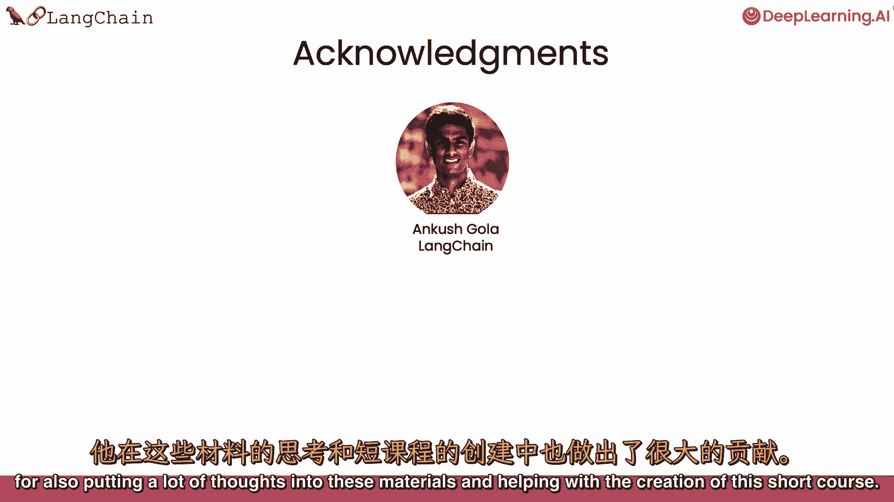

在DeepLearning.AI方面，Jeff、Ludwig、Eddie Shu和Dilara作为院长也为这些材料做出了贡献。

那么，让我们继续观看下一个视频，在那里我们将学习模型的基础知识。

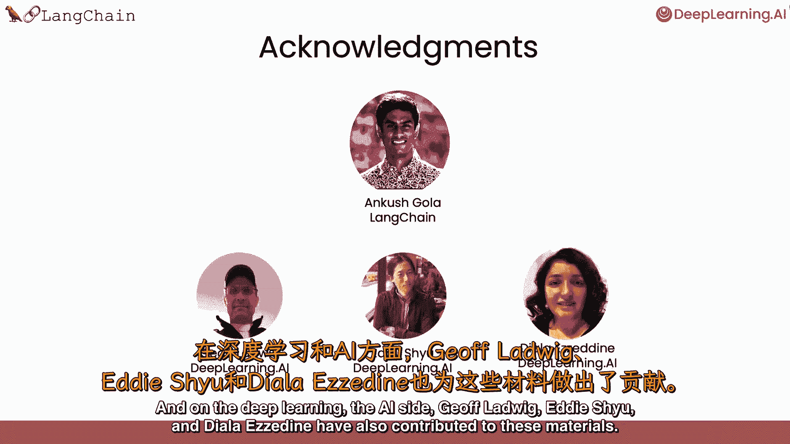

---

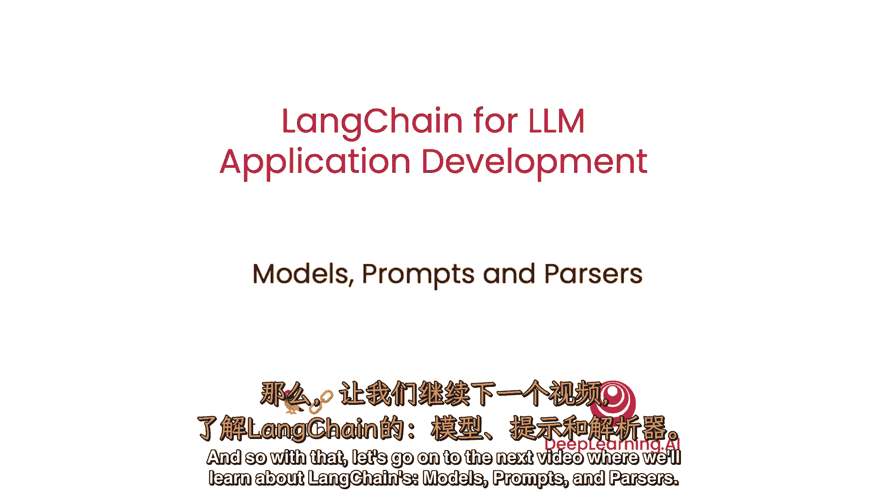

**本节课总结**：本节课我们一起学习了LangChain的起源、核心价值（模块化与组合性）以及其主要组件（模型、提示、索引、链和代理）。它为简化大语言模型应用开发提供了强大的框架支持。