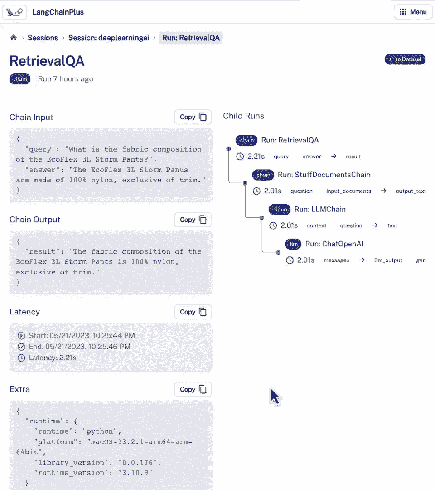

# 006：评估 📊

在本节课中，我们将学习如何评估基于大语言模型（LLM）构建的应用。评估是开发流程中至关重要但有时又很棘手的一步，它能帮助我们判断应用是否满足准确性标准，并在我们更改实现（如替换模型、调整检索策略或修改参数）时，确认改进是否有效。

## 1. 理解评估的挑战

上一节我们介绍了如何构建一个问答链。本节中，我们来看看如何评估它的表现。LLM应用通常由多个步骤串联而成，因此理解每个步骤的输入和输出是评估的基础。虽然一些工具可以像调试器一样可视化这些步骤，但要全面评估模型表现，查看大量数据点会更有帮助。

手动检查是一种方法，但使用语言模型本身来评估其他模型和应用则更为高效和强大。随着开发范式转向基于提示的工程，评估流程也在被重新思考，这带来了许多激动人心的新概念。

## 2. 设置待评估的应用

首先，我们需要一个待评估的链或应用。我们将使用上一节课构建的文档问答链作为示例。

以下是设置步骤：
```python
# 导入所需库，加载数据，创建索引
from langchain.vectorstores import Chroma
from langchain.embeddings import OpenAIEmbeddings
from langchain.chains import RetrievalQA
from langchain.chat_models import ChatOpenAI

# 加载文档并创建向量数据库
documents = load_documents()
vectorstore = Chroma.from_documents(documents, OpenAIEmbeddings())

# 创建检索QA链
qa_chain = RetrievalQA.from_chain_type(
    llm=ChatOpenAI(),
    chain_type="stuff",
    retriever=vectorstore.as_retriever(),
    verbose=False
)
```

## 3. 创建评估数据集

有了应用后，我们需要确定用于评估的数据点。我们将介绍几种方法。

### 方法一：手动创建示例
最简单的方法是手动构思一些好的查询-答案对。例如，浏览文档后，我们可以提出：
*   **查询**：舒适套头衫套装是否有侧口袋？
*   **真实答案**：是。

但这种方法扩展性差，需要为每个示例花费时间。

### 方法二：使用语言模型自动生成
我们可以利用语言模型本身来自动化生成评估数据集。LangChain提供了`QAGenerationChain`工具。

以下是生成问答对的步骤：
```python
from langchain.evaluation.qa import QAGenerationChain

# 创建问答生成链
example_gen_chain = QAGenerationChain.from_llm(ChatOpenAI())

# 为文档生成问答对
examples = example_gen_chain.apply_and_parse([{"doc": t} for t in documents[:5]])
```
这个链会分析每个文档的内容，并自动生成相关的**查询**和对应的**真实答案**，极大地节省了时间。

现在，我们可以将手动和自动生成的示例合并，形成一个评估数据集。

## 4. 调试与检查链的内部状态

在评估所有示例之前，了解单个查询在链中是如何处理的很有帮助。仅仅查看最终答案是不够的，我们需要知道中间步骤、检索到的文档以及传递给LLM的完整提示。

LangChain提供了一个实用工具 `langchain.debug`。

设置并运行调试：
```python
import langchain
langchain.debug = True

# 运行链，将看到详细的内部信息输出
result = qa_chain.run("舒适套头衫套装是否有侧口袋？")
langchain.debug = False
```
启用调试模式后，运行链会输出详细信息，例如：
1.  进入`RetrievalQA`链。
2.  进入`StuffDocuments`链（使用`stuff`方法合并文档）。
3.  进入`LLMChain`，显示输入（原始问题、检索到的上下文）。
4.  进入`ChatOpenAI`模型，显示完整的提示模板和系统消息。
5.  最终输出答案及Token使用量等元数据。

这有助于定位问题：如果答案错误，可能是检索步骤没找到相关文档，而不是语言模型本身的问题。

## 5. 使用语言模型进行自动化评估

为所有示例手动检查预测结果非常乏味。我们可以再次借助语言模型来自动化评估过程。

首先，为数据集中的所有示例生成预测：
```python
# 为所有示例运行QA链，生成预测答案
predictions = []
for example in evaluation_dataset:
    pred = qa_chain.run(example["query"])
    predictions.append(pred)
```

然后，使用LangChain的`QAEvalChain`进行评估：
```python
from langchain.evaluation.qa import QAEvalChain

# 创建评估链
eval_chain = QAEvalChain.from_llm(ChatOpenAI())

# 执行评估
graded_outputs = eval_chain.evaluate(
    evaluation_dataset, 
    predictions, 
    question_key="query", 
    answer_key="answer",
    prediction_key="result"
)

# 查看评估结果
for i, (example, prediction, grade) in enumerate(zip(evaluation_dataset, predictions, graded_outputs)):
    print(f"示例 {i+1}:")
    print(f"问题: {example['query']}")
    print(f"真实答案: {example['answer']}")
    print(f"预测答案: {prediction}")
    print(f"评分: {grade['text']}")
    print("-" * 50)
```
使用语言模型评估的核心优势在于它能理解**语义**。两个字符串在字面上可能完全不同（例如“是”和“舒适保暖套头衫条纹确实有侧口袋”），但只要含义正确，语言模型就能给出“正确”的评分。这是传统的字符串匹配或正则表达式方法无法做到的。

## 6. 利用LangSmith平台进行持久化评估

最后，我们介绍LangChain的官方平台——LangSmith。它可以将我们在笔记本中进行的运行、调试和评估工作持久化，并在一个统一的UI界面中展示。

在LangSmith平台中，你可以：
*   **追踪运行**：查看所有历史查询的输入和输出。
*   **可视化链**：以更清晰的方式查看链的每一步，包括中间状态和传递给模型的提示。
*   **构建数据集**：直接将从应用运行中得到的好的查询-答案对添加到数据集中，方便后续评估。
*   **实现评估飞轮**：持续运行应用，收集数据，进行评估，并用结果指导应用优化，形成一个闭环。

这为管理和规模化评估流程提供了一个强大的工具。

---




**本节课总结**：
在本节课中，我们一起学习了评估LLM应用的完整流程。我们从**理解评估挑战**开始，然后**设置了一个待评估的问答链**。接着，我们探讨了两种创建评估数据集的方法：**手动创建**和**使用LLM自动生成**。为了深入理解应用行为，我们使用了`langchain.debug`工具来**调试和检查链的内部状态**。最重要的是，我们学会了如何利用**语言模型本身作为评估器**，对预测结果进行自动化、基于语义的评分。最后，我们介绍了**LangSmith平台**，它能为评估工作流提供持久化、可视化和规模化的支持。掌握这些评估方法，是构建可靠、高效大模型应用的关键。