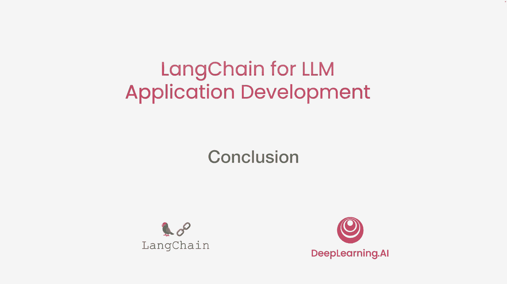
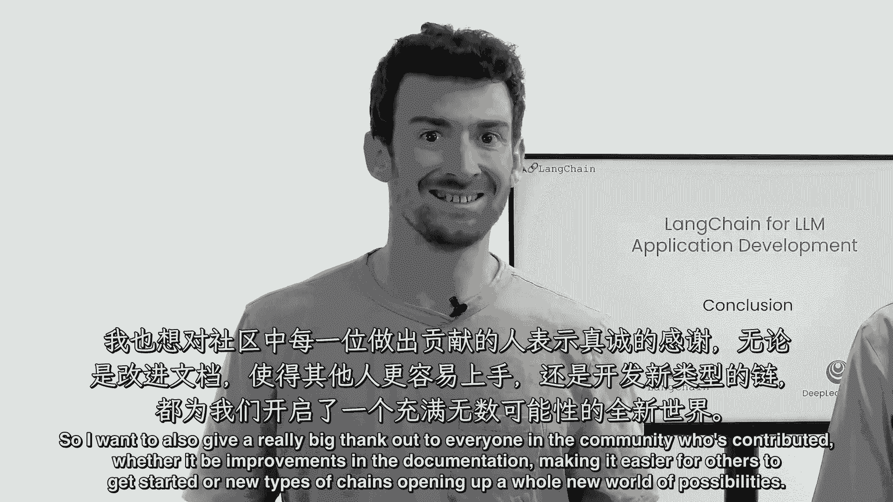
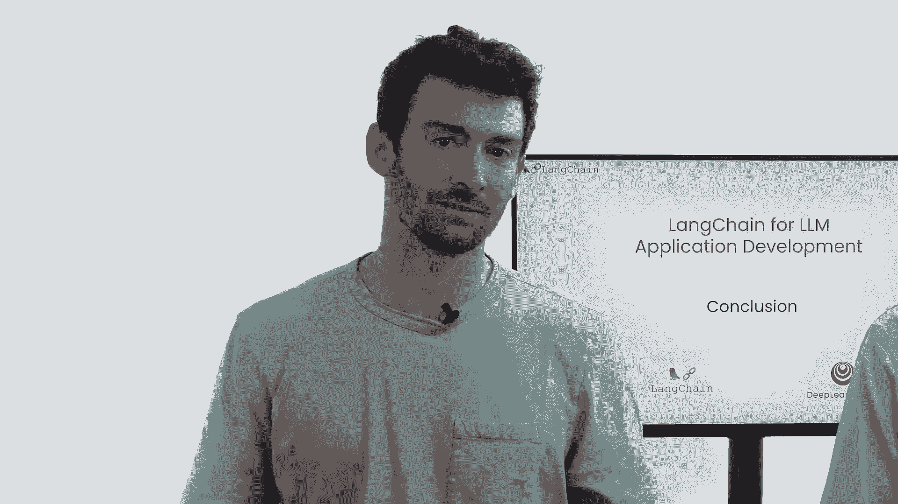

# 008：【LangChain大模型应用开发】课程总结 🎯

在本节课中，我们将对这门短课的核心内容进行回顾与总结。我们将梳理已学习的应用类型，理解LangChain如何简化开发流程，并展望语言模型的更多可能性。

---

在这门短课中，我们学习了一系列基于大语言模型的应用开发实例。

这些应用包括处理客户评论、构建文档问答系统，以及使用语言模型决策何时调用外部工具（如网络搜索）来回答复杂问题。

如果在一两周前，有人问及构建所有这些应用程序需要多少工作量，许多人可能会认为这需要数周甚至更长时间。

然而，在这门短课中，我们仅用了几行简洁的代码就实现了这些功能。这证明了你可以使用LangChain高效地构建各类应用程序。

因此，我希望你能吸收这些想法，并尝试将在Jupyter笔记本中看到的代码片段应用到自己的项目中。

这些应用只是一个起点。由于大语言模型功能强大且适用于广泛的任务，你还可以利用它们开发许多其他类型的应用。

无论是回答关于CSV文件的问题、查询SQL数据库，还是与API进行交互，LangChain都提供了丰富的示例。

这些功能主要通过组合使用**链（Chains）**、**提示（Prompts）** 和**输出解析器（Output Parsers）** 来实现。LangChain中更多的链式组件使得完成所有这些任务成为可能。

这一切在很大程度上要归功于LangChain社区的贡献。

在此，我想向社区中的每一位成员表示衷心的感谢。无论是通过改进文档帮助他人更容易上手，还是通过创建新的链式组件开启了全新的可能性世界。

课程到此结束。如果你还没有开始实践，我希望你现在就打开你的笔记本电脑或台式机，运行 `pip install langchain` 命令来安装LangChain，并开始你的探索之旅。

---

**本节课总结**

在本节课中，我们一起回顾了本课程涵盖的核心应用类型，理解了LangChain框架如何通过简洁的代码大幅降低大模型应用开发的门槛。我们认识到，借助强大的语言模型和活跃的社区生态，开发者可以高效构建从文本处理到复杂决策的多样化应用。最后，我们鼓励你立即动手安装LangChain，将所学知识付诸实践。