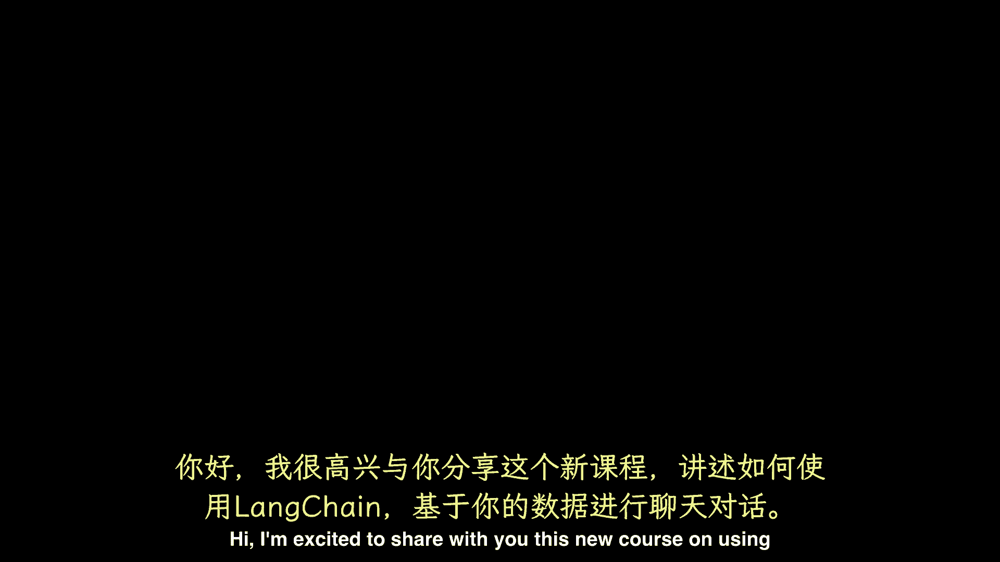
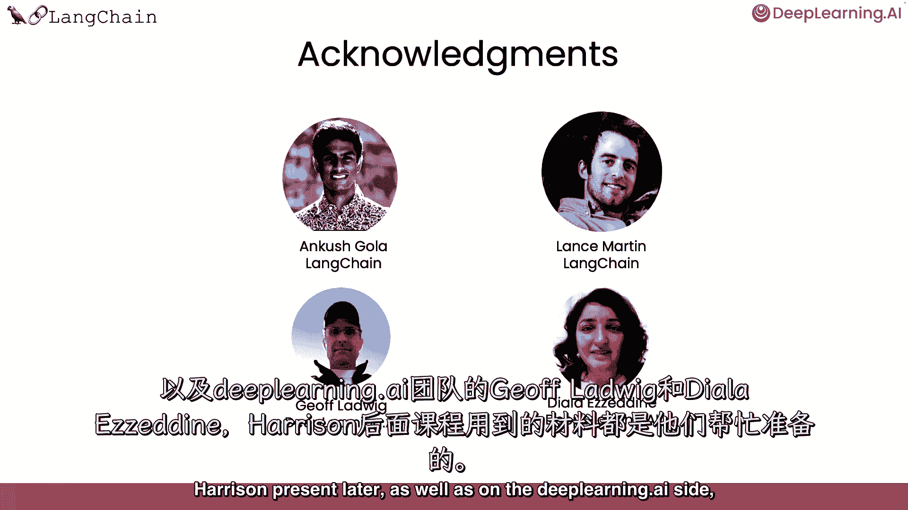

# 009：📚 构建与数据对话的聊天机器人（一）—— 介绍

## 概述

在本节课中，我们将要学习如何使用 LangChain 框架来构建一个能与你的专属数据进行对话的聊天机器人。大型语言模型（LLMs）虽然强大，但其知识通常局限于训练数据。本课程将指导你如何让 LLM 访问并利用你的私有文档来回答问题。

## 课程内容

大型语言模型（LLMs），例如 ChatGPT，能够回答许多主题的问题。但一个孤立的 LLM 只知道它被训练过的内容，不包括你的个人资料。例如，如果你在一家公司，拥有不在网络上的专有文件，或者 LLM 训练后编写的数据或文章，那么 LLM 就无法直接利用这些信息。

因此，如果你或其他人，比如你的客户，希望与自己的文件进行对话并获得基于这些文档信息的回答，就需要特殊的方法。在本短期课程中，我们将介绍如何使用 LangChain 与你的数据聊天。

LangChain 是一个用于构建 LLM 应用程序的开源开发者框架。LangChain 由几个模块化组件以及更多的端到端模板组成。LangChain 中的模块化组件包括：**提示**、**模型**、**索引**、**链**和**代理**。要更详细地了解这些组件，你可以参考我和 Andrew 教授的第一门课。

在本课程中，我们将聚焦于 LangChain 一个更受欢迎的用例：**如何使用 LangChain 与你的数据聊天**。

## 学习路径

以下是本课程将涵盖的核心步骤：

首先，我们将介绍如何使用 LangChain 的文档加载器，从各种来源加载数据。

上一节我们介绍了课程目标，本节中我们来看看数据处理的第一步。以下是加载数据后的关键预处理步骤：

*   我们将讨论如何将这些文档拆分为语义上有意义的块。这个预处理步骤可能看起来很简单，但其中有很多细微差别。

接下来，我们将概述语义搜索，这是一种根据用户问题获取相关信息的基本方法。这是最简单的入门方法，但也有几种情况会失败，我们会仔细检查这些案例。

然后，我们将讨论如何修复这些失败案例。之后，我们将展示如何使用这些检索到的文档，使 LLM 能够回答有关文档的问题。

但此时，你仍然缺少一个关键的部分来完全重现聊天机器人的体验。最后，我们将讨论这个缺失的部分——**记忆**，并展示如何构建一个功能齐全的、可以与你的数据聊天的聊天机器人。

这将是一个激动人心的短期课程。我们感谢 Ankura、Lance Martin，感谢 LangChain 团队为 Harrison 提供的所有材料，以及 DeepLearning.AI 的方杰夫。

Ludwig 和 Diala Eine，万一你要上这门课，并决定想复习一下 LangChain 的基础知识，我鼓励你也参加之前的 LangChain 短期培训班，关于 LLM 应用开发，Harrison 也提到过。那么现在让我们进入下一个视频，Harrison 将向你展示如何使用。

## 总结

本节课中，我们一起学习了构建与数据对话的聊天机器人的核心动机和整体路线图。我们了解到，为了让 LLM 利用私有数据，需要借助 LangChain 框架，并依次完成数据加载、分块、检索、增强生成以及添加记忆功能等关键步骤。接下来，我们将深入每个环节的具体实现。