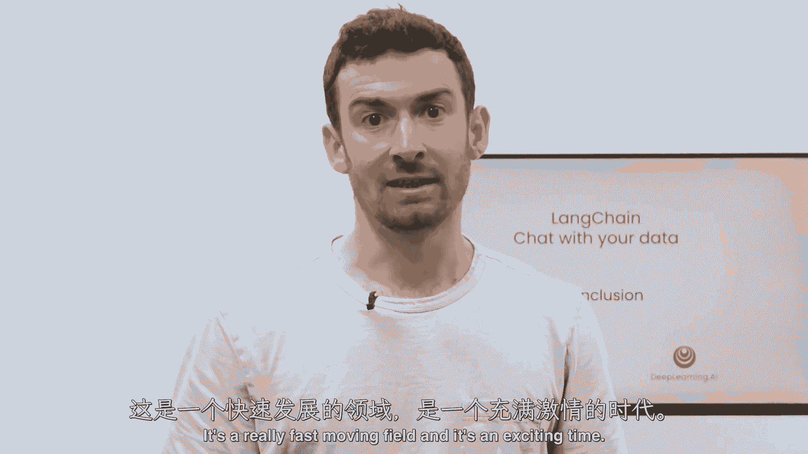

# 016：【LangChain大模型应用开发】课程总结 🎓

在本节课中，我们将一起回顾整个课程的核心内容与学习路径。课程涵盖了如何利用LangChain框架，构建一个能够与您自有数据进行对话的完整聊天机器人应用。

---

## 课程内容回顾 📚

上一节我们介绍了课程的整体目标，本节中我们来详细梳理已学习的各个模块。

### 数据加载与处理

我们从各种文档源加载数据开始。LangChain提供了超过80种不同的文档加载器。

以下是数据处理的核心步骤：
1.  使用文档加载器读取原始文件。
2.  将文档分割成更小的文本块（Chunking）。这个过程涉及许多细微差别，例如块的大小和重叠度的选择。

### 向量化存储与检索

接着，我们为这些文本块创建嵌入向量，并将它们存入向量数据库。这使我们能够轻松实现语义搜索。

然而，语义搜索在某些边缘情况下可能存在不足。为了克服这些限制，我们深入探讨了检索环节。

### 高级检索与答案生成

检索部分介绍了许多新颖、先进且有趣的检索算法。这些算法旨在提升在复杂查询下的准确率。

然后，我们将检索到的相关文档与大型语言模型结合。具体流程是：接收用户问题，检索相关文档，并将它们一同传递给LLM，最终生成针对原始问题的答案。

### 构建端到端对话应用

至此，系统还缺少对话的连贯性。我们通过创建一个功能齐全的端到端聊天机器人，完善了这一环节，实现了与数据的流畅对话。

---

## 总结与展望 🌟

本节课中，我们一起学习了利用LangChain构建对话式AI应用的完整流程：从数据加载、分块、向量化存储，到高级检索、与LLM结合生成答案，最终集成对话能力，打造出完整的聊天机器人。

这是一个快速发展的领域，充满了激动人心的创新。我真诚地期待看到您如何应用所学知识，构建出属于自己的应用。欢迎您在社区分享您的成果、新技巧，甚至为LangChain项目贡献代码。