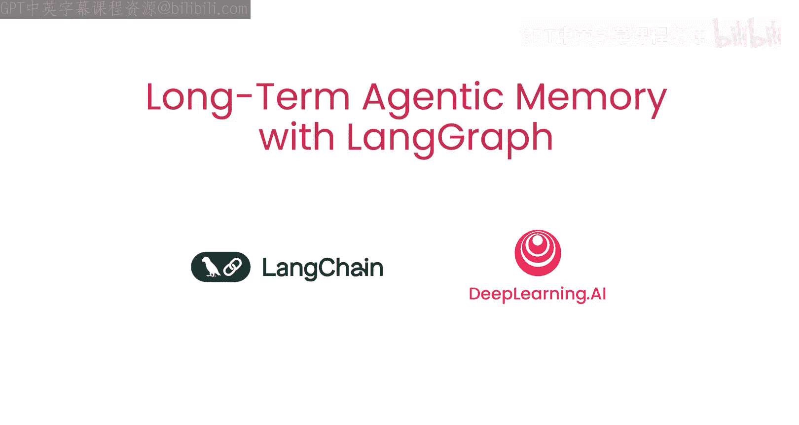
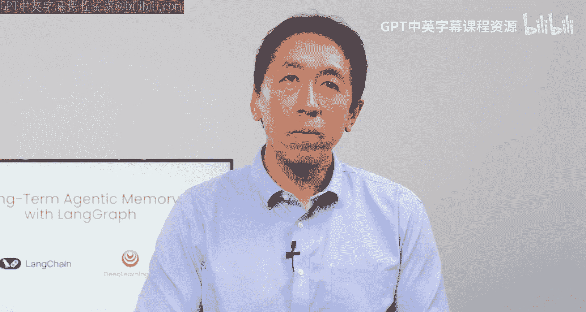
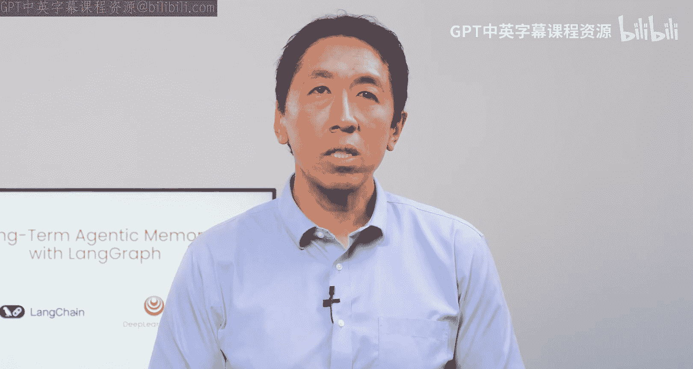
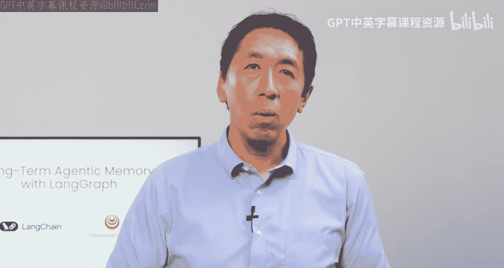
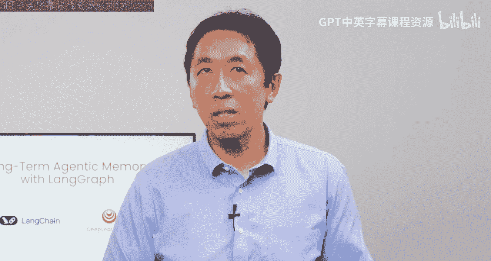
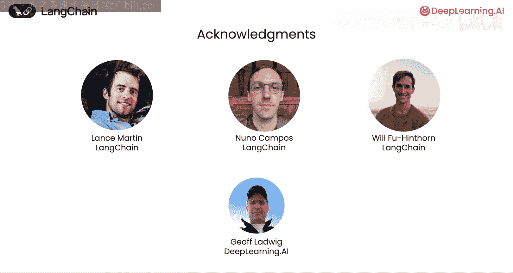

# 001：构建具备长期记忆的自主智能体 🧠

## 概述

在本节课中，我们将学习如何为自主智能体（Agent）添加长期记忆。我们将探讨需要存储哪些信息、何时以及如何检索这些信息，并介绍三种关键的记忆类型。课程将使用 LangGraph 库，通过构建一个实用的电子邮件助手来演示这些概念。

## 课程内容

欢迎来到与 Langchain 合作构建的“使用 LangGraph 实现长期智能体记忆”课程。

我是 Harrison Chase，Langchain 的联合创始人，很高兴再次与大家见面。谢谢 Andrew。

近来，我们看到许多智能体应用被构建出来。这帮助我们形成了一个在为其添加记忆时非常有用的思维框架。我们希望与学习者分享这个框架。

越来越多的 AI 应用需要跨越时间持续运行。这真正驱动了对智能体记忆的需求。一个例子是 AI 个人助手。

智能体是一个很好的例子，它们学得越多，在未来任务中表现就越好。

要为智能体添加记忆，首先必须弄清楚哪些信息需要存储在长期记忆中。同时，当需要使用这些信息时，还需要知道如何检索。

首先关注存储什么。

聊天机器人最初只是在对话的每一轮中，在上下文记忆中查看对话历史。但那些长期为你服务的智能体需要长期记忆。

例如，一个日历智能体可能需要长期保存跨多个智能体调用周期的会议信息。

接下来是检索。检索将从记忆中获取信息并将其插入到上下文中。Harrison 将向大家展示如何确定何时以及检索什么。

此外，我们还需要决定何时更新这些存储的信息。它应该在智能体循环的每次迭代中更新，还是在后台空闲时更新？

为了解决这些问题，我们发现将记忆分为三种类型来思考是有用的。

以下是三种记忆类型：

1.  **语义记忆**：这些是事实，例如日历智能体中重要的生日。
2.  **情景记忆**：这些是经验，可以帮助智能体记住如何完成任务。
3.  **程序性记忆**：这些是智能体需要遵循的规则。

为了帮助管理记忆，我们创建了一个新的库 LangGraph。它支持向量数据库，提供可搜索、可共享、持久化的存储。这些存储可以由智能体立即更新，也可以由辅助智能体在后台更新。

在本课程中，你将构建一个实用的电子邮件助手，使用 LangGraph 来演示所有这些概念。

多位贡献者共同创作了本课程。我要感谢来自 Langchain 的 Lance Martin、Wil Fu、Hinphonn 和 Nnocompos，以及来自 Dilanta AI 的 Jeff Ludwig。

好的，让我们开始第一课。

## 总结

本节课我们一起学习了为自主智能体构建长期记忆系统的基础。我们明确了智能体需要跨越时间存储和利用信息，并介绍了决定存储内容、检索时机以及更新策略的思维框架。核心是将记忆分为**语义记忆**、**情景记忆**和**程序性记忆**三类。我们还了解到 LangGraph 库为此提供了强大的工具支持。在接下来的实践中，我们将应用这些概念来构建一个电子邮件助手。