# 002：智能体记忆简介 🧠

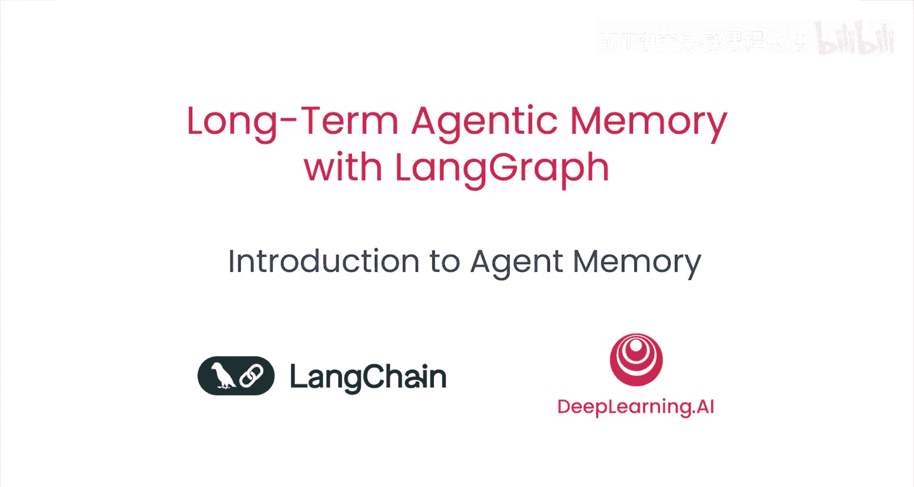

## 概述
在本节课中，我们将要学习智能体（Agent）记忆的核心概念，特别是长期记忆对于构建高效自主智能体的重要性。我们将以电子邮件助手为例，探讨三种不同类型的记忆及其实现方式。

几个月前，我们对开发者进行了一项调查，询问他们认为当前智能体最适合执行哪些任务。得票第二高的答案是个人助理和生产力任务。这些任务的一个核心方面是记忆，特别是长期记忆。

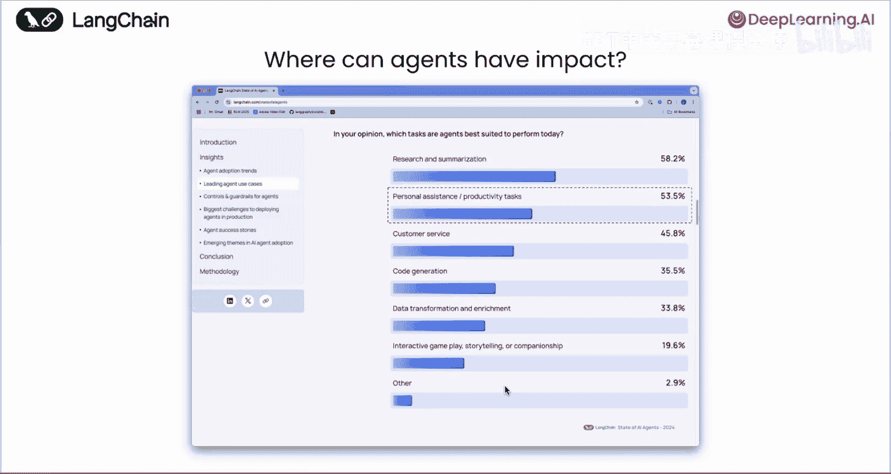

想象一下与一位担任个人助理的人类助手合作。如果他忘记了与你的所有对话，并且不记得你之前告诉他的事情，那将是一种非常糟糕的体验。对于智能体来说，情况也是如此。因此，记忆是这类任务的关键部分。当我们思考一个例子来介绍记忆时，电子邮件代理就是一个绝佳的选择。

## 为何选择电子邮件助手？ 📧

上一节我们介绍了记忆的重要性，本节中我们来看看为什么电子邮件助手是展示记忆功能的理想场景。

电子邮件是我们每个人都拥有且必须处理的事务。随着你越来越忙，可能会有越来越多的邮件涌现，而你根本没有时间查看或回复。这正是智能体可以大显身手的地方。

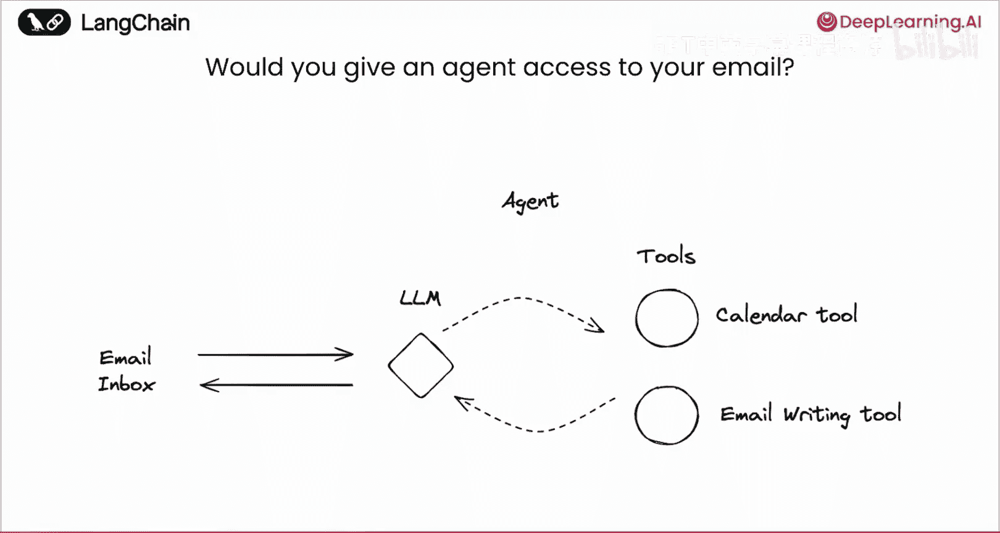

如果我们思考一个智能体要出色完成这项工作需要什么，它很可能与一位行政助理所需的能力相似。它可能需要访问日历工具来查看你的空闲时间，可能需要代表你撰写或回复邮件的权限。因此，当我们考虑构建一个智能体时，我们可以考虑赋予它访问这类工具的能力。

## 记忆在何处发挥作用？ 💭

像这样的智能体在许多地方，记忆都变得至关重要。
以下是几个关键环节：
*   **第一步是查看所有邮件并决定**：我应该忽略这封邮件，还是应该回复它？
*   **如果决定回复并使用日历或邮件工具**：它需要知道用户的会议偏好，包括时间、地点和标题。
*   **如果决定撰写邮件**：它需要了解用户的语气和风格。
*   **与之前有过互动的人交流**：了解之前的互动背景对于恰当回复非常重要。

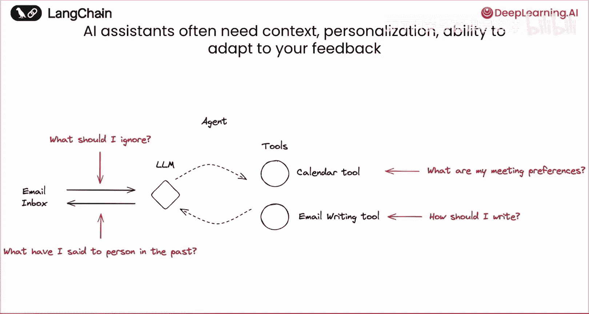

因此，这个电子邮件助手是展示大型语言模型（LLM）与记忆功能结合应用的绝佳平台。我们将用它作为试验场，来讨论AI智能体的三种不同类型记忆。

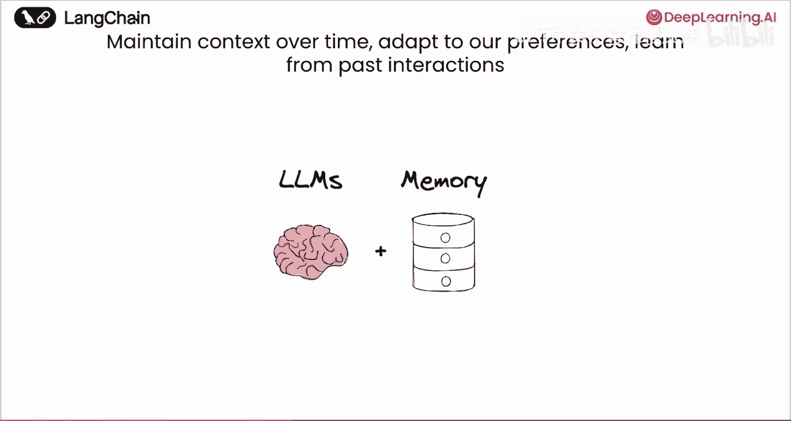

## 三种核心记忆类型 🧩

上一节我们看到了记忆在电子邮件助手工作流中的关键作用，本节中我们来详细了解一下智能体可以拥有的三种核心记忆类型。

**第一种是语义记忆。** 语义记忆本质上是事实。如果我们思考人类的语义记忆，它包括你在学校学到的知识、从教科书中读到并记住的事实，以及从以往互动中记住的各种基于事实的记忆。

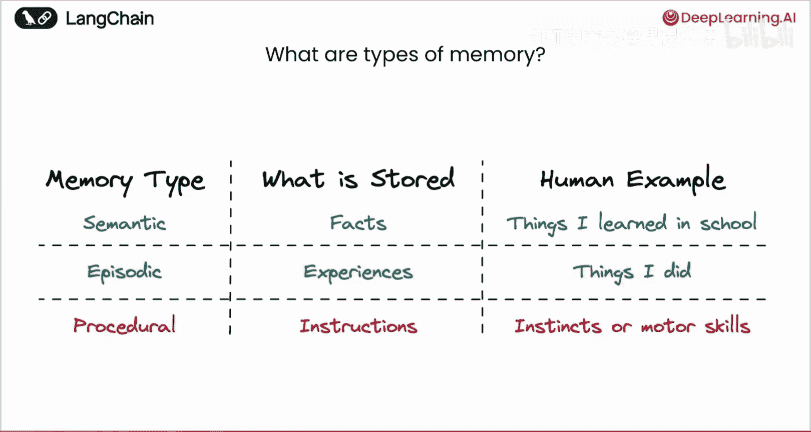

**第二种类型是情景记忆。** 这是关于经历的记忆，是对你曾有过确切对话的回溯。它不一定是关于这些对话的事实，而是对话本身的记忆，就像去迪士尼乐园的记忆一样。

**第三种类型是程序性记忆。** 这类似于给自己的指令、本能或运动技能，例如如何骑自行车，或者你给自己设定的关于如何回复邮件的指令。

## 如何映射到智能体？ 🔄

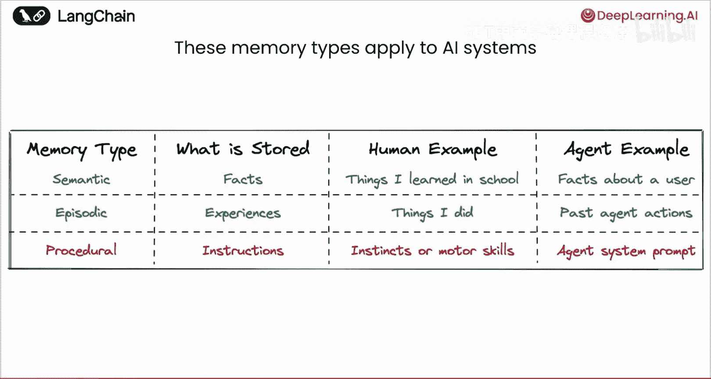

那么，我们如何将这些记忆类型映射到智能体上呢？

*   **对于语义记忆**：这些可能是关于用户或智能体交互过的人物、地点、事物的**事实**。
*   **对于情景记忆**：这可能是**过去的智能体行动**，以少量示例（few-shot examples）的形式存在，即之前发生过的实际轨迹记录。
*   **对于程序性记忆**：这可能是最直接的。这就是**系统提示词**，即你给智能体关于如何行为的指令。

## 记忆交互的两种范式 ⚙️

除了这三种记忆类型，指出智能体与这些记忆交互的不同方式也很有价值。

我们观察到两种不同的范式：
*   **第一种通常在热路径（hot path）中**：智能体在响应用户的同时更新记忆，所有操作一气呵成。
*   **另一种类型是记忆更新发生在后台或单独的进程中**。

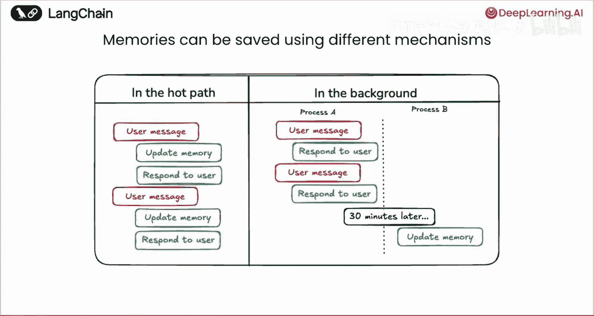

这两种方式各有优缺点。
*   **在热路径中更新**：通常只有一个智能体，因此维护更简单，更新也通常是即时发生的。然而，缺点是现在这个智能体必须同时做两件事：更新记忆和响应用户，这使得它更复杂，并且在响应用户时增加了额外的延迟。
*   **后台更新**则相反：现在你可以将记忆更新与智能体的核心任务分离开来，因此更简单。并且由于从热路径中移除了更新步骤，响应速度实际上更快。问题在于，现在你有了两个智能体而不是一个，这更复杂。并且更新可能不是即时发生的，它们可能只在触发更新记忆的进程启动时才发生。

## 本课程实践路线图 🗺️

在本课程中，我们将把这些记忆类型应用到一个电子邮件智能体上。

我们将从一个基本的电子邮件智能体开始，它首先对收到的邮件进行分类，如果值得回复，则将其传递给第二个智能体，该智能体使用日历工具和写作工具来回复邮件。

我们将添加的第一种记忆是**语义记忆**。我们将通过给这个负责回复邮件的智能体提供更多工具来实现：写入记忆的工具和读取记忆的工具。智能体将在热路径中使用这些工具，也就是说，在它循环调用日历或撰写邮件的同时，它也会写入和检索记忆。这就是热路径中的语义记忆，我们通过给智能体一个工具来实现。

接着，我们将添加**情景记忆**。这将以少量示例的形式存在于分类步骤中。这里我们将有一些与邮件对应的少量示例，以及我们希望得到的分类结果（是忽略、通知还是回复）。这些示例将被插入到提示词中。我们将在单独的进程中添加这些示例，这是情景记忆的一个例子，其更新发生在后台。

最后，我们将添加**程序性记忆**。这些是提示词本身，或者更确切地说，是提示词中关于如何使用不同工具或如何对事物进行分类的指令部分。我们同样将在后台更新这些内容，并且实际上会使用一个单独的智能体来执行更新。

## 总结与展望

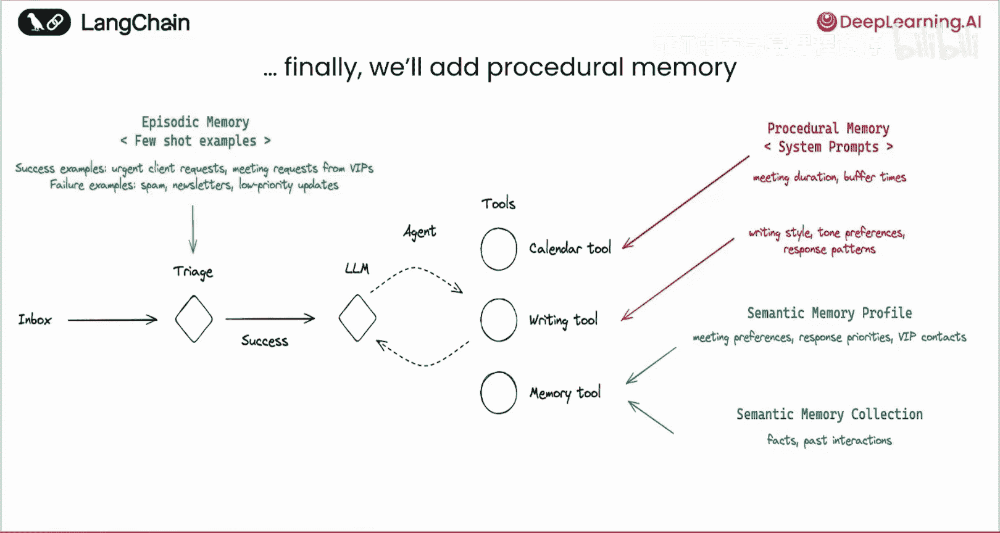

本节课中我们一起学习了智能体长期记忆的重要性，并深入探讨了语义记忆、情景记忆和程序性记忆这三种核心类型，以及它们在热路径和后台两种范式下的交互方式。

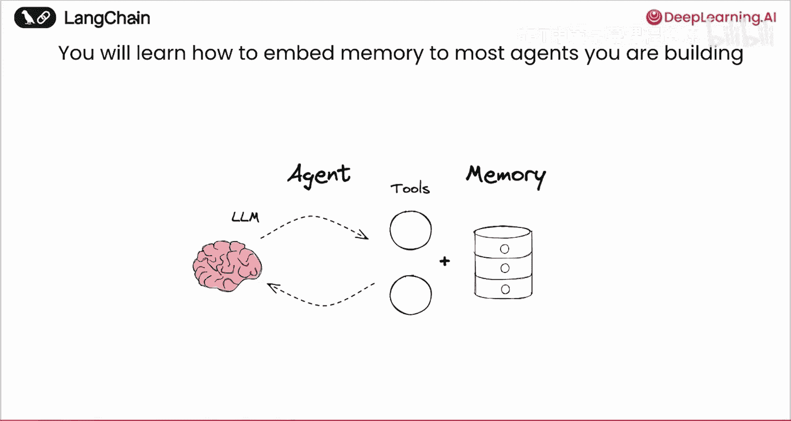

虽然我们将在第二课中构建一个非常具体的电子邮件智能体，但你在这里学到的管理智能体记忆的技术将适用于你未来构建的任何智能体。

你需要仔细思考你的智能体需要什么类型的记忆：
*   它是否需要学习更好的指令？好的，那可能是**程序性记忆**。
*   你是否想给它一些少量示例，因为你认为这将有助于真正指导它的行动？好的，那是**情景记忆**。
*   它是否只需要了解关于人物、地点和事物的事实？好的，那是**语义记忆**。
这完全取决于你正在构建的应用程序。

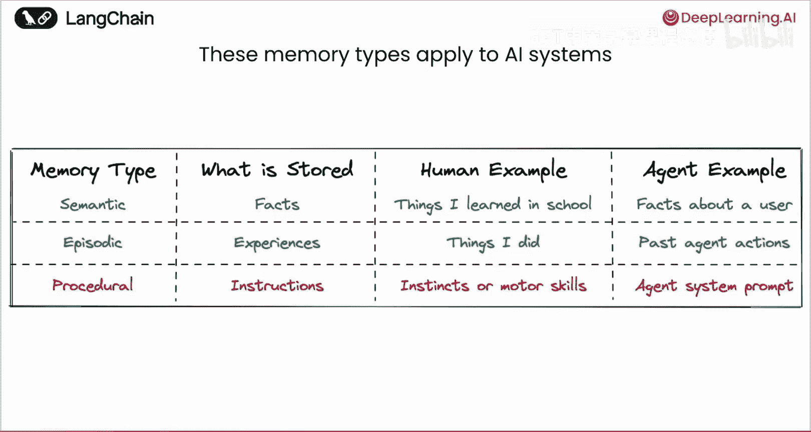

接下来，让我们进入下一课，学习如何构建这个基础的电子邮件智能体。