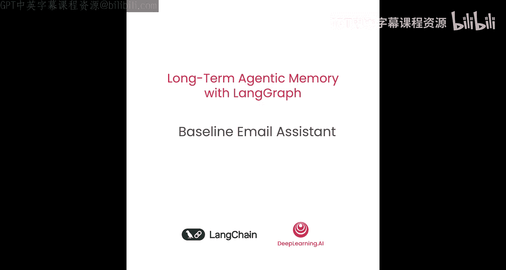
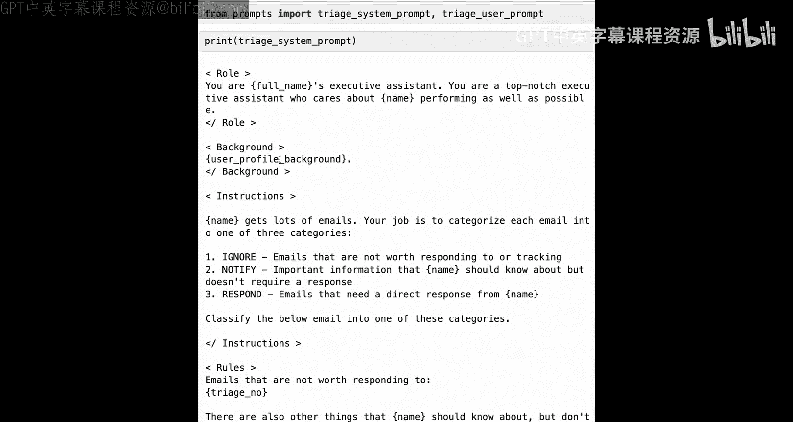
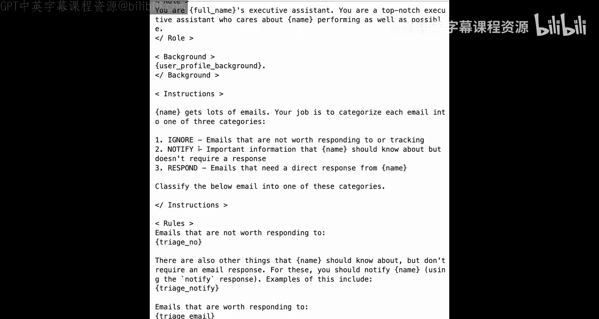
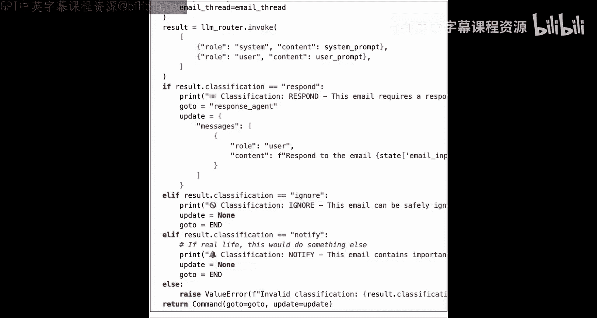
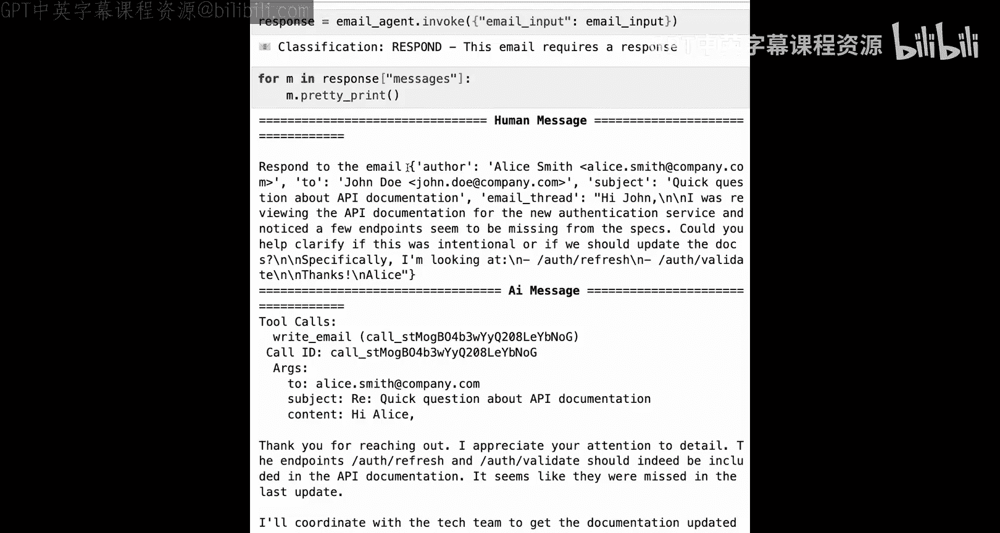
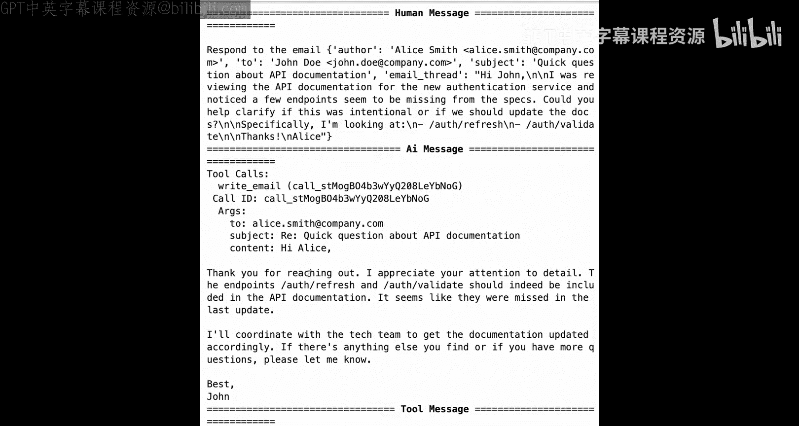
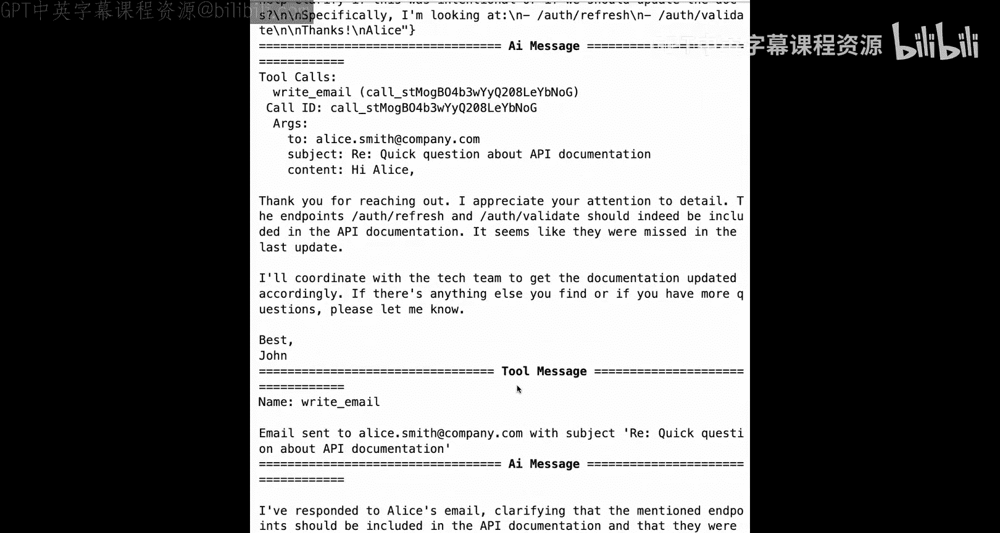
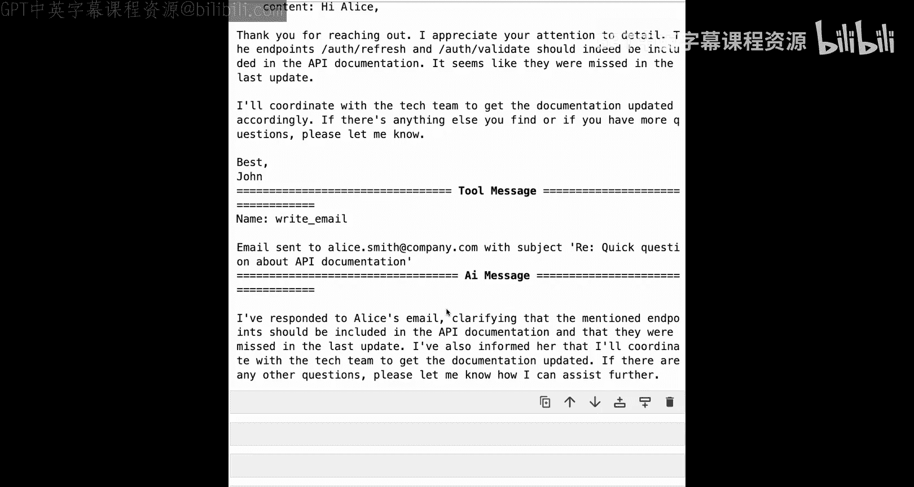

# 003：构建基础邮件助手




在本节课中，我们将构建一个基础的邮件助手。这个助手目前还不具备记忆功能，我们只是搭建框架并使其运行。

## 概述

我们将创建一个能够处理邮件的智能助手。其核心流程是：首先对收到的邮件进行分类（忽略、通知或回复），然后根据分类结果采取相应行动。本节将完成基础框架的搭建。

## 环境与配置

首先，我们需要导入环境变量并设置邮件助手的基本配置。

以下是配置用户个人资料和提示指令的步骤：

1.  **用户个人资料**：包含用户的姓名和背景信息。这代表邮件助手将要为其处理邮件的用户信息。
2.  **提示指令**：包含两部分规则。
    *   **分类规则**：定义哪些邮件应被归类为“忽略”、“通知”或“回复”。
    *   **主代理指令**：定义在决定回复邮件后，主代理应遵循的操作指南。

将个人资料和指令单独定义，是为了提高模块化程度，并为后续添加记忆功能做准备。

## 定义邮件结构





我们定义一个示例邮件来了解将要处理的数据结构。一封邮件主要包含四个部分：
*   `from`：发件人邮箱
*   `to`：收件人邮箱
*   `subject`：邮件主题
*   `body`：邮件正文

我们将使用这个结构来测试后续的代理功能。

## 构建分类节点

上一节我们介绍了整体框架，本节中我们来看看第一个核心组件：邮件分类节点。它的作用是判断如何处理一封邮件。

首先，我们导入必要的库并选择用于分类的模型，例如 OpenAI 的 GPT-4o-mini。

接着，我们定义分类节点输出的数据结构。我们使用 Pydantic 模型，它包含两个字段：
*   `reasoning`：LLM 生成其决策的理由。
*   `classification`：分类结果，必须是 `ignore`、`respond` 或 `notify` 之一。

我们使用 `with_structured_output` 方法将此数据结构绑定到 LLM，确保其输出格式固定。

然后，我们导入分类提示模板。它包含系统提示和用户提示两部分。
*   **系统提示**：定义了 AI 的角色、用户背景、分类类别说明以及规则部分。规则部分是一个模板，将用之前定义的指令来填充。
*   **用户提示**：结构简单，主要用于格式化输入的邮件内容。

现在，我们可以测试分类节点。我们格式化提示模板，调用绑定了输出结构的 LLM，并传入系统消息和用户消息。返回的结果将包含 `reasoning` 和 `classification` 字段。

## 构建主代理（响应代理）

当分类结果为“回复”时，我们需要一个更强大的代理来撰写并发送回复。这就是主代理。

首先，我们为主代理定义一些工具。以下是三个示例工具：

1.  **写邮件工具**：模拟发送邮件。
    ```python
    def send_email(to: str, subject: str, content: str):
        # 此处应连接真实邮箱API（如Gmail/Outlook）
        print(f"[模拟] 发送邮件给 {to}，主题：{subject}")
    ```
2.  **安排会议工具**：模拟安排日历会议。
    ```python
    def schedule_meeting(attendees: List[str], subject: str, duration_minutes: int, preferred_day: str):
        # 此处应连接真实日历API
        print(f"[模拟] 为 {attendees} 安排会议：{subject}")
    ```
3.  **检查日历可用性工具**：模拟检查用户某天的空闲时间。
    ```python
    def check_availability(day: str) -> List[str]:
        # 模拟数据
        return ["9:00 AM", "2:00 PM", "4:00 PM"]
    ```

接着，我们创建主代理的提示生成函数。该函数接收代理状态，返回一个消息列表，其中包含系统消息（包含角色、工具列表和自定义指令）和已有的对话历史。

我们使用 `create_react_agent` 来创建主代理，传入模型、工具列表和提示生成函数。

现在可以测试主代理。例如，我们询问“我周二有什么空闲时间？”，代理会调用 `check_availability` 工具并返回模拟的空闲时间。

## 整合为完整邮件助手

前面我们分别构建了分类节点和响应代理，现在我们将它们整合成一个完整的、具备工作流的邮件助手。

首先，我们定义整个图的状态，它包含：
*   `email_input`：用户传入的邮件信息。
*   `messages`：代理工作过程中的消息列表。



然后，我们定义**分类节点**的具体逻辑。该节点：
1.  从状态中提取邮件信息。
2.  格式化系统提示和用户提示。
3.  调用分类 LLM。
4.  根据分类结果决定下一步走向：
    *   `respond`：向 `messages` 列表中添加一条新的人类消息（内容为“回复邮件：[邮件内容]”），并指示图跳转到**响应代理**节点。
    *   `ignore`：不更新状态，直接跳转到图**结束**。
    *   `notify`：目前模拟行为与 `ignore` 类似（实际应用中可能跳转到通知节点），直接跳转到图**结束**。

最后，我们使用 `StateGraph` 来构建整个工作流。我们添加两个节点：`triage_node`（分类节点）和 `response_agent`（响应代理子图）。我们设置从起始点到 `triage_node` 的边，并根据分类节点的动态输出来决定后续路径。

我们可以使用 `draw_mermaid_png` 方法来可视化这个图，可以看到清晰的决策流程。

## 测试与总结

现在，让我们测试完整的邮件助手。



1.  **测试垃圾邮件**：输入一封推销邮件，助手应将其分类为 `ignore` 并直接结束。
2.  **测试需回复的邮件**：输入一封需要回复的邮件（例如询问会议时间），助手会将其分类为 `respond`，然后进入响应代理。响应代理会调用 `send_email` 工具生成并“发送”回复。我们可以在最终的 `messages` 列表中看到完整的对话和工具调用记录。





本节课中我们一起学习了如何使用 LangGraph 构建一个基础的邮件处理助手。我们完成了邮件分类、工具调用和代理工作流的整合。目前这个助手还没有记忆功能，在接下来的课程中，我们将为其添加长期记忆，使其能够基于历史交互做出更个性化的决策。



现在是一个很好的时机，你可以尝试修改示例邮件、调整分类规则或系统提示，观察助手行为的变化。