# 005：为智能体添加情景记忆 🧠

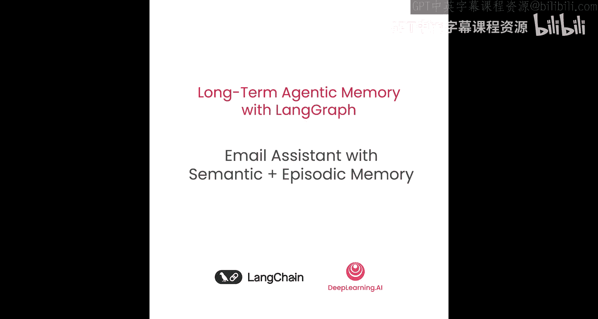

在本节课中，我们将学习如何为电子邮件助手智能体添加**情景记忆**。情景记忆通常以过往的智能体行动或**少样本示例**的形式存在，它们会被整合到提示词中，从而影响智能体的决策行为。我们将把这种记忆机制集成到邮件的“分类”步骤中。

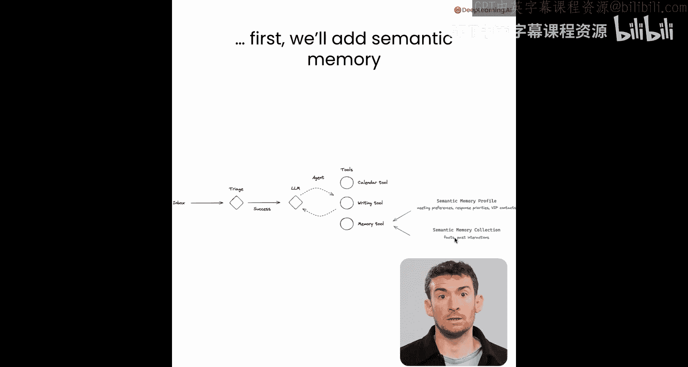

---

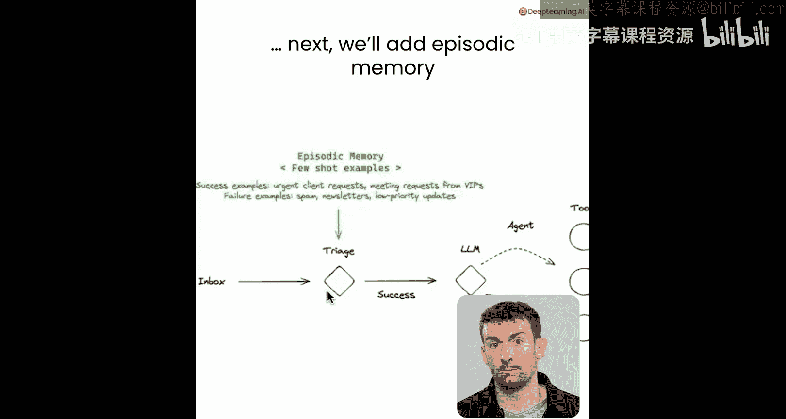

## 回顾与目标

上一节我们为智能体添加了语义记忆。本节我们将在此基础上，引入情景记忆。具体来说，我们将以**少样本示例**的形式添加记忆，并将其整合到邮件分类节点中。

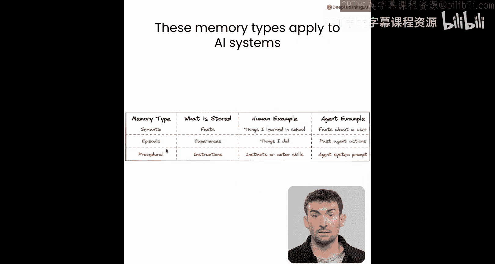

情景记忆代表的是**经验**，在智能体中，这通常表现为过去的智能体行动，以及作为少样本示例传递给提示词的信息。

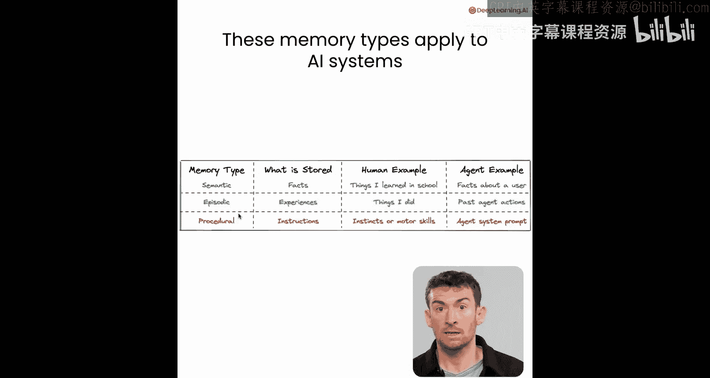

---

## 基础环境设置

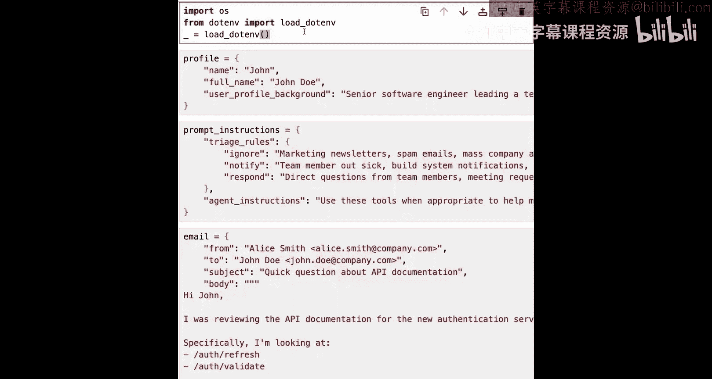

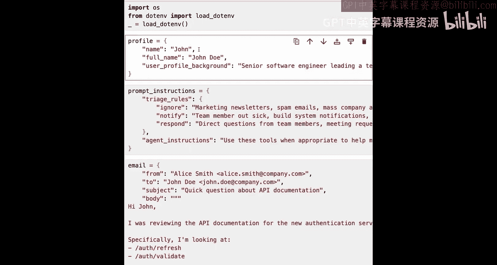

让我们开始实际操作。以下是基础的设置步骤，包括加载环境变量、定义用户配置、提示词指令和一个示例邮件。

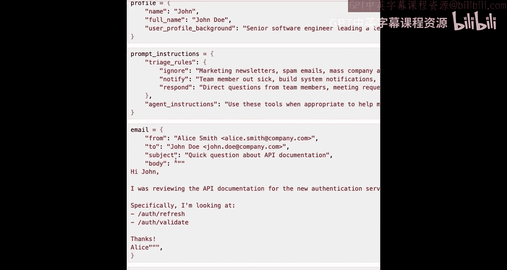

```python
# 加载环境变量
import os
from dotenv import load_dotenv
load_dotenv()

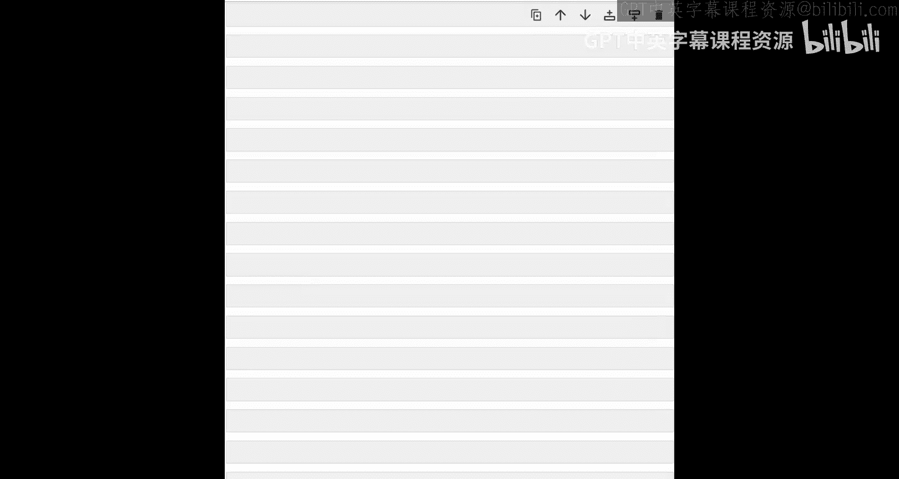

# 定义用户配置
profile = {
    "name": "John",
    "role": "Developer Advocate"
}

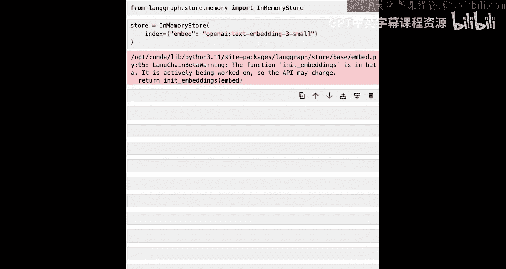

# 定义提示词指令
instructions = "You are a helpful email assistant. Triage incoming emails and decide whether to respond or ignore."

# 定义一个示例邮件
example_email = {
    "from": "tom@example.com",
    "to": "john@example.com",
    "subject": "Meeting Request",
    "body": "Hi John, can we schedule a meeting next week?"
}
```

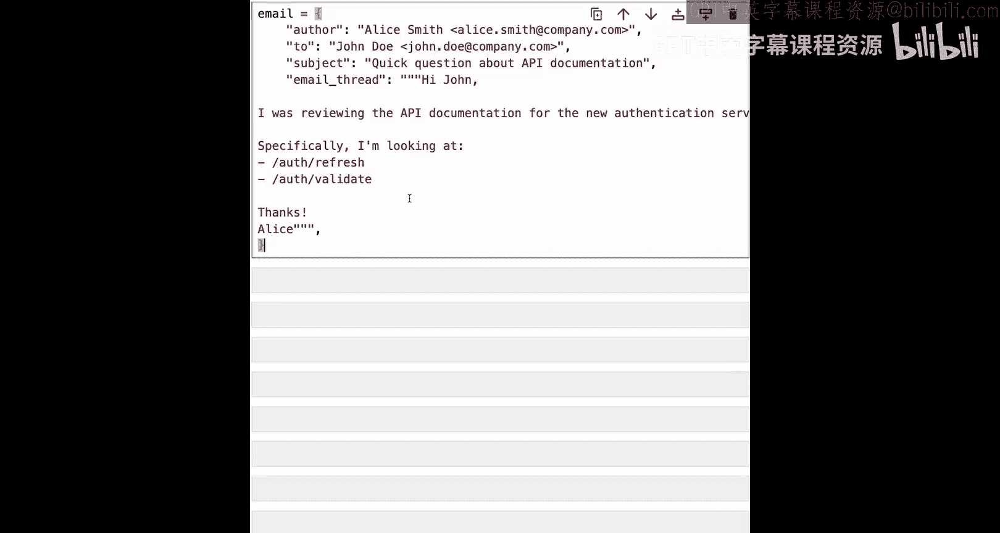

---

## 定义长期记忆存储

在定义分类逻辑之前，我们先来讨论少样本示例。首先，我们需要定义长期记忆存储，这与我们在第3课中使用的方法相同。

```python
from langchain.vectorstores import LanceDB
import lancedb

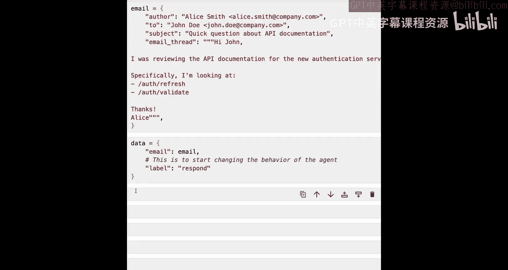

# 初始化 LanceDB 连接
db = lancedb.connect("./.lancedb")
# 创建或获取一个用于存储示例的集合（表）
store = LanceDB(connection=db, collection_name="email_examples")
```

---

## 准备少样本示例数据

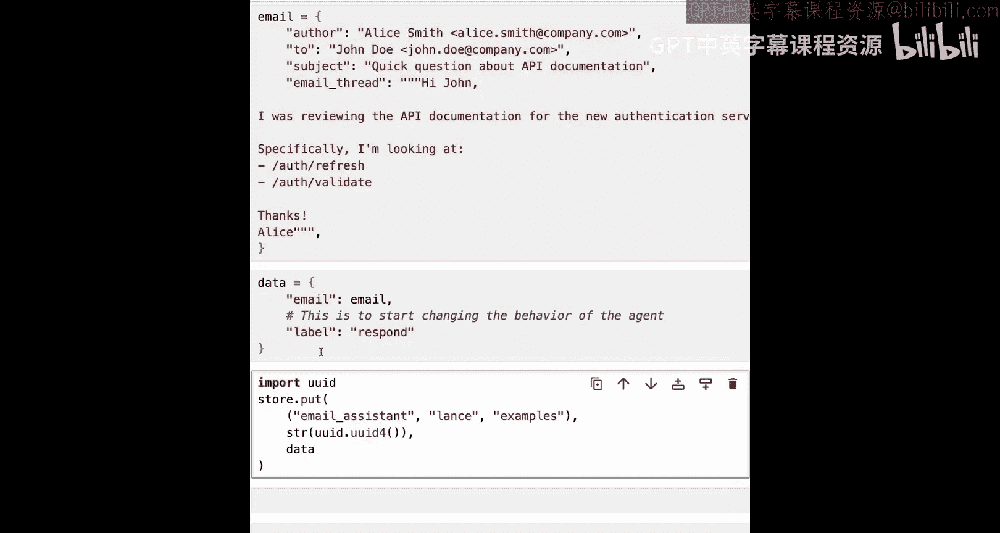

接下来，我们需要定义要作为少样本示例加载的数据。首先，决定要存储的邮件内容。这里我们使用上面定义的示例邮件。

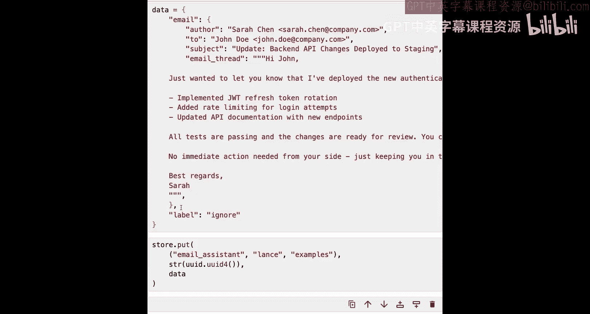

```python
# 定义要存储的示例数据
example_data = {
    "email": example_email,  # 输入
    "label": "respond",      # 输出：分类标签
    "response": "Sure, let's find a time."  # 输出：建议回复（可选）
}
```

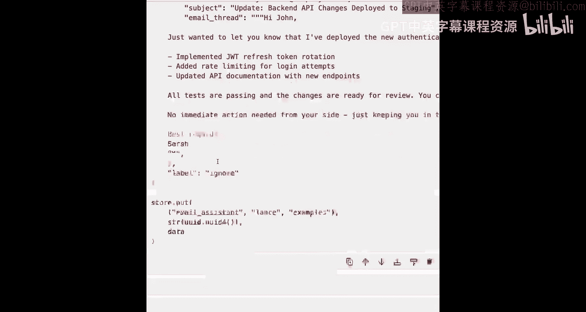

我们将这个示例放入一个更大的数据模型中，包含邮件（输入）和输出（这里称为`label`和`response`）。这些输出也会被格式化到少样本示例中，从而帮助改变智能体的行为。

现在，我们可以将这个示例存入长期记忆存储。我们需要指定一个命名空间，例如 `email_assistant`，并传入一个唯一ID和数据。

```python
import uuid

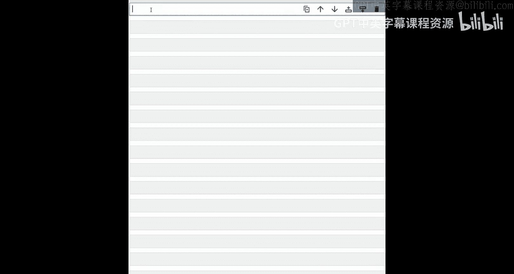

# 将示例存入记忆存储
namespace = "email_assistant"
example_id = str(uuid.uuid4())
store.add_texts(
    texts=[str(example_data)],  # 将数据转换为字符串存储
    metadatas=[{"namespace": namespace, "id": example_id}],
    ids=[example_id]
)
```

让我们再添加一个数据点，以便后续可以搜索多个数据点并查看返回结果。

```python
# 添加第二个示例
another_email = {
    "from": "sarah@example.com",
    "to": "john@example.com",
    "subject": "Question about API",
    "body": "Hi John, I have a question about the new API documentation."
}
another_example = {
    "email": another_email,
    "label": "respond",
    "response": "I'd be happy to help with your API question."
}
another_id = str(uuid.uuid4())
store.add_texts(
    texts=[str(another_example)],
    metadatas=[{"namespace": namespace, "id": another_id}],
    ids=[another_id]
)
```

---

## 格式化检索到的示例

在模拟搜索之前，我们先定义一个简单的辅助函数。这个函数接收从存储中直接检索到的少样本示例，并将它们格式化为一个美观的字符串。这便于我们查看检索结果，并且这种格式比原始示例更适合传递给大语言模型。

```python
def format_examples(examples):
    """将检索到的示例列表格式化为字符串。"""
    formatted_strings = []
    for ex in examples:
        # 假设示例是字典，包含'email'和'label'
        email_info = ex.get("email", {})
        formatted_str = f"""
        邮件主题: {email_info.get('subject', 'N/A')}
        发件人: {email_info.get('from', 'N/A')}
        收件人: {email_info.get('to', 'N/A')}
        内容: {email_info.get('body', 'N/A')}
        分类结果: {ex.get('label', 'N/A')}
        """
        formatted_strings.append(formatted_str)
    return "\n---\n".join(formatted_strings)
```

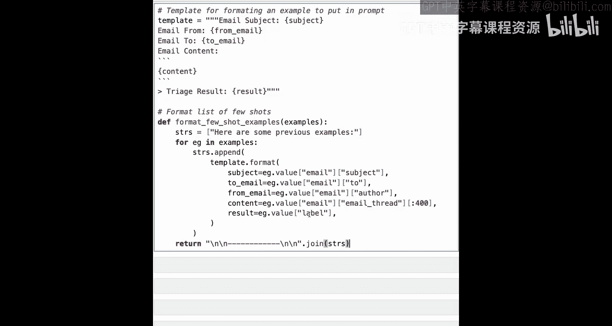

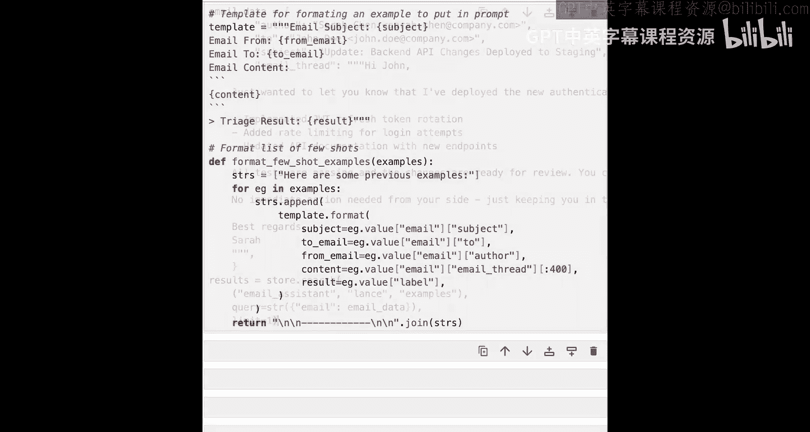

这个函数将每个示例的信息（邮件主题、发件人、收件人、内容）和分类结果整合到一个易读的模板中。

---

## 模拟搜索与检索

现在，让我们模拟搜索过程。我们将搜索与上面传入的邮件相似的示例。这里我稍微修改一下查询邮件，以确保不是完全匹配。

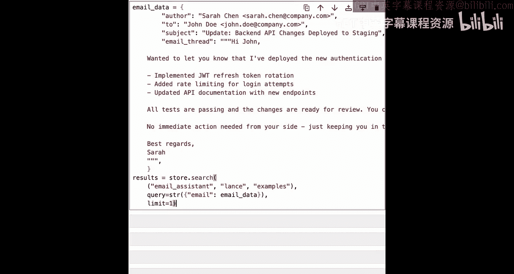

```python
# 定义一个查询邮件（与存储的示例相似但不完全相同）
query_email = {
    "from": "tom.jones@example.com",  # 稍作修改
    "to": "john.doe@example.com",
    "subject": "Meeting Request",
    "body": "Hi John, can we meet next week to discuss?"
}
query_text = str(query_email)

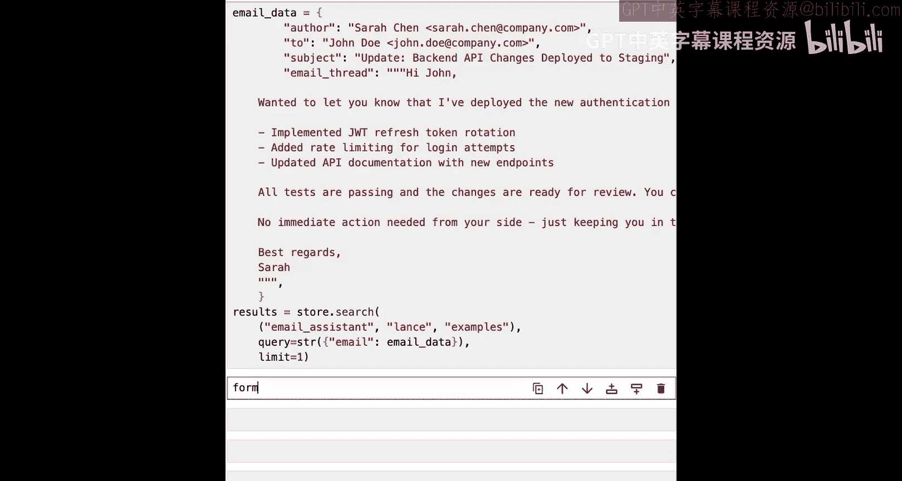

# 在指定命名空间中进行相似性搜索
results = store.similarity_search(
    query=query_text,
    filter={"namespace": namespace},
    k=1  # 限制返回最相似的1个结果
)

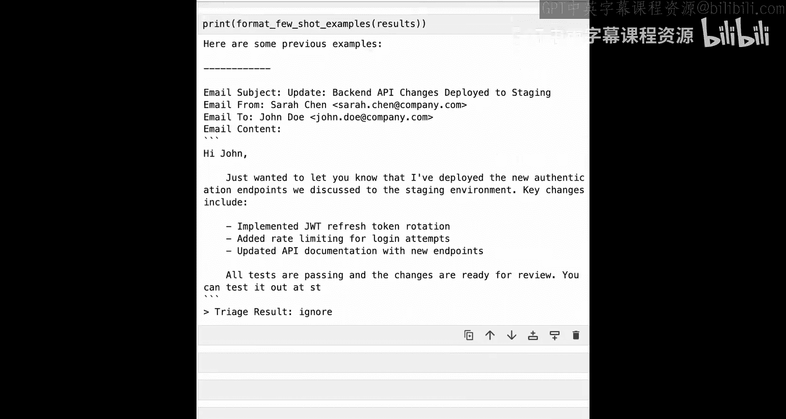

# 假设 results 是 Document 对象列表，我们需要提取其内容
# 这里简化处理，假设内容就是存储的字符串，我们需要eval回字典
retrieved_examples = []
for doc in results:
    # 注意：实际应用中需要更安全的反序列化方法
    retrieved_data = eval(doc.page_content)
    retrieved_examples.append(retrieved_data)

# 格式化检索到的示例
formatted_examples = format_examples(retrieved_examples)
print("检索到的少样本示例：")
print(formatted_examples)
```

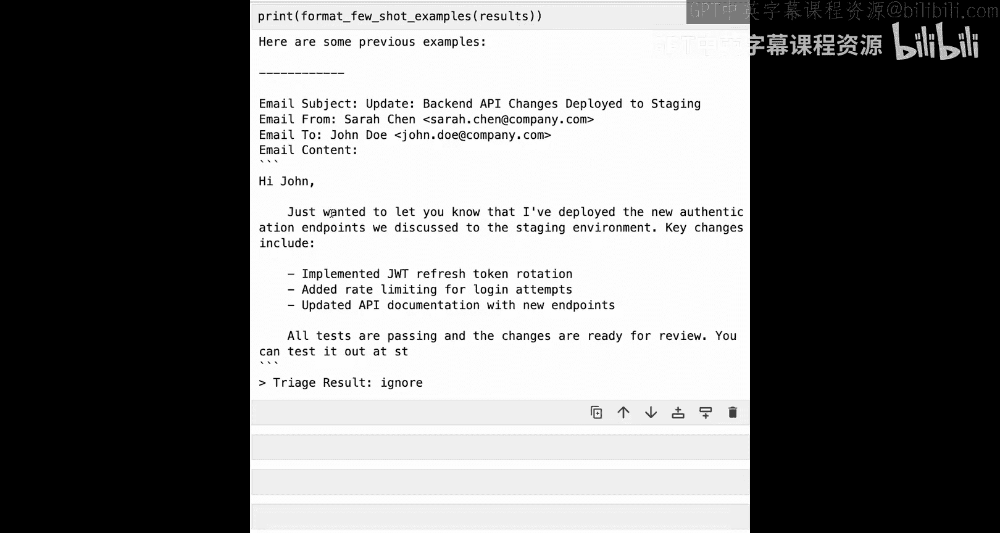

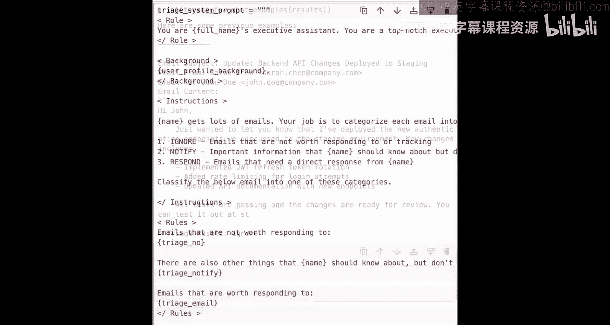

运行后，我们可以看到它返回了我们存储的数据点。虽然与查询邮件略有不同，但语义上非常相似。

---

## 构建集成少样本示例的分类节点

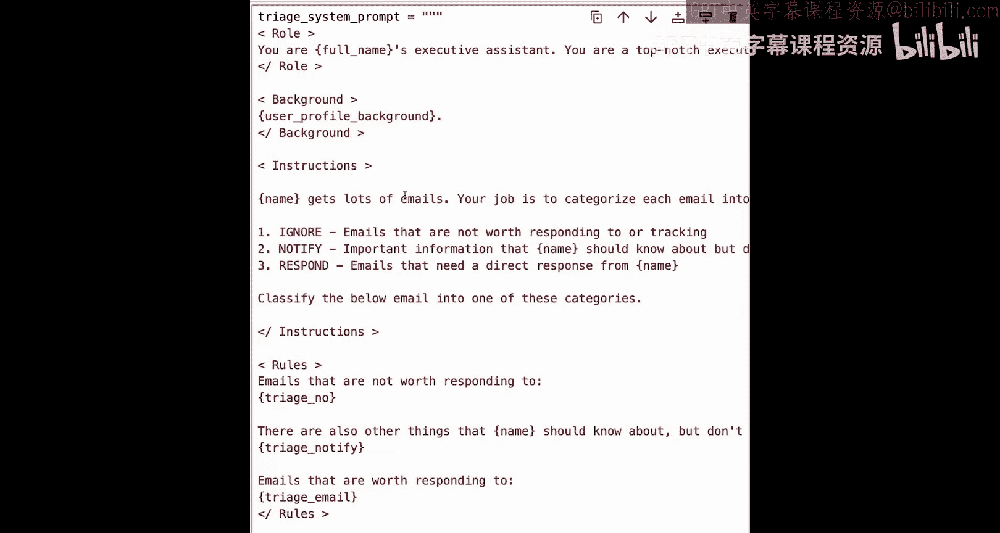

现在，我们开始将这些整合到一个新的分类步骤中，该步骤将执行少样本示例搜索。

首先，我们定义一个分类系统提示词。之前我们从辅助文件导入，现在我们在代码中定义它，以便于修改。

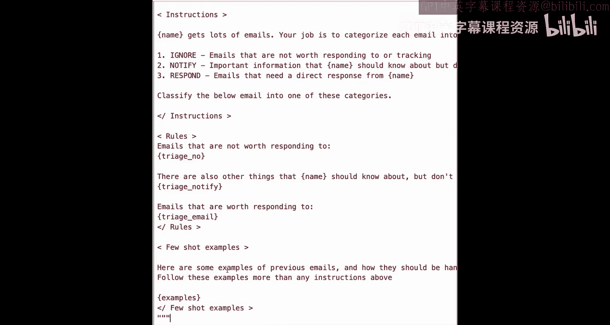

```python
# 定义分类系统提示词模板
triage_system_prompt_template = """
你是一个电子邮件分类助手。
你的任务是根据邮件内容和用户偏好，将邮件分类为 `respond`（需要回复）或 `ignore`（忽略）。

以下是用户过往处理类似邮件的示例（少样本示例），请仔细参考：
{few_shot_examples}

基于以上示例和当前邮件内容，请做出分类决策。
请仅输出分类标签（`respond` 或 `ignore`）。
"""
```

在提示词模板中，我们预留了 `{few_shot_examples}` 的位置，用于插入格式化后的少样本示例字符串，并添加了指令要求模型密切关注这些示例。

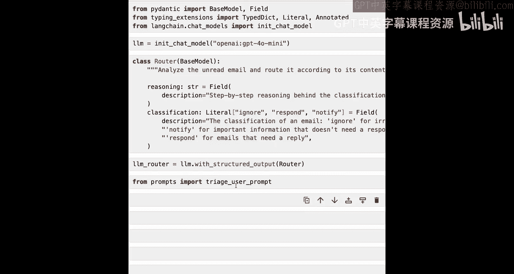

接下来，导入路由步骤所需的各种组件。这与之前类似：初始化聊天模型、定义输出模式、将其附加到模型以生成结构化信息，然后导入分类用户提示词。系统提示词我们已经定义好了，无需再导入。

```python
from langchain.chat_models import ChatOpenAI
from langchain.prompts import ChatPromptTemplate, HumanMessagePromptTemplate
from langchain.schema.output_parser import StrOutputParser
from langchain.schema.runnable import RunnablePassthrough

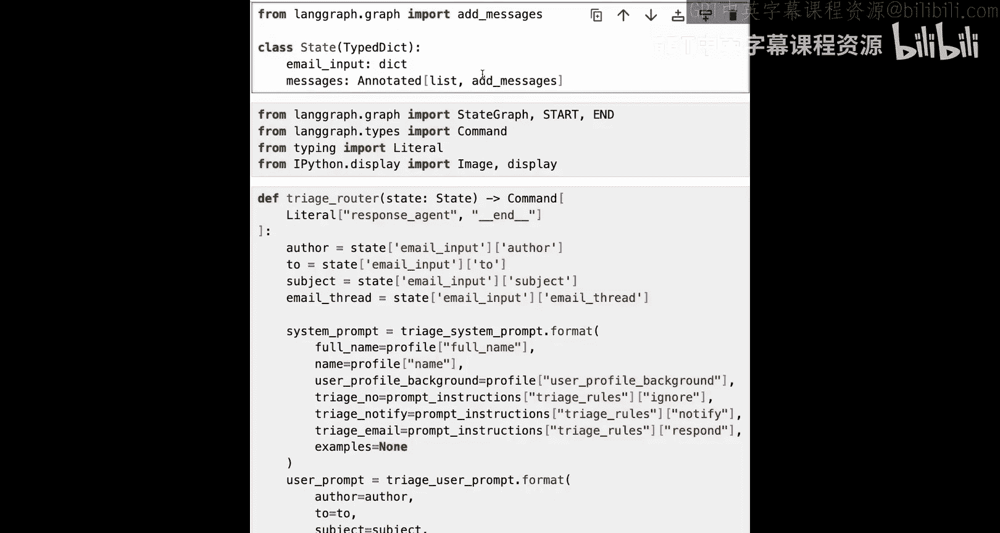

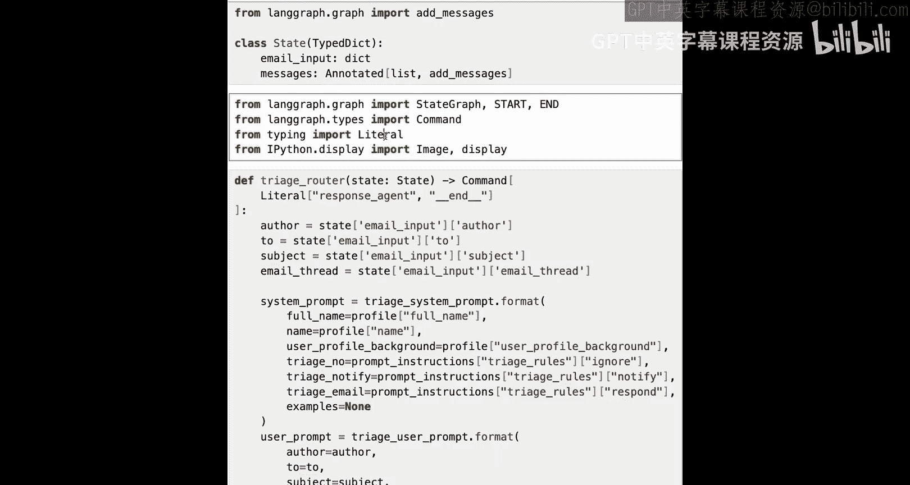

# 初始化聊天模型
llm = ChatOpenAI(model="gpt-3.5-turbo", temperature=0)

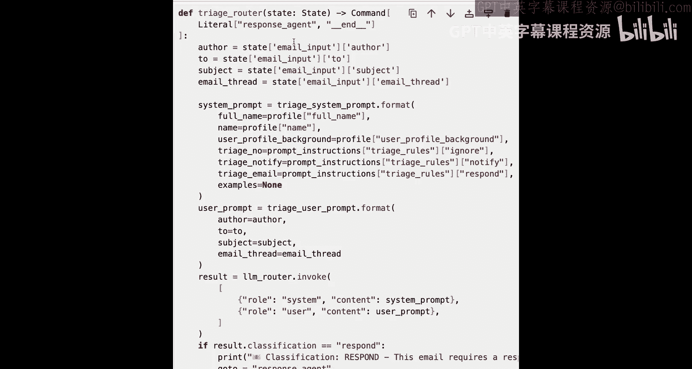

# 定义输出结构（这里简化，只输出字符串标签）
# 在实际中，你可能使用Pydantic来定义更复杂的结构

# 分类用户提示词模板
triage_user_prompt_template = "请对以下邮件进行分类：\n\n{email_content}"
```

以下是之前分类路由节点的定义。我们将修改它以支持少样本示例提示。

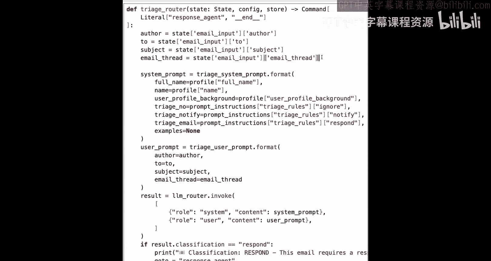

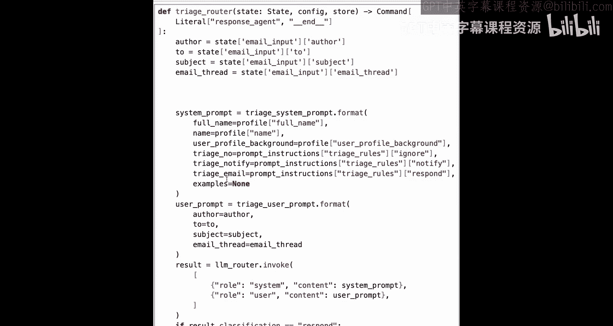

```python
# 旧版分类节点逻辑（简化版）
def old_triage_router_node(state):
    email_content = state["email_content"]
    # 直接调用LLM进行分类
    prompt = ChatPromptTemplate.from_messages([
        ("system", "You are a triage assistant. Classify the email as 'respond' or 'ignore'."),
        ("human", f"Email: {email_content}")
    ])
    chain = prompt | llm | StrOutputParser()
    label = chain.invoke({})
    return {"label": label}
```

我们将如何修改它呢？首先，我们需要在输入中接收配置`config`和存储`store`，这些将由主智能体传递过来。然后，在格式化系统提示词之前，添加逻辑来插入少样本示例。

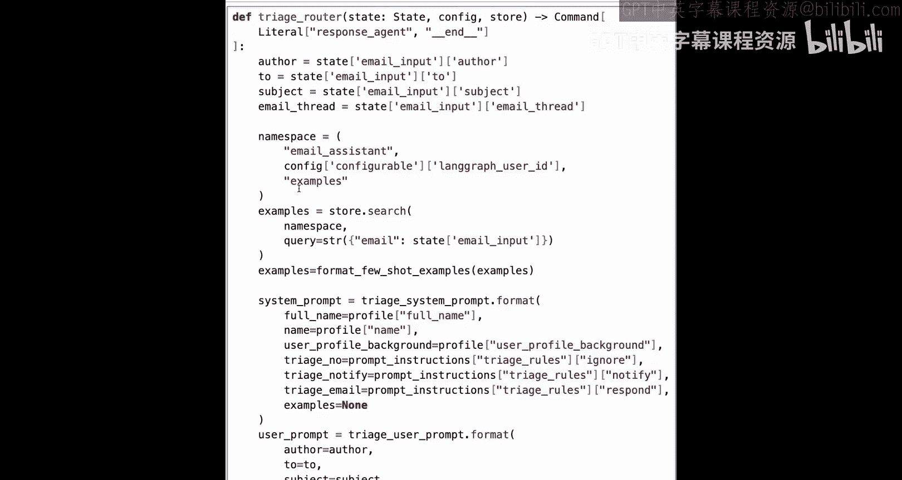

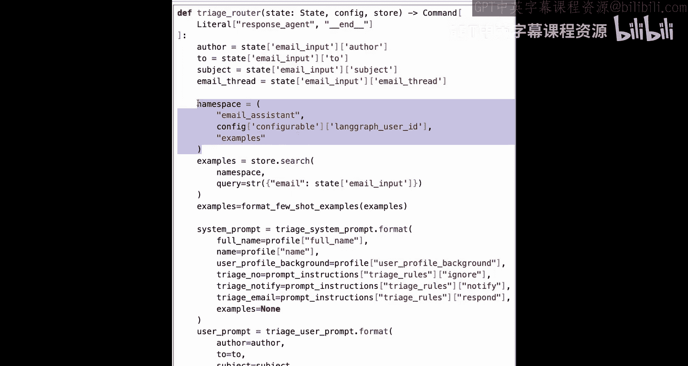

```python
# 新版分类节点逻辑（集成少样本记忆）
def new_triage_router_node(state, config, store):
    email_content = state["email_content"]
    langgraph_user_id = config.get("langgraph_user_id", "default")

    # 1. 定义命名空间，用于搜索少样本示例
    namespace = f"email_assistant_{langgraph_user_id}_examples"

    # 2. 在长期记忆存储中搜索相似示例
    query_text = str(email_content)
    search_results = store.similarity_search(
        query=query_text,
        filter={"namespace": namespace},
        k=2  # 检索最相似的2个示例
    )
    # 提取并反序列化示例数据
    few_shot_examples_list = []
    for doc in search_results:
        try:
            example_data = eval(doc.page_content)  # 注意安全，生产环境应用json.loads或更安全的方法
            few_shot_examples_list.append(example_data)
        except:
            continue

    # 3. 格式化少样本示例
    formatted_few_shots = format_examples(few_shot_examples_list)

    # 4. 准备完整的系统提示词
    full_system_prompt = triage_system_prompt_template.format(
        few_shot_examples=formatted_few_shots
    )

    # 5. 调用LLM进行分类
    prompt = ChatPromptTemplate.from_messages([
        ("system", full_system_prompt),
        ("human", triage_user_prompt_template.format(email_content=email_content))
    ])
    chain = prompt | llm | StrOutputParser()
    label = chain.invoke({})

    return {"label": label}
```

修改后的节点逻辑包括：根据用户ID构建命名空间、从记忆存储中检索相似示例、格式化这些示例、将它们填入系统提示词，最后调用大语言模型做出分类决策。

---

## 组装完整的智能体

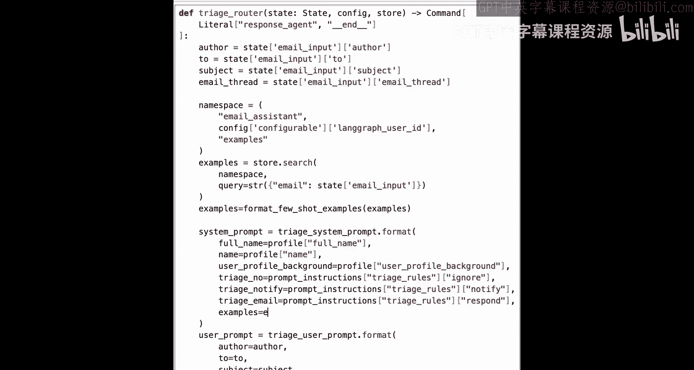

之后，我们可以继续创建智能体的其余部分。我们将创建之前用到的所有工具（例如，管理记忆、搜索记忆的工具），创建响应智能体，并定义配置。

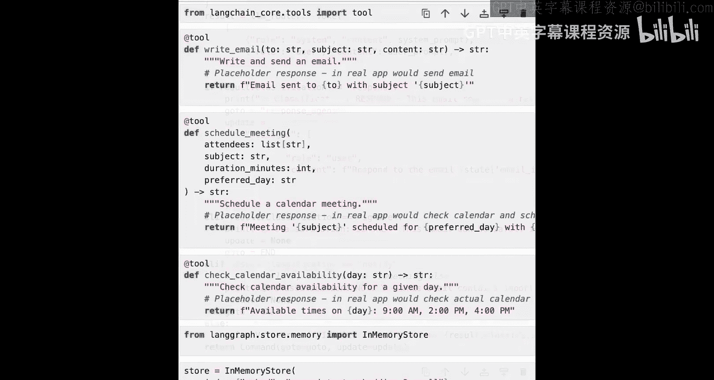

```python
# 创建工具（此处省略具体工具定义，假设已存在）
# tools = [manage_memory_tool, search_memory_tool, ...]

# 创建响应智能体
response_agent = create_response_agent(llm, tools)

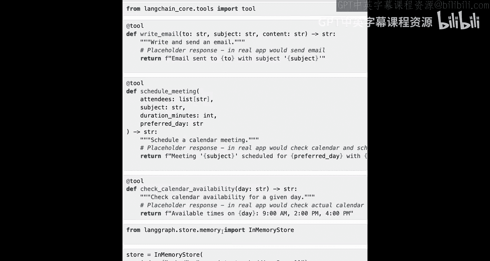

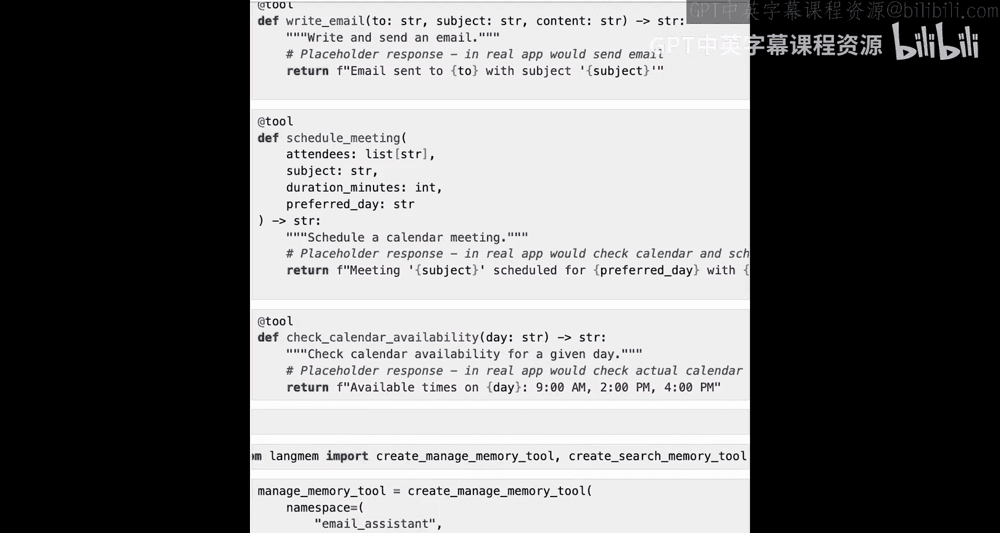

# 定义配置
config = {"langgraph_user_id": "harrison"}
```

然后，像之前一样组装电子邮件智能体，并确保传入存储`store`。

```python
# 组装电子邮件智能体
email_agent = {
    "triage": new_triage_router_node,  # 使用新的分类节点
    "respond": response_agent,
    # ... 其他节点
}
# 注意：在实际的LangGraph中，你需要用Graph来定义工作流
```

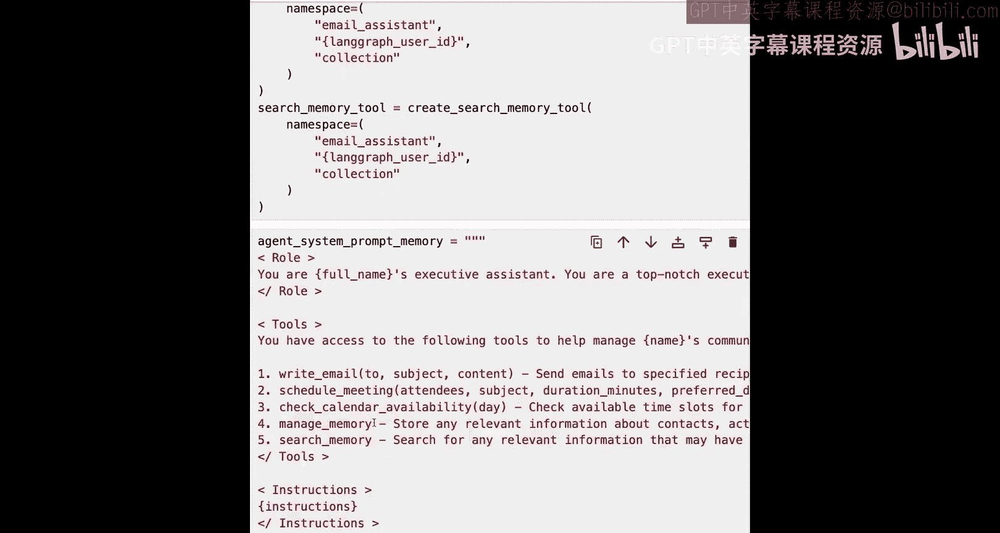

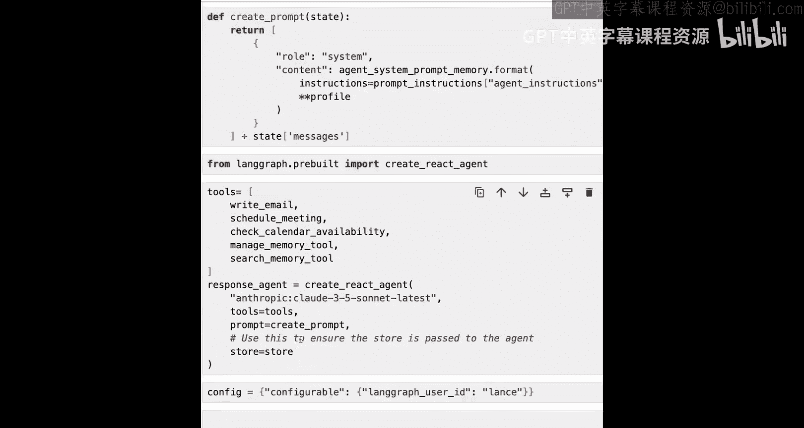

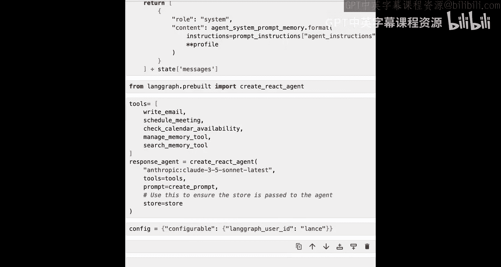

---

## 测试与效果验证

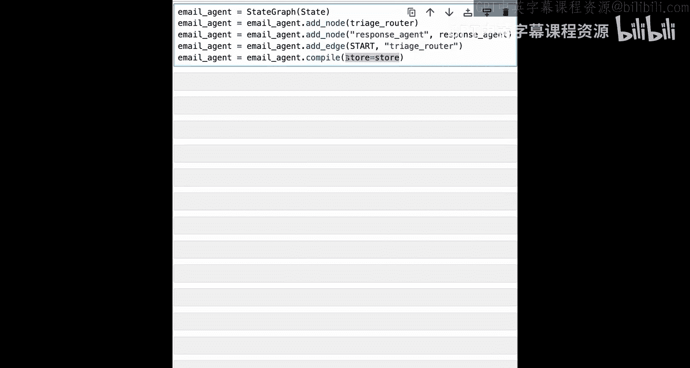

现在让我们测试这个电子邮件智能体，看看少样本提示的效果。

首先，我们有一个来自“Tom Jones”的示例邮件输入：“Hi John, wanna buy documentation?”。我们传入用户ID为“Harrison”的配置。默认情况下，这封邮件可能被分类为需要回复`respond`。

```python
test_email = {
    "from": "tom.jones@example.com",
    "to": "john@example.com",
    "subject": "Sales Inquiry",
    "body": "Hi John, wanna buy documentation?"
}
initial_state = {"email_content": test_email}
result = email_agent["triage"](state=initial_state, config=config, store=store)
print(f"分类结果: {result['label']}")  # 可能输出 `respond`
```

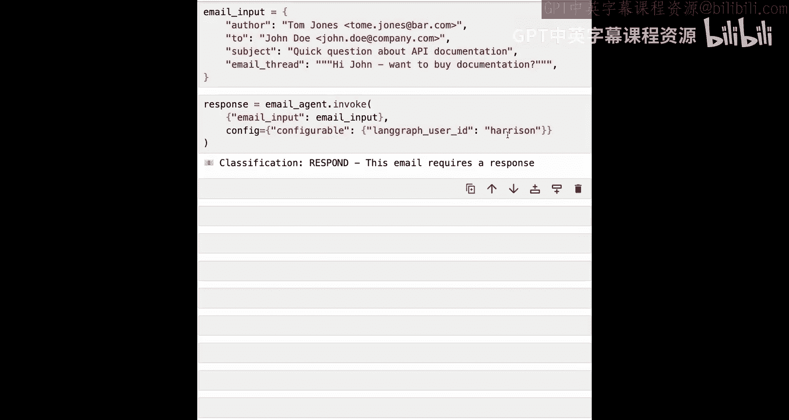

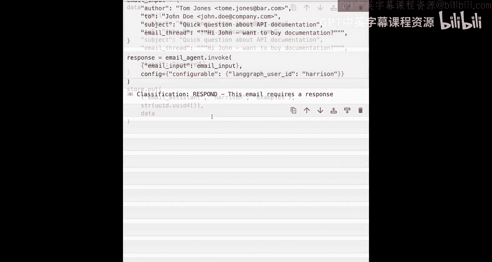

如果我们不喜欢这个结果怎么办？我们可以向长期记忆中**添加一个少样本示例**，然后在运行时，这个示例会被引入，并指导智能体以类似的方式处理未来相似的邮件。

例如，我们可以添加一个标签为`ignore`的示例。

```python
# 创建一个我们希望智能体学会忽略的示例
ignore_example = {
    "email": {
        "from": "sales@spam.com",
        "to": "user@example.com",
        "subject": "Buy now!",
        "body": "Wanna buy something?"
    },
    "label": "ignore",
    "response": ""
}
ignore_id = str(uuid.uuid4())
# 存入记忆存储，命名空间对应特定用户
store.add_texts(
    texts=[str(ignore_example)],
    metadatas=[{"namespace": f"email_assistant_harrison_examples", "id": ignore_id}],
    ids=[ignore_id]
)
```

再次运行分类测试，现在我们可以看到邮件被分类为`ignore`。智能体引入了这个少样本示例，并学会了应该忽略此类邮件。

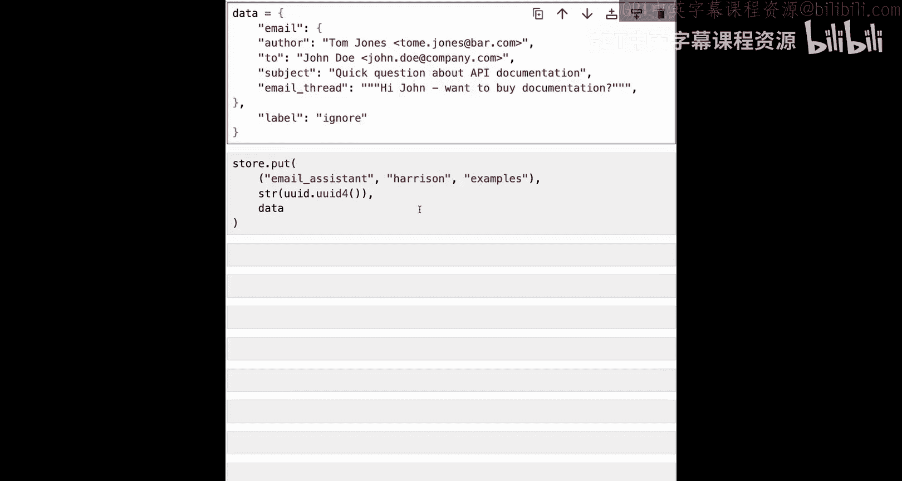

我们还可以稍微改变一下邮件内容（例如添加更多问号或改变发件人名称），可以看到它仍然被分类为`ignore`，说明智能体学会了以相似的方式处理语义相近的邮件。

```python
modified_test_email = {
    "from": "tom.jones@spammy.com",
    "to": "john@example.com",
    "subject": "Sales Inquiry!!!",
    "body": "Hi John, wanna buy documentation???? Best, Jim."
}
modified_state = {"email_content": modified_test_email}
result2 = email_agent["triage"](state=modified_state, config=config, store=store)
print(f"修改后邮件分类结果: {result2['label']}")  # 应输出 `ignore`
```

如果我们传入一个不同的用户ID（例如“alex”），由于少样本示例的作用域限定在特定的用户ID，因此对于“alex”这个用户，没有相关的忽略示例，邮件可能又被分类为`respond`。

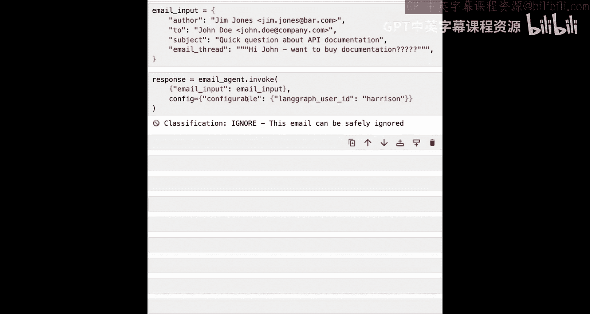

---

## 总结

本节课中，我们一起学习了如何为LangGraph智能体添加**情景记忆**。我们通过以下步骤实现了这一目标：

1.  **定义长期记忆存储**，用于保存少样本示例。
2.  **准备并存储示例数据**，将邮件输入和期望的输出（分类标签）作为经验保存。
3.  **在分类节点中集成检索逻辑**，根据当前邮件内容，从记忆中查找相似的历史示例。
4.  **利用格式化后的少样本示例构建动态提示词**，从而影响大语言模型的分类决策。
5.  **通过测试验证**，智能体能够根据用户特定的历史经验（少样本示例）来调整其行为，实现个性化的邮件分类。

通过添加情景记忆，我们使智能体能够学习和适应用户的偏好，例如学会忽略某些类型的推销邮件，从而变得更加智能和个性化。

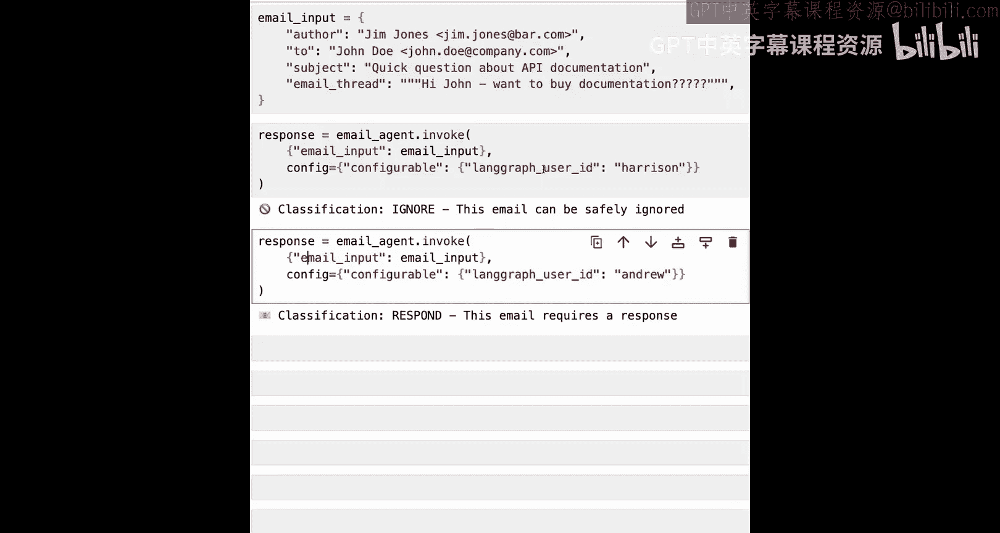

现在，你可以尝试使用不同的示例和不同的用户ID进行实验，更好地理解智能体如何通过记忆进行学习和适应。我们下节课再见！