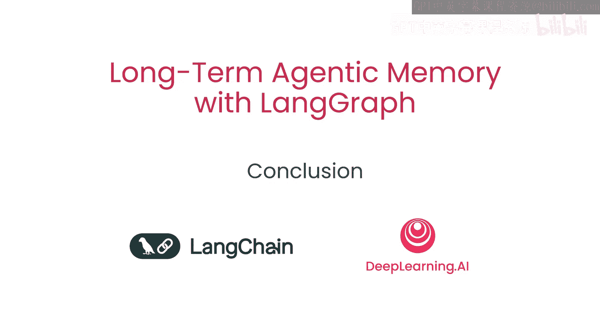

# 007：总结

## 概述
在本节课中，我们将总结关于使用LangGraph为智能体构建长期记忆的核心知识。我们已经学习了记忆的分类、操作方式及其在智能体架构中的实现。

## 课程总结

上一节我们介绍了记忆的后台操作与整合，本节中我们来回顾整个课程的核心要点。

以下是本课程涵盖的关键内容总结：

*   **记忆的分类**：智能体的记忆主要分为三类：
    *   **语义记忆**：存储通用知识和事实。
    *   **情景记忆**：记录特定的事件或经历。
    *   **程序记忆**：存储如何执行任务或技能。

*   **记忆的操作模式**：记忆操作可以在两条路径上进行：
    *   **热路径**：在智能体执行主任务流程时同步进行记忆的读取与写入，确保实时性。
    *   **后台路径**：信息可被暂存，随后在后台进行整合与处理，这种方式不影响主任务的响应延迟。

你现在已经掌握了为智能体添加记忆的能力。你学会了将记忆分类为语义、情景或程序记忆。你也准备好了在热路径或后台路径上进行记忆操作，在后台整合信息而不会影响系统延迟。

期待看到你在未来的项目中如何运用记忆功能。