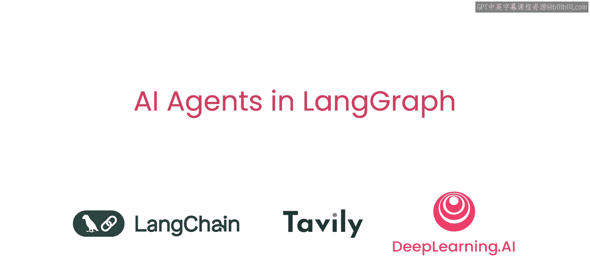
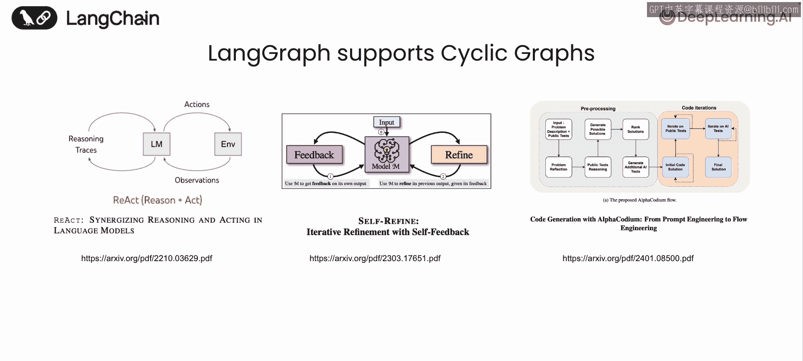
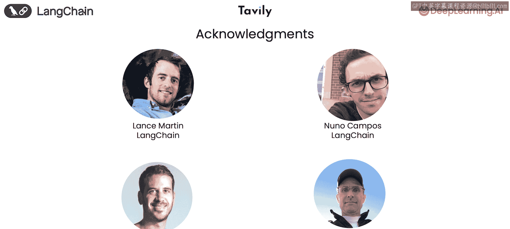

# 001：引言 🚀

在本节课中，我们将要学习什么是AI智能体以及LangGraph如何帮助我们构建它们。我们将了解智能体工作流的核心概念，并与传统的单次生成式AI应用进行对比。

---

## 智能体工作流概述

传统的语言模型应用通常是一次性生成完整内容。例如，你给出一个提示，模型就从头到尾写出一篇文章。然而，人类的工作方式并非如此。我们更擅长通过**迭代**和**协作**来完成任务。

想象一下，我们几个人要合作写一篇论文。这个过程可能如下：
1.  我先进行**规划**，制定论文的初步大纲。
2.  接着，有人进行**研究**，运行查询并收集相关资料。
3.  然后，由我来撰写**初稿**。
4.  之后，其他人会**审阅**初稿，提出建设性意见。
5.  最后，根据反馈进行**修改**，并可能再次进行研究。

这种循环往复、各司其职的工作方式，就是**智能体工作流**的一个生动例子。它通过多个步骤的迭代，最终产出一个更高质量的工作成果。

---

## 智能体工作流的关键设计模式

基于上述例子，我们可以总结出构建智能体工作流的几个核心设计模式。以下是这些模式的简要介绍：

*   **规划**：思考需要采取的步骤，例如制定大纲和后续行动计划。
*   **工具使用**：了解有哪些工具可用以及如何使用它们，例如搜索工具。
*   **反思**：指迭代改进结果的过程，可能涉及多个语言模型进行评审并提出有用建议，以驱动编辑循环。
*   **多智能体协作**：你可以将每个参与者视为扮演特定角色的语言模型，每个角色都有独特的提示词，在此过程中发挥独特作用。
*   **记忆**：跟踪多个步骤中的进展和结果。

这些能力中，一部分与语言模型本身相关（如用于工具调用的函数调用功能），但许多能力实际上是由它们所运行的**框架**来实现的。

---

## LangChain与LangGraph的演进

LangChain框架早已支持上述的许多元素，例如多种形式的记忆、支持函数调用的语言模型以及工具执行。然而，为了更好地支持上述的循环图式智能体工作流，LangChain近期扩展并推出了**LangGraph**。

LangGraph能够直接支持构建此类智能体。目前已有多种智能体范式得到了更好的支持，例如：
*   **ReAct智能体**：一种早期的智能体构建范式，ReAct代表“推理与行动”。
*   **Self-Refine示例**：实现了上文提到的迭代优化过程。
*   **AI Codium示例**：通过流程工程创建代码智能体。

所有这些智能体的行为都由一个**循环图**来定义。

---

## 本课程内容预告

在上一节我们介绍了智能体工作流的基本概念，本节中我们来看看本课程将具体涵盖哪些内容。

在本课程中，你将：
1.  从零开始，仅使用一个语言模型和Python构建一个智能体。
2.  学习LangGraph的组件，并通过直接使用这些组件重建同一个智能体来加深理解。
3.  鉴于搜索工具是许多智能体应用的重要组成部分，你将学习智能体搜索的功能以及如何使用它。
4.  探索构建智能体时的两项重要能力：
    *   **接收人工输入**：允许你在关键时刻引导智能体。
    *   **持久化**：存储当前状态信息的能力，以便日后可以返回。这对于调试智能体和将其投入生产环境都非常有用。
5.  使用LangGraph构建一个项目（具体内容将在最后一课揭晓）。
6.  在课程结束时，了解这项技术的一些酷炫应用和未来发展方向。

---

本节课中，我们一起学习了智能体工作流的核心思想及其相较于传统单次生成模式的优势，并预览了使用LangGraph构建智能体的课程路线图。接下来，让我们进入下一课，开始动手实践。