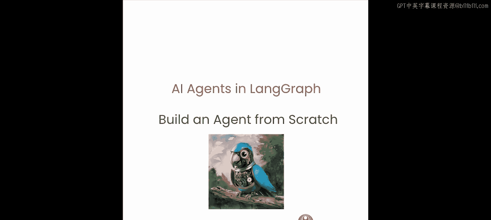
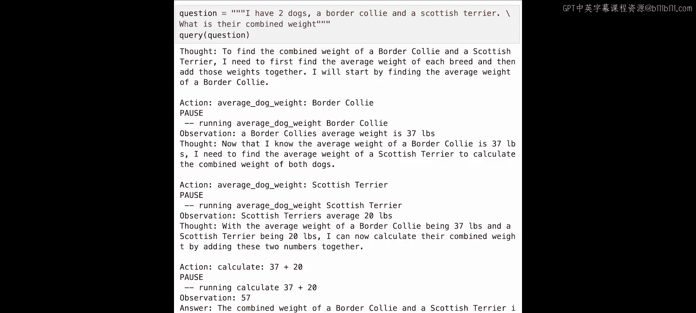

# 002：2. 从零构建简单的ReAct智能体 🧠




## 概述

在本节课中，我们将从零开始构建一个智能体。你将看到，虽然智能体可以执行相当复杂的任务，但一个基础的智能体实际上并不难构建。在构建过程中，注意区分哪些工作由大语言模型（LLM）完成，哪些由围绕LLM的代码（我们称之为运行时）管理，这将非常有帮助。

## 构建基础智能体类

首先，我们需要导入所有必要的库并初始化语言模型。我们将使用OpenAI的模型。

```python
import openai

# 初始化OpenAI客户端
client = openai.OpenAI()
```

测试模型以确保其正常工作。

```python
response = client.chat.completions.create(
    model="gpt-4",
    messages=[{"role": "user", "content": "hello world"}],
    temperature=0
)
print(response.choices[0].message.content)
```

接下来，我们创建一个基础的智能体类。这个类将由一个系统消息参数化，并维护一个消息列表来记录交互历史。

```python
class Agent:
    def __init__(self, system_message=""):
        self.system_message = system_message
        self.messages = []
        if self.system_message:
            self.messages.append({"role": "system", "content": self.system_message})

    def __call__(self, message):
        self.messages.append({"role": "user", "content": message})
        result = self._execute()
        self.messages.append({"role": "assistant", "content": result})
        return result

    def _execute(self):
        response = client.chat.completions.create(
            model="gpt-4",
            messages=self.messages,
            temperature=0
        )
        return response.choices[0].message.content
```

## 实现ReAct模式智能体

上一节我们介绍了基础的智能体框架，本节中我们来看看如何实现ReAct模式。ReAct代表“推理（Reasoning）”加“行动（Acting）”。在这个模式中，LLM首先思考要做什么，然后决定采取什么行动。该行动在环境中执行，并返回一个观察结果。LLM根据这个观察结果重复这个过程，直到决定任务完成。

首先，我们需要一个特定的系统提示词来指导智能体遵循ReAct循环。

```python
REACT_PROMPT = """
你将以一个循环运行：思考 -> 行动 -> 暂停 -> 观察。
当你完成循环后，输出一个答案。
使用“思考：”来描述你对被问到问题的想法。
使用“行动：”来运行一个你可用的行动。
然后返回“暂停”。
之后，“观察：”将用于表示运行那些行动的结果。

你可用的行动是：
1. `calculate`：计算一个数学表达式。输入：一个字符串形式的数学表达式。
2. `average_dog_weight`：获取一个犬种的平均体重。输入：犬种名称。

示例：
问题：一个玩具贵宾犬有多重？
思考：我应该使用`average_dog_weight`工具查找玩具贵宾犬的体重。
行动：average_dog_weight toy poodle
暂停
观察：7
思考：现在我有了答案。
答案：一个玩具贵宾犬重7磅。
"""
```

现在，我们需要提供上面提到的两个工具函数。

```python
def calculate(expression):
    """计算一个数学表达式。"""
    return str(eval(expression))

def average_dog_weight(breed):
    """获取犬种的平均体重（模拟数据）。"""
    weights = {
        "scottish terrier": "20",
        "border collie": "37",
        "toy poodle": "7"
    }
    return weights.get(breed.lower(), "未知品种")

# 创建工具字典
tools = {
    "calculate": calculate,
    "average_dog_weight": average_dog_weight
}
```

## 手动运行智能体

让我们初始化智能体并尝试提出第一个问题。

```python
agent = Agent(system_message=REACT_PROMPT)
response1 = agent("一个玩具贵宾犬有多重？")
print(response1)
```

输出可能类似于：
```
思考：我应该使用`average_dog_weight`工具查找玩具贵宾犬的体重。
行动：average_dog_weight toy poodle
暂停
```

根据输出，我们需要执行`average_dog_weight`行动。

```python
# 解析行动和输入
# 假设我们从响应中解析出行动是“average_dog_weight”，输入是“toy poodle”
action = "average_dog_weight"
action_input = "toy poodle"
observation = tools[action](action_input)
print(f"观察：{observation}")
```

然后，我们将观察结果格式化为下一个提示，传递给智能体。

```python
next_prompt = f"观察：{observation}"
response2 = agent(next_prompt)
print(response2)
```

这次，智能体应该输出最终答案。

## 自动化ReAct循环

手动执行每个步骤很繁琐。让我们将整个过程自动化到一个循环中。

首先，我们需要一个正则表达式来解析LLM的响应，判断是要求取行动还是输出最终答案。

```python
import re

# 用于解析“行动：<工具名> <输入>”模式的正则表达式
action_re = re.compile(r'行动：(\w+)\s*(.*)')
```

接下来，我们创建一个`query`函数来运行自动化的ReAct循环。

```python
def query(question, max_turns=10):
    """
    使用ReAct模式自动查询智能体。
    :param question: 用户的问题
    :param max_turns: 最大循环次数，防止无限循环
    :return: 最终答案
    """
    agent = Agent(system_message=REACT_PROMPT)
    next_prompt = question
    counter = 0

    while counter < max_turns:
        counter += 1
        print(f"\n--- 第 {counter} 轮 ---")
        response = agent(next_prompt)
        print(f"智能体响应：{response}")

        # 检查响应是否以“答案：”开头，表示结束
        if response.strip().startswith("答案："):
            print("任务完成。")
            return response

        # 否则，尝试解析行动
        match = action_re.search(response)
        if match:
            action_name = match.group(1)
            action_input = match.group(2).strip()
            print(f"解析到行动：{action_name}， 输入：{action_input}")

            if action_name not in tools:
                raise ValueError(f"未知行动：{action_name}")

            # 执行行动
            observation = tools[action_name](action_input)
            print(f"观察结果：{observation}")
            # 为下一轮创建提示
            next_prompt = f"观察：{observation}"
        else:
            # 如果没有解析到行动，也没有答案，可能出错了
            print("警告：无法解析响应中的行动。")
            next_prompt = "请根据之前的步骤继续思考或给出答案。"

    print(f"达到最大轮数（{max_turns}），未完成。")
    return "无法在限制内得出结论。"
```

现在，让我们用更复杂的问题测试这个自动化智能体。

```python
result = query("我有一只边境牧羊犬和一只苏格兰梗犬。它们的总体重是多少？")
print(f"\n最终结果：{result}")
```

## 总结



本节课中我们一起学习了如何从零开始构建一个ReAct模式的智能体。我们首先创建了一个基础的智能体类，然后设计了引导其进行“思考-行动-观察”循环的系统提示词。我们实现了两个简单的工具函数，并演示了如何手动执行循环步骤。最后，我们通过编写一个`query`函数，利用正则表达式解析和循环逻辑，将整个过程自动化。这个例子展示了仅使用原始LLM API和一些Python代码就能创建一个功能性的智能体。在下一课中，我们将使用LangGraph框架来实现这个相同的智能体。