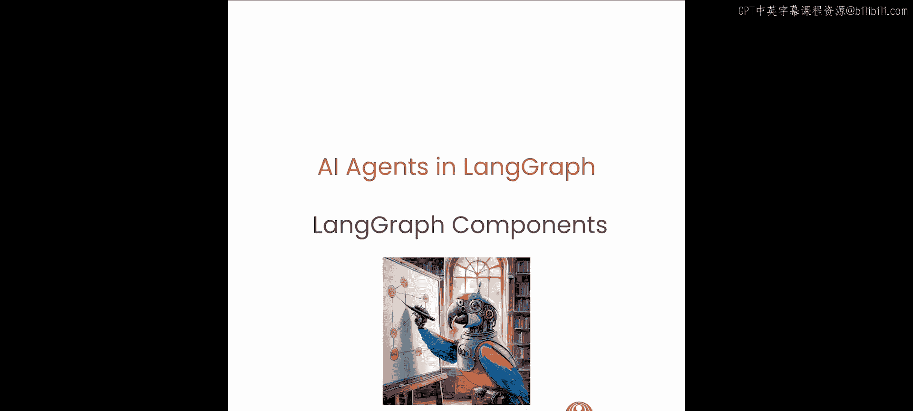
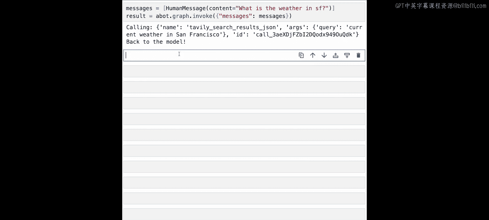
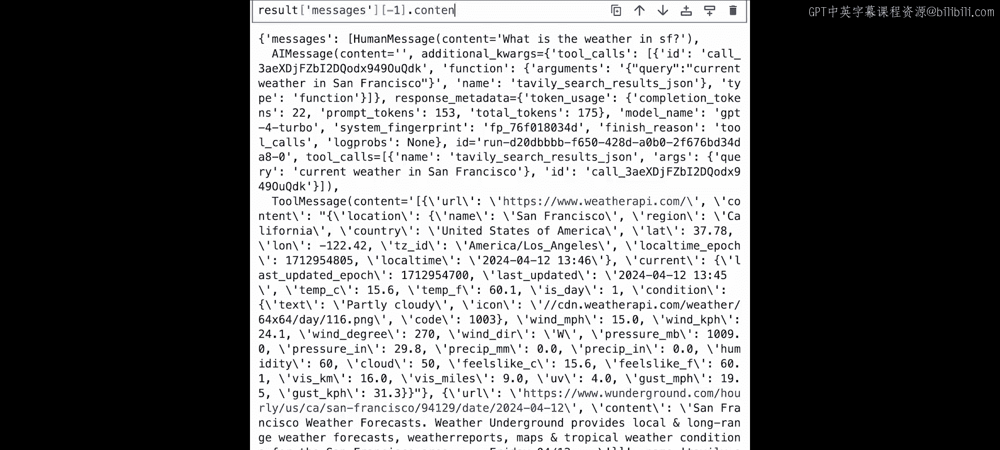
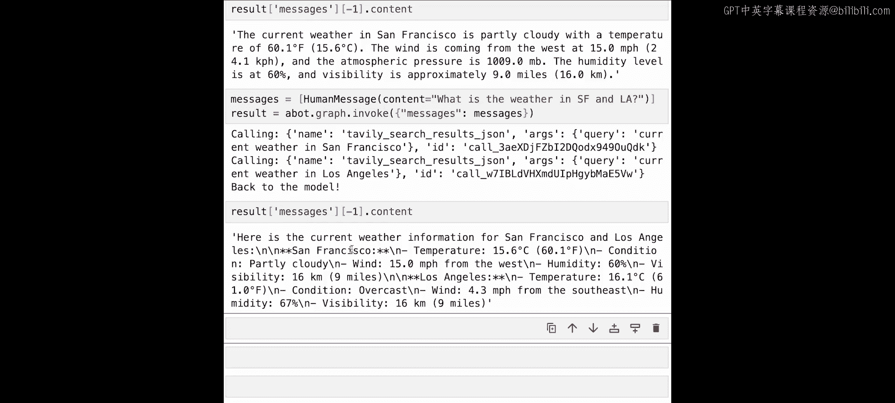
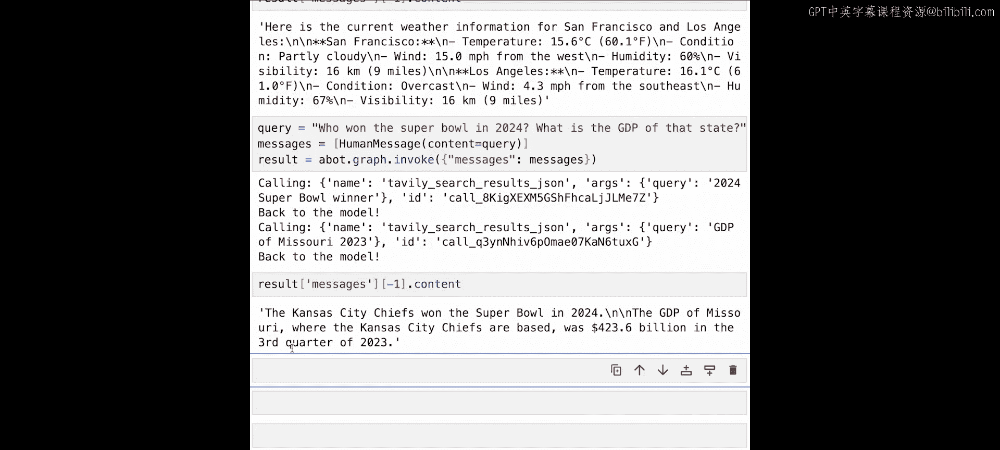

# 003：LangGraph核心组件 🧩




在本节课中，我们将学习如何使用LangGraph的核心组件来构建一个智能体。我们将从零开始，逐步介绍提示模板、工具、状态管理以及如何用LangGraph编排控制流。

---

在上一课中，我们从头构建了一个智能体。现在，让我们使用LangGraph来实现这个智能体，并在此过程中介绍它的一些核心组件和功能。

## 回顾上节课内容

首先，我们来分解上节课所做的工作。

1.  我们接收了一条用户消息。
2.  我们有一个很长的系统提示。
3.  我们使用这个提示调用了大语言模型。
4.  模型输出类似“思考”和“行动”的内容。
5.  基于输出，我们做出决策：要么返回最终答案，要么调用工具。
6.  我们将所有这些逻辑放入一个大的循环函数中。
7.  我们有两个可调用的工具：计算平均体重和搜索。
8.  如果调用了工具，我们会得到一个观察结果，然后将其作为新消息放回提示中，继续循环。

接下来，我们将这些步骤映射到LangChain的组件中。

## LangChain核心组件

### 提示模板

提示模板允许我们创建可复用的提示。这意味着我们可以创建一个带有格式化变量的字符串模板，并根据用户内容以不同方式填充这些变量。

例如，我们可以创建一个类似上节课使用的智能体提示模板。在LangChain Hub中可以看到许多社区贡献的提示模板示例。

### 工具

工具是智能体可以调用的函数。例如，我们将使用一个名为Tavily的搜索工具。它可以从`langchain-community`包中导入，该包包含数百个其他工具。

### 控制流与LangGraph

我们编写的应用程序中，大部分代码是用于管理循环的控制流。LangGraph可以帮助我们描述和编排这种控制流。具体来说，它允许我们创建循环图，这正是我们所需要的。

LangGraph还内置了持久化功能，这对于同时处理多个对话或记住之前的迭代和操作非常有用。这种持久化也支持了很棒的“人在回路”功能。

许多学术论文中的智能体图表都可以表示为图，正是这种认识促使我们创建了LangGraph。它是LangChain的扩展，专门用于智能体和多智能体工作流。关键在于，它允许非常精细的控制流，图中的每个箭头都精确地指明了从一个状态到下一个状态的路径。这种可控性对于创建高性能的智能体至关重要。

## LangGraph核心概念

LangGraph有三个核心概念：节点、边和条件边。

*   **节点**：代表智能体或函数。
*   **边**：连接这些节点。
*   **条件边**：当需要决定下一步应该前往哪个节点时使用。

让我们看一个例子，创建一个与上节课函数等效的LangGraph：

1.  我们有一个**智能体节点**，代表调用大语言模型。
2.  然后有一个**条件边**，它接收大语言模型的调用结果，并决定下一步做什么。
3.  其中一条边可以是**行动边**，它调用一个函数节点，并自动循环回智能体节点。
4.  有一个**入口点**，即开始的地方。
5.  还有一个**结束节点**，是智能体之后可以采取的另一个行动。

## 理解状态

使用LangGraph时，最重要的是理解随时间跟踪的**状态**，通常称为**智能体状态**。这个状态在图的所有部分（每个节点、每条边）都可以访问。它是图本地的，并且可以存储在持久化层中，这意味着你可以在以后的任何时间点恢复该状态。

以下是两个状态示例：

1.  **简单状态**：只包含一个消息列表。`messages`变量被注解为`operator.add`，这意味着当用新消息更新状态时，不会覆盖现有消息，而是将它们添加到该状态中。
2.  **复杂状态**：可能包含`input`、`chat_history`、`agent_outcome`和`intermediate_steps`。其中`intermediate_steps`被注解为`operator.add`，因为我们需要在智能体执行过程中不断添加新的行动和观察记录。

## 代码实现

有了高层次的理解，让我们深入代码。

首先，加载所需的环境变量（如OpenAI API密钥），然后导入必要的模块来创建工具、智能体状态和LangGraph本身。

以下是需要导入的关键组件：

```python
from langgraph.graph import StateGraph, END
from typing import TypedDict, Annotated, Sequence
import operator
from langchain_core.messages import BaseMessage, HumanMessage, AIMessage, SystemMessage
from langchain_openai import ChatOpenAI
from langchain_community.tools.tavily_search import TavilySearchResults
```

*   `StateGraph` 和 `END` 用于构建图。
*   `TypedDict` 和 `Annotated` 用于构造智能体状态。
*   `BaseMessage` 及其子类用于表示不同类型的消息。
*   `ChatOpenAI` 是LangChain对OpenAI API的包装，提供了一个标准接口。
*   `TavilySearchResults` 是我们将要使用的搜索工具。

### 创建工具和状态

我们初始化Tavily搜索工具，并设置最大返回结果数为2。工具有一个特定的名称，大语言模型将使用这个名称来调用它。

接着，我们创建智能体状态，它只是一个被注解的消息列表，我们会随时间向其中添加消息。

### 构建智能体类

我们将创建一个智能体类，它需要三个函数：一个用于调用OpenAI，一个用于检查是否存在要执行的动作，另一个用于执行该动作。这些将作为类的方法。

智能体类需要三个参数：要使用的模型、要调用的工具列表和系统消息。

我们首先初始化一个带有智能体状态的`StateGraph`。此时图是空的，没有任何节点或边。

我们知道需要创建三个函数（作为节点和边），所以先规划一下：

1.  添加一个名为`llm`的节点，用于执行大语言模型调用。
2.  添加一个名为`action`的节点，用于执行工具调用。
3.  添加一个条件边，在`llm`节点之后检查是否存在动作。如果有，则前往`action`节点；如果没有，则前往`END`节点并结束。
4.  添加一条从`action`节点回到`llm`节点的常规边。
5.  设置图的入口点为`llm`节点。
6.  完成所有设置后，编译图，将其转换为一个可运行的LangChain对象。

我们还将工具名称映射到工具本身，并调用模型的`bind_tools`方法，让模型知道它可以调用这些工具。

### 实现节点和边函数

现在，我们需要在智能体类上实现三个方法：

1.  **`call_open_ai` (LLM节点)**：从状态中获取消息列表，添加系统消息，调用模型，并返回包含模型响应消息的字典。
2.  **`take_action` (行动节点)**：从状态中获取最后一条消息（其中应包含工具调用信息），循环遍历每个工具调用，查找对应的工具并调用它，然后将结果作为工具消息返回。
3.  **`should_continue` (条件边)**：检查最后一条消息中是否存在工具调用。如果有，返回`True`（前往行动节点）；如果没有，返回`False`（前往结束节点）。

将这些方法分别设置为对应节点和边的函数。

### 使用智能体

创建好智能体后，我们可以使用它了。首先，我们可以可视化刚刚创建的图，这可以通过调用`get_graph().draw_png()`自动完成。



现在，让我们调用智能体。我们需要创建一个代表用户消息的`HumanMessage`，并将其放入一个消息列表中，因为智能体状态期望的`messages`属性是一个消息列表。



然后，我们可以使用`agent_graph.invoke()`调用智能体，并传入初始状态。

## 运行示例

让我们尝试几个问题：



1.  **“旧金山天气如何？”**：智能体会调用Tavily搜索工具获取天气信息，然后返回结果。
2.  **“旧金山和洛杉矶的天气如何？”**：智能体会并行调用两次搜索工具（分别查询两个城市），然后综合信息返回答案。这展示了并行工具调用的能力。
3.  **“2024年超级碗冠军是谁？那个州的GDP是多少？”**：智能体会先搜索超级碗冠军，得到结果（堪萨斯城酋长队，位于密苏里州）后，再搜索密苏里州的GDP。这展示了顺序工具调用，因为第二个查询依赖于第一个查询的结果。

通过这些例子，我们看到了如何将原始的大语言模型调用和Python代码，转换成一个能够回答复杂问题的真实智能体，其背后使用了Tavily搜索API。

---

本节课中，我们一起学习了LangGraph的核心组件，包括提示模板、工具、状态管理以及如何用节点、边和条件边来构建和控制智能体的工作流。我们还通过代码实现了一个功能完整的智能体，并看到了它处理串行和并行任务的能力。



在下一课中，我们将更深入地探索LangGraph的其他功能。