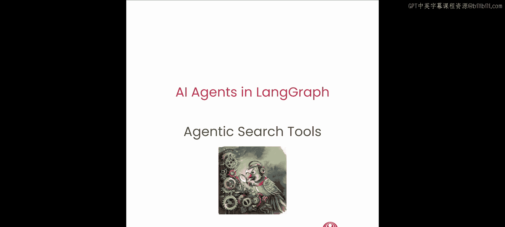
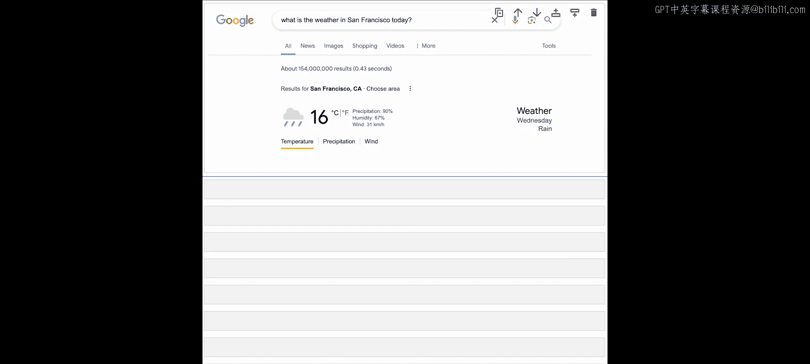

# 004：4.智能体搜索




## 概述
在本节课中，我们将要学习智能体搜索。我们将探讨智能体搜索与标准搜索有何不同，以及如何使用它。让我们开始吧。

---


## 智能体搜索的作用

在深入探讨智能体搜索的具体功能之前，让我们先理解一个智能体可能会如何使用它。

在零样本学习中，智能体会接收一个提示，并根据其模型的静态权重生成答案。尽管这种方法已被证明非常强大，但这个过程存在许多局限性。

首先，我们周围的数据是动态变化的。例如，智能体无法询问关于昨晚比赛的讨论。
其次，在许多应用场景中，我们希望知道结果中所提供信息的来源。这可以减少幻觉并平滑人机交互的摩擦。

观察幻灯片，我们可以看到提示被智能体接收，然后智能体决定调用搜索工具。接着，找到的信息被返回给智能体。

---

## 智能体搜索的内部机制

现在，让我展示其内部发生了什么。这是一个非常基础的搜索工具实现示例。让我们逐步分析。

如果智能体决定向搜索工具发送查询，第一步将是理解问题，并在需要时将其分解为子问题。这是一个重要的步骤，因为它可以处理复杂的查询。

然后，对于每个子查询，搜索工具必须从多个集成中选择最佳来源。例如，如果智能体询问“旧金山的天气如何”，搜索工具应使用天气API以获得最佳结果。

找到正确的来源后，工作并未结束。搜索工具随后必须仅提取与子查询相关的信息。一个基础的实现可以通过对来源进行分块，并运行快速的向量搜索来检索最相关的块来完成。

从每个来源检索数据后，搜索工具将对结果进行评分，并过滤掉相关性较低的信息。

---

## 实践测试

好的，让我们来测试一下。

首先，导入一些库并建立与搜索工具的初始连接。这里我们从环境变量中加载了Tavily API密钥。然后我们创建Tavily客户端，它是从`tavily`库中导入的。

```python
# 示例代码：导入库和建立连接
import os
from tavily import TavilyClient

# 从环境变量加载API密钥
api_key = os.getenv('TAVILY_API_KEY')
# 创建Tavily客户端
client = TavilyClient(api_key=api_key)
```

建立初始连接后，让我们测试一下。这里我将运行一个搜索，询问关于新的黑曜石GPT的信息，看看答案是什么。

```python
# 示例搜索查询
response = client.search(query="最新的黑曜石GPT是什么？")
print(response)
```

好的，正如你所见，这是一个相当简单但非常准确的答案。

---

## 标准搜索与智能体搜索的对比

接下来，让我们做一个简单的例子，看看常规搜索工具和智能体搜索工具之间的区别。我将创建一个关于特定地点天气的简单查询。你可以随意将地点更改为你的位置。我将以旧金山为例。

查询是：“旧金山现在的天气怎么样？我今天应该去那里旅行吗？”

现在，让我们尝试用常规搜索来处理。这里我将导入DuckDuckGo搜索，尝试运行常规搜索并获取可能引导我找到答案的链接。

```python
# 示例：使用常规搜索（如DuckDuckGo）获取链接
# 注意：此处为概念性代码，实际库可能不同
from duckduckgo_search import DDGS

with DDGS() as ddgs:
    results = [r for r in ddgs.text("旧金山 当前 天气", max_results=5)]
    for result in results:
        print(result['href'])
```

好的，正如你所见，我们确实得到了结果，但这并不是智能体需要的东西。现在，我们需要从这些结果中获取一些答案。让我们来做这件事。

我们将创建一个函数，从第一个URL中抓取数据。我们将使用Beautiful Soup来提取HTML。

```python
# 示例：使用Beautiful Soup抓取网页内容
import requests
from bs4 import BeautifulSoup

def scrape_url(url):
    response = requests.get(url)
    soup = BeautifulSoup(response.content, 'html.parser')
    # 提取文本，这里是一个简化示例
    text = soup.get_text()
    return text

# 假设我们获取了第一个链接
first_link = results[0]['href']
scraped_content = scrape_url(first_link)
print(scraped_content[:500]) # 打印前500个字符
```

正如你所见，输出内容很多。如果你想，可以继续向下滚动。但让我们尝试清理它。

为了清理输出，我将使用一些解析方法。我将提取标题和一些内容，将其剥离，并使用join来获取文本。

```python
# 示例：清理抓取的文本
def clean_scraped_text(text):
    # 这里是一个简化的清理过程，实际中可能需要更复杂的处理
    lines = text.split('\n')
    cleaned_lines = [line.strip() for line in lines if line.strip()]
    cleaned_text = '\n'.join(cleaned_lines[:50]) # 取前50行作为示例
    return cleaned_text

cleaned_output = clean_scraped_text(scraped_content)
print(cleaned_output)
```

正如你所见，输出好多了，但仍然不够简洁。

---

## 使用智能体搜索工具

在看到常规搜索的结果后，让我们尝试使用智能体搜索工具来运行相同的查询。我们将调用Tavily来获取结果。

```python
# 使用Tavily进行智能体搜索
agentic_response = client.search(query="旧金山现在的天气怎么样？我今天应该去那里旅行吗？")
print(agentic_response)
```

正如你所见，我们得到了一个简单的JSON，其中包含大量关于旧金山天气的信息。

让我们解析并高亮显示JSON，以便能清楚地看到它。

```python
# 示例：解析和格式化JSON响应
import json

# 假设agentic_response是一个字典或JSON字符串
if isinstance(agentic_response, str):
    data = json.loads(agentic_response)
else:
    data = agentic_response

# 漂亮地打印JSON
formatted_json = json.dumps(data, indent=2, ensure_ascii=False)
print(formatted_json)
```

正如你所见，这不是作为人类我想看到的答案，但这正是智能体想要的结构化数据。

---

## 人类需求与智能体需求的差异

我将加载一个来自Google搜索的示例，以便我们看到差异。

在这里，我得到了作为人类我 exactly 想要的东西：一张漂亮的图片显示温度、湿度、风速，但没有不必要的数据。这正是人类需求和智能体需求之间的区别。

---

## 总结

本节课中，我们一起学习了智能体搜索。我们介绍了智能体搜索的基本概念，探讨了它与标准搜索的区别，并通过代码示例演示了其内部工作流程和实际应用。智能体搜索旨在为AI代理提供结构化、精确且来源可追溯的信息，这与人类用户通常需要的简洁、直观的答案形成了对比。



在下一节课中，Harrison将讨论持久化和流式处理。