# 005：持久化与流式处理


在本节课中，我们将学习如何为运行时间较长的智能体任务实现两个关键功能：**持久化**和**流式处理**。持久化允许我们保存智能体在特定时间点的状态，以便后续恢复。流式处理则能让我们实时了解智能体正在执行的操作。这两个功能对于构建生产级应用至关重要。

## 持久化：保存智能体状态

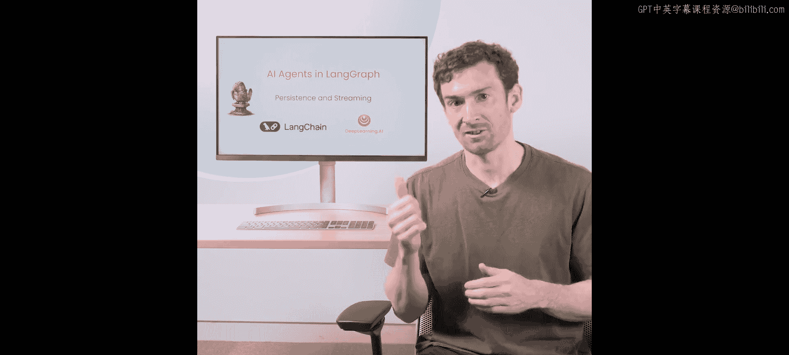

上一节我们介绍了如何构建一个基础的智能体。本节中，我们来看看如何为其添加持久化能力，使其能够记住对话历史并在后续交互中恢复状态。

为了实现持久化，LangGraph引入了**检查点**的概念。检查点会在每个节点执行后保存状态。我们将使用一个简单的SQLite检查点存储器。

以下是创建并配置带持久化功能智能体的步骤：

1.  **导入必要的库并设置环境**：与之前一样，我们首先导入所需模块并加载环境变量。
2.  **创建工具和智能体状态**：定义我们之前用过的Tavily搜索工具和智能体状态结构。
3.  **初始化检查点存储器**：我们将使用一个内存中的SQLite检查点存储器。请注意，重启笔记本后内存数据会消失，但在生产环境中可以轻松连接到外部数据库（如PostgreSQL或Redis）。
4.  **将检查点器传递给智能体**：在编译智能体图时，将检查点器作为参数传入。

核心的配置代码如下所示：

```python
# 初始化一个内存中的SQLite检查点器
checkpointer = SqliteSaver.from_conn_string(":memory:")

# 在编译智能体图时传入检查点器
agent = create_agent(llm, tools, checkpointer=checkpointer)
```

## 流式处理：实时观察智能体行为

配置好持久化后，我们现在可以添加流式处理功能。流式处理主要关注两方面：**消息流**和**令牌流**。消息流让我们能看到智能体决定采取什么行动（AI消息）以及行动的结果（工具观察消息）。令牌流则允许我们实时看到大语言模型生成的每一个词。

首先，我们实现消息流。

为了使用流式处理并利用持久化的状态，我们需要引入**线程配置**的概念。线程配置是一个字典，其中包含一个可配置的`thread_id`键。这允许我们在同一个检查点器中管理多个独立的对话线程，模拟多用户场景。

以下是使用流式处理调用智能体的方法：

```python
# 定义消息和线程配置
messages = {"messages": [HumanMessage(content="旧金山的天气怎么样？")]}
thread_config = {"configurable": {"thread_id": "1"}}  # 为此次对话设置一个线程ID

# 使用stream方法进行调用，并传入线程配置
stream_events = agent.stream(messages, thread_config)

# 遍历并打印流式事件
for event in stream_events:
    # 事件中包含状态更新，我们关注其中的消息
    if "messages" in event:
        print(event["messages"][-1])  # 打印最新的消息
```

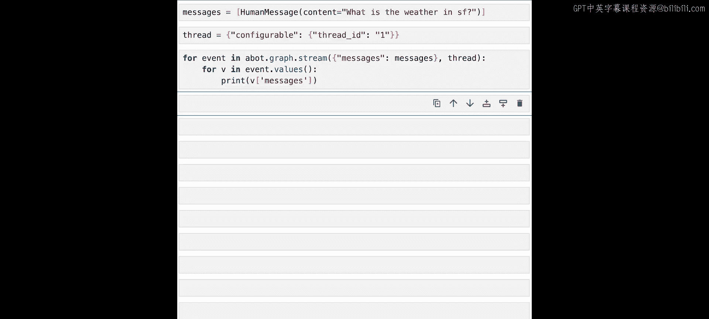

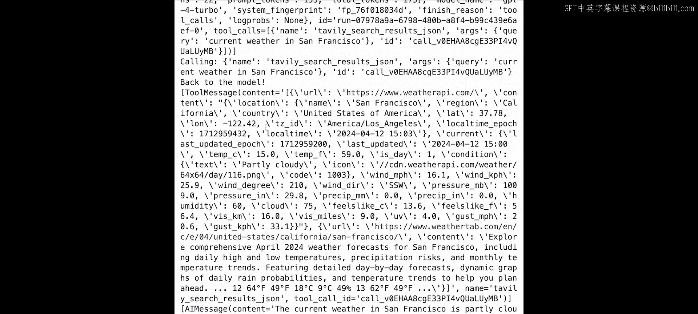

运行上述代码，我们将看到一系列消息被流式输出：首先是AI决定调用天气工具的消息，然后是工具返回的天气结果消息，最后是AI总结的最终答案消息。

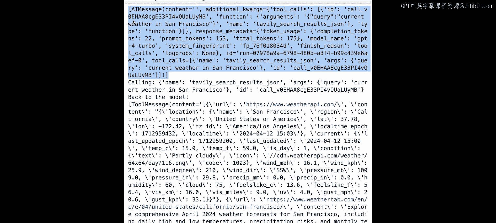

## 实践：多轮对话与线程隔离

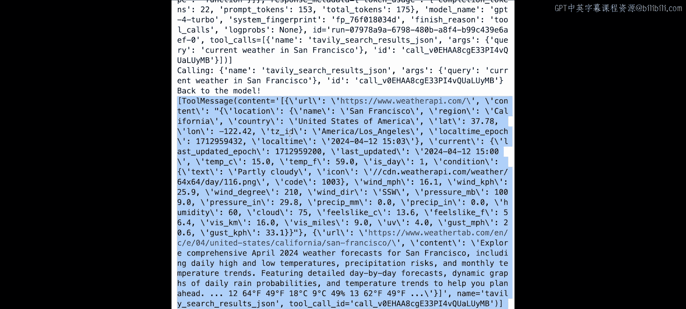

现在，让我们利用持久化进行多轮对话。我们可以在同一个线程ID下提出后续问题。

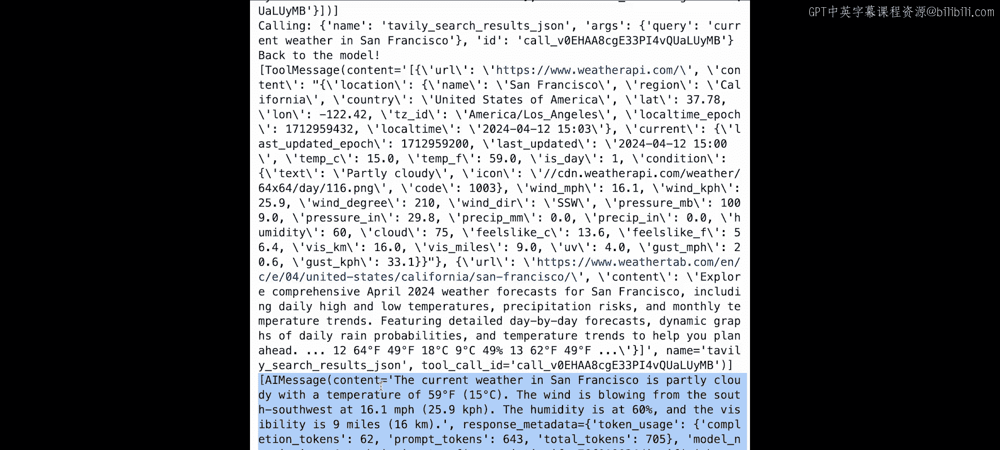

```python
# 继续线程ID为“1”的对话
follow_up_messages = {"messages": [HumanMessage(content="那洛杉矶呢？")]}
for event in agent.stream(follow_up_messages, {"configurable": {"thread_id": "1"}}):
    if "messages" in event:
        print(event["messages"][-1])
```

智能体会利用之前的对话历史，理解“洛杉矶”指的是天气，并给出回答。这证明了持久化的有效性。

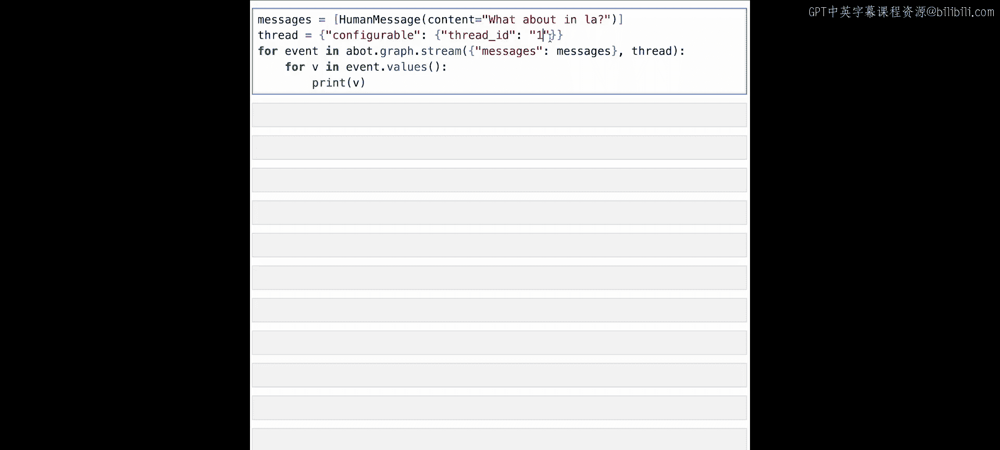

为了展示线程ID的重要性，我们尝试使用一个新的线程ID提问：

```python
# 使用新的线程ID“2”开启一个全新对话
new_thread_messages = {"messages": [HumanMessage(content="哪个更暖和？")]}
for event in agent.stream(new_thread_messages, {"configurable": {"thread_id": "2"}}):
    if "messages" in event:
        print(event["messages"][-1])
```

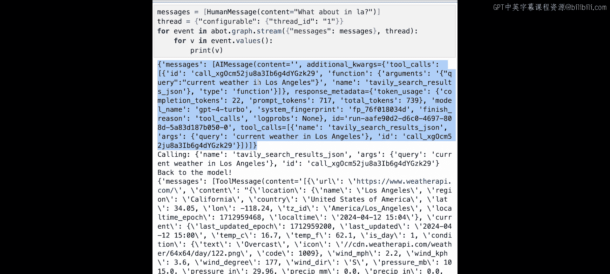

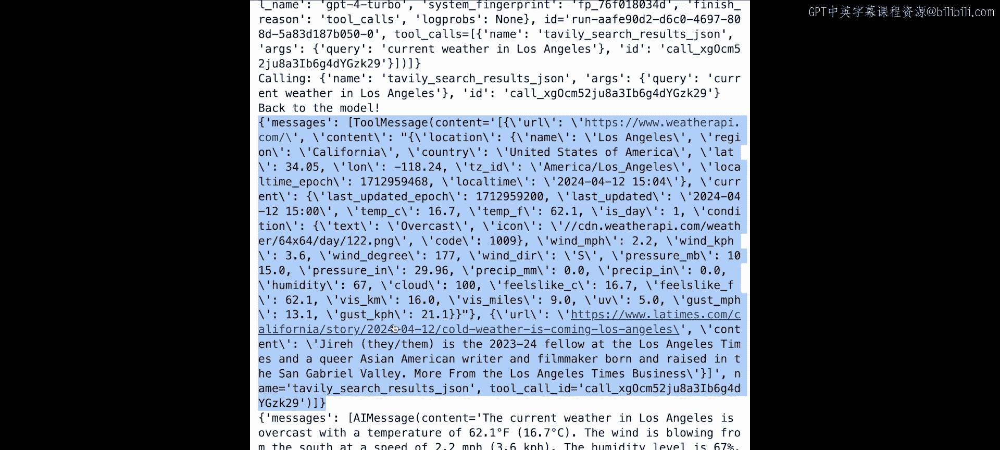

由于线程ID“2”没有历史记录，智能体会感到困惑，并要求用户明确比较对象。这清晰地说明了线程ID如何隔离不同的对话会话。

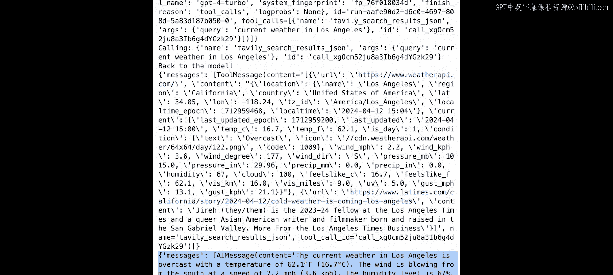

## 进阶：流式处理令牌

除了消息，我们还可以实时流式输出大语言模型生成的每一个令牌（词）。这需要使用异步方法和异步检查点器。

以下是实现令牌流式处理的步骤：

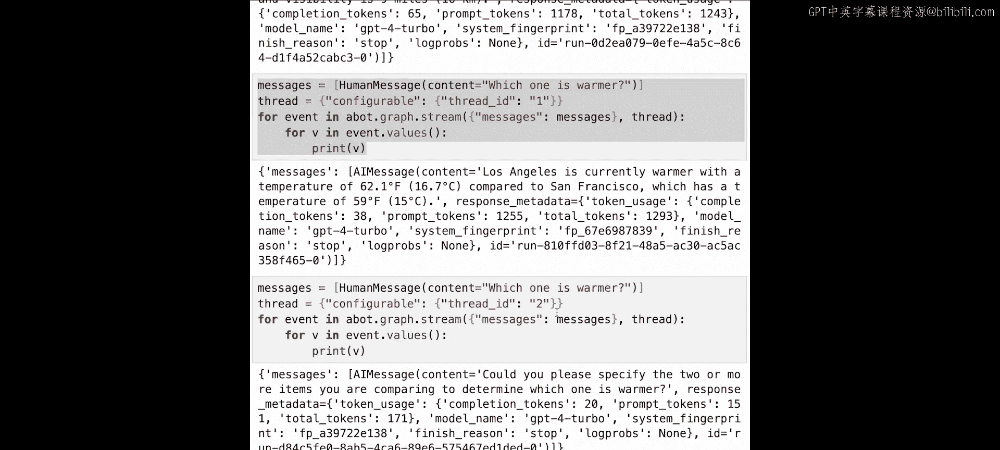

1.  **切换到异步检查点器**：例如使用`AsyncSqliteSaver`。
2.  **使用`astream_events`方法**：这是一个异步方法，可以提供更底层的事件流。
3.  **筛选令牌事件**：我们监听类型为`on_chat_model_stream`的事件，这些事件包含了新生成的令牌。

核心代码如下：

```python
import asyncio

# 使用异步检查点器
async_checkpointer = AsyncSqliteSaver.from_conn_string(":memory:")
async_agent = create_agent(llm, tools, checkpointer=async_checkpointer)

# 定义异步函数来流式处理令牌
async def stream_tokens():
    messages = {"messages": [HumanMessage(content="巴黎的天气如何？")]}
    thread_config = {"configurable": {"thread_id": "async_1"}}

    async for event in async_agent.astream_events(messages, thread_config, version="v1"):
        # 筛选出聊天模型生成令牌的事件
        if event["event"] == "on_chat_model_stream":
            # 打印令牌内容，用“|”分隔以便观察
            content = event["data"]["chunk"].content
            if content:
                print(f"|{content}", end="", flush=True)

# 运行异步函数
await stream_tokens()
```

运行后，你将看到最终答案的令牌被一个一个地实时打印出来，中间由“|”符号分隔。在工具调用阶段可能没有内容流式输出，因为那只是一个函数调用指令。

## 总结

本节课中我们一起学习了为LangGraph智能体添加**持久化**和**流式处理**功能。

*   **持久化**通过检查点器实现，允许智能体保存状态，支持多轮对话和多个独立对话线程（通过`thread_id`管理），这是构建复杂生产应用的基础。
*   **流式处理**提供了两种观察智能体工作的方式：
    *   **消息流**：让我们能看到智能体推理、行动和观察的完整步骤。
    *   **令牌流**：让我们能实时看到大语言模型生成答案的过程。

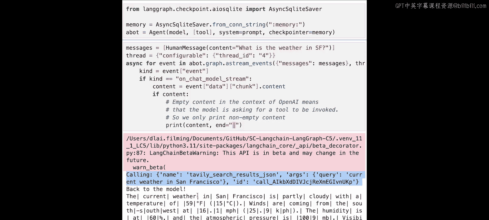

这些功能不仅提升了用户体验，使得长时间运行的任务可交互、可观察，也为实现“人在回路”等高级交互模式奠定了基础。在下一节课中，我们将具体探讨如何利用这些功能实现人机协同交互。