# 006：人机交互循环

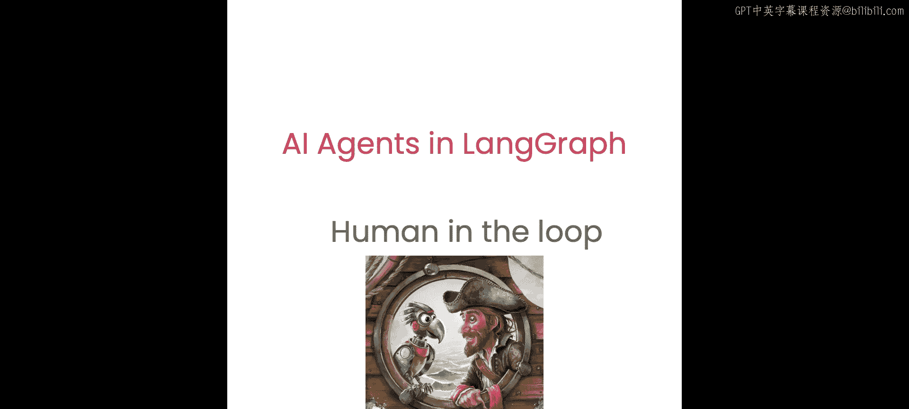


## 概述

在本节课中，我们将学习如何在LangGraph智能体中引入“人机交互循环”。这意味着在智能体执行关键操作（如调用工具）之前，可以暂停并等待人工审核或干预。这能让你更好地监控和控制智能体的行为，确保其操作的正确性和安全性。

---

## 人机交互循环简介

在许多场景下，你可能希望将人类纳入循环，以监控智能体的行为。使用LangGraph可以轻松实现这一点。

上一节我们介绍了如何构建一个基础的智能体，本节中我们来看看如何为这个智能体添加人工审核的“暂停点”。

## 设置环境与状态

我们从上节课结束的地方继续。首先，设置环境变量，导入相关库，并配置检查点。

接下来，设置智能体的状态。这里我们需要做一个小修改。在之前的例子中，我们使用 `operator.add` 来注解消息列表，这会将新消息添加到现有数组中。然而，对于人机交互，我们可能需要替换现有的消息。

为了实现这一点，我们将编写一个自定义的 `reducer` 函数。该函数会检查新消息的ID，如果发现与已有消息ID相同，则替换它；否则，将其追加到列表末尾。

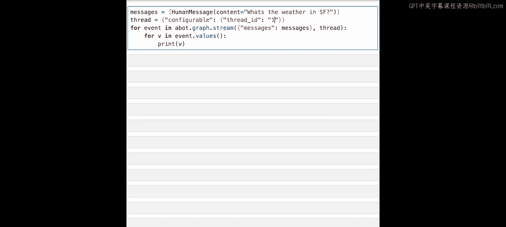

```python
# 自定义reducer函数示例
def custom_reducer(existing_messages, new_messages):
    # 实现逻辑：根据ID替换或追加消息
    pass
```

之后，我们创建之前用过的相同工具和智能体。

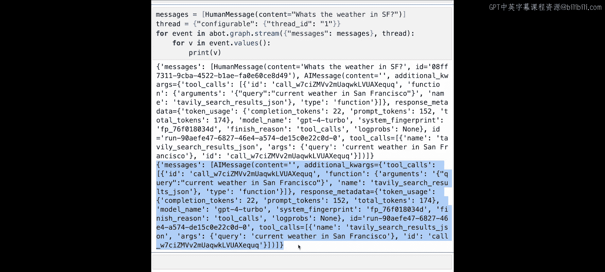

## 添加执行前中断

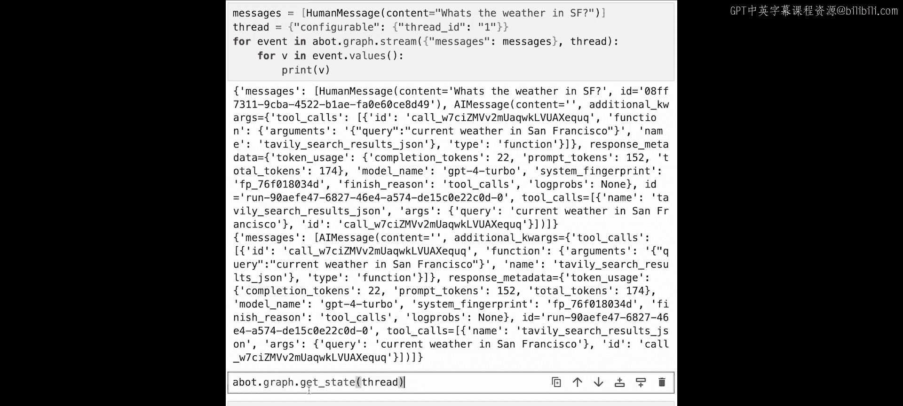

我们将对智能体做一个小修改。在编译图时，除了传入检查点，我们还将传入 `interrupts_before=[“action”]` 参数。这将在调用“action”节点之前添加一个中断。

“action”节点是调用工具的地方。这样做的目的是，在运行任何工具之前，添加一个需要手动批准的步骤。这对于确保工具正确执行非常有用。

这个中断发生在调用所有工具的“action”节点之前。有时，你可能只想在调用特定工具时中断，这在本课程的其他部分有介绍，建议你稍后查看。

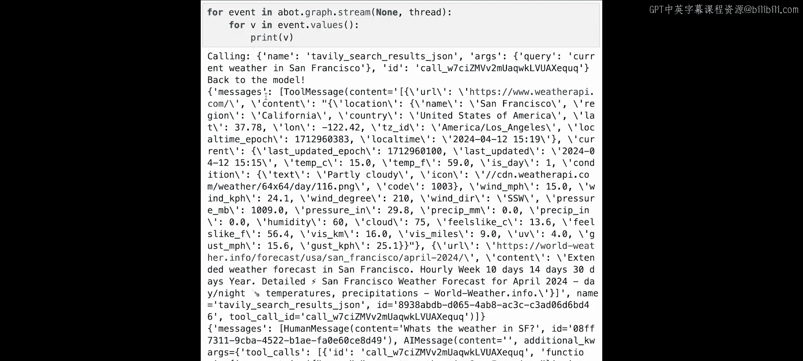

让我们用相同的系统提示、模型和检查点来初始化智能体。

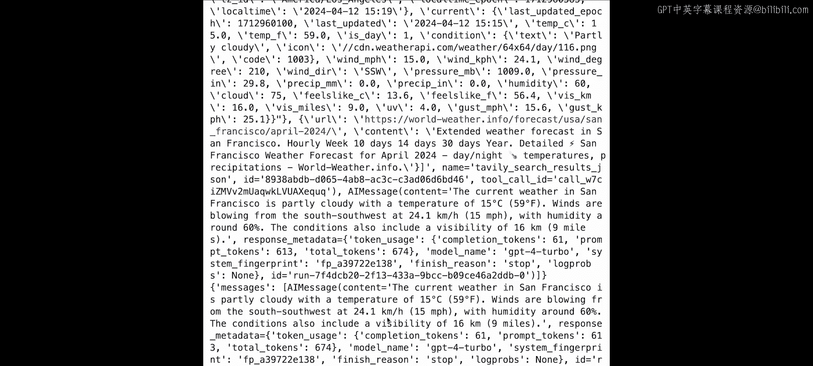

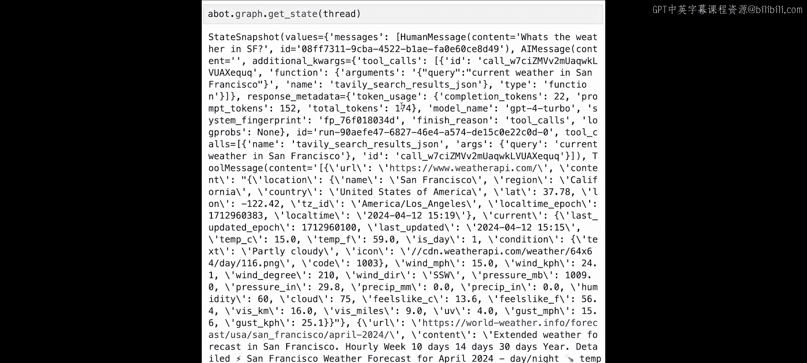

```python
# 编译图并添加中断
graph = graph.compile(checkpointer=checkpointer, interrupts_before=[“action”])
```

## 运行与中断演示

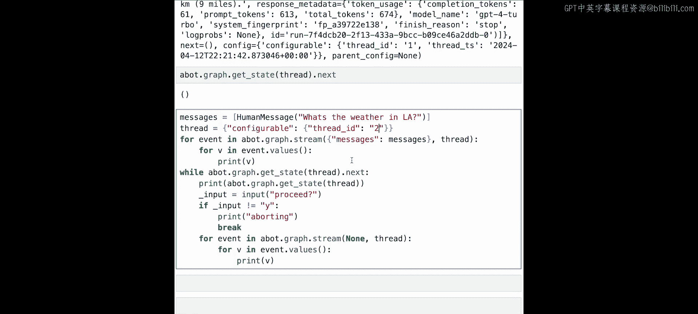

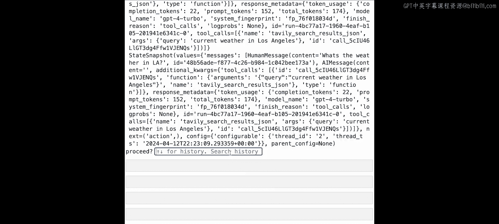

我们现在调用智能体，传入一个新的线程ID（例如 `thread_id=1`），因为这是一个新的会话，它将从头开始。

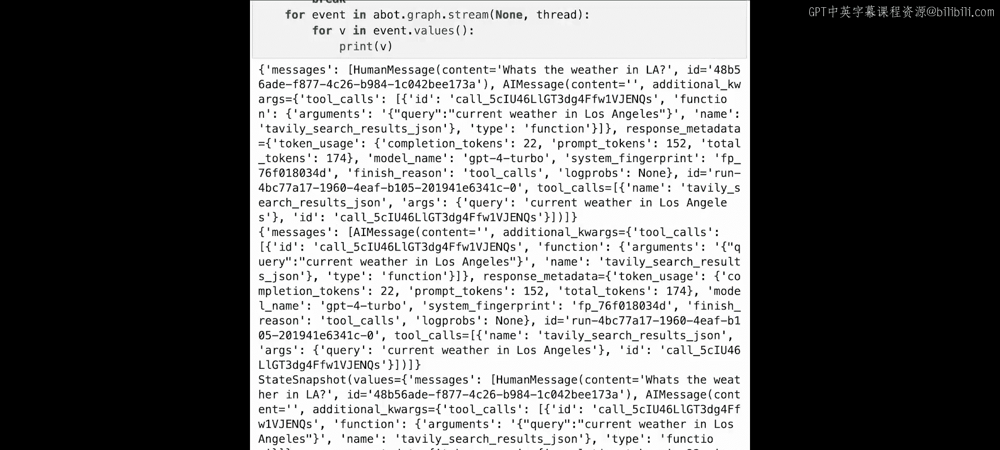

我们流式返回响应，并在AI消息处停止。这是因为AI消息指示应该调用工具，但我们设置了 `interrupts_before` 参数，使其在此处暂停。

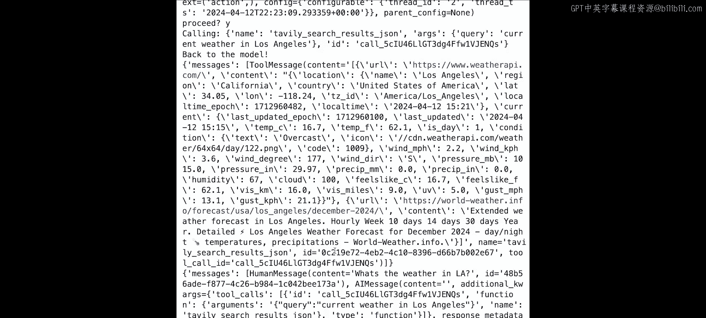

从这里，我们可以获取此线程的图的当前状态。为此，我们需要传入线程配置。

我们将返回一个配置对象，其中包含几个参数。最重要的一个是这里的消息列表，它代表了图在此时刻的状态。我们还可以看到它有一个 `next` 参数，指示接下来要调用的节点。这里显示是 `action`，意味着我们即将调用“action”节点。

为了继续执行，我们可以再次调用 `graph.stream()`，传入相同的线程配置，并将输入设为 `None`。

这将流式返回结果，我们将看到来自调用工具的工具消息，以及最终的AI消息。注意，在“action”节点和“LLM”节点之间没有中断，因为我们没有在那里添加任何中断。

如果我们现在获取状态，可以看到消息列表包含了完整的消息序列。如果查看 `next` 参数，会发现它是空的，表示没有其他任务需要执行。

## 构建交互式循环

为了更有趣，我们可以编写一些代码，在一个小循环中运行此过程，并提示我们输入是否继续。我们将传入一个新的线程ID以重新开始。

以下是实现交互式循环的步骤：

1.  初始化智能体并设置中断点。
2.  启动一个循环，处理用户查询。
3.  当智能体运行到中断点时，暂停并提示用户。
4.  根据用户输入（例如“是”或“否”）决定是否继续执行工具调用。
5.  如果继续，则完成剩余步骤；否则，可以修改状态或终止。

```python
# 伪代码示例
while True:
    user_input = input(“请输入您的问题（或输入‘退出’结束）: “)
    if user_input.lower() == ‘退出’:
        break
    # 调用智能体，它会自动在工具调用前暂停
    for step in graph.stream({“messages”: [(“human”, user_input)]}, config):
        # 处理并显示每一步的输出
        # 如果遇到中断，则等待用户输入
        if 需要人工批准:
            approval = input(“是否批准执行此操作？(是/否): “)
            if approval == ‘是’:
                # 继续执行
                continue_execution()
            else:
                # 处理不批准的情况，例如修改状态或跳过
                handle_rejection()
```

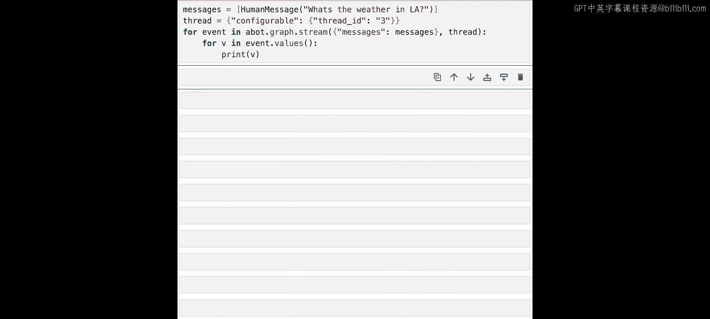

这是一个停下来尝试其他输入的好时机。尝试在不同的位置添加中断，看看会发生什么。

## 深入理解状态与记忆

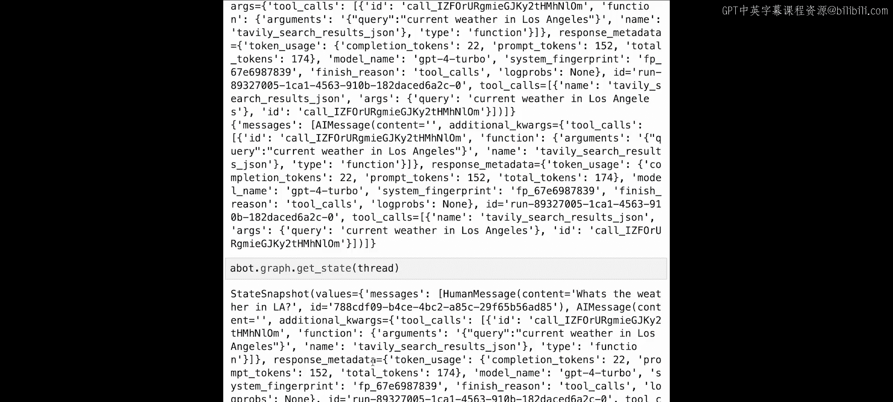

在进入下一部分之前，让我们更深入地讨论一下状态记忆。

当图执行时，每个状态的快照都存储在内存中。这个快照里有什么？首先是你已经定义的智能体状态，其次还有一些其他有用的信息，例如线程和每个快照的唯一标识符（即 `thread_ts`）。你可以使用它来访问快照。

有一些命令可以访问内存。你已经见过 `get_state`，如果你只提供线程ID而不提供唯一标识符，它将返回当前状态。还有 `get_state_history`，它返回一个遍历所有状态快照的迭代器。你可以使用这个迭代器来获取每个状态的所有唯一标识符。

你能用它做什么？这里有一个例子：给定线程标识符（更确切地说是那个唯一的 `thread_ts`），你可以访问第一个状态 `state1`，并在 `invoke` 命令中使用它。这将使用 `state1` 作为图的当前状态或起始点。这实际上是“时间旅行”。相反，如果没有那个 `thread_ts`，只传入线程ID，将使用线程的当前状态作为起始点。

你也可以使用那个唯一标识符来访问特定状态。然后，你可以修改那个状态。接着，你可以使用 `update_state` 来更新状态，并将其存储回内存中当前状态的位置。之后，如果你运行 `stream` 或 `invoke`，它将使用新的、修改后的状态作为起始点。

好的，你将在接下来的部分看到这些例子，让我们继续。

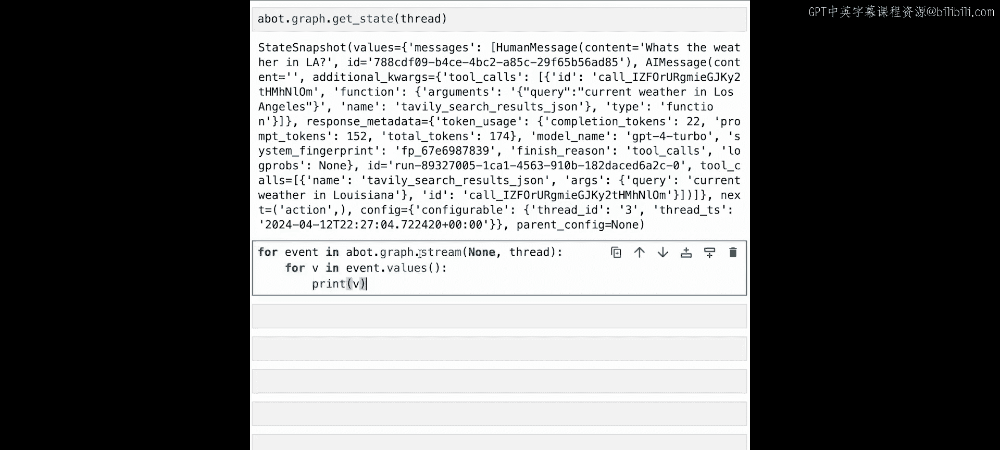

## 修改状态示例

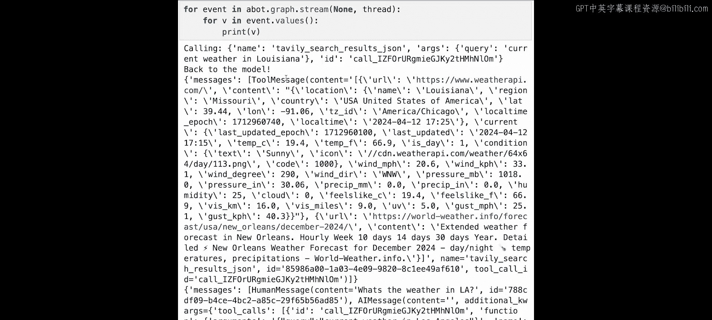

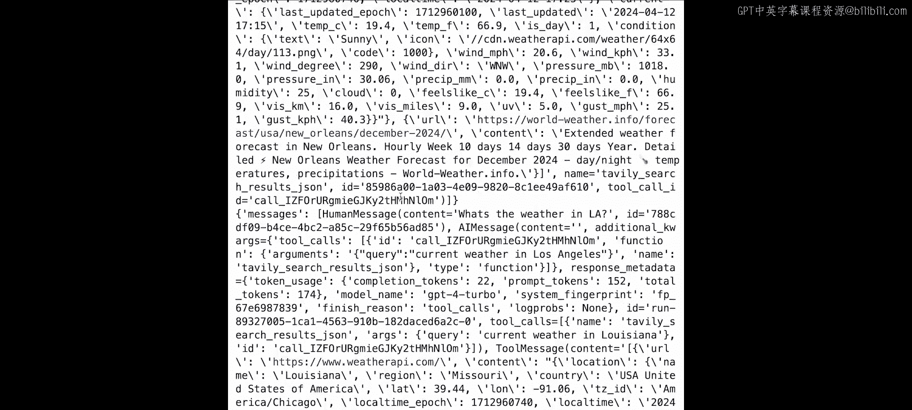

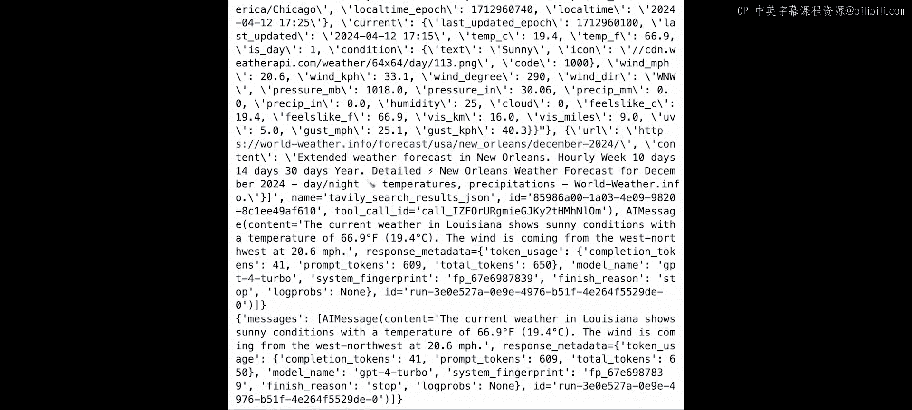

现在让我们展示一个修改状态的例子。让我们启动一个新线程，询问“洛杉矶的天气怎么样”。

在这个线程的这一点上，我们有两条消息：人类消息和AI消息。AI消息指示搜索“洛杉矶的当前天气”。但让我们修改一下。假设我们实际上想问的是路易斯安那州的天气，而不是洛杉矶。那么，我们如何修改以纠正智能体的行为呢？

首先，让我们将图的当前状态保存到一个名为 `current_values` 的变量中。这个状态中的最后一条消息是AI消息，它指示搜索特定的搜索词，即“洛杉矶的当前天气”。我们可以进一步深入查看与此消息关联的工具调用列表。

现在更新这些工具调用。为此，我们首先获取与工具调用关联的ID。然后，我们将 `tool_calls` 属性更新为一个列表。这个列表有一个元素，是一个字典。它有一个工具调用，调用的是 `tavily_search_results_json` 工具，和之前一样，但参数不同。这次，查询是“路易斯安那州的当前天气”。

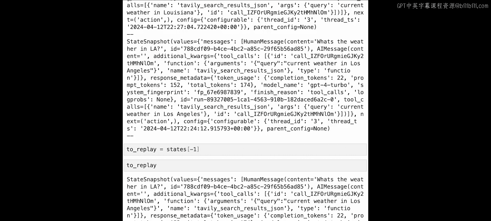

在我们对图调用 `update_state` 之前，这实际上不会做任何事情。我们将传入线程配置，这样我们就知道正在操作哪个线程，并且我们将传入我们想要覆盖的新值。

如果我们现在获取图的当前状态，可以看到搜索词已经变成了“路易斯安那州的当前天气”。

如果我们从这里继续，可以看到它用“路易斯安那州的当前天气”调用Tavily，得到一些响应，然后相应地回复：路易斯安那州当前的天气是晴朗的。

## 状态历史与时间旅行

我们现在已经展示了如何修改图的状态以控制智能体的行为。需要注意的重要一点是，我们实际上保留了所有这些状态的运行列表。因此，当我们修改状态时，实际上是创建了一个新状态，它成为了新的当前状态。然后，每次我们用节点的结果更新它时，实际上是一个接一个地创建新状态。

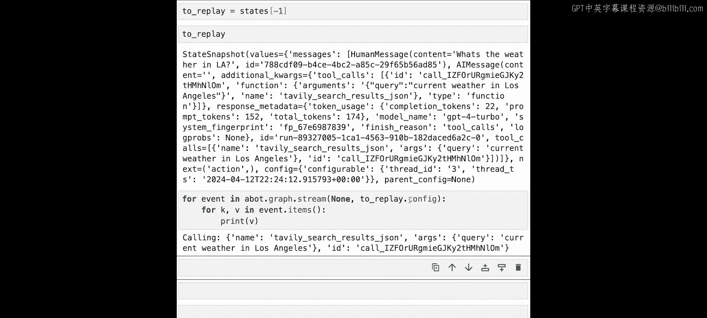

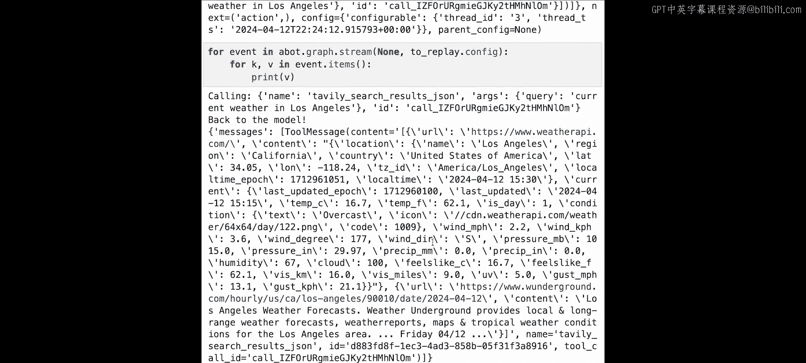

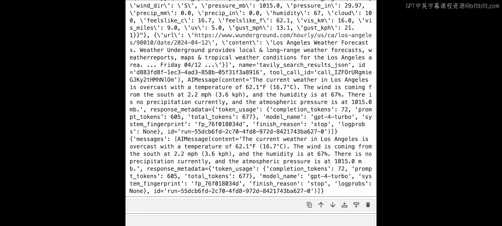

这非常好，因为它实际上允许我们回到过去，访问之前的状态，我们称之为“时间旅行”。

为了做到这一点，我们可以在图上调用 `get_state_history`，再次传入线程ID。然后，我们将开始随时间构建这个状态列表。

如果我们获取这个列表中的最后一个状态，可以看到它实际上是最早的一个。这是它查找洛杉矶当前天气时的状态。这是基于第一次语言模型调用所做的原始状态更新。如果我们想回到过去，从这个它正在寻找洛杉矶的检查点恢复，我们完全可以做到。

为此，我们只需再次调用 `graph.stream()`，传入 `None`，但请注意，我们现在传入的是 `config`，其中 `config` 包含 `“replay”` 参数，指定了我们想要从哪个状态恢复。`config` 只是告诉我们正在从这个状态恢复的配置参数。

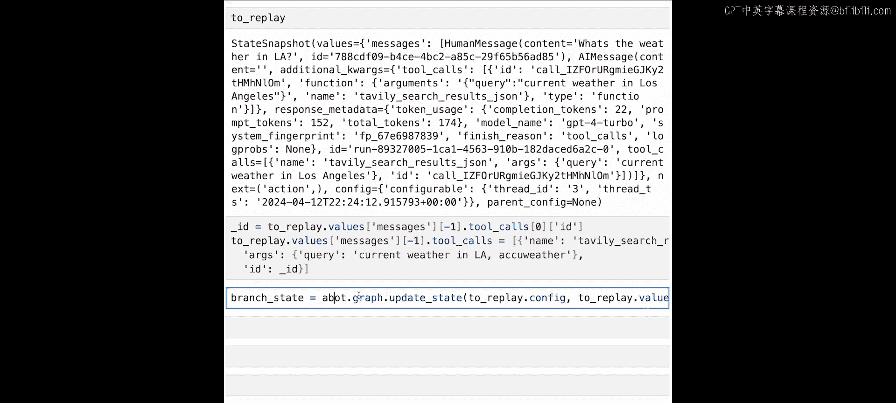

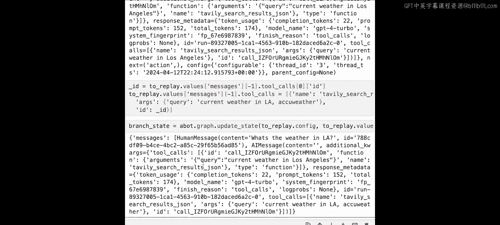

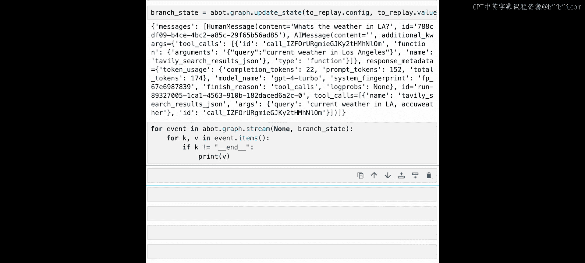

因此，如果我们运行这个，将看到它开始搜索洛杉矶的当前天气，从Tavily获取结果，然后生成响应，这就是我们的最终答案。

## 在历史状态上进行编辑

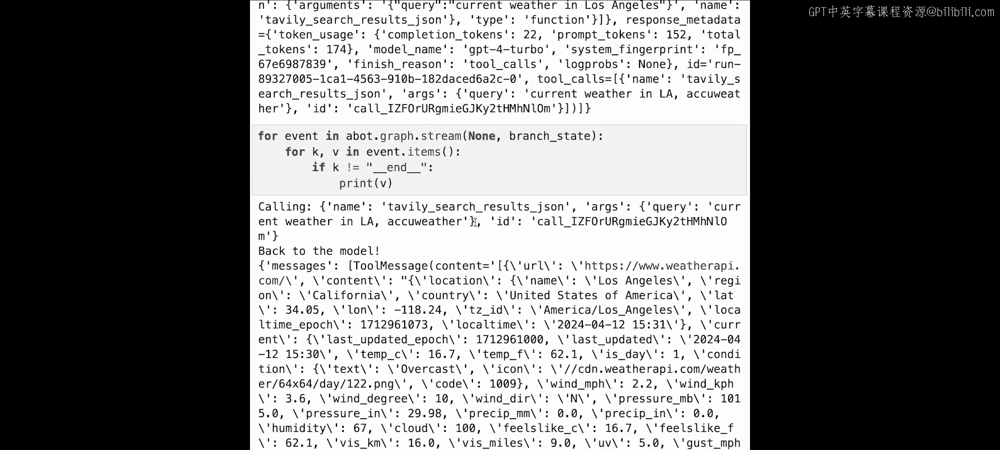

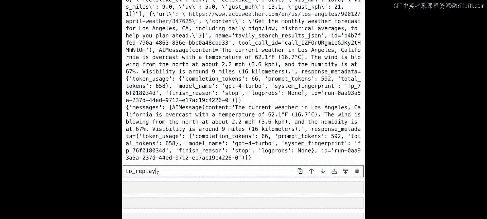

我们还可以做的一件事是回到过去，然后从那里进行编辑。

这里我们有这个 `config`，其中 `replay` 指向它正在查找洛杉矶当前天气的状态。所以我们可以做和之前一样的事情来修改这个状态。

因此，我们将修改它以执行“洛杉矶的当前天气 AccuWeather”，假设我们想要来自AccuWeather的响应。这里与之前不同的原因是，我们是回到过去然后进行编辑，而不是像之前那样从最近的状态进行编辑。

我们可以更新这个 `replay` 状态，然后返回到这个分支状态，我们已经通过这个修改分支出去了。

如果我们现在在这个分支状态上调用 `graph.stream()`，传入 `None`，可以看到它正在查找AccuWeather并从那里获取结果，我们得到一个新的答案，然后从AI那里得到响应。

## 手动添加消息到状态

我们还可以做的另一件事是在任何给定的时间点向状态添加消息。

这里我们有这个 `config`，我们已经将其修改为包含“洛杉矶的当前天气 AccuWeather”。现在假设我们不想实际调用Tavily，而是想模拟一个响应。我们可以通过向状态追加一个新消息来实现。

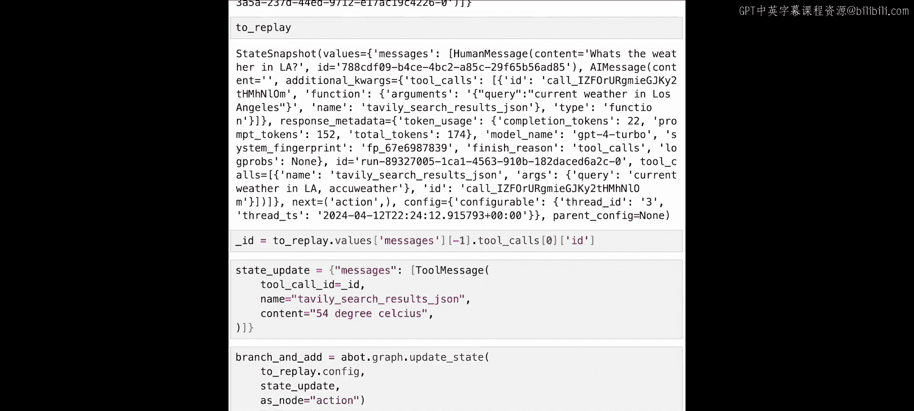

我们将获取我们应该进行的工具调用的ID。然后，我们将创建这个状态更新，它是一个消息列表，这次是一条新消息。它有一个工具调用ID，工具名称是“TavilySearch”，内容是“54摄氏度”。所以这是一条新消息。因此，当我们在图中更新这个状态时，它不会替换现有消息，而是会将其追加到消息列表中。

我们现在要更新图的状态。但是，因为我们实际上是在添加并假装一个动作已经发生，而不是修改现有状态，所以我们需要做一件额外的事情。我们需要在这里添加 `as_node=“action”` 参数。这基本上是在说，我们正在做的状态更新不仅仅是一个修改，我们实际上是在模拟“action”节点进行这个更新。这之所以相关，是因为在我们添加这条消息之前，图的当前状态即将进入“action”节点。但在我们添加这条消息之后，我们不希望它再进入“action”节点了。所以，我们基本上是在说，当我们更新这个状态时，我们表现得好像我们就是“action”节点。

如果我们现在在这个新配置上调用 `stream()`，可以看到它不再执行动作了。相反，它只是调用模型并用这条AI消息响应：“洛杉矶的当前天气是54摄氏度”。这就是我们假装工具已经返回的内容。

## 总结

本节课中，我们一起学习了如何在LangGraph智能体中实现复杂的人机交互循环模式。

你已经学会了如何在一个节点执行前添加中断，这允许人类批准或拒绝特定的操作。你还展示了如何回到过去，以及如何修改状态（无论是当前状态还是过去的状态）。此外，你还展示了如何手动更新状态，这允许你手动给智能体提供调用工具的结果，而不是实际调用工具本身。

所有这些“人在循环中”的模式都有助于促进你与智能体的交互。它们让你对智能体的行为有更多的控制权，允许你回到之前的时间点，并通过编辑来纠正它的行为。

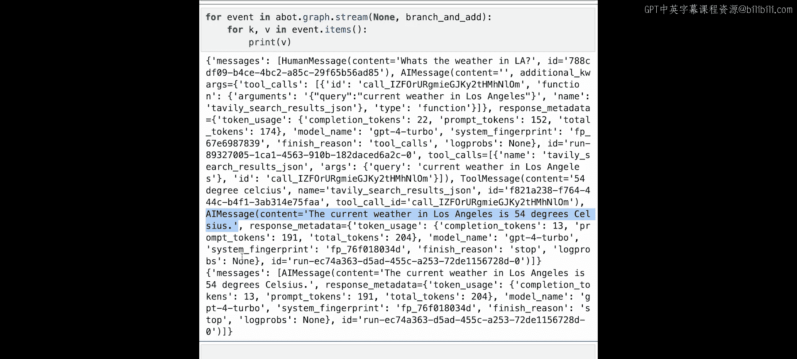

到目前为止，我们一直在使用一个相当简单的智能体：它有一个LLM调用，一个提示，并且状态很简单，只是一个消息列表。在本课程的下一个也是最后一个例子中，我们将创建一个更复杂的智能体，它由多个LLM调用组成，并拥有一个相当复杂的状态。