# 007：7.第六课 论文写作器 📝

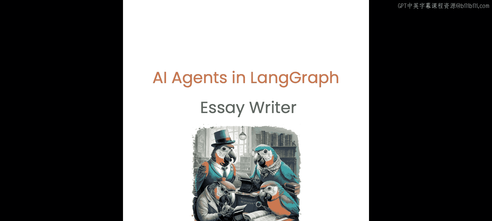


## 概述
在本节课中，我们将构建一个功能更全面的项目——一个AI论文写作器。这个智能体将遵循“规划-研究-生成-反思”的循环流程，自动撰写并迭代改进一篇论文。

---

## 项目架构与流程

上一节我们介绍了基础智能体的构建，本节中我们来看看一个更复杂的、具备迭代能力的写作智能体。

整个论文写作器的流程可以分解为以下几个步骤：
1.  **规划**：根据用户任务生成论文大纲。
2.  **研究**：根据大纲，调用Tavili搜索工具获取相关文档。
3.  **生成**：基于研究内容和规划，撰写论文初稿。
4.  **判断**：检查修订次数是否达到上限，决定是结束还是进入反思循环。
5.  **反思**：对当前论文草稿进行批判性分析，生成改进建议。
6.  **二次研究**：根据反思建议，再次进行搜索以获取补充资料。
7.  **循环**：带着新的研究资料，返回“生成”步骤，开始新一轮的撰写与修订。

这个循环将持续进行，直到满足预设的修订次数上限为止。

---

## 代码实现详解

### 1. 定义智能体状态
首先，我们需要定义一个更复杂的状态结构来跟踪整个写作过程。

```python
from typing import List, TypedDict
from langgraph.graph import StateGraph

class AgentState(TypedDict):
    task: str           # 用户输入的写作主题
    plan: str           # 生成的论文大纲
    draft: str          # 当前的论文草稿
    critique: str       # 对草稿的批判性意见
    content: List[str]  # 研究获取的文档内容列表
    revision_number: int # 当前的修订次数
    max_revisions: int  # 允许的最大修订次数
```

### 2. 创建提示词
以下是控制不同环节智能体行为的提示词。

**规划提示词**：指导LLM生成论文大纲。
```
你是一位专业的论文规划师。请根据用户提供的主题，生成一份详细、结构清晰的论文大纲。大纲应包含引言、主体段落和结论。
```

**写作提示词**：指导LLM基于研究和规划进行写作。
```
你是一位专业的作家。请根据以下研究资料和论文规划，撰写一篇结构完整、论据充分的论文。
研究资料：{content}
论文规划：{plan}
```

**反思提示词**：指导LLM对草稿进行批判性评估。
```
你是一位严格的编辑。请仔细审阅以下论文草稿，指出其在逻辑、论据、结构和语言上的不足之处，并提供具体的改进建议。
论文草稿：{draft}
```

**研究提示词（规划后）**：指导LLM根据大纲生成搜索查询。
```
基于以下论文大纲，生成一系列用于搜索相关资料的查询关键词。
大纲：{plan}
```

**研究提示词（反思后）**：指导LLM根据批判意见生成新的搜索查询。
```
基于以下对论文草稿的批判意见，生成一系列用于搜索补充资料的查询关键词，以解决指出的问题。
批判意见：{critique}
```

### 3. 构建功能节点
接下来，我们创建实现每个步骤的功能节点。

**规划节点**：接收任务，生成论文计划。
```python
def planning_node(state: AgentState):
    messages = [
        SystemMessage(content=planning_prompt),
        HumanMessage(content=state[“task”])
    ]
    response = model.invoke(messages)
    return {“plan”: response.content}
```

**研究节点（规划后）**：根据计划生成查询并获取资料。
```python
def research_plan_node(state: AgentState):
    # 生成搜索查询
    queries = model.with_structured_output(Queries).invoke([
        SystemMessage(content=research_planning_prompt),
        HumanMessage(content=state[“task”])
    ])
    # 执行搜索并累积结果
    current_content = state.get(“content”, [])
    for query in queries.list:
        results = tavili_client.search(query)
        current_content.extend(results)
    return {“content”: current_content}
```

**生成节点**：结合研究资料和计划，撰写论文草稿。
```python
def generate_node(state: AgentState):
    # 准备输入
    formatted_content = “\n”.join(state[“content”])
    user_message = f”任务：{state[‘task’]}\n计划：{state[‘plan’]}”
    # 调用模型生成草稿
    messages = [
        SystemMessage(content=writer_prompt.format(content=formatted_content)),
        HumanMessage(content=user_message)
    ]
    response = model.invoke(messages)
    # 更新状态
    new_revision = state[“revision_number”] + 1
    return {“draft”: response.content, “revision_number”: new_revision}
```

**反思节点**：对当前草稿进行评估，生成批判意见。
```python
def reflect_node(state: AgentState):
    messages = [
        SystemMessage(content=reflection_prompt),
        HumanMessage(content=state[“draft”])
    ]
    response = model.invoke(messages)
    return {“critique”: response.content}
```

**研究节点（反思后）**：根据批判意见进行补充研究。
```python
def research_critique_node(state: AgentState):
    # 基于批判生成新的查询
    queries = model.with_structured_output(Queries).invoke([
        SystemMessage(content=research_critique_prompt),
        HumanMessage(content=state[“critique”])
    ])
    # 执行搜索并更新内容
    current_content = state.get(“content”, [])
    for query in queries.list:
        results = tavili_client.search(query)
        current_content.extend(results)
    return {“content”: current_content}
```

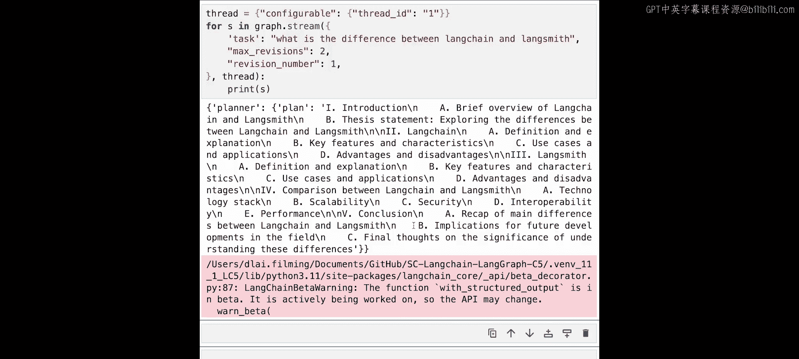

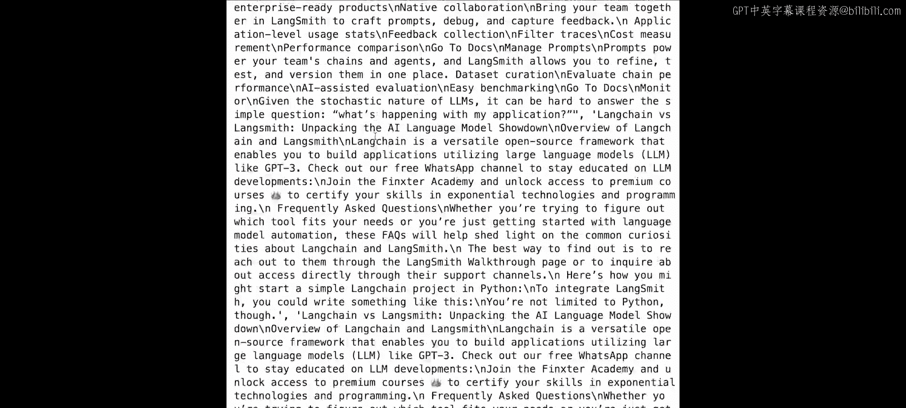

### 4. 定义条件边
我们需要一个逻辑来决定是结束流程还是继续反思循环。

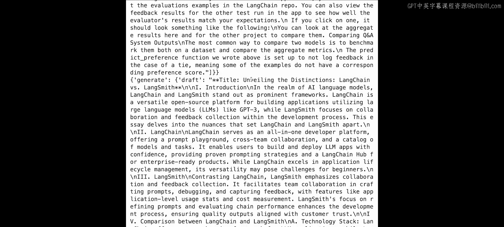

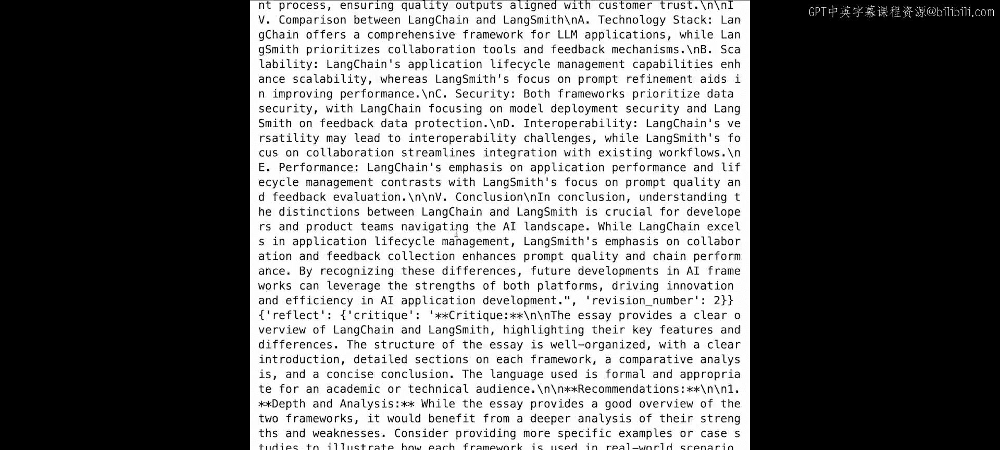

```python
def should_continue(state: AgentState) -> str:
    if state[“revision_number”] >= state[“max_revisions”]:
        return “end”
    else:
        return “reflect”
```

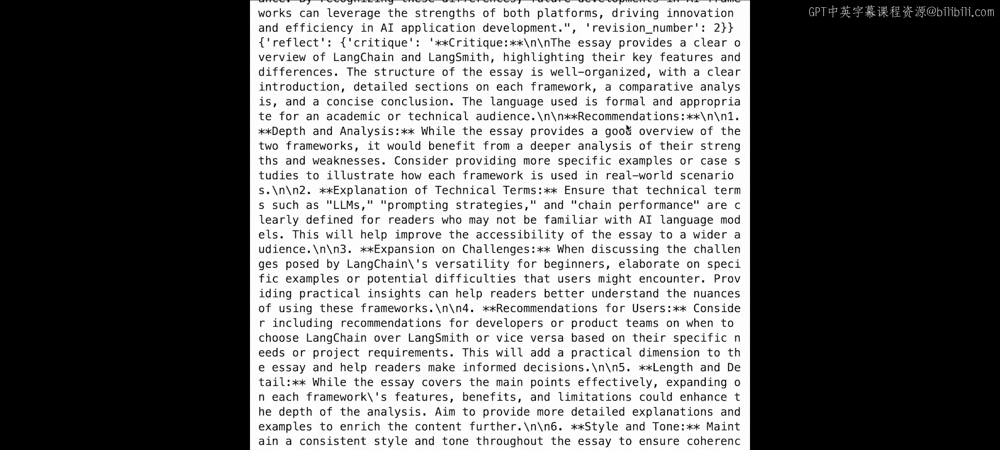

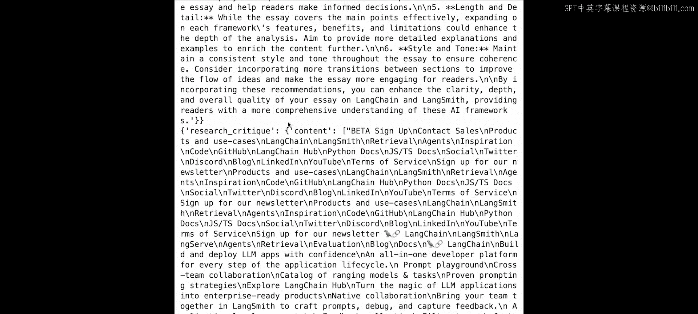

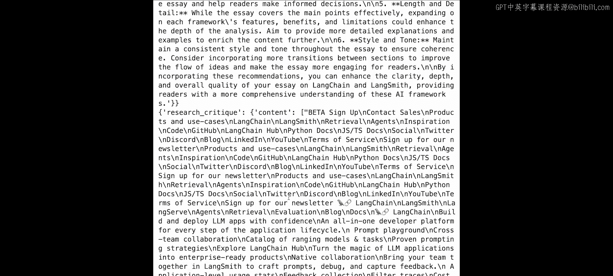

### 5. 组装成图
最后，将所有节点和边组合成一个完整的工作流图。

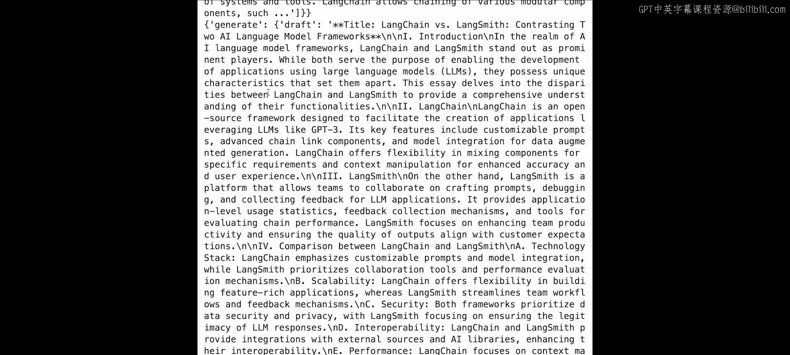

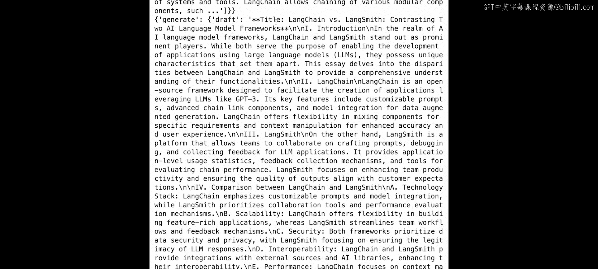

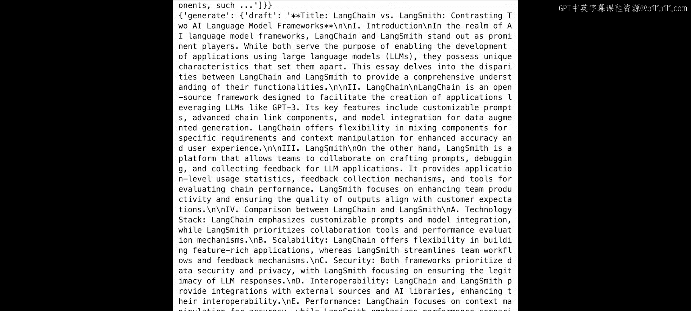

```python
# 初始化图
workflow = StateGraph(AgentState)

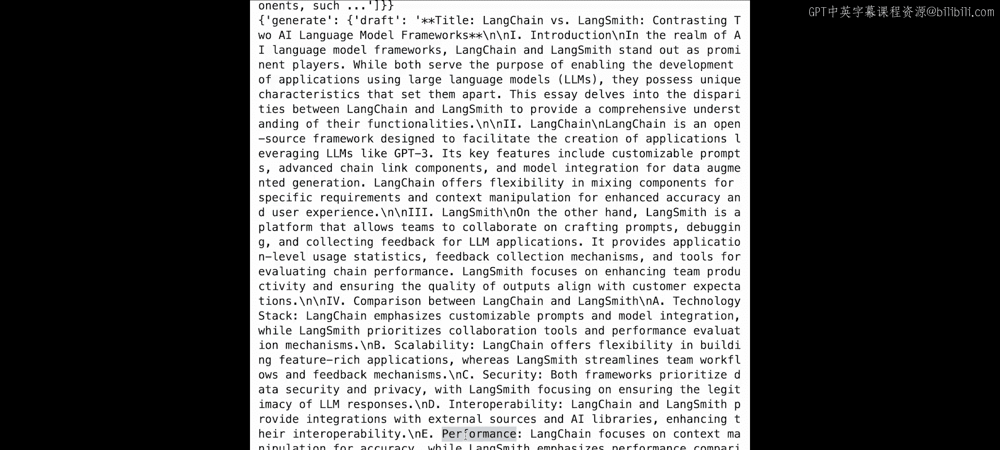

# 添加所有节点
workflow.add_node(“plan”, planning_node)
workflow.add_node(“research_plan”, research_plan_node)
workflow.add_node(“generate”, generate_node)
workflow.add_node(“reflect”, reflect_node)
workflow.add_node(“research_critique”, research_critique_node)

# 设置入口点
workflow.set_entry_point(“plan”)

# 添加普通边
workflow.add_edge(“plan”, “research_plan”)
workflow.add_edge(“research_plan”, “generate”)
workflow.add_edge(“reflect”, “research_critique”)
workflow.add_edge(“research_critique”, “generate”)

# 添加条件边（在生成节点之后）
workflow.add_conditional_edges(
    “generate”,
    should_continue,
    {
        “end”: END,
        “reflect”: “reflect”
    }
)

# 编译图
app = workflow.compile()
```

---

## 运行与测试
编译完成后，我们可以运行这个写作智能体。例如，让它撰写一篇关于“LangChain和LangSmith区别”的短文，并设置最大修订次数为2。

```python
inputs = {
    “task”: “LangChain和LangSmith的主要区别是什么？”,
    “revision_number”: 1,
    “max_revisions”: 2
}
for output in app.stream(inputs):
    print(output) # 可以观察到规划、研究、生成、反思等各个步骤的输出
```

运行过程将清晰展示智能体如何：
1.  生成初步大纲。
2.  进行第一轮研究并获取资料。
3.  撰写第一版草稿。
4.  对草稿进行批判，提出改进建议（如“需要更深入的优势劣势分析”）。
5.  根据批判进行第二轮研究。
6.  结合新资料撰写第二版（最终版）草稿。

最终，我们得到一篇经过研究和迭代改进的、结构清晰的对比文章。

---

## 总结
本节课中我们一起学习并构建了一个功能完整的AI论文写作智能体。我们掌握了如何：
*   设计一个包含**规划、研究、生成、反思**循环的复杂智能体工作流。
*   使用 **`TypedDict`** 定义和管理包含多个键的复杂智能体状态。
*   为工作流中不同的环节（规划、写作、批判）编写针对性的**提示词**。
*   利用 **`with_structured_output`** 确保语言模型输出结构化的数据（如查询列表）。
*   在图中使用 **`add_conditional_edges`** 来实现基于条件（如修订次数）的流程分支控制。
*   通过可视化工具观察智能体的执行步骤和状态变化。

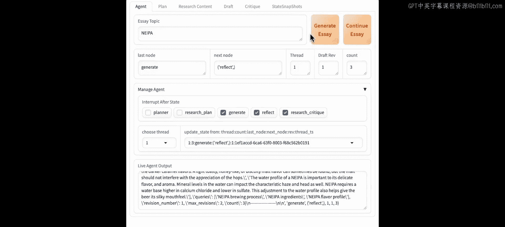

这个项目展示了LangGraph在构建多步骤、可迭代、具备自我改进能力的高级智能体方面的强大灵活性。你可以尝试修改提示词、调整循环逻辑或集成不同的工具，来打造属于你自己的专属写作助手或研究助理。