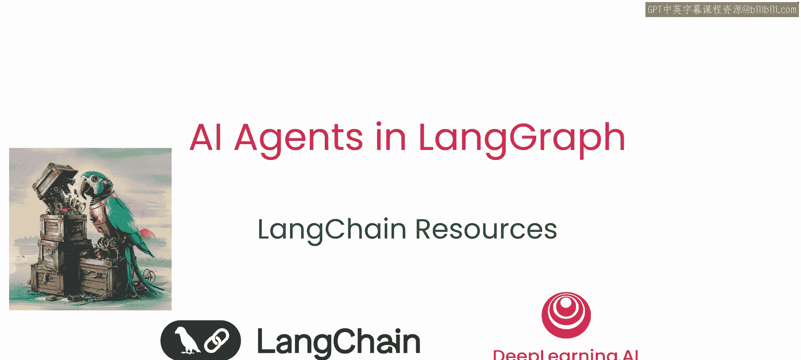
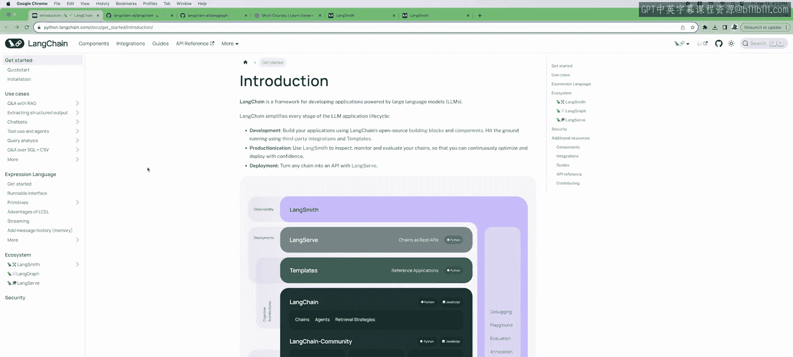
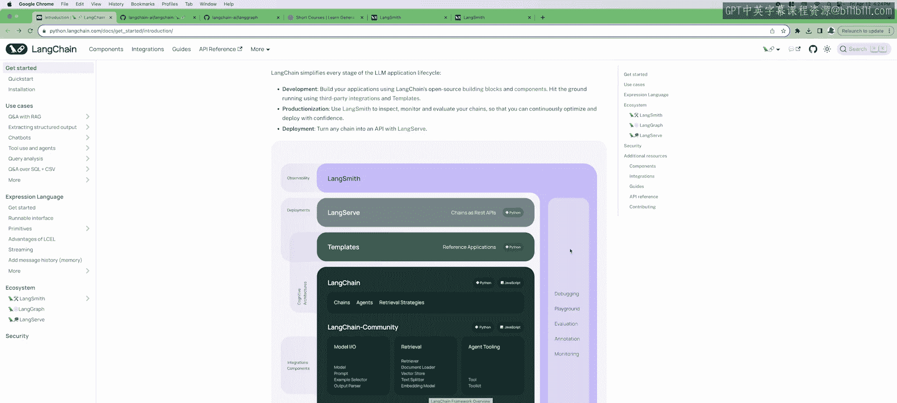
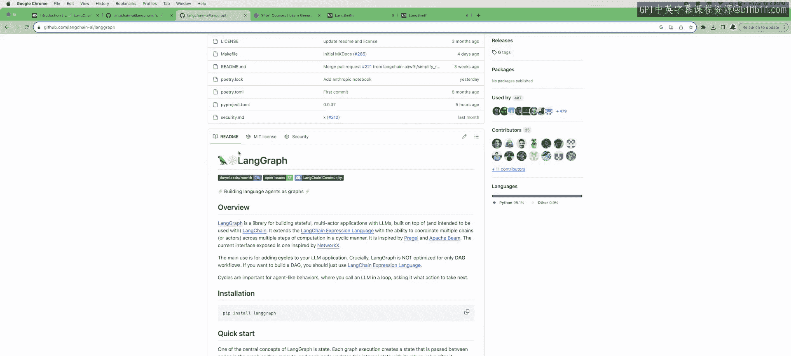
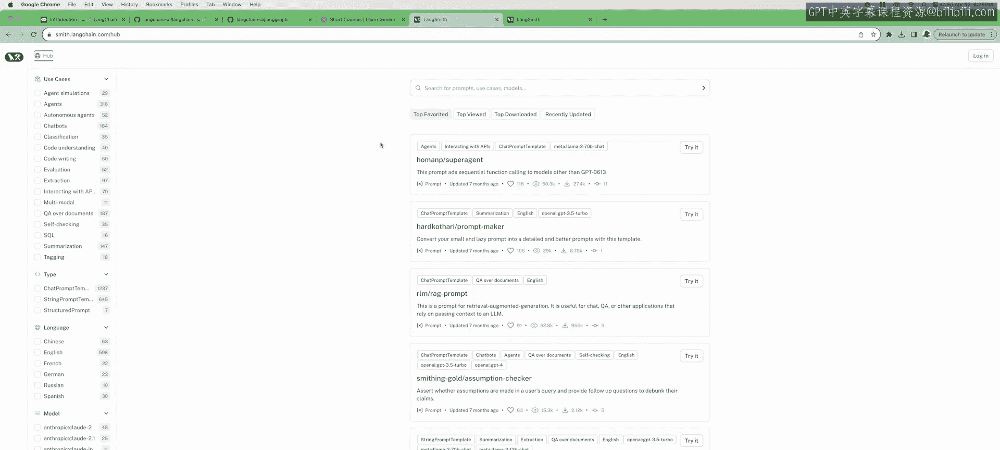
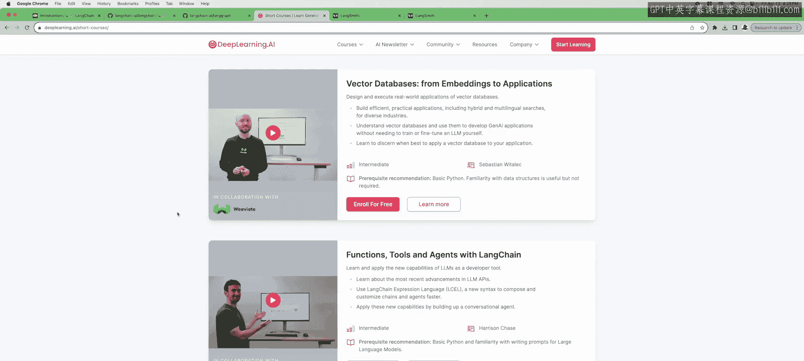

# 008：学习资源 📚

在本节课中，我们将一起了解如何获取更多信息，以继续你在智能体领域的探索之旅。我们已经介绍了许多基础知识，现在来看看有哪些优秀的资源可以帮助你深入学习。

## LangChain生态系统概览

上一节我们介绍了LangGraph的基础概念，本节中我们来看看整个LangChain生态系统的资源分布。LangChain文档是一个极佳的起点。

该文档提供了LangChain生态系统中所有包和服务的高层次概述。以下是其核心组成部分：

*   **LangChain核心包**：包含构建链、智能体和检索系统的基础模块。
*   **LangChain社区包**：包含由社区贡献的集成，例如我们课程中使用的Tavily搜索工具。
*   **合作伙伴包**：如`langchain-openai`，是与特定供应商深度集成的独立包。文档中列出了大量其他集成可供探索。

## LangChain高阶工具与平台

了解了生态结构后，我们来看看能加速开发的具体工具。LangChain本身提供了构建智能体、链和各种检索策略的高阶入口。

如果你希望快速开始，LangChain还提供了大量模板，可以通过LangServe轻松部署。**LangServe**是一个将你的LangChain应用转化为Web服务器的简便方式。

在整个开发过程中，**LangSmith**可以提供有力支持。从项目初期开始，LangSmith就能协助调试。它还能用于生产环境监控，并且包含我们之前见过的Playground功能。

## 代码库与模板资源

除了官方文档和平台，代码库是获取实战资源的好地方。LangChain的GitHub仓库包含了许多优质资源。

以下是该仓库中的主要资源类型：

*   **实用指南**：包含大量入门教程和示例代码。
*   **项目模板**：提供多种可直接使用的项目模板。

当然，**LangGraph的GitHub仓库**包含了关于LangGraph的深入文档，涵盖了我们课程所讲的所有内容。这里有优秀的参考文档、教程和分步指南。

## 扩展学习课程

我们已经介绍了静态资源，动态的学习课程也是很好的补充。DeepLearning.AI此前开设的LangChain相关课程也值得高度推荐。

特别是《**LangChain中的函数、工具与智能体**》这门课，它是本课程非常好的先导学习材料。

## 提示词灵感库

最后，我们来回顾一个能激发创造力的资源。我们之前已经见过Prompt Hub，这里再次强调。

Prompt Hub是一个获取灵感的绝佳场所，你可以看到其他提示词专家正在做什么。

---

本节课中我们一起学习了继续探索LangGraph和智能体开发的各种资源路径，包括官方文档、开发工具、代码库、扩展课程以及灵感社区。利用这些资源，你可以更深入地理解和构建复杂的智能体应用。