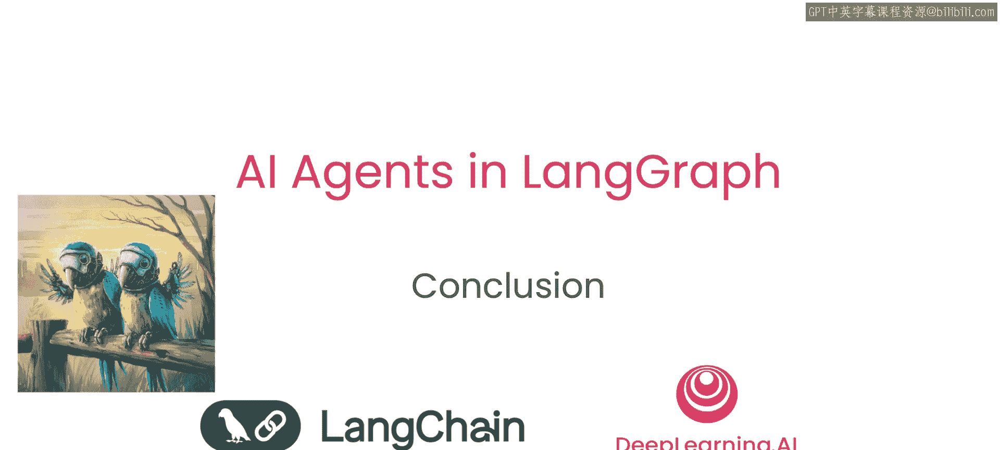
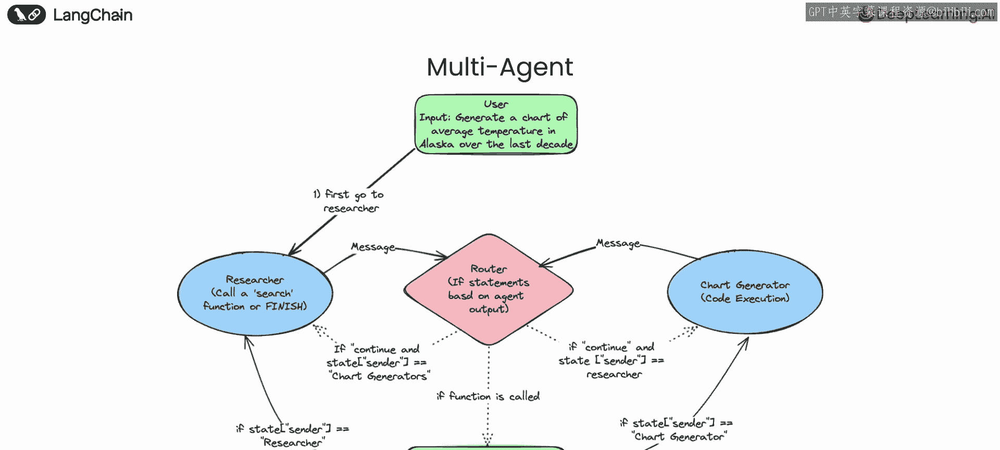
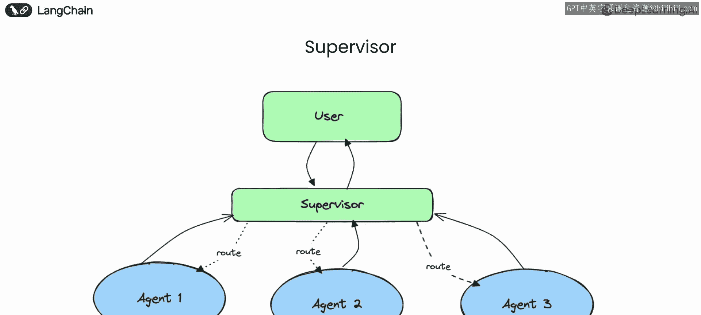
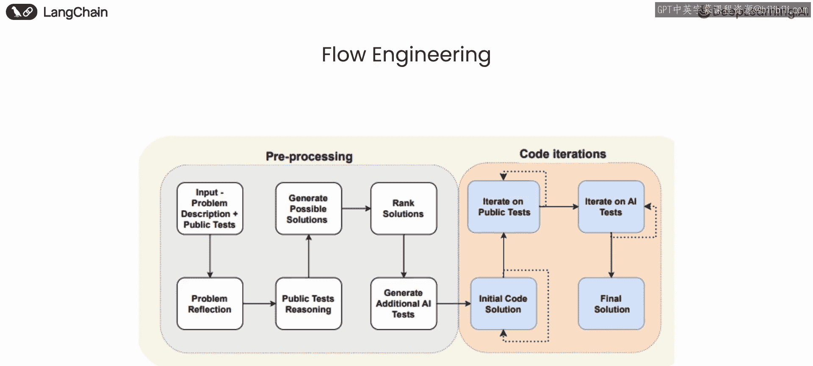
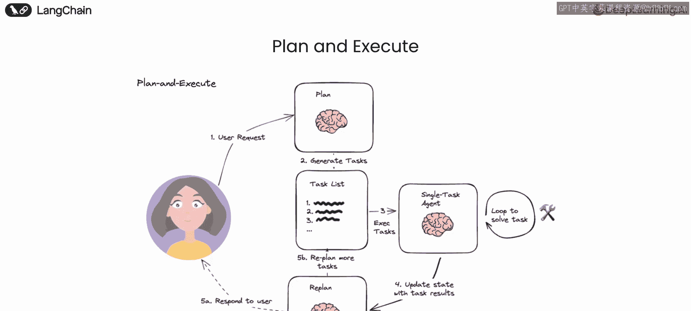
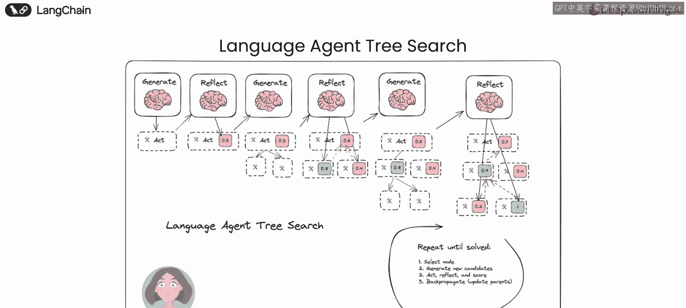

# 009：总结与展望

在本节课中，我们将总结整个课程的核心内容，并展望几种更复杂的智能体架构范式。这些架构展示了如何超越基础的循环结构，构建更强大、更灵活的智能体系统。

恭喜你，现在你已经掌握了如何构建自己的智能体。

基于今天所学的知识，你可以构建简单或相当复杂的智能体。但在结束之前，我想介绍一些我们今天未能构建，但你应该了解的智能体流程架构。

## 多智能体架构

上一节我们介绍了基础的智能体循环，本节中我们来看看更复杂的协作模式。第一种架构是多智能体架构。

我们在写作智能体的例子中对此略有涉及，但这里将使其更具体。多智能体架构是指多个不同的智能体在同一个共享状态上工作。

以下是其关键特征：
*   这些智能体可以像写作智能体中的那样，仅由一个提示词和一个语言模型构成。
*   它们也可以拥有不同的、可供调用的工具。即，一个智能体可以是“提示词 + 语言模型 + 工具”的组合。
*   每个智能体内部实际上可以拥有自己的循环。

这里的核心要点，以及它与我们将要看到的下一种架构的区别在于，所有智能体都在同一个共享状态上工作，它们将这个状态从一个智能体传递到下一个智能体。

## 监督者智能体架构

让我们将其与监督者智能体架构进行对比。这里我们有一个监督者，它负责调用若干个子智能体。

监督者将决定传递给这些子智能体的输入是什么。而这些子智能体内部可以拥有各自不同的状态，它们本身可以是一个图。

因此，这里不一定存在“共享状态”的概念。除此之外，它与多智能体框架非常相似，但它特别强调存在一个负责路由和协调其他智能体的监督者。

当你能够使用一个非常强大的语言模型作为监督者时，这种架构通常很有效，因为执行这种监督和规划工作需要很高的智能。

## 流程工程

最近频繁出现的一个术语是“流程工程”。

这个概念源自一篇Alpha Codium论文，他们在其中实现了最先进的编码性能，并且采用了一种类似这样的、非常图形化的解决方案。观察这个架构，你可以看到它基本上是一个流水线，但在几个关键节点上实际上存在循环。

例如，在初始代码解决方案处有循环，在迭代公共测试时有循环，在迭代AI测试时也有循环。这是一个有趣的图结构，因为在到达某个点之前，信息流是非常定向的，然后在这些点处进行迭代。

这是一个为特定编码问题量身定制的架构，但“流程工程”的概念具有更广泛的适用性。它通常指的是为你的智能体思考和行动设计恰当的信息流。

## 规划与执行流程

顺着这个思路，一个常见的范式是采用“规划与执行”风格的流程。

首先，你在前期执行一个明确的规划步骤，然后开始执行该计划。

其流程可能如下：
1.  规划：为一个子智能体制定几个需要执行的步骤。
2.  执行：子智能体执行第一步，然后返回结果。
3.  评估与调整：你可能根据结果更新计划，也可能不更新。这里存在一些不同的变体。
4.  迭代：然后它继续执行下一步，完成后返回，直到完成整个计划。
5.  最终检查：你可能会检查计划是否成功完成，或者是否需要重新规划。

如果一切顺利，最终将结果返回给用户。

## 树搜索架构

最后我想提及的是一篇非常有趣的论文，名为《Lagu Agent Tese》。

它基本上是在可能的行动状态空间上进行树搜索。

其流程如下：
1.  生成一个行动。
2.  对该行动进行反思。
3.  基于该行动向下探索，生成一些其他子行动。
4.  对这些子行动进行反思。
5.  在所有这些反思过程中，它可以基本上决定想要跳回到行动状态树中的哪个位置。

因此，它可以反向传播并更新父节点，以携带更多信息，这可能会从先前的状态为未来的方向提供参考。对于这种架构，你可以真正理解为什么状态持久化非常重要，因为你需要能够回溯到之前的状态。

## 总结

本节课中我们一起学习了多种构建复杂智能体流程的新兴范式。以上只是一些用于创建更复杂智能体流程的新兴范式示例。

LangGraph的目标是高度可控，并允许你创建这些循环或非循环的流程。这种程度的可控性正是它与其他框架的区别所在。我们认为这对于创建真正有效的智能体至关重要，因此我们对它的未来发展感到非常兴奋。

😊

