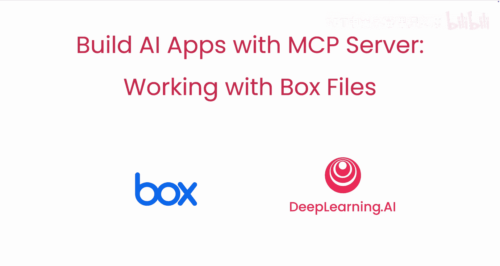
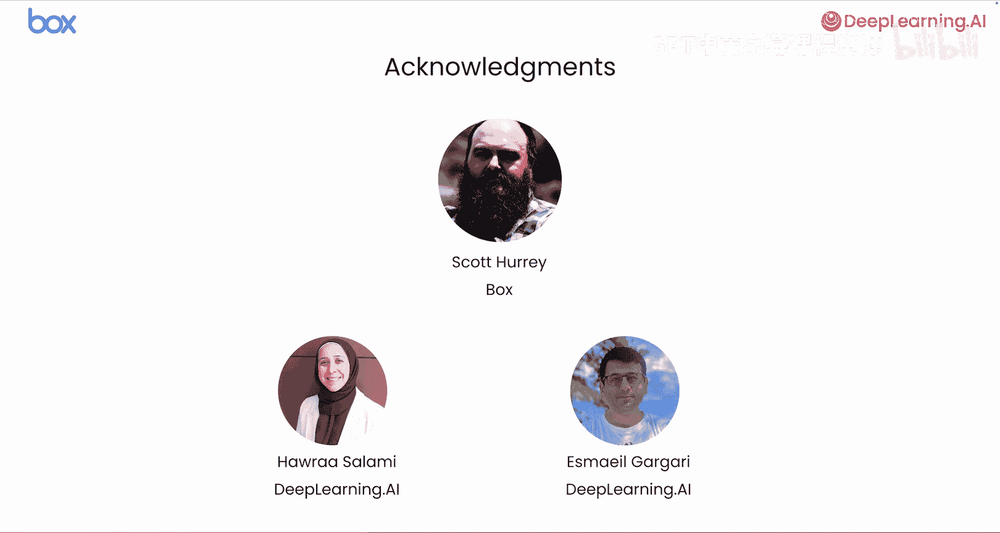

# 001：1.引言 🧠

在本节课中，我们将学习如何使用模型上下文协议（MCP）服务器来构建AI应用。我们将以处理存储在Box中的非结构化PDF发票为例，演示如何提取关键信息（如客户名称、发票金额和产品名称）并存入数据库。本课程是与Box合作开发的，旨在展示使用MCP服务器的最佳实践。

## 课程概述

我们将从构建一个自定义解决方案开始，手动读取本地存储的发票并提取文本。然后，我们将利用Box MCP服务器来简化这一流程。最后，我们会将应用扩展为一个多智能体系统，其中每个智能体都可以使用MCP服务器来搜索或处理文件。

## 什么是MCP？

MCP，即模型上下文协议，它标准化了向基于大语言模型（LLM）的应用提供上下文的方式。这意味着，你无需在AI应用内部编写与外部系统或数据源交互的自定义集成代码，而是可以将你的应用连接到MCP服务器，从而自动扩展LLM可用的工具集。

例如，Box的MCP服务器提供了一套工具，用于与存储在Box中的文件和文件夹进行交互，包括文件搜索、文本提取、基于AI的查询和数据提取。

## 课程路径

以下是本课程将涵盖的主要步骤：

首先，我们将构建一个自定义解决方案。在这个方案中，你需要手动读取每张本地存储的发票，提取文本，然后将文本传递给应用中的LLM，以从每张发票中提取客户名称、总金额和产品名称。

接下来，我们将通过使用Box MCP服务器来优化流程。该服务器提供了与发票交互和处理所需的所有工具，从而简化了代码。

随着为应用添加更多功能，逻辑可能会变得更加复杂。因此，下一步是将你的应用转变为一个多智能体系统。这个系统由多个专门的智能体组成，每个智能体都可以使用MCP服务器来搜索或处理文件。

例如，一个智能体可以返回文件夹内的文件列表，另一个智能体可以从给定文档中提取数据，或许第三个智能体可以根据发票内容生成最终报告。在本课程中，我们假设这些智能体是独立运行的，甚至可能由其他团队开发。因此，我们将使用谷歌开发的智能体间通信协议（A2A）让它们彼此通信。

## 致谢

本课程的创建离不开许多人的努力。特别感谢来自Box的Scott Hurrey，以及来自DeepLearning.AI的Har Salami和Eshma Gagari对本课程的贡献。

## 总结

本节课我们一起介绍了MCP协议的基本概念、本课程的学习目标以及我们将要遵循的实践路径。我们了解到，MCP可以简化AI应用与外部数据的集成，而多智能体架构则能帮助我们管理复杂应用的逻辑。

在下一课中，我们将开始动手实践，首先实现一个不使用Box MCP服务器的AI应用版本，这需要我们为每种文件类型编写自定义代码。