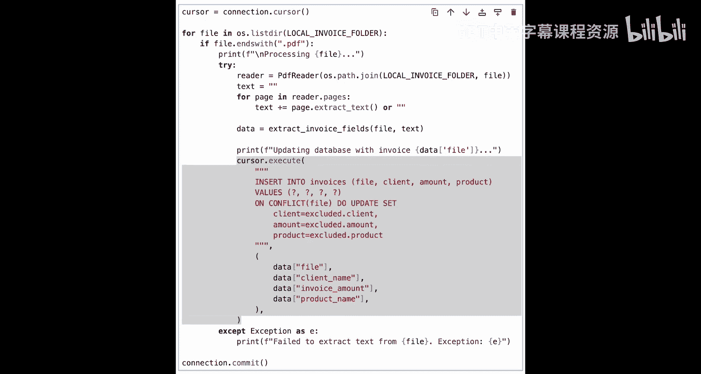
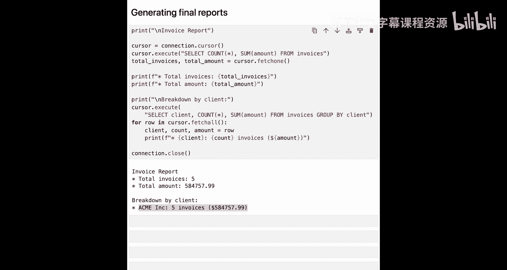

# 002：构建简单的发票处理应用 💡


在本节课中，我们将学习如何手动处理本地的 PDF 发票文件，提取其文本内容，并使用 Gemini 模型从中提取关键字段信息。

---


## 概述

我们将构建一个简单的发票处理应用。整个过程分为几个步骤：首先从本地 PDF 文件中提取文本，然后利用 Gemini 大语言模型从文本中解析出结构化的数据（如客户名称、发票金额、产品名称），最后将这些数据存储到本地 SQLite 数据库中并生成汇总报告。


---

## 导入所需库

首先，我们需要导入本教程中要用到的所有库。

```python
import sqlite3
import os
from google import genai
from pypdf import PdfReader
from dotenv import load_dotenv
```

以下是每个库的作用：
*   **`sqlite3`**：用于在本地 SQLite 数据库中存储处理后的信息。
*   **`genai`**：Google 的 Gemini 模型客户端库，在本例中作为我们的大语言模型。
*   **`PdfReader`**：用于从 PDF 发票中提取文本。
*   **`dotenv`**：用于从 `.env` 文件加载环境变量到当前会话，以便后续访问。

接下来，我们加载环境变量。

```python
load_dotenv()
```

---

## 定义变量与模型

上一节我们导入了必要的库，本节中我们来看看需要定义哪些关键变量。

首先，我选择使用 **`gemini-2.0-flash`** 模型。这是一个快速且经济实惠的模型，非常适合我们的示例。

```python
MODEL_NAME = “gemini-2.0-flash”
INVOICE_FOLDER = “./invoices”
```

同时，我们从环境变量中加载 Gemini 的 API 密钥。

```python
GEMINI_API_KEY = os.getenv(“GEMINI_API_KEY”)
```

---

## 创建 JSON 解析工具函数

有时 Gemini 的响应是 Markdown 格式的 JSON，有时则是原始 JSON。这个辅助函数 `parse_json` 可以确保无论 Gemini 返回何种格式，我们都能提取出干净的 JSON 数据。

```python
import json
import re

def parse_json(response_text):
    “””
    从模型响应中提取并解析 JSON。
    处理可能包裹在 Markdown 代码块中的 JSON。
    “””
    try:
        # 尝试直接解析
        return json.loads(response_text)
    except json.JSONDecodeError:
        # 如果失败，尝试查找并提取代码块中的 JSON
        match = re.search(r’```(?:json)?\s*({.*?})\s*`’‘, response_text, re.DOTALL)
        if match:
            try:
                return json.loads(match.group(1))
            except json.JSONDecodeError:
                pass
        # 如果都失败，返回空字典或抛出异常
        return {}
```

**注意**：作为替代方案，你也可以使用 Pydantic 来定义期望的输出结构，并指示 Gemini 相应地格式化响应。为了保持与下一课代码示例的一致性（下一课同样需要处理模型的工具调用输出），我们在两个示例中都使用了相同的 `parse_json` 函数。

---

## 核心函数：提取发票字段

现在，让我们看看与 Gemini 通信的核心函数。我称这个函数为 `extract_invoice_fields`。

它接收发票文本，将其发送给 Gemini，并要求返回相关的关键字段。

```python
def extract_invoice_fields(invoice_text, filename):
    “””
    使用 Gemini 从发票文本中提取关键字段。
    “””
    # 1. 设置 Gemini 客户端
    client = genai.Client(api_key=GEMINI_API_KEY)

    # 2. 定义提示词
    prompt = f“””
    请从以下发票文本中提取以下字段，并以 JSON 对象形式返回。
    如果找不到某个值，请返回 “null”。

    字段：
    - client_name (客户名称)
    - invoice_amount (发票金额，数字类型)
    - product_name (产品名称)

    发票文本：
    “{invoice_text}”
    “””

    # 3. 调用模型
    response = client.models.generate_content(
        model=MODEL_NAME,
        contents=prompt
    )

    # 4. 解析响应为 JSON
    extracted_data = parse_json(response.text)

    # 5. 添加文件名字段，以便知道数据属于哪张发票
    extracted_data[‘source_file’] = filename

    return extracted_data
```

这个函数的逻辑很清晰：
1.  使用 API 密钥设置 Gemini 客户端。
2.  定义一个直接的提示词，要求 Gemini 从发票文本中提取客户名称、发票金额和产品名称，并以 JSON 对象形式返回信息。
3.  使用 `generate_content` 函数调用模型。
4.  使用之前定义的 `parse_json` 函数将响应解析为 JSON。
5.  最后，添加一个 `source_file` 字段，标明数据来源的文件名。

---

## 准备数据存储

我们已经有了提取数据的函数，接下来需要将数据保存起来。为了简单起见，我将创建一个本地数据库。

我选择使用 **SQLite**。它轻量、快速，且无需任何额外设置。

以下代码创建数据库文件和一个用于存储发票数据的表（如果表不存在的话）。

```python
# 连接到（或创建）SQLite 数据库文件
conn = sqlite3.connect(‘invoices.db’)
cursor = conn.cursor()

# 创建表（如果不存在）
create_table_query = “””
CREATE TABLE IF NOT EXISTS invoices (
    id INTEGER PRIMARY KEY AUTOINCREMENT,
    source_file TEXT UNIQUE,
    client_name TEXT,
    invoice_amount REAL,
    product_name TEXT
);
“””
cursor.execute(create_table_query)
conn.commit()
```

---

## 处理发票文件夹

一切准备就绪，现在开始处理文件夹中的每一张发票。

以下是处理流程：

```python
# 遍历发票文件夹中的每个文件
for filename in os.listdir(INVOICE_FOLDER):
    # 1. 验证文件格式（目前仅支持 PDF）
    if not filename.lower().endswith(‘.pdf’):
        continue

    filepath = os.path.join(INVOICE_FOLDER, filename)
    print(f”正在处理: {filename}“)

    # 2. 从 PDF 提取文本
    full_text = “”
    try:
        reader = PdfReader(filepath)
        for page in reader.pages:
            full_text += page.extract_text() + “\n”
    except Exception as e:
        print(f”读取文件 {filename} 时出错: {e}“)
        continue

    # 3. 调用函数，使用 Gemini 提取结构化数据
    extracted_data = extract_invoice_fields(full_text, filename)

    # 4. 将数据插入数据库
    # 如果发票已处理过，则更新现有条目；否则创建新条目。
    insert_or_update_query = “””
    INSERT OR REPLACE INTO invoices (source_file, client_name, invoice_amount, product_name)
    VALUES (?, ?, ?, ?)
    “””
    cursor.execute(insert_or_update_query,
                   (extracted_data.get(‘source_file’),
                    extracted_data.get(‘client_name’),
                    extracted_data.get(‘invoice_amount’),
                    extracted_data.get(‘product_name’)))
    conn.commit()

# 关闭数据库连接
conn.close()
```

我们对文件夹中的每张发票都执行上述操作。

---

## 生成报告

处理完所有发票后，数据都已存储。现在我们可以生成两份报告。

第一份报告显示发票的总数以及所有发票的总金额。



```python
conn = sqlite3.connect(‘invoices.db’)
cursor = conn.cursor()

# 报告1：总计
cursor.execute(“SELECT COUNT(*), SUM(invoice_amount) FROM invoices WHERE invoice_amount IS NOT NULL”)
total_count, total_amount = cursor.fetchone()
print(“=== 发票汇总报告 ==”)
print(f”发票总数: {total_count}“)
print(f”总金额: ${total_amount or 0:.2f}“)
print()
```

第二份报告按客户对发票进行分类，并显示从每个客户产生的收入。

```python
# 报告2：按客户细分
print(“=== 按客户细分 ==”)
cursor.execute(“””
    SELECT client_name,
           COUNT(*) as invoice_count,
           SUM(invoice_amount) as total_revenue
    FROM invoices
    WHERE client_name IS NOT NULL AND invoice_amount IS NOT NULL
    GROUP BY client_name
    ORDER BY total_revenue DESC
“””)
for row in cursor.fetchall():
    client, count, revenue = row
    print(f”客户 ‘{client}‘: {count} 张发票，总收入 ${revenue or 0:.2f}“)

conn.close()
```

运行结果示例如下：
> === 发票汇总报告 ===
> 发票总数: 5
> 总金额: $58475.99
>
> === 按客户细分 ===
> 客户 ‘Acme Corp’: 2 张发票，总收入 $25000.00
> 客户 ‘Beta LLC’: 1 张发票，总收入 $15000.00
> 客户 ‘Gamma Inc’: 1 张发票，总收入 $9999.99
> 客户 ‘Delta Co’: 1 张发票，总收入 $8476.00

我们可以看到，总共有5张发票，总金额为58475.99美元。按客户细分的报告也反映了相同的信息。

---

## 总结

本节课中，我们一起学习并构建了一个简单的发票处理流程。我们通过 `PdfReader` 提取本地 PDF 文件的文本，利用 Gemini 大语言模型从文本中解析出关键字段，并将这些结构化数据存储到 SQLite 数据库中，最后生成了汇总和细分报告。

在下一节课中，你将学习如何通过使用 Box 的 MCP 服务器来解决同类用例，而不是直接使用 Gemini 并受限于本地文件系统。这将使你的应用能够处理云端存储的文件。



我们下节课再见。