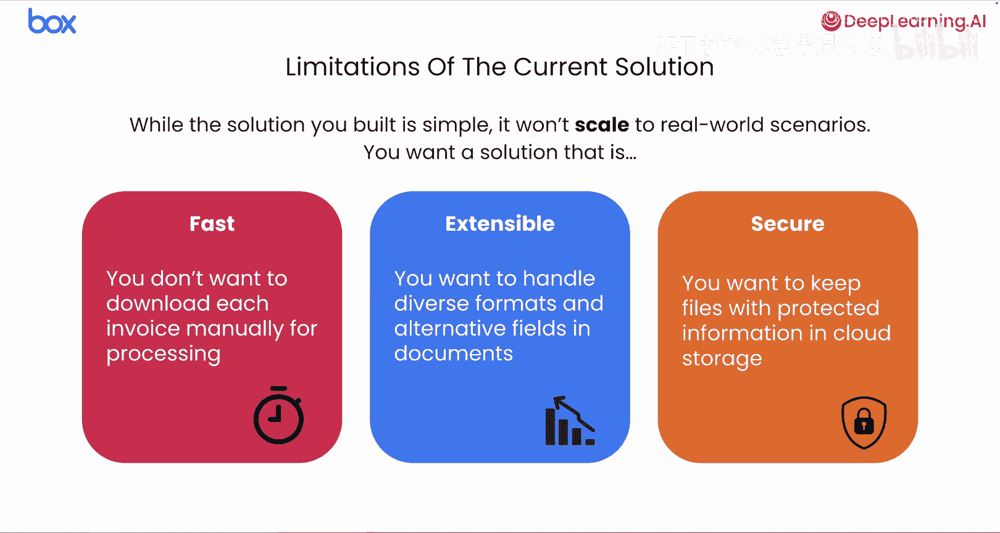
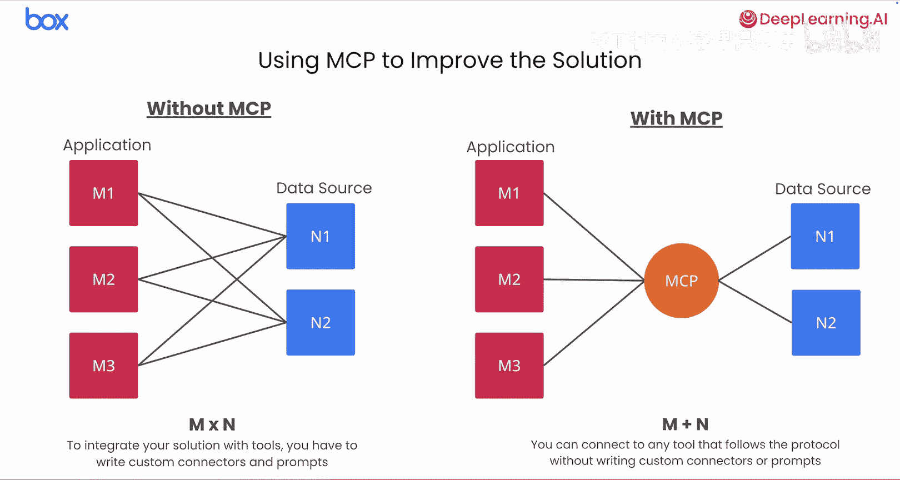
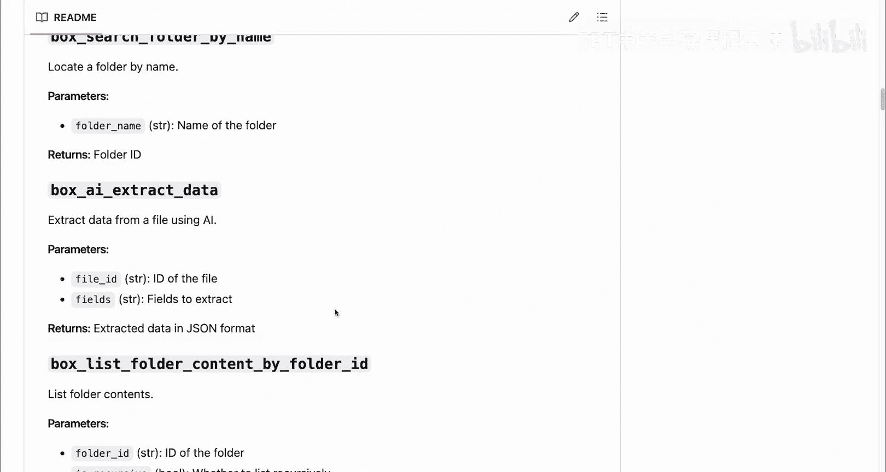

# 003：3. Box MCP 服务器简介 🧩

在本节课中，我们将学习如何利用 Box MCP 服务器，使你的解决方案变得更加灵活和可扩展。

## 概述

上一节我们实现了一个概念验证方案。本节中，我们将探讨该方案在实际业务环境中可能遇到的问题，并介绍如何通过模型上下文协议（MCP）和 Box MCP 服务器来解决这些问题，从而构建一个更强大、更通用的解决方案。

## 现有方案的局限性

你之前实现的解决方案作为概念验证是可行的。但如果尝试在真实的业务环境中使用，会遇到一些问题。

核心问题是自定义构建的解决方案难以扩展。

以下是具体原因：

*   **性能与扩展性问题**：在上一课中，文件需要预先下载到本地。但在处理前下载 Box 上的每一张发票速度极慢，无法扩展到处理成千上万的文件。
*   **格式兼容性问题**：你构建的脚本是为了处理特定的发票格式。现实中，发票有各种类型，如 Word 文档、PDF、JPEG、PNG 等。你当前的代码需要大量更新才能处理这种多样性。
*   **维护成本高**：一旦业务需要提取额外的字段，你就需要重新审视并更新代码。这使得解决方案难以维护。
*   **安全与最佳实践**：像这样处理文件需要审查最佳实践和数据安全性，因为存储的文件通常包含敏感数据，这会使此类解决方案变得复杂。

综上所述，这使得该方案超出了简单概念验证的范围，变得不切实际。为了让你的解决方案能够在整个企业内无缝处理各种文件类型，你需要对其进行增强。

## 引入模型上下文协议（MCP）

这正是模型上下文协议（MCP）的用武之地。MCP 将帮助你简化应用程序的复杂性，使其更加灵活和可扩展。

MCP 是一个标准，定义了如何向 AI 应用程序提供外部工具和数据资源的上下文。

目前，你的解决方案是使用 Gemini 自定义构建的。你必须编写一次性的自定义应用程序来处理发票。为了扩展功能并访问其他工具或数据源，你需要编写更多的自定义代码。这被称为 **M × N 问题**：对于 M 个应用程序和 N 个外部数据源或系统，你需要编写 M × N 次集成，这很快就会变得难以管理。

通过添加对 MCP 的支持，你的应用程序可以访问任何同样遵循 MCP 标准的外部工具。

以下是其工作原理：工具的定义和执行被卸载到一个 MCP 服务器。这意味着在你的 AI 应用程序内部，你不再需要编写自定义代码来将模型连接到外部系统。相反，你可以在应用程序中使用一个 MCP 客户端，该客户端连接到 MCP 服务器并发送工具调用请求。同一个服务器可以被任何其他 AI 应用程序使用。这将一切简化为一个更易于管理的 **M + N** 设置。

通过使用 MCP，你可以解决我们之前发现的许多扩展性和灵活性问题。

## 回到我们的用例：Box MCP 服务器

回到我们的用例。让我们看一个具体的、实用的实现，它将帮助我们使用 MCP 服务器（如 Box MCP 服务器）来改进解决方案。

我们可以将所需的集成工作外包给几乎任何 AI 智能体框架。在这些示例中，我们将使用 Box MCP 服务器，尽管这种方法几乎可以用于任何 MCP 服务器以及其他类似的用例。这正是 MCP 的根本力量。

我们将为此目的使用 Box 提供的本地 MCP 服务器。本质上，它是一个现成的解决方案，处理与 Box 平台的所有复杂交互，包括数据提取 API（这是 Box AI API 中最受欢迎的部分之一）。不同的供应商会提供不同的 MCP 服务器，其中一些你可以本地或云端访问。

以下是 Box MCP 服务器提供的一些功能：

*   **直接内容访问**：它允许 AI 应用程序直接访问、理解并对 Box 中的内容进行操作。主要的应用程序不再需要下载和处理文件，它可以直接要求服务器对内容执行操作。
*   **高效处理能力**：服务器从一开始就设计用于处理大量文档。它可以非常高效地执行对文件和文件夹的操作。这解决了之前提到的速度和扩展性问题。
*   **内置工具集**：它附带了一系列功能，包括搜索、使用 AI 查询数据以及从文档中提取字段。你无需担心 OCR 代码或为特定字段提示模型，因为这些现在都是你可以调用的预构建函数。
*   **安全性**：由于所有操作都在 Box 平台内进行，你可以对文件和整个 AI 生态系统进行安全控制。

这里是 GitHub 仓库，你可以找到用于本地运行 Box MCP 服务器的文件。

你可以在这里看到 Box MCP 服务器提供的所有工具列表，它集成了 Box API 来执行各种操作，例如文件搜索、文本提取、基于 AI 的查询和数据提取。

## 总结

本节课中，我们一起学习了现有自定义解决方案的局限性，并引入了模型上下文协议（MCP）作为解决扩展性和灵活性问题的标准方法。我们重点介绍了 Box MCP 服务器，它作为一个现成的 MCP 实现，能够高效、安全地处理 Box 平台上的文件操作，并提供了丰富的内置工具。下一节课，我们将使用 Box MCP 服务器来重写解决方案，以替代自定义的 API 代码。