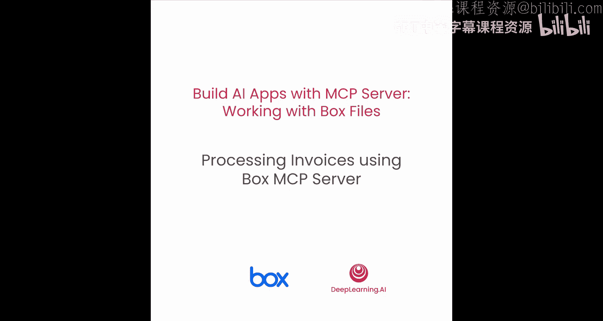
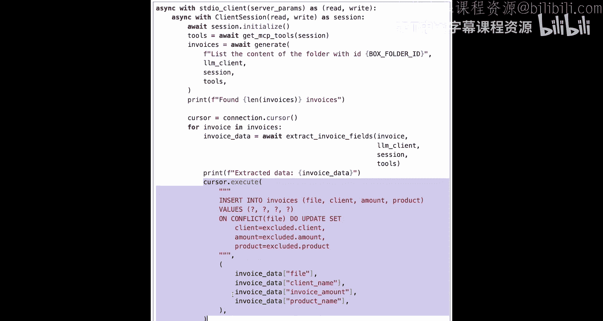
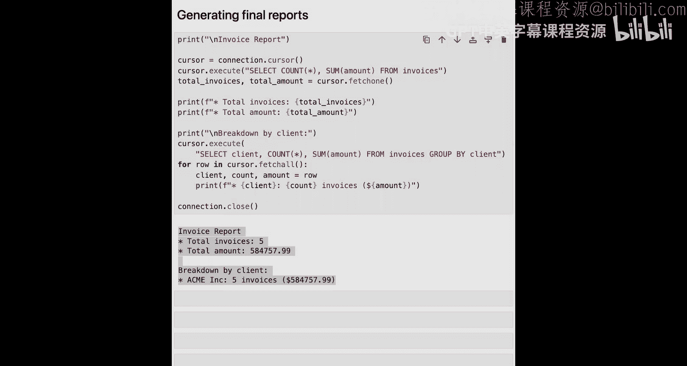

# 004：使用 Box MCP 服务器处理发票 📄



在本节课中，我们将学习如何使用 Box 的 MCP 服务器来处理发票。我们将构建一个应用程序，该程序能够连接到 Box 云存储，列出其中的发票文件，并利用 AI 工具自动提取关键信息，最后将结果存入数据库并生成报告。

## 概述

我们将通过以下步骤完成发票处理任务：
1.  设置环境并加载必要的库。
2.  配置并连接到本地的 Box MCP 服务器。
3.  发现并使用 MCP 服务器提供的工具。
4.  编写核心函数来列出文件并提取数据。
5.  将所有功能整合到一个主循环中，完成从数据提取到报告生成的完整流程。

现在，让我们开始第一步。

## 加载库与配置环境

首先，我们需要加载必要的库并配置环境变量。

```python
import os
from dotenv import load_dotenv
# 导入 MCP Python SDK 相关模块
from mcp import ClientSession, StdioServerParameters
from mcp.client.stdio import stdio_client

# 加载环境变量
load_dotenv()
```

我们导入了 `dotenv` 来管理环境变量，以及 MCP SDK 中的关键组件：`ClientSession` 用于初始化客户端与服务器的会话，`StdioServerParameters` 用于定义服务器参数，`stdio_client` 则允许我们通过标准输入/输出流来生成和连接到本地 MCP 服务器。

接下来，我们定义一些变量。

```python
# 定义模型和路径
MODEL_NAME = “models/gemini-2.0-flash”
MCP_SERVER_PATH = “./mcp-server-box”  # Box MCP 服务器的本地路径

# 定义我们将要使用的工具名称
TOOLS_TO_USE = [“list_folder_contents”, “ai_extract_freeform”]


# 从环境变量加载敏感信息
GEMINI_API_KEY = os.getenv(“GEMINI_API_KEY”)
BOX_FOLDER_ID = os.getenv(“BOX_FOLDER_ID”)  # 包含发票的 Box 文件夹 ID
```

这里，我们指定了使用的 AI 模型（Gemini 2.0 Flash）、本地 MCP 服务器的路径、计划使用的两个工具名称，并从 `.env` 文件加载了 Gemini API 密钥和 Box 文件夹 ID。

## 配置 MCP 服务器连接

配置好基础变量后，我们需要创建 Gemini 客户端并设置 MCP 服务器的访问方式。

```python
import google.generativeai as genai

# 创建 Gemini 客户端
genai.configure(api_key=GEMINI_API_KEY)
model = genai.GenerativeModel(MODEL_NAME)

# 定义 MCP 服务器的标准输入/输出配置
server_params = StdioServerParameters(
    command=“uv”,
    args=[“run”, “–directory”, MCP_SERVER_PATH, “mcp-server-box”]
)
```

我们使用 Gemini API 密钥配置了客户端，并定义了 `StdioServerParameters`。这个配置指定了运行本地 MCP 服务器的命令（这里使用 `uv` 工具）和参数，指向了服务器文件所在的目录。

## 定义辅助函数

在构建完整解决方案之前，我们先定义几个辅助函数。上一节我们配置了环境，本节中我们来看看如何与 MCP 服务器交互并处理数据。

首先，定义一个函数来发现 MCP 服务器提供的工具。

```python
async def get_mcp_tools(session):
    “””
    向 MCP 服务器发送请求，获取可用工具列表，并过滤出我们需要的工具定义。
    “””
    # 发送 list_tools 请求
    response = await session.list_tools()
    available_tools = response.tools

    # 过滤出我们需要的工具
    filtered_tools = [
        tool for tool in available_tools
        if tool.name in TOOLS_TO_USE
    ]
    return filtered_tools
```

这个函数在应用程序连接到 MCP 服务器后被调用。它向服务器请求可用工具列表，然后根据 `TOOLS_TO_USE` 列表进行过滤，只返回我们需要的工具定义（包括名称和期望的参数）。这些定义之后会被传递给 Gemini，让模型知道它可以调用哪些工具以及如何调用。

接着，我们定义一个解析 JSON 的辅助函数来清理 Gemini 的响应。

```python
import json

def parse_json_response(response_text):
    “””
    尝试从响应文本中解析 JSON 数据。
    “””
    try:
        # 尝试查找 JSON 代码块
        start = response_text.find(‘{‘)
        end = response_text.rfind(‘}’) + 1
        if start != -1 and end != 0:
            json_str = response_text[start:end]
            return json.loads(json_str)
        else:
            return None
    except json.JSONDecodeError:
        return None
```

现在，我们定义核心的 `generate` 函数，它负责处理用户查询并管理工具调用。

```python
async def generate(prompt, tools_definitions, session):
    “””
    向 Gemini 发送提示词和工具定义，并处理可能的工具调用。
    “””
    # 准备聊天会话并发送消息
    chat = model.start_chat()
    response = await chat.send_message_async(
        prompt,
        tools=tools_definitions  # 传入工具定义
    )

    # 检查响应中是否包含工具调用
    if response.candidates[0].content.parts[0].function_call:
        fc = response.candidates[0].content.parts[0].function_call
        tool_name = fc.name
        tool_args = fc.args

        # 通过 MCP 客户端调用工具
        tool_response = await session.call_tool(tool_name, tool_args)

        # 解析并返回工具执行结果
        result_text = tool_response.content[0].text
        parsed_result = parse_json_response(result_text)
        return parsed_result if parsed_result else result_text
    else:
        # 如果没有工具调用，直接返回文本
        return response.text
```

这个函数接收用户提示词和工具定义。它将提示词和工具定义一起发送给 Gemini。如果 Gemini 决定调用工具，其响应中会包含函数调用信息。此时，函数会通过 MCP 会话 (`session`) 向 MCP 服务器发送 `call_tool` 请求，并传入工具名称和参数。服务器执行工具后返回结果，我们再将其解析返回。如果 Gemini 没有调用工具，则直接返回生成的文本。

最后，定义一个专门用于从发票中提取字段的函数。

```python
async def extract_invoice_fields(file_id, session, tools_definitions):
    “””
    请求 AI 从指定的 Box 文件（通过 file_id）中提取客户名、发票金额和产品名。
    “””
    prompt = f”””Extract the following fields from the invoice file with ID ‘{file_id}’:
    - Client Name
    - Invoice Amount
    - Product Name
    Return the result as a JSON object.”””

    extracted_data = await generate(prompt, tools_definitions, session)
    return extracted_data
```

这个函数构造一个明确的提示词，要求 Gemini 从给定文件 ID 的发票中提取三个特定字段。它调用我们刚才定义的 `generate` 函数来完成实际工作。

**请注意一个关键点**：在 `generate` 函数内部，Gemini 可能会决定调用 Box MCP 服务器提供的 `ai_extract_freeform` 工具。这意味着文件处理和字段提取是在 Box 服务器端完成的，我们的应用程序无需在本地下载 PDF 文件或进行 OCR 转换。这得益于 MCP 架构，让我们能够直接使用服务提供商（Box）提供的强大功能。

## 构建完整解决方案

有了以上辅助函数，我们现在可以将它们组合到主程序循环中。上一节我们定义了处理单张发票的函数，本节中我们来看看如何批量处理文件夹中的所有发票并生成报告。

首先，建立数据库连接并创建表。

```python
import sqlite3

# 连接到 SQLite 数据库（如果不存在则创建）
conn = sqlite3.connect(‘invoices.db’)
cursor = conn.cursor()

# 创建 invoices 表（如果不存在）
cursor.execute(‘’‘
    CREATE TABLE IF NOT EXISTS invoices (
        id INTEGER PRIMARY KEY AUTOINCREMENT,
        file_id TEXT,
        client_name TEXT,
        amount REAL,
        product_name TEXT
    )
‘’’)
conn.commit()
```

接下来是主循环代码。

```python
async def main():
    # 1. 创建 MCP 客户端并连接到 Box 服务器
    async with stdio_client(server_params) as (read_stream, write_stream):
        async with ClientSession(read_stream, write_stream) as session:
            # 初始化会话
            await session.initialize()

            # 2. 发现可用的 MCP 工具
            tools_definitions = await get_mcp_tools(session)

            # 3. 列出 Box 文件夹中的内容
            list_prompt = f”List all files in the Box folder with ID ‘{BOX_FOLDER_ID}’.”
            file_list = await generate(list_prompt, tools_definitions, session)

            # 假设 file_list 是一个包含 ‘items’ 列表的字典，每个 item 有 ‘id’ 和 ‘name’
            invoice_files = file_list.get(‘items’, [])

            # 4. 遍历每个发票文件并提取数据
            for file_item in invoice_files:
                file_id = file_item[‘id’]
                print(f”Processing invoice: {file_item[‘name’]} (ID: {file_id})”)

                extracted_data = await extract_invoice_fields(file_id, session, tools_definitions)

                if extracted_data and isinstance(extracted_data, dict):
                    # 5. 将提取的数据插入数据库
                    cursor.execute(‘’‘
                        INSERT INTO invoices (file_id, client_name, amount, product_name)
                        VALUES (?, ?, ?, ?)
                    ‘’’， (file_id,
                           extracted_data.get(‘client_name’),
                           extracted_data.get(‘invoice_amount’),
                           extracted_data.get(‘product_name’)))
                    conn.commit()
                    print(f”  Extracted: {extracted_data}”)
                else:
                    print(f”  Failed to extract data for {file_id}”)

    # 6. 关闭数据库连接
    conn.close()

# 运行主函数
import asyncio
asyncio.run(main())
```

以下是主循环中每一步的详细说明：

1.  **建立 MCP 连接**：使用 `stdio_client` 在后台生成 MCP 服务器进程，并建立客户端会话 (`ClientSession`)。
2.  **发现工具**：调用 `get_mcp_tools` 函数，获取我们需要的两个工具（`list_folder_contents` 和 `ai_extract_freeform`）的正式定义。
3.  **列出文件**：构造提示词让 Gemini 列出指定 Box 文件夹中的所有文件。Gemini 会识别出可用的 `list_folder_contents` 工具并调用它，MCP 服务器执行后返回文件列表。
4.  **遍历并提取**：对于列表中的每一个文件，调用 `extract_invoice_fields` 函数。该函数内部的 `generate` 调用会促使 Gemini 使用 `ai_extract_freeform` 工具在 Box 端处理文件并提取字段。
5.  **存储数据**：将成功提取的字段（客户名、金额、产品名）插入到 SQLite 数据库中。
6.  **清理**：处理完所有文件后，关闭数据库连接。

运行此程序后，你可以在控制台看到类似以下的输出，表明 Gemini 客户端成功调用了 MCP 工具：

```
Processing invoice: invoice_001.pdf (ID: 12345)
  Extracted: {‘client_name’: ‘Acme Corp’， ‘invoice_amount’: 1250.75, ‘product_name’: ‘Web Design Service’}
Processing invoice: invoice_002.pdf (ID: 12346)
  Extracted: {‘client_name’: ‘Globex’， ‘invoice_amount’: 890.00, ‘product_name’: ‘Consulting’}
...
```

## 生成报告

数据存入数据库后，我们可以像往常一样生成报告。



```python
# 重新打开数据库连接（如果已关闭）
conn = sqlite3.connect(‘invoices.db’)
cursor = conn.cursor()

print(“\n=== 发票总览报告 ===”)
# 报告1：汇总所有发票的总金额
cursor.execute(‘SELECT SUM(amount) as total_amount FROM invoices’)
total = cursor.fetchone()[0]
print(f”所有发票总金额: ${total:.2f}”)

print(“\n=== 按客户收入细分 ==”)
# 报告2：按客户分组，显示每个客户带来的收入
cursor.execute(‘’‘
    SELECT client_name, SUM(amount) as revenue
    FROM invoices
    GROUP BY client_name
    ORDER BY revenue DESC
‘’’)
for row in cursor.fetchall():
    print(f”  {row[0]}: ${row[1]:.2f}”)

conn.close()
```

这将生成两份清晰的报告：
1.  所有发票的总金额。
2.  按客户分组的收入明细。

## 总结

在本节课中，我们一起学习了如何使用 Box 的 MCP 服务器构建一个发票处理 AI 应用。我们掌握了以下核心内容：

*   **MCP 服务器连接**：配置并连接到本地运行的 Box MCP 服务器，使用标准输入/输出流进行通信。
*   **工具发现与调用**：通过 MCP 会话发现服务器提供的工具，并将工具定义传递给 Gemini 模型，使模型能够智能地决定何时调用这些工具。
*   **远程文件处理**：利用 Box 提供的 `ai_extract_freeform` 工具，直接在 Box 服务器端处理文档并提取结构化数据，无需在本地下载或转换文件，极大地扩展了应用的能力和可处理文件类型。
*   **完整流程集成**：将从工具调用、AI 推理、数据提取到数据库存储和报告生成的步骤整合到一个流畅的自动化流程中。



通过本次实践，你看到了 MCP 架构如何让 AI 应用轻松集成第三方服务的强大功能。在下一节课中，你将学习如何通过多智能体架构进一步扩展此应用的能力。