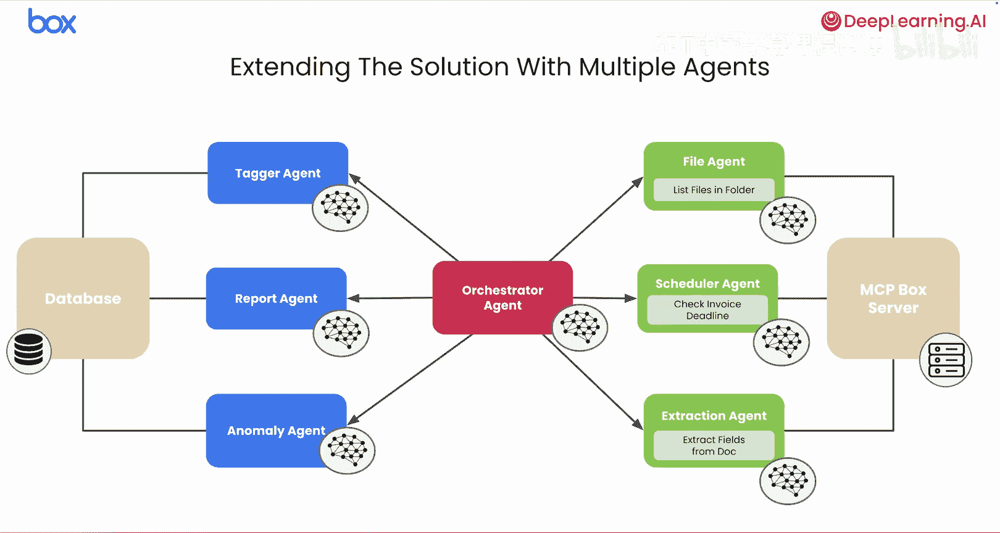
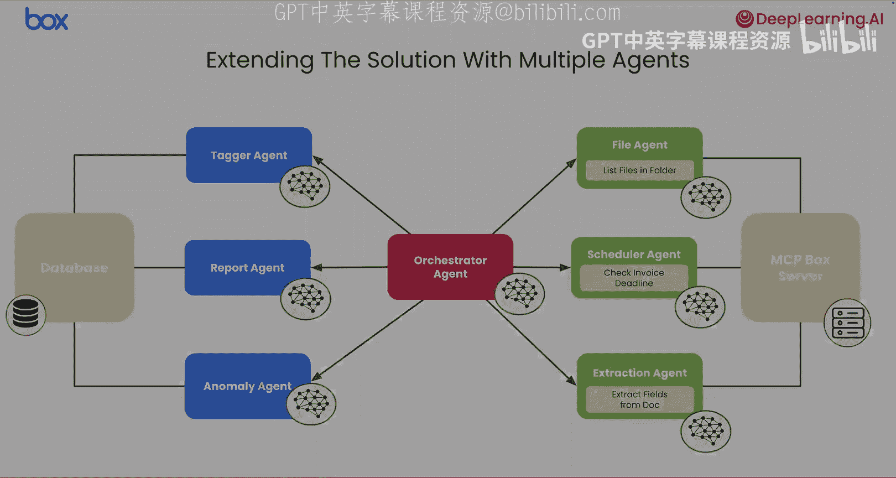

# 005：从单智能体到多智能体架构 🏗️

在本节课中，我们将学习如何通过从单智能体架构过渡到多智能体架构，来扩展应用的能力。我们还将了解独立的智能体如何通过智能体间协议进行通信与协作。

## 概述

上一节我们介绍了基于 MCP 的解决方案。新的基于 MCP 的解决方案比原始方案**显著更灵活、更健壮**。

现在，如果你想扩展解决方案的能力，可以在提取的数据之上开始添加更高级的业务逻辑。

## 扩展应用能力

随着新功能的增加，应用逻辑会迅速变得复杂。为了有效管理这种复杂性，我们需要改进架构方案。一个简单的脚本不足以清晰、可维护地处理所有新逻辑。

一个更高效的架构方法是过渡到**多智能体架构**。

## 多智能体架构的优势

以下是采用多智能体架构的几个主要优势：

*   **易于构建和维护**：每个小型、专门的智能体都更容易构建、测试和维护。
*   **系统更灵活**：由于智能体相互独立，如果找到更好的方法，可以轻松替换其中一个，或者以新方式组合它们来创建不同的解决方案。
*   **独立扩展性**：可以根据工作负载独立扩展每个智能体，而无需触及系统其余部分。
*   **促进团队协作**：这种分离有助于业务更有效地工作，因为可以让不同的团队负责构建和维护每个智能体。

## 智能体间协作：A2A 协议

假设你有一组独立的、专门的智能体，每个都由不同的团队开发和维护，并且你想在你的应用中重用这些智能体。这就引出了一个重要问题：这些智能体如何协同工作？

这种多智能体协作可以通过 **A2A（Agent-to-Agent）协议**实现。

A2A 是一个开放标准，一种通用语言，它允许智能体相互通信、协作和委派任务，无论它们由谁构建或在何处运行。

A2A 协议的目标是创建真正的互操作性。它建立了一种通用语言，使不同的智能体能够有效地相互协作。这至关重要，因为它避免了每个新智能体都需要与生态系统中的其他每个智能体进行自定义集成的局面。

此外，通过该协议，智能体可以发现彼此并了解各自的能力。一个智能体可以询问另一个：“你能做什么？”并获得清晰、标准化的答案。这使得它们能够相互委派任务和请求操作。

最终，A2A 将使我们能够支持复杂的多智能体工作流，以解决任何单个智能体独自工作都无法解决的问题。

## 应用于发票处理应用

让我们回到发票处理应用。你可以将当前的解决方案分解为多个独立的智能体。

让我们从**编排器智能体**开始。它的工作是协调每个智能体的工作。一旦编排器智能体收到请求，它可以生成一个计划，并委托给每个可用的智能体来寻找解决方案。

以下是可能涉及的智能体及其职责：

*   **文件智能体**：返回文件夹内的文件列表。
*   **提取智能体**：从任何给定文档中提取结构化数据。
*   **报告智能体**：根据发票内容生成最终报告。
*   **标记智能体**：负责对金额超过 1000 美元的发票应用标记。
*   **调度器智能体**：如果客户发票逾期，发送提醒。
*   **异常检测智能体**：运行异常检测模型，识别与客户典型付款历史相比异常延迟的发票。

每个智能体都将有明确、单一的职责，并使用 A2A 协议协同工作、委派任务，从而创建一个更强大、更灵活的应用。

## 总结

本节课中，我们一起学习了如何通过采用多智能体架构来提升应用的扩展性和可维护性。我们了解到，将复杂任务分解为多个专门的智能体，并通过 **A2A 协议**实现它们之间的通信与协作，可以构建出更强大、更灵活的系统。在下一课中，你将使用三个通过 A2A 协议通信的智能体，将你的实现转变为一个多智能体系统。