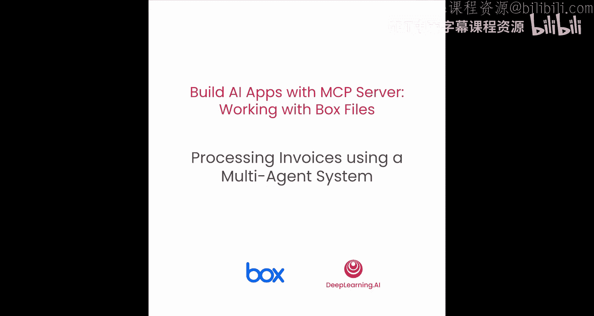
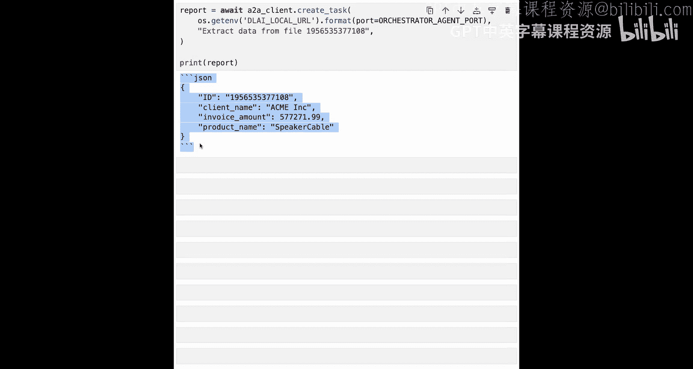

# 006：使用多智能体系统处理发票 📄

在本节课中，我们将学习如何构建一个由三个独立智能体协同工作的系统来处理发票。这三个智能体分别是：文件智能体、提取智能体和协调智能体。它们将通过 AdaA 协议进行通信，共同完成从文件列表到数据提取的完整流程。

## 概述

我们将构建一个多智能体系统，该系统包含三个具有明确职责的智能体：
1.  **文件智能体**：负责列出指定文件夹中的所有文件。
2.  **提取智能体**：负责从特定文档（如发票）中提取结构化数据。
3.  **协调智能体**：负责接收用户请求，分析任务，并将子任务分派给相应的智能体。

所有智能体都符合 MCP 标准，可以轻松连接到任何 MCP 服务器。接下来，我们将从导入必要的库开始。




## 导入必要的库

首先，我们需要导入构建智能体所需的库。这包括 Google 的 Agent Development Kit (ADK) 以及用于 AdaA 通信的库。

```python
# 导入 Google ADK 用于定义智能体
import google_adk

# 导入 AdaA 协议相关库，用于智能体间通信
from adaa import *

# 从 .env 文件加载环境变量
from dotenv import load_dotenv
load_dotenv()

# 其他可能需要的库
import os
import json
```

我们选择使用 Gemini 2.5 Pro 模型，它比 Gemini Flash 更强大，虽然稍重且慢一些，但对于我们当前的任务来说是值得的。

## 定义配置与 MCP 服务器

在定义智能体之前，我们需要设置一些基础配置，例如每个智能体监听的本地端口，以及 MCP 服务器的路径。

```python
# 定义每个智能体将使用的本地端口
FILES_AGENT_PORT = 10024
EXTRACTION_AGENT_PORT = 10025
ORCHESTRATOR_AGENT_PORT = 10026

# 定义 Box 文件夹 ID 和 MCP 服务器路径
BOX_FOLDER_ID = “your_folder_id_here”
MCP_SERVER_PATH = “/path/to/your/mcp/server”
```

MCP 服务器的配置方式与之前相同，采用标准的输入输出配置来定义启动本地 MCP 服务器所需的命令和参数。

## 定义智能体

现在，让我们开始定义三个核心智能体。为了保持简单，每个智能体都有单一且明确的职责。

### 1. 文件智能体

文件智能体的工作是列出给定文件夹中的所有文件 ID。它只被授予访问 MCP 服务器中“列出 Box 文件夹内容”这一个工具的权限。

```python
# 定义文件智能体
files_agent = adk.Agent(
    name=“files_agent”,
    instructions=“你的职责是列出指定 Box 文件夹中的所有文件 ID。”,
    tools=[list_box_folder_tool]  # 仅访问列表工具
)
```

定义完智能体后，我们需要创建它的“智能体卡片”。这张卡片概述了智能体的职责、运行地址、支持的输入输出格式以及技能，其他智能体（如协调者）将根据这张卡片来判断它是否能处理特定任务。

```python
# 创建文件智能体的智能体卡片
files_agent_card = adk.AgentCard(
    name=“files_agent”,
    endpoint=f“http://localhost:{FILES_AGENT_PORT}”,  # 运行地址
    input_schema={“type”: “object”, “properties”: {“folder_id”: {“type”: “string”}}},
    output_schema={“type”: “array”, “items”: {“type”: “string”}},
    skills=[“list_files”]
)
```

最后，我们为文件智能体创建一个远程实例变量，以便协调智能体能够与之通信。注意，智能体卡片的 `endpoint` 将用于此目的。

### 2. 提取智能体

提取智能体的工作是从 Box 中的文件提取发票数据。我们将指示它提取客户名称、发票金额和产品名称，并以特定的 JSON 格式返回。

```python
# 定义提取智能体
extraction_agent = adk.Agent(
    name=“extraction_agent”,
    instructions=“””
    从指定的发票文件中提取以下信息：
    1. 客户名称 (client_name)
    2. 发票金额 (invoice_amount)
    3. 产品名称 (product_name)
    请以 JSON 格式返回，例如：{“client_name”: “...”, “invoice_amount”: 123.45, “product_name”: “...”}
    “””,
    tools=[ai_extract_tool]  # 仅访问 AI 提取工具
)
```

同样，我们为它创建智能体卡片，并包含一个“从发票提取数据”的技能，同时提供一些交互示例。

```python
# 创建提取智能体的智能体卡片
extraction_agent_card = adk.AgentCard(
    name=“extraction_agent”,
    endpoint=f“http://localhost:{EXTRACTION_AGENT_PORT}”,
    input_schema={“type”: “object”, “properties”: {“file_id”: {“type”: “string”}}},
    output_schema={
        “type”: “object”,
        “properties”: {
            “client_name”: {“type”: “string”},
            “invoice_amount”: {“type”: “number”},
            “product_name”: {“type”: “string”}
        }
    },
    skills=[“extract_invoice_data”]
)
```

我们也需要为这个智能体创建远程实例。

### 3. 协调智能体

协调智能体是将所有部分联系起来的核心。它的指令相对复杂：需要解析用户请求，将其分解为步骤，然后将每个步骤委托给合适的子智能体。

```python
# 定义协调智能体
orchestrator_agent = adk.Agent(
    name=“orchestrator_agent”,
    instructions=“””
    你是一个协调者。请按以下步骤处理用户请求：
    1. 解释用户的请求。
    2. 将请求分解为具体的子任务。
    3. 将每个子任务委托给拥有相应技能的智能体（文件智能体或提取智能体）。
    4. 收集子智能体的响应，并整合成最终答案返回给用户。
    你本身不直接访问任何工具，但你可以指挥其他智能体。
    “””,
    # 协调智能体不直接拥有工具，但拥有对子智能体的访问权限
    subagents=[files_agent_card, extraction_agent_card]
)
```

最后，我们也为协调智能体定义其智能体卡片。

## 启动智能体服务器

定义完所有智能体后，我们准备运行它们。我们将定义一些函数来在后台启动每个智能体的服务器。

以下是启动智能体服务器的关键组件：
*   **Runner 实例**：为每个 ADK 智能体提供执行环境，管理会话内的消息处理、事件生成等。
*   **Agent Executor**：作为 AdaA 协议和智能体逻辑之间的桥梁，处理请求并使用事件队列通信结果。
*   **Request Handler**：处理队列，将响应发送给发起查询的用户。
*   **Starlette 应用实例**：包装请求处理器和智能体卡片，用于运行 AdaA 智能体服务器。

```python
# 启动文件智能体服务器
start_agent_server(files_agent, files_agent_card, port=FILES_AGENT_PORT)
# 启动提取智能体服务器
start_agent_server(extraction_agent, extraction_agent_card, port=EXTRACTION_AGENT_PORT)
# 启动协调智能体服务器
start_agent_server(orchestrator_agent, orchestrator_agent_card, port=ORCHESTRATOR_AGENT_PORT)
```

执行以上代码后，三个智能体将分别在端口 10024、10025 和 10026 上本地运行。可以等待几秒钟确保线程已启动。

## 使用 AdaA 客户端进行交互

一切就绪后，我们将创建一个 AdaA 客户端。这个客户端就像一个接口，接收用户请求并将其发送给所连接的智能体（这里我们连接到协调智能体）。它会处理智能体卡片的缓存、以正确格式发送任务、解析响应并返回干净的 JSON 或文本。

```python
# 创建 AdaA 客户端并连接到协调智能体
client = adaa.Client(orchestrator_agent_card.endpoint)
```

## 运行多智能体系统

现在来到了有趣的部分：运行整个多智能体系统。

首先，我们让协调智能体列出 Box 文件夹中的文件。尽管协调智能体自身没有直接访问工具来完成此任务，但它知道文件智能体可以，因此它会委托该任务。

```python
# 请求协调智能体列出文件
response = client.send_task({“action”: “list_files”, “folder_id”: BOX_FOLDER_ID})
print(“文件列表：”, response)
```

协调智能体将任务分派给文件智能体，获取响应并返回。结果将显示文件夹中的五个文件列表。

接下来，我们请求协调智能体从一张特定发票中提取数据。同样，协调智能体会意识到提取智能体可以处理此任务。

```python
# 请求协调智能体提取发票数据
response = client.send_task({“action”: “extract_invoice”, “file_id”: “invoice_123.pdf”})
print(“提取的发票详情：”, response)
```

协调智能体将请求传递给提取智能体并返回结果。我们将看到提取智能体返回的、包含客户名称、金额和产品名称的 JSON 对象。

## 总结

在本节课中，我们一起构建并运行了一个功能完整的多智能体系统。我们学习了如何：
1.  **定义三个具有明确职责的智能体**：文件智能体、提取智能体和协调智能体。
2.  **为每个智能体创建智能体卡片**，以描述其技能和通信端点。
3.  **配置并启动基于 AdaA 协议的智能体服务器**，使它们能够在本地运行并相互通信。
4.  **使用 AdaA 客户端** 与协调智能体进行交互，并由协调智能体自动将任务委托给合适的子智能体。



这个系统展示了清晰的职责划分、基于工具的能力以及智能体间的有效通信。你可以在此基础上扩展，添加更多智能体或更复杂的任务流程。