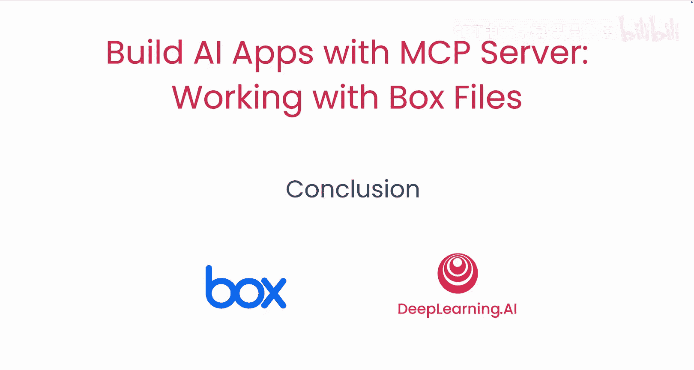
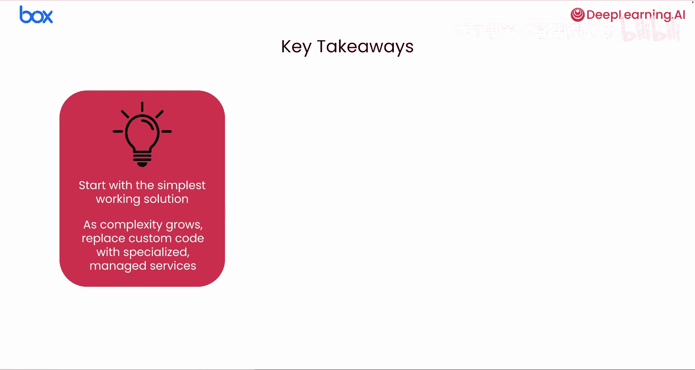
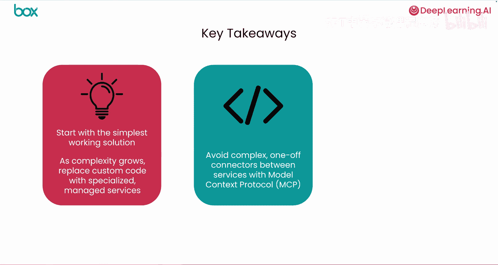
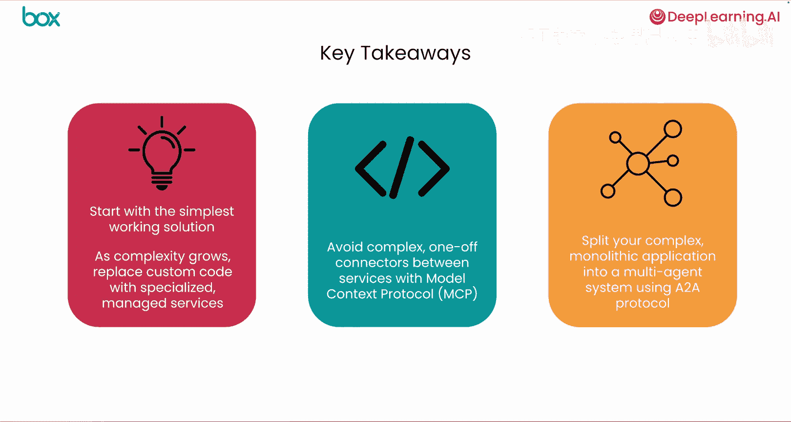

# 007：课程总结 🎉

在本节课中，我们将回顾整个课程的核心要点，总结从简单脚本到复杂架构的演进过程，并理解如何构建强大、可扩展且可维护的 AI 解决方案。

恭喜你完成了这门课程。让我们回顾一下你所学到的关键见解。

首先，你通过构建最简单的解决方案来启动项目。

这始终是一个很好的起点，因为它允许你快速开发一个可行的概念验证，而不会过早地陷入复杂性之中。

在确定我们的第一个脚本无法扩展之后，我们以 Boxes MCP 服务器为例，重新实现了我们的解决方案。

这显著简化了代码，使其更加灵活和可扩展。

这一步的关键经验是关于模型上下文协议（MCP）的优势，以及如何利用它来避免为不同的工具和服务编写复杂的一次性集成代码。

最后，随着我们的需求持续增长，我们讨论了将解决方案分解为多个智能体，并使用 A-to-A 协议来协调它们。

这将允许我们通过将问题分解为更小、独立的协作智能体来管理新的复杂性。

通过遵循这种从简单脚本到更复杂架构的自然演进过程，你可以构建出强大、可扩展且可维护的 AI 解决方案。

感谢你与我一同踏上这段旅程。我迫不及待想看到你接下来会构建出什么。😊

---

**本节课总结**

在本节课中，我们一起学习了构建 AI 应用的完整演进路径：
1.  **从简单开始**：首先构建最简单的可行方案作为概念验证。
2.  **引入 MCP**：当简单方案无法扩展时，利用模型上下文协议（MCP）来简化集成，提升灵活性与可扩展性。
3.  **迈向多智能体架构**：面对更复杂的需求，将解决方案分解为多个独立的智能体，并通过 A-to-A 协议进行协调。

遵循这一路径，你可以系统地构建出既强大又易于维护的 AI 应用。