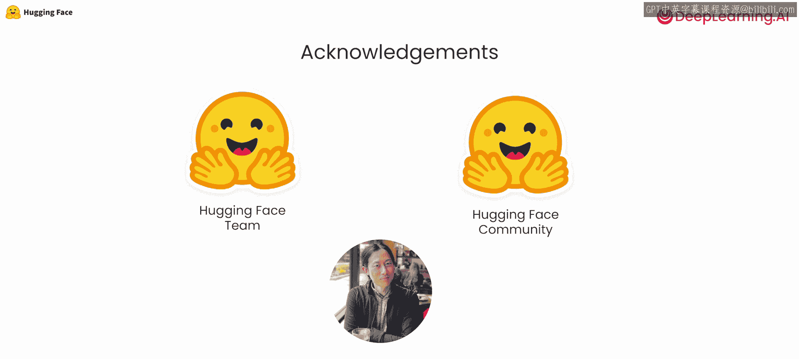

# 001：课程介绍 🎯

在本课程中，我们将与Hugging Face合作，深入探讨模型量化的核心技术模块。量化是压缩大语言模型及其他模型的关键技术，属于AI软件栈的重要组成部分。我们将从零开始实现最常见的线性量化变体，并学习如何应用不同的量化粒度。课程结束时，你将能够构建自己的量化器，并使用每通道线性量化方案将任何模型量化为8位精度。

## 课程核心内容概述

上一段我们介绍了本课程的目标，接下来详细看看我们将要学习的具体内容。

以下是本课程涵盖的核心主题：

*   **线性量化实现**：从零实现**对称**与**非对称**两种主要量化模式。其核心区别在于压缩算法是否将原始表示中的零点映射到压缩表示中的零点。
    *   **公式**：`量化值 = 舍入(原始值 / 缩放比例) + 零点偏移`
*   **量化粒度**：使用PyTorch实现**每张量**、**每通道**和**每组**量化。这决定了你一次量化模型的多大部分。
    *   **代码示例**：`# 伪代码示意不同粒度
      # 每张量量化：整个权重张量使用同一组量化参数
      scale, zero_point = calibrate(entire_weight_tensor)
      # 每通道量化：权重张量的每个通道使用独立的量化参数
      scales, zero_points = calibrate_per_channel(weight_tensor)`
*   **构建量化器**：构建一个量化器，使用之前学到的每通道量化方案，将任何模型量化为8位精度。该方法适用于文本、视觉、音频乃至多模态模型。
*   **权重打包**：学习并实现权重打包与解包算法。这是当前存储4位或2位低精度权重的常见方法，可将多个低精度张量打包到一个更大的8位张量中，无需分配额外内存。
*   **前沿挑战与方案**：探讨量化大模型（如LLM）时的其他挑战，回顾当前最先进的、旨在实现无损性能量化的方法，并了解如何在Hugging Face生态系统中进行操作。

## 讲师介绍

很高兴向大家介绍本课程的讲师。Eunice Dgoda是Hugging Face的机器学习工程师，在开源团队工作，涉足Transformers、PEFT等多种开源工具。Mark Sun同样是Hugging Face的机器学习工程师，在开源团队为Transformers、Accelerate等库做出贡献。他们二人都深度参与量化工作，致力于让大模型更易于社区使用。

## 学习价值与致谢

量化是当今大模型实际应用中的重要环节。深入理解它将帮助你更有效地构建、部署和使用模型。本课程的诞生离不开许多人的努力，特别感谢Hugging Face团队对课程内容的评审，以及Hugging Face社区对开源模型和量化方法的贡献。DeepLearning.AI的Eddie Shu也为此做出了贡献。

量化是一个技术性较强的主题。完成本课程后，希望你能够深入理解它，并可以自信地表示自己掌握了模型压缩技术，不再为此担忧。

让我们进入下一个视频，正式开始学习。