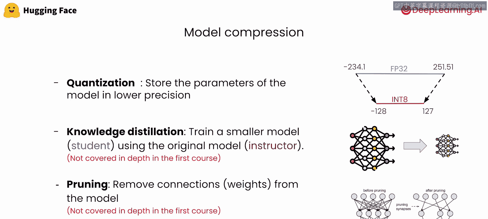
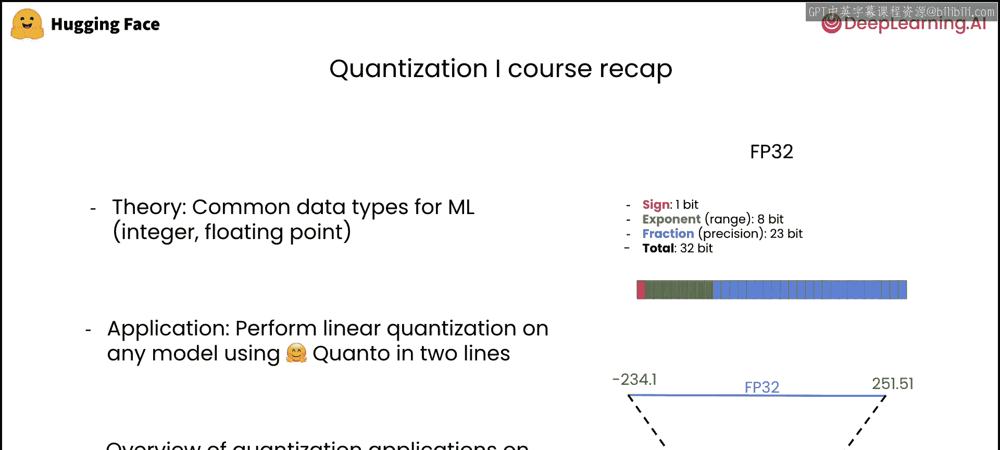
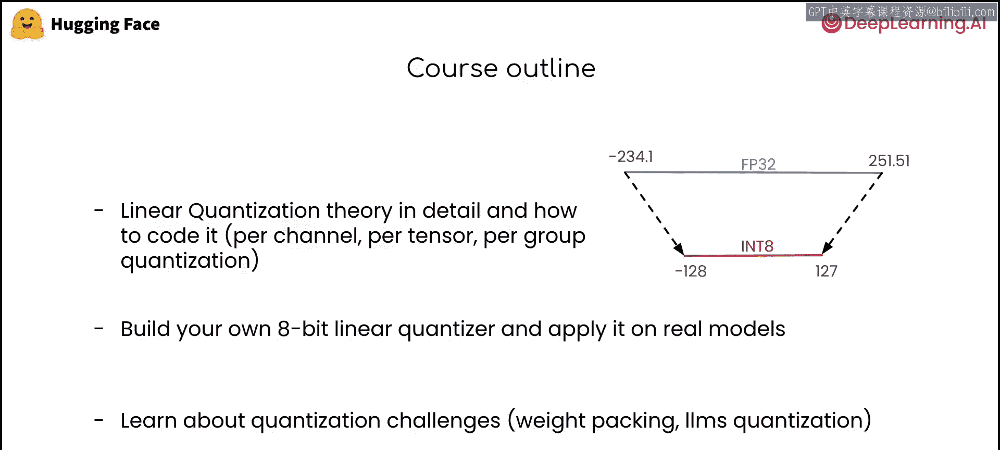

# 002：课程概述 🎯

在本节课中，我们将对模型量化技术进行一个全面的概述。量化方法用于使模型变得更小，从而让更广泛的AI社区能够更容易地使用它们。我们将了解量化是什么以及它是如何工作的。

## 课程回顾与引言

在上一节课程中，我们了解到量化是一个令人兴奋的领域，因为它使我们能够压缩模型，提高其可及性。本节课程中，我们将学习如何从零开始实现一些量化基本操作，并构建我们自己的模型量化器。同时，我们也会探讨在低比特量化（如权重打包）中可能遇到的一些挑战。

首先，让我们快速回顾一下在第一门课程中学到的内容。

## 第一门课程要点回顾

在第一门课程的介绍部分，我们列举了可用于压缩模型的通用技术。

以下是主要技术概览：
*   **量化**：旨在以更低的精度表示模型的参数。
*   **知识蒸馏**：你可以使用更大的教师模型的输出来训练一个学生模型。
*   **剪枝**：你可以简单地移除模型内部的一些连接（即移除权重），使模型更加稀疏。

我们还介绍了机器学习中常见的数据类型，例如 `int8` 或 `float`。我们使用 Hugging Face 的量化库，用几行代码执行了线性量化。最后，我们概述了量化如何在不同用例（如大语言模型微调）中发挥作用。

接下来，让我们看看在本门课程中具体要学习哪些内容。

## 本课程核心内容

本课程将深入探讨以下三个核心部分。

### 1. 深入线性量化内部原理 🔍

首先，我们将一起深入线性量化的内部原理，并从零开始实现其一些变体。

以下是主要的量化方案：
*   **逐通道量化**
*   **逐张量量化**
*   **逐组量化**

我们将研究每种方法的优点和缺点，并观察它们对一些随机张量的影响。

### 2. 构建自定义量化器 ⚙️

接下来，我们将尝试构建自己的量化器，使用前面介绍的量化方案之一，将任何模型量化为8位精度。

需要注意的是，量化方案与模型模态无关。这意味着只要你的模型包含线性层，你就可以将其应用于任何模型。从技术上讲，你将能够使用你的量化器来量化视觉、文本、音频甚至多模态模型。

### 3. 应对极端量化挑战 🧩

最后，我们将通过了解更多关于极端量化（如权重打包）时可能面临的挑战来结束本课程。这是当前常见的挑战。

截至我们讨论时，PyTorch 尚未原生支持2位或4位精度的权重。解决此问题的一种方法是将这些低精度权重打包到更高精度的张量中，例如 `int8`。我们将深入探讨这一点，并一起实现打包和解包算法。

我们将通过探讨量化大型模型（如LLMs）时的其他常见挑战，并一起回顾一些最先进的LLM量化方法来结束本课程。

现在，让我们直接开始，一起压缩一些模型吧！

## 总结

本节课中，我们一起回顾了模型压缩的背景知识，并概述了本门课程的学习路线。我们将从实现量化基本操作开始，逐步构建完整的量化器，并最终攻克低比特量化中的实际挑战。准备好迎接深度量化的实践之旅了吗？让我们开始吧。