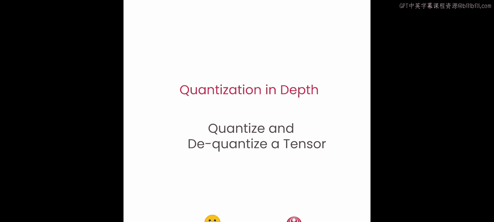
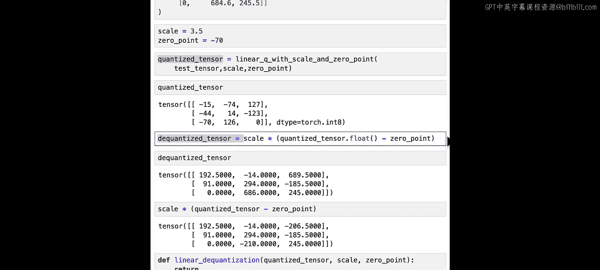
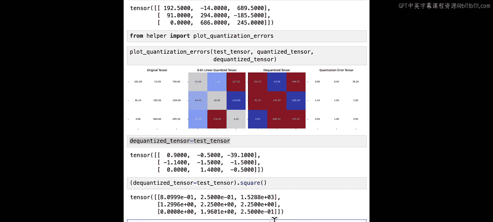
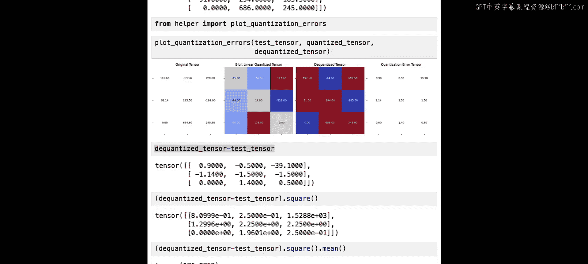
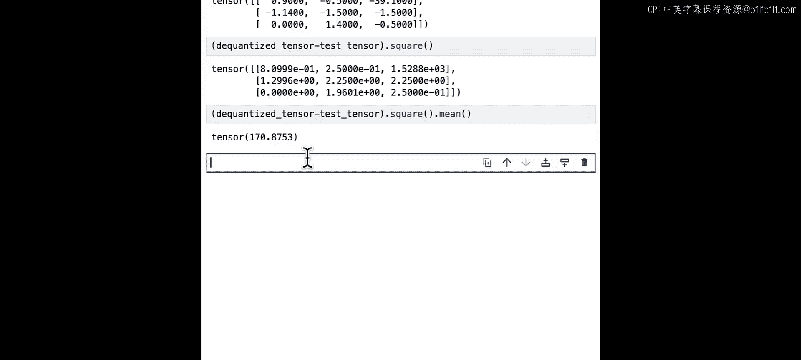

# 003：张量的量化与反量化 🧮




在本节课中，我们将深入学习线性量化的理论。你将从头开始实现线性量化的非对称变体，并了解缩放因子和零点这两个核心概念。

## 概述

量化是指将一个大集合的值映射到一个更小集合的过程。本课程将专注于**线性量化**。我们将学习如何将一个浮点张量量化为低精度格式（如 `int8`），以及如何将其反量化回原始表示。理解这个过程是掌握模型量化技术的基础。

## 线性量化理论

上一节我们介绍了量化的基本概念，本节中我们来看看线性量化的具体理论。

线性量化使用线性映射，将高精度范围（例如 `float32`）映射到低精度范围（例如 `int8`）。线性量化涉及两个关键参数：
*   **缩放因子**：通常用 `S` 表示，存储在与原始张量相同的数据类型中。
*   **零点**：通常用 `Z` 表示，存储在与量化后张量相同的数据类型中。

量化值 `Q` 与原始值 `R` 之间的关系可以用以下**公式**表示：
`R = S * (Q - Z)`

根据这个公式，我们可以推导出反量化公式：
`Q = round(R / S + Z)`

## 实现量化函数

理解了理论公式后，现在让我们动手实现量化函数。我们将使用 PyTorch 框架。

首先，确保已安装必要的库。如果在本机运行，请执行：
```python
pip install torch
```

以下是量化函数 `linear_quantize_with_scale_and_zeropoint` 的实现步骤：

1.  **计算缩放和偏移后的张量**：根据公式 `R / S + Z` 进行计算。
2.  **四舍五入**：对结果进行取整，因为量化值必须是整数。
3.  **数值裁剪**：确保结果在目标数据类型的表示范围内（例如 `int8` 的 -128 到 127）。
4.  **类型转换**：将结果转换为目标数据类型（如 `torch.int8`）。

以下是完整的代码实现：
```python
import torch

def linear_quantize_with_scale_and_zeropoint(tensor, scale, zero_point, dtype=torch.int8):
    # 步骤1: 计算缩放和偏移后的张量
    scaled_and_shifted_tensor = tensor / scale + zero_point

    # 步骤2: 四舍五入
    rounded_tensor = torch.round(scaled_and_shifted_tensor)

    # 步骤3: 数值裁剪到目标数据类型的范围
    q_min = torch.iinfo(dtype).min
    q_max = torch.iinfo(dtype).max
    quantized_tensor = rounded_tensor.clamp(q_min, q_max)

    # 步骤4: 类型转换
    quantized_tensor = quantized_tensor.to(dtype)

    return quantized_tensor
```

## 测试量化函数

现在，让我们用一个示例张量来测试我们实现的函数。我们将暂时为缩放因子和零点赋予随机值。

```python
# 定义测试张量
test_tensor = torch.tensor([[1.0, 2.0, 3.0],
                            [4.0, 5.0, 6.0],
                            [7.0, 8.0, 9.0]], dtype=torch.float32)

# 暂时使用随机缩放因子和零点
scale = 3.5
zero_point = -70

# 调用量化函数
quantized_tensor = linear_quantize_with_scale_and_zeropoint(test_tensor, scale, zero_point)
print("量化后的张量：")
print(quantized_tensor)
print(f"数据类型：{quantized_tensor.dtype}")
```

## 实现反量化函数

得到量化张量后，我们需要能够将其恢复为原始表示。这个过程称为反量化。

根据公式 `R = S * (Q - Z)`，我们可以轻松实现反量化。需要注意的是，在计算 `(Q - Z)` 时，必须先将 `Q` 转换为浮点类型，以避免整数运算中的溢出或下溢问题。

以下是反量化函数 `linear_dequantize` 的实现：
```python
def linear_dequantize(quantized_tensor, scale, zero_point):
    # 将量化张量转换为浮点型后进行反量化计算
    dequantized_tensor = scale * (quantized_tensor.float() - zero_point)
    return dequantized_tensor

# 测试反量化
dequantized_tensor = linear_dequantize(quantized_tensor, scale, zero_point)
print("\n反量化后的张量：")
print(dequantized_tensor)
```

## 计算量化误差

为了评估量化过程的精度，我们可以计算量化误差，即原始张量与反量化后张量之间的绝对差值。



```python
# 计算量化误差
quantization_error = torch.abs(test_tensor - dequantized_tensor)
print("\n量化误差张量：")
print(quantization_error)
print(f"\n平均量化误差：{quantization_error.mean().item():.4f}")
```

在这个例子中，由于我们为缩放因子和零点赋予了随机值，量化误差可能会比较大。这引出了下一个关键问题：如何找到最优的缩放因子和零点，以最小化量化误差。



## 总结





本节课中我们一起学习了线性量化的核心理论。我们定义了缩放因子 `S` 和零点 `Z` 这两个关键参数，并理解了它们与量化值 `Q`、原始值 `R` 之间的关系（`R = S * (Q - Z)`）。我们从头实现了量化函数和反量化函数，并计算了量化误差。目前，我们使用了随机的 `S` 和 `Z`，导致误差较高。在下一节中，我们将探讨如何计算最优的缩放因子和零点，以显著降低量化误差，使量化后的模型保持高性能。