# 004：获取缩放因子与零点 🎯

在本节课中，我们将学习如何确定线性量化中的两个核心参数：**缩放因子（Scale）** 和 **零点（Zero Point）**。它们是连接原始浮点数值与量化后整数值的关键。我们将从理论推导开始，然后通过代码实现一个完整的量化函数。

## 概述

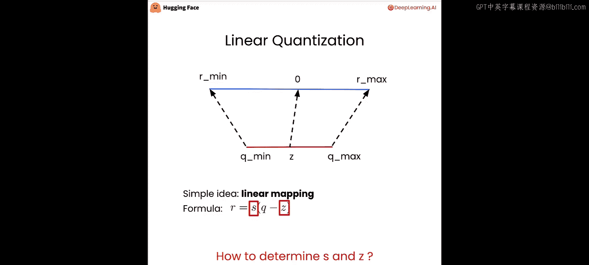

上一节我们介绍了线性量化的基本公式 `Q = round(R / S + Z)`。本节中，我们将解决如何为给定的张量计算最优的缩放因子 `S` 和零点 `Z`。核心思想是让原始数据的最小值和最大值分别映射到量化范围的最小值和最大值。

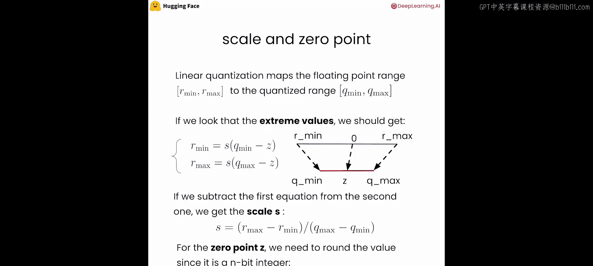

## 理论推导

我们需要根据原始张量的极值来确定 `S` 和 `Z`。设原始张量 `R` 的最小值为 `R_min`，最大值为 `R_max`。设量化后的整数类型（如 `int8`）的最小值为 `Q_min`，最大值为 `Q_max`。

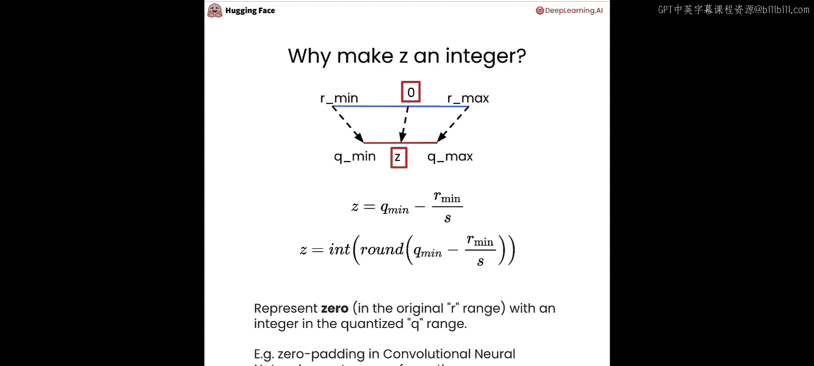

根据映射关系，我们得到两个方程：
1.  `R_min` 映射到 `Q_min`： `Q_min = round(R_min / S + Z)`
2.  `R_max` 映射到 `Q_max`： `Q_max = round(R_max / S + Z)`

为了简化，我们通常忽略 `round` 操作进行推导，得到近似公式：
*   `Q_min ≈ R_min / S + Z`
*   `Q_max ≈ R_max / S + Z`

由于我们有两个未知数 `S` 和 `Z`，以及两个方程，可以求解。将第二个方程减去第一个方程，可以消去 `Z`，从而解出缩放因子 `S`：

**缩放因子公式：**
`S = (R_max - R_min) / (Q_max - Q_min)`

得到 `S` 后，将其代入第一个方程，即可解出零点 `Z`：

**零点公式：**
`Z = Q_min - R_min / S`

需要注意的是，计算出的 `Z` 需要四舍五入并转换为与量化值相同的数据类型（如 `int`）。`Z` 的设计目标是让原始数据中的 `0` 在量化后也能精确表示，这样在反量化时，`0` 值可以无损恢复。

### 零点越界处理

有时计算出的 `Z` 可能超出 `[Q_min, Q_max]` 的范围。为了避免溢出，我们需要进行截断：
*   如果 `Z < Q_min`，则令 `Z = Q_min`。
*   如果 `Z > Q_max`，则令 `Z = Q_max`。

## 代码实现

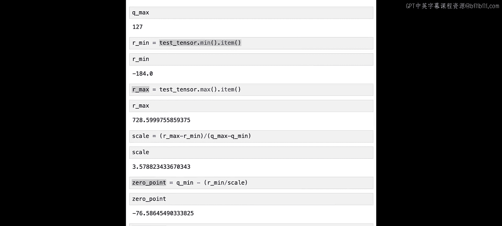

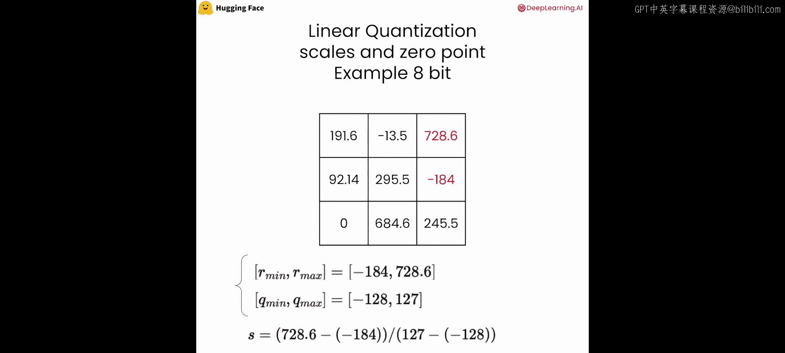

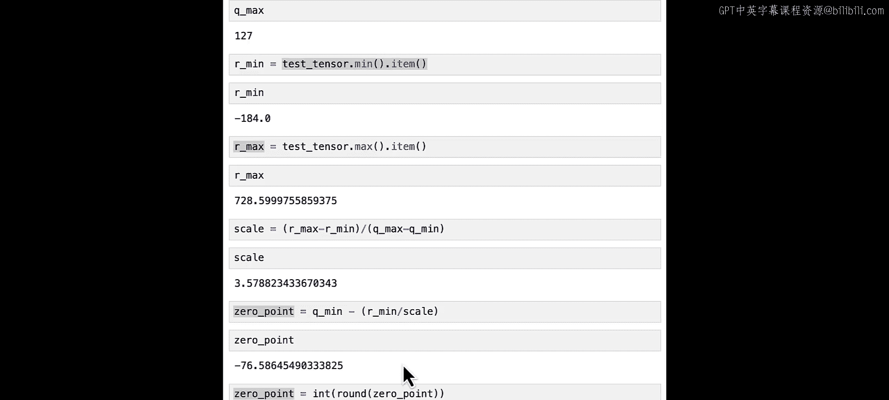

现在，让我们将理论转化为代码。我们将实现一个函数 `get_q_scale_and_zero_point` 来计算 `S` 和 `Z`，然后将其整合进一个完整的线性量化函数中。

首先，实现获取缩放因子和零点的函数。

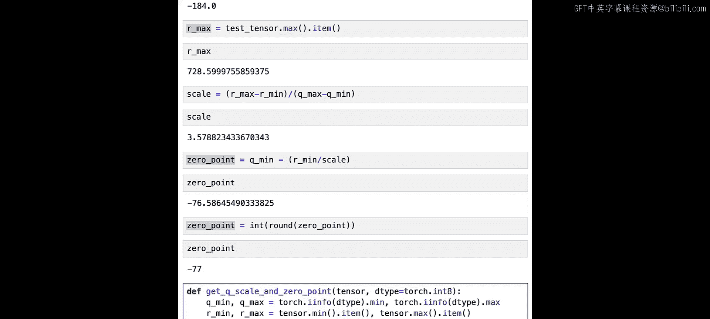

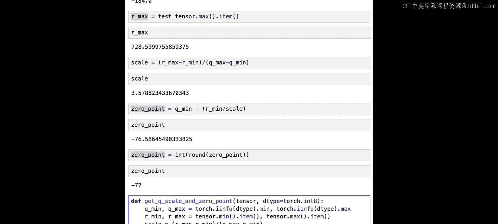

```python
import torch

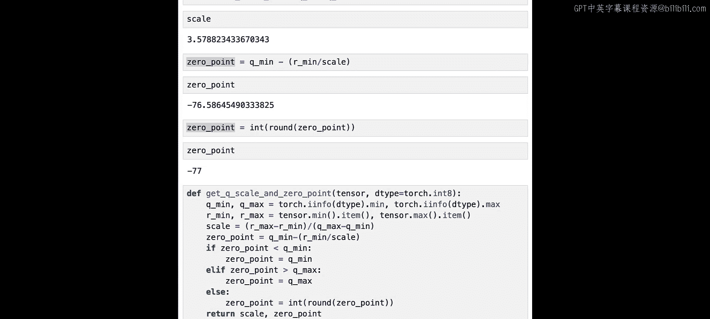

def get_q_scale_and_zero_point(tensor, dtype=torch.int8):
    """
    计算给定张量的量化缩放因子和零点。
    参数:
        tensor: 待量化的浮点张量。
        dtype: 目标量化数据类型，默认为 torch.int8。
    返回:
        scale: 缩放因子 (浮点数)。
        zero_point: 零点 (整数)。
    """
    # 1. 获取量化数据类型的范围
    q_min = torch.iinfo(dtype).min
    q_max = torch.iinfo(dtype).max

    # 2. 获取原始张量的范围
    r_min = tensor.min().item()
    r_max = tensor.max().item()

    # 3. 计算缩放因子 S
    scale = (r_max - r_min) / (q_max - q_min)

    # 4. 计算零点 Z (初步)
    zero_point = q_min - r_min / scale

    # 5. 处理零点越界并转换为整数
    if zero_point < q_min:
        zero_point = q_min
    elif zero_point > q_max:
        zero_point = q_max
    else:
        zero_point = round(zero_point)

    zero_point = int(zero_point)

    return scale, zero_point
```

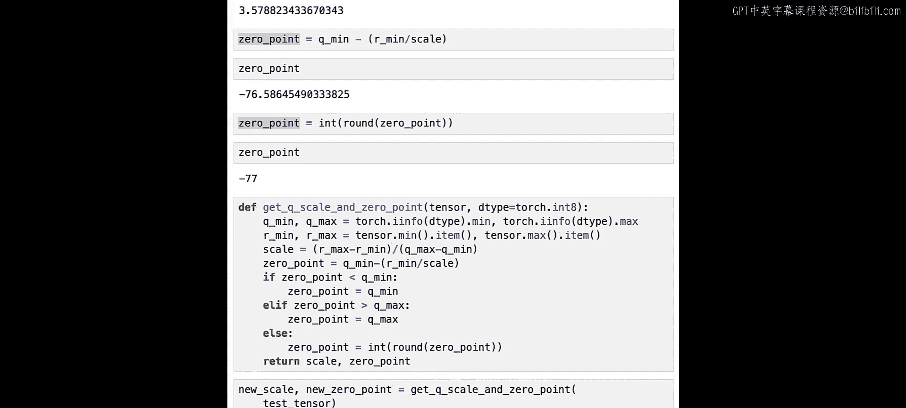

接下来，我们需要之前定义的量化与反量化函数。为了完整性，这里再次列出：

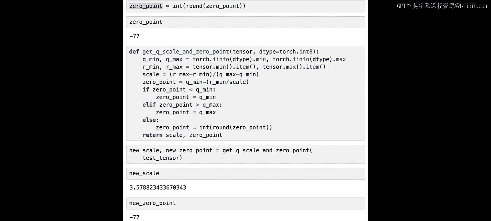

```python
def linear_quantize_with_scale_and_zero_point(tensor, scale, zero_point, dtype=torch.int8):
    """使用给定的缩放因子和零点进行线性量化"""
    quantized_tensor = torch.round(tensor / scale + zero_point).to(dtype)
    return quantized_tensor

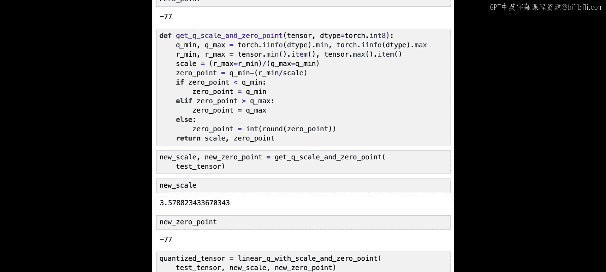

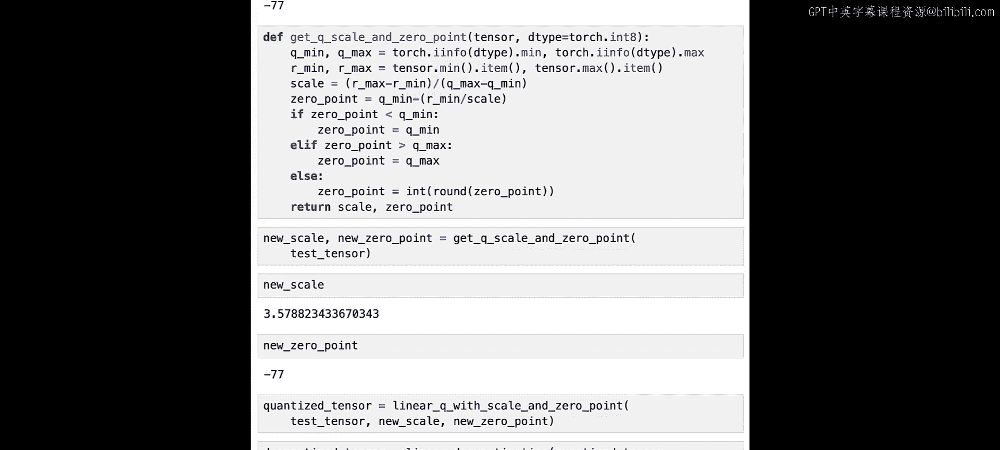

def linear_dequantize(quantized_tensor, scale, zero_point):
    """线性反量化"""
    dequantized_tensor = scale * (quantized_tensor.float() - zero_point)
    return dequantized_tensor
```

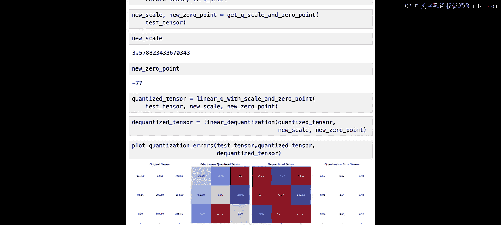

现在，我们可以将这些部分组合成一个完整的线性量化函数：

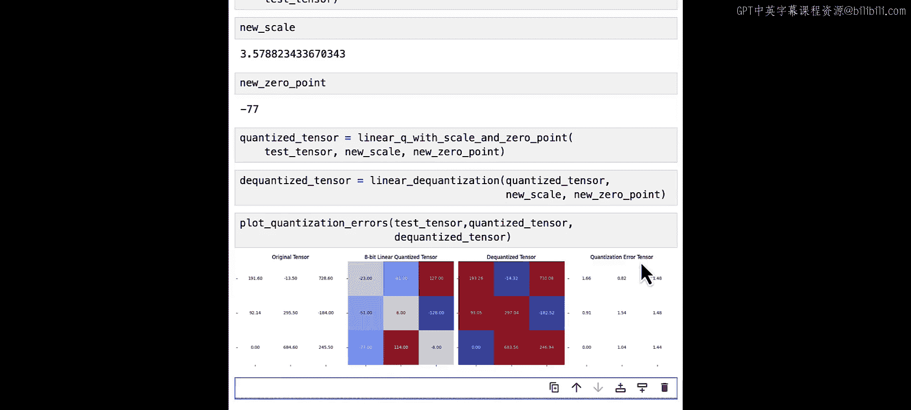

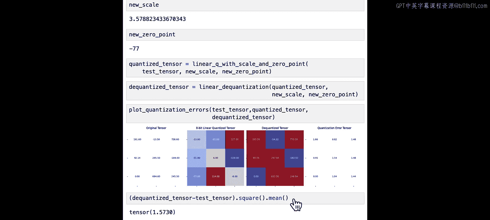

```python
def linear_quantization(tensor, dtype=torch.int8):
    """
    完整的线性量化函数。
    参数:
        tensor: 待量化的浮点张量。
        dtype: 目标量化数据类型。
    返回:
        quantized_tensor: 量化后的张量。
        scale: 使用的缩放因子。
        zero_point: 使用的零点。
    """
    # 1. 计算缩放因子和零点
    scale, zero_point = get_q_scale_and_zero_point(tensor, dtype)

    # 2. 执行量化
    quantized_tensor = linear_quantize_with_scale_and_zero_point(tensor, scale, zero_point, dtype)

    return quantized_tensor, scale, zero_point
```

## 示例与验证

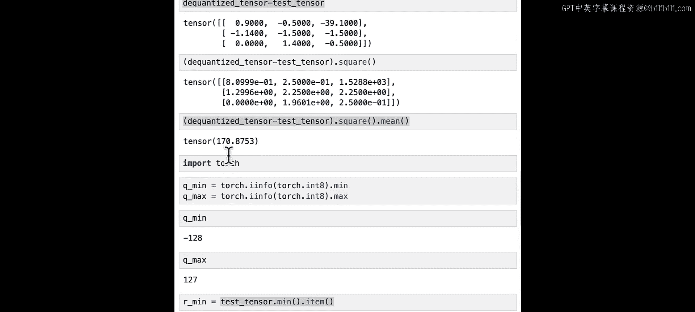

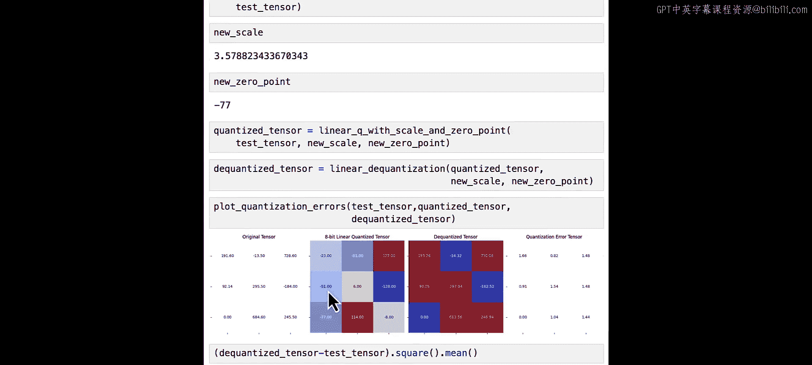

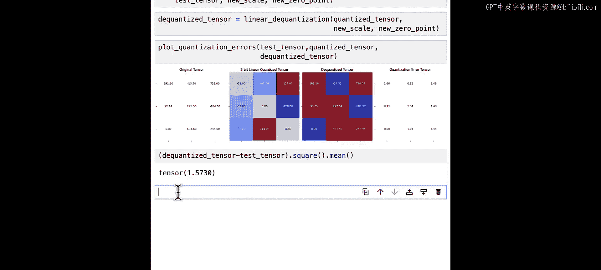

让我们用一个随机张量来测试我们实现的量化器。

```python
# 创建一个随机张量
random_tensor = torch.randn(4, 4)
print("原始张量:\n", random_tensor)

# 执行量化
quantized_tensor, scale, zero_point = linear_quantization(random_tensor)
print("\n量化后张量 (int8):\n", quantized_tensor)
print(f"\n缩放因子 S: {scale:.4f}")
print(f"零点 Z: {zero_point}")

# 执行反量化
dequantized_tensor = linear_dequantize(quantized_tensor, scale, zero_point)
print("\n反量化后张量:\n", dequantized_tensor)

# 计算量化误差 (均方误差)
quantization_error = ((dequantized_tensor - random_tensor) ** 2).mean().item()
print(f"\n量化误差 (MSE): {quantization_error:.6f}")
```

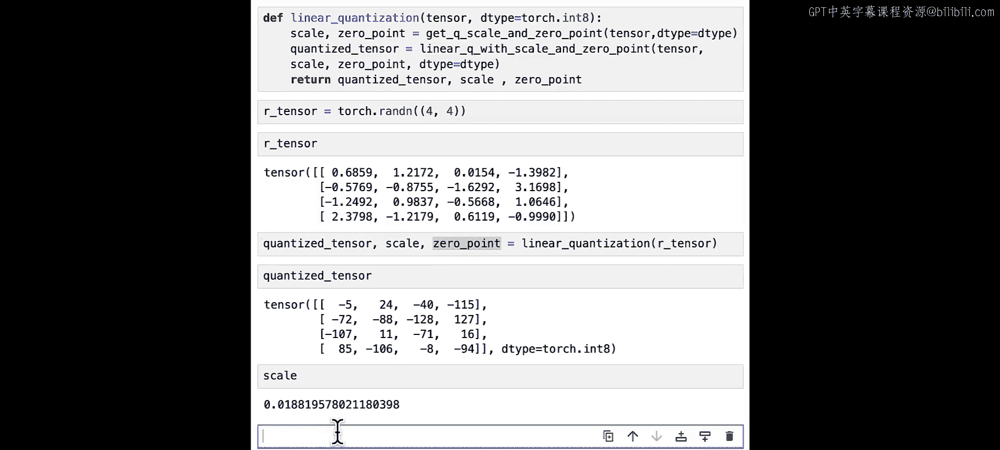

运行上述代码，你将看到量化后的张量、计算出的 `S` 和 `Z`，以及反量化结果。量化误差应该比使用随意选择的 `S` 和 `Z` 时小得多，这证明我们的方法是有效的。

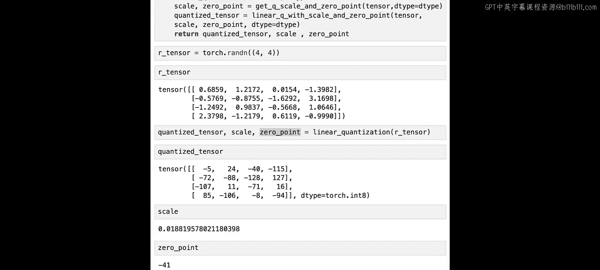

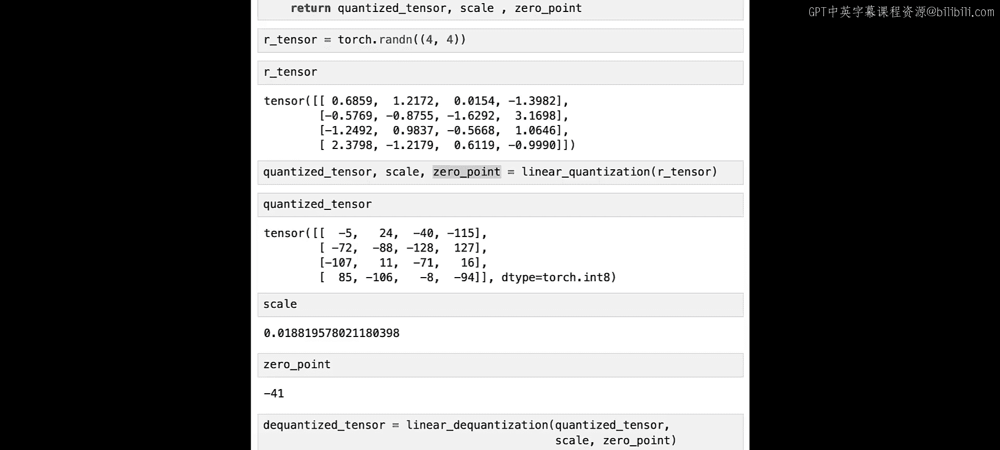

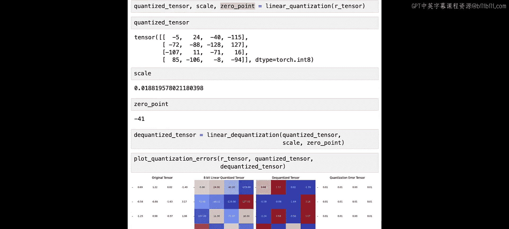

## 总结

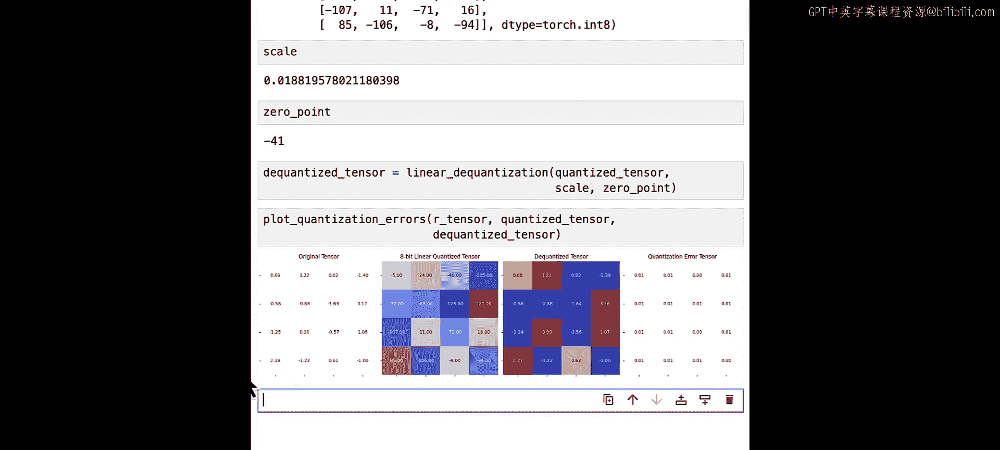

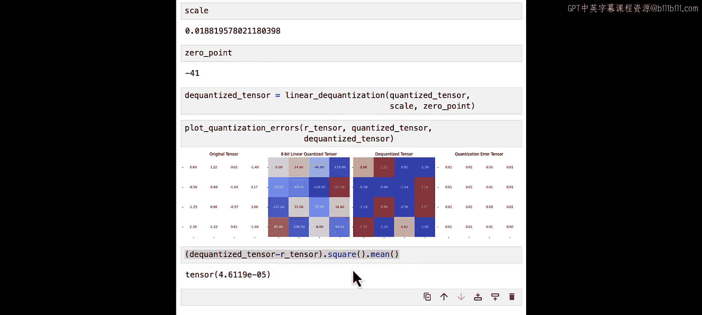

本节课中，我们一起学习了线性量化的核心步骤：**计算缩放因子与零点**。
1.  我们从理论出发，推导了 `S` 和 `Z` 的计算公式，其核心是让数据范围匹配。
2.  我们实现了 `get_q_scale_and_zero_point` 函数来计算这两个参数，并处理了零点越界的情况。
3.  最后，我们将所有功能整合进 `linear_quantization` 函数，形成了一个完整的、可用的线性量化工具。

现在你已经掌握了如何为任意张量自动计算合适的量化参数。建议你暂停视频，尝试用不同的输入张量测试这个量化器，观察其表现。

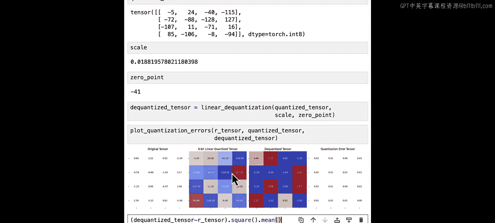

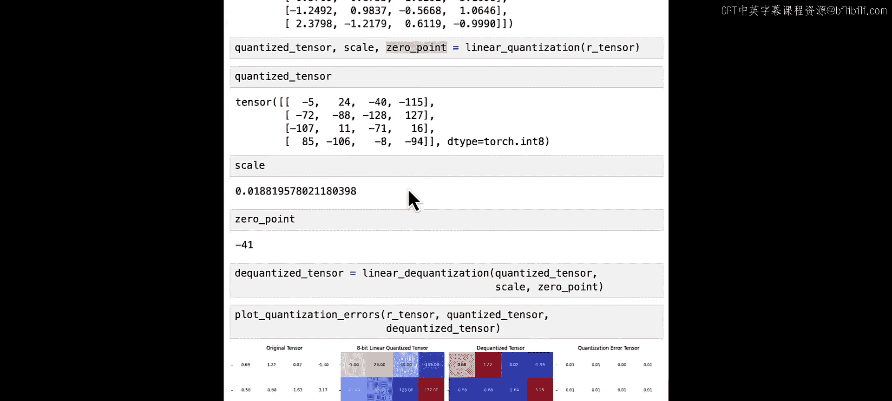

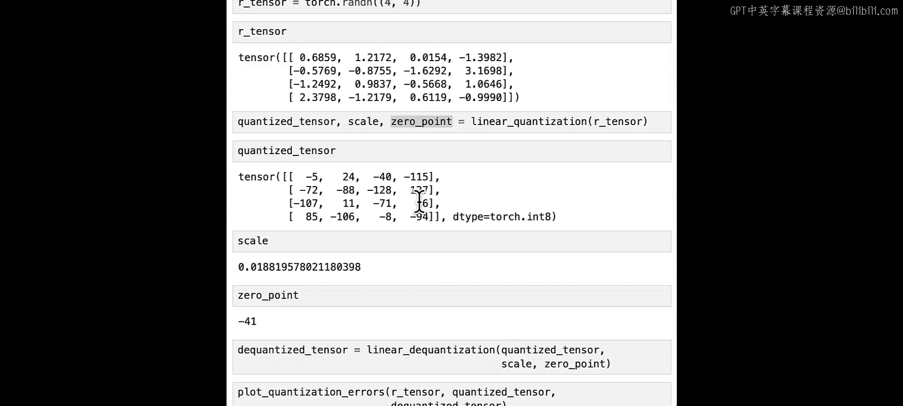

在下一课中，我们将深入线性量化的其他变体，如对称量化，并探讨不同的量化粒度（如每张量、每通道、每组量化）。我们还将学习如何对量化后的模型进行推理。