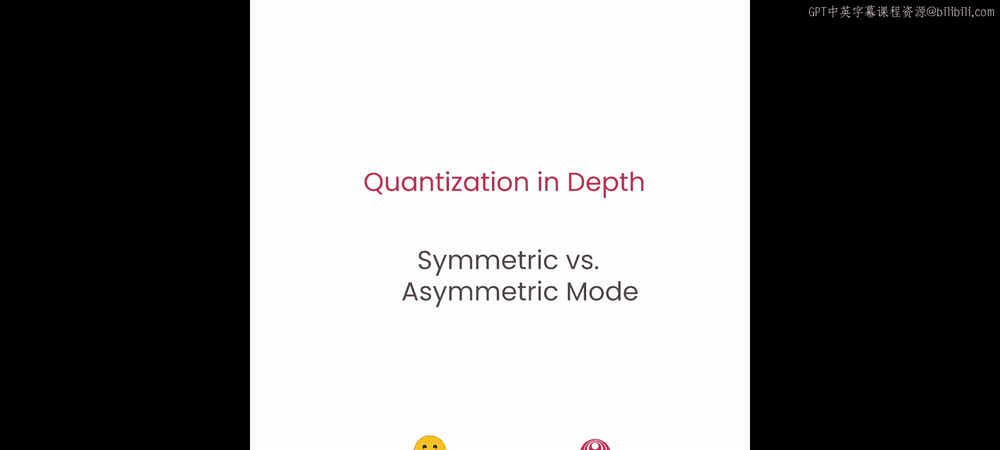
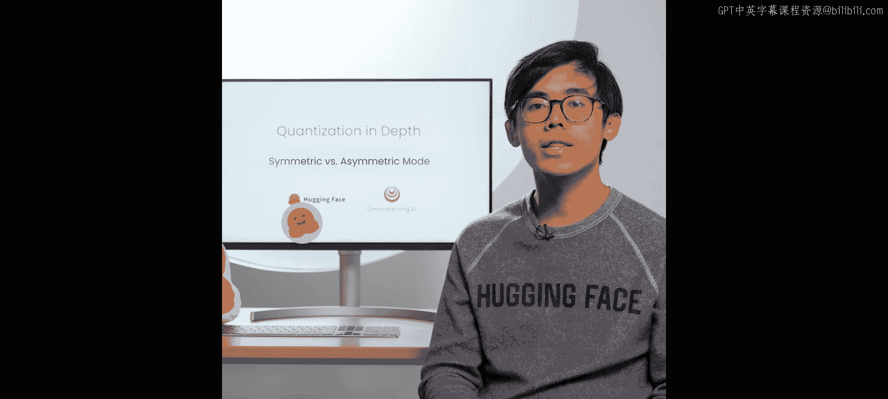
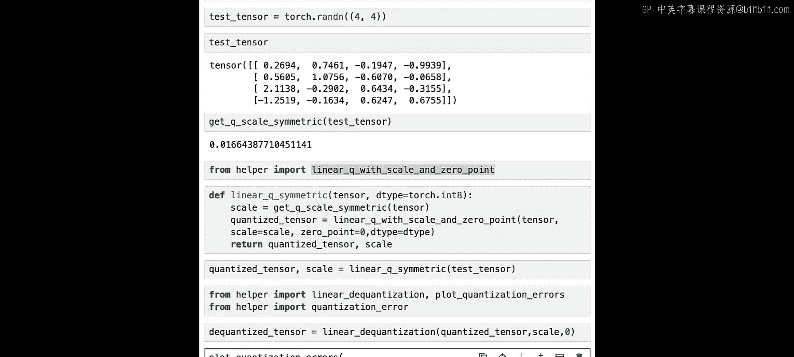
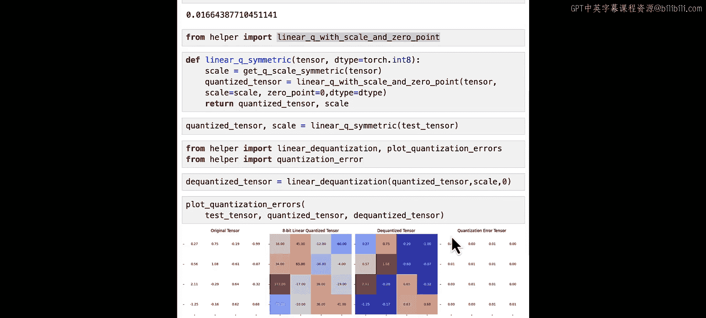
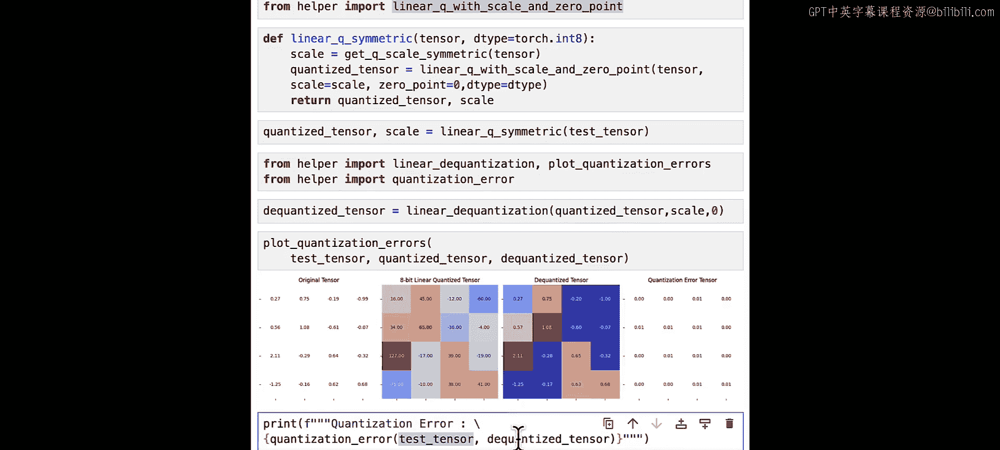
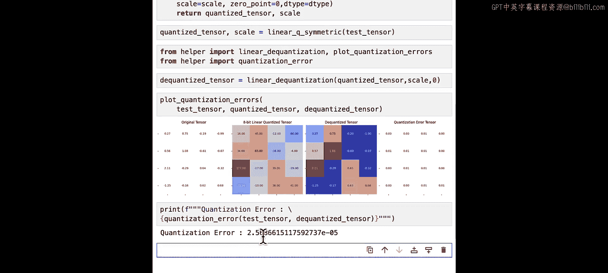
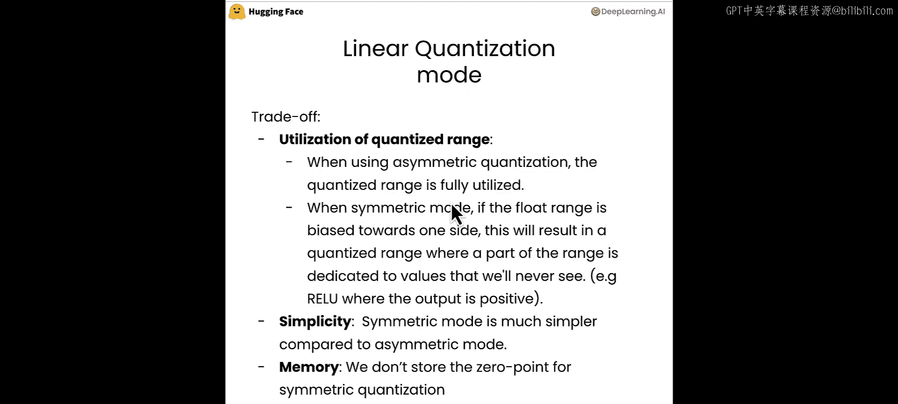

# 005：对称与非对称模式 🔄



在本节课中，我们将学习线性量化中的对称模式。我们还将实现不同粒度级别的量化，例如逐张量、逐通道和逐组量化。最后，我们将探讨如何在量化后的线性层上进行推理。让我们开始吧。



## 概述 📋

线性量化有两种主要模式。第一种是非对称模式，这是我们在上一课中已经实践过的，即将原始张量的最小值或最大值映射到量化范围的最小值或最大值。第二种是对称模式，这是本节课的重点，它将原始张量的负最大值和正最大值映射到量化范围的负最大值和正最大值。

## 对称模式详解 ⚖️

在对称模式中，我们不需要存储零点（zero point），因为它等于0。这是因为浮点数范围和量化范围都关于0点对称。因此，我们可以简化上一课的量化公式。

量化张量 `Q` 的计算公式为：
`Q = round(T / S)`

其中，缩放因子 `S` 的计算公式为：
`S = R_max / Q_max`

这里，`R_max` 是原始张量绝对值的最大值，`Q_max` 是量化数据类型的最大值。

## 代码实现 💻

现在，让我们通过代码来实现对称模式的线性量化。首先，我们需要导入必要的库。

```python
import torch
```

接下来，我们定义一个函数来计算对称量化所需的缩放因子 `S`。

```python
def get_q_scale_symmetric(tensor, dtype=torch.int8):
    # 计算原始张量绝对值的最大值 R_max
    r_max = tensor.abs().max().item()
    # 获取量化数据类型的最大值 Q_max
    q_max = torch.iinfo(dtype).max
    # 计算缩放因子 S
    scale = r_max / q_max
    return scale
```

为了测试这个函数，我们创建一个随机张量并计算其缩放因子。

```python
test_tensor = torch.randn(4, 4)
print("测试张量：", test_tensor)
scale = get_q_scale_symmetric(test_tensor)
print("计算得到的缩放因子：", scale)
```

现在，我们实现完整的对称线性量化函数。这个函数将返回量化后的张量和缩放因子。

```python
def linear_q_symmetric(tensor, dtype=torch.int8):
    # 获取缩放因子
    scale = get_q_scale_symmetric(tensor, dtype)
    # 使用上一课编写的辅助函数进行量化
    # 假设该函数名为 linear_quantize_with_scale_zp
    from helper import linear_quantize_with_scale_zp
    quantized_tensor = linear_quantize_with_scale_zp(tensor, scale, zero_point=0, dtype=dtype)
    return quantized_tensor, scale
```

让我们对测试张量应用这个函数。

```python
quantized_tensor, scale = linear_q_symmetric(test_tensor)
```

为了评估量化效果，我们需要将量化后的张量反量化回浮点数，并计算量化误差。

```python
# 反量化
from helper import linear_dequantize
dequantized_tensor = linear_dequantize(quantized_tensor, scale, zero_point=0)



# 计算并可视化量化误差
from helper import plot_quantization_error, quantization_error
plot_quantization_error(test_tensor, quantized_tensor, dequantized_tensor)
error = quantization_error(test_tensor, dequantized_tensor)
print("量化误差：", error)
```

## 模式对比与权衡 ⚖️

上一节我们介绍了对称模式的实现，本节我们来对比一下对称模式与非对称模式的权衡。

以下是两种模式的主要区别：

1.  **量化范围利用率**：非对称模式能充分利用整个量化范围。而对称模式在原始数据范围偏向一侧时（例如，某层的输出总是正数），会导致部分量化范围被浪费，用于表示永远不会出现的值。
2.  **实现复杂度**：对称模式更简单，因为它不需要计算和存储零点。
3.  **内存占用**：对称量化不需要存储零点，因此在内存上略有优势。







在实践中，当我们进行8位量化时，通常使用对称模式。而当量化到更低的位数，如2、3或4位时，为了更充分地利用有限的表示范围，我们更常使用非对称量化。

## 总结 🎯



本节课中，我们一起学习了线性量化的对称模式。我们了解了其基本原理，即通过关于0点对称的映射来简化量化过程，无需零点。我们动手实现了计算缩放因子和进行对称量化的代码，并通过反量化和误差计算验证了量化效果。最后，我们对比了对称与非对称模式在范围利用率、复杂度和内存占用方面的权衡，并了解了它们在不同量化位数场景下的适用性。掌握这两种模式是深入理解模型量化的关键一步。