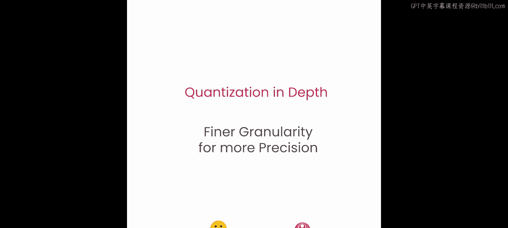
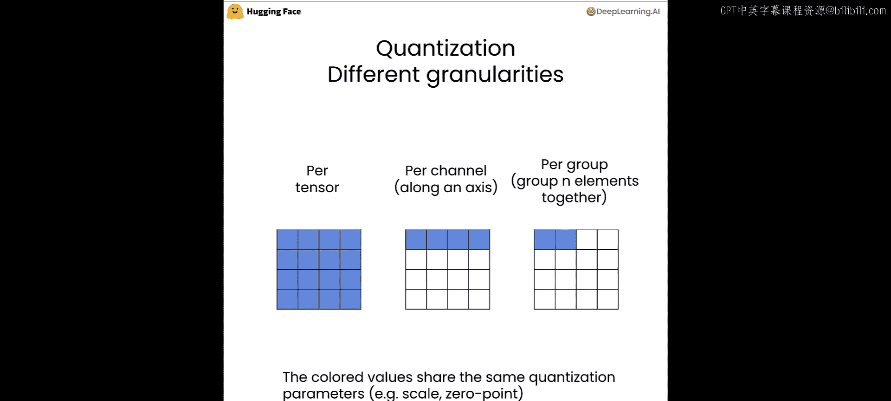
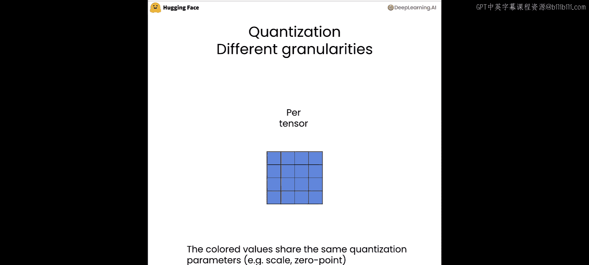
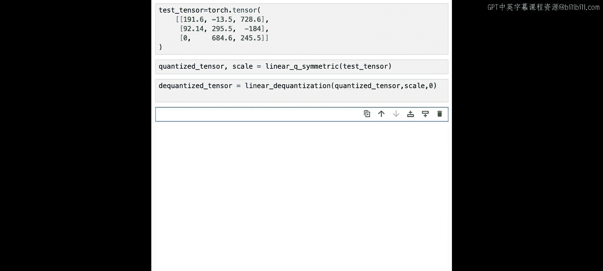
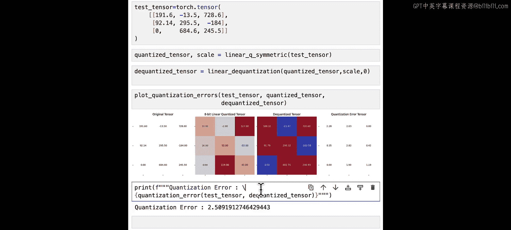

# 006：更细粒度带来更高精度



## 概述
在本节课中，我们将要学习量化粒度对模型精度的影响。我们将了解到，更细的量化粒度可以带来更高的精度，但也会占用更多内存。我们将通过一个简单的例子，回顾对称量化的过程，并比较不同粒度下的量化误差。

## 量化粒度与精度
量化粒度越细，量化结果就越精确。然而，这需要存储更多的量化参数，因此会占用更多内存。

在量化中，存在不同的粒度级别。我们有逐张量量化，但正如你所见，我们不必为整个张量使用相同的缩放因子和零点。

例如，我们可以为每个轴计算一个缩放因子和零点。这被称为逐通道量化。我们也可以选择一组N个元素来获取缩放因子和零点，并使用其自身的缩放因子和零点对每组进行量化。对于逐张量量化，这就是我们在之前实验中所做的。

## 回顾对称量化示例
让我们通过一个简单的例子来回顾一下。使用我们在上一个实验中使用的测试张量，这次对这个张量执行对称量化。我们将使用我们刚刚编写的 `linear_q_symmetric` 函数。

```python
# 假设我们已经定义了 linear_q_symmetric 函数
quantized_tensor, scale = linear_q_symmetric(test_tensor)
```



我们将得到量化后的张量 `quantized_tensor` 和缩放因子 `scale`。这个 `linear_q_symmetric` 函数，我们只需要传入测试张量 `test_tensor`。



为了进行总结，你还需要将其反量化。我们将使用上一个实验中的 `linear_dequantization` 函数。

```python
dequantized_tensor = linear_dequantization(quantized_tensor, scale, zero_point=0)
```

我们需要传入量化张量 `quantized_tensor`、缩放因子 `scale` 和零点 `zero_point`。但如你所记，对于对称量化，零点等于0。



现在我们有了绘制总结所需的一切。

## 结果分析
如图所示，量化效果相当好，数值非常接近。我们得到了量化误差张量，看起来相当不错。

让我们看一下量化误差，我们得到了2.5。如果你还记得上一个实验，当我们使用对称量化时，量化误差大约在1.5左右。



## 总结
本节课中，我们一起学习了量化粒度的重要性。更细的粒度（如逐通道量化）可以提高量化精度，但会增加内存开销。我们通过代码示例回顾了对称量化的过程，并观察了量化误差。理解这些权衡对于在实际应用中有效实施量化至关重要。