# 007：逐通道量化 🧮

在本节课中，我们将要学习逐通道量化（Per-Channel Quantization）的原理与实现。这是一种更精细的量化方法，它为张量的每个通道（例如矩阵的每一行或每一列）使用独立的缩放因子，从而减少异常值对整个张量量化精度的影响。

## 概述

上一节我们介绍了对称线性量化的基本概念。本节中我们来看看逐通道量化。这种方法的核心思想是，不再为整个张量使用单一的缩放因子和零点，而是为张量的每个通道（例如矩阵的每一行或每一列）分别计算并存储这些参数。这能有效隔离异常值的影响，通常能获得比逐张量量化更低的量化误差。

## 逐通道量化的原理

我们需要为每一行（如果沿行量化）或每一列（如果沿列量化）存储独立的缩放因子和零点。存储这些线性参数所需的内存非常小。在8位模型量化中，我们通常使用逐通道量化。

## 实现逐通道量化

现在让我们来编写逐通道量化的代码。为了简化工作，我们将自己限制在线性量化的对称模式中。因此，函数将被称为 `linear_Q_symmetric_per_channel`。

我们期望这个函数接收以下参数：张量、维度（即我们想沿行还是沿列量化，对于二维矩阵而言），并设置默认值等于 `torch.int8`。最后，我们期望得到量化后的张量和缩放因子。由于我们使用对称模式，因此不需要零点。

以下是实现步骤：

首先，定义一个测试张量，以便我们逐步理解代码。我们将使用之前定义的测试张量。

第一步是确定缩放因子张量的形状。由于我们进行逐通道量化，将会有多个缩放因子，我们需要创建一个张量来存储这些值。缩放因子张量的形状将取决于我们选择的维度。

如果我们要沿行量化，需要将维度设置为0；否则，如果我们要沿列量化，则需要将维度设置为1。

让我们检查输出维度。可以看到我们得到了3，确实我们需要三个缩放值：一个对应这些数字，一个对应这一行，最后一个对应这一行。

现在，我们可以使用 `torch.zeros` 创建缩放因子张量。这将创建一个形状为输出维度的张量，每个元素初始化为零。

现在，我们需要做的是遍历这些行中的每一行，并为每一行计算缩放因子。为此，我们将循环遍历输出维度。现在，我们需要获取每一行，例如第一行、第二行或第三行。为此，我们将使用 `select` 方法，并需要设置两个参数：维度和索引。

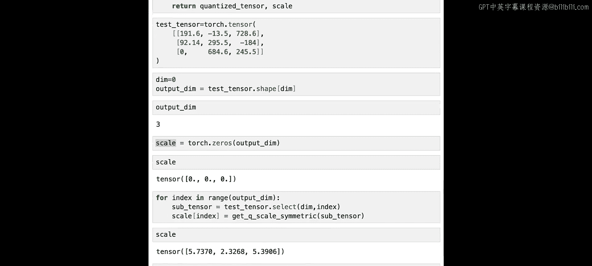

现在，为了确保正确，让我们检查一下子张量的样子。我们应该为每一行得到一个张量。确实，我们能够将每一行提取为一个张量。

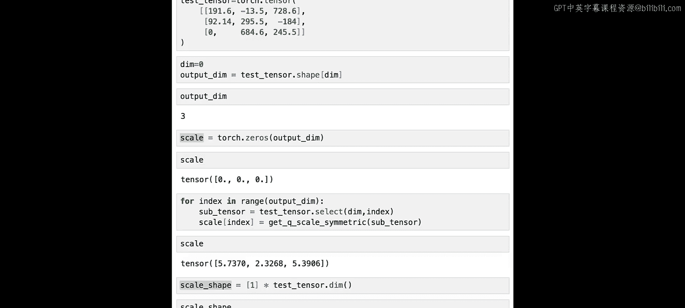

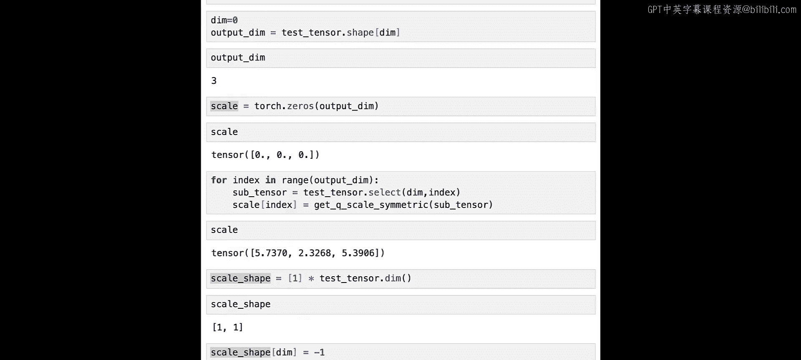

现在，我们成功获取了子张量，接下来需要做的就是将 `get_Q_scale_symmetric` 函数应用于该子张量，以获取与该行相关的缩放因子，并将其存储在缩放因子张量中。

因此，我们需要在缩放因子张量的索引位置，设置该特定子张量的缩放因子。为此，我们将使用 `get_Q_scale_symmetric` 函数，并传递子张量。

现在，让我们检查缩放因子张量的样子。我们确实成功将与每一行相关的缩放因子存储在这个张量中。

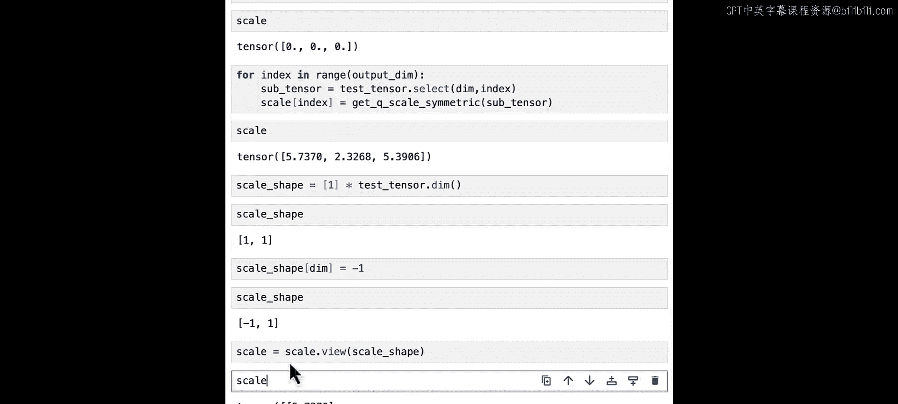

现在我们已经存储了所有的缩放因子，我们需要进行一些处理，以重塑缩放因子张量的形状，使得当我们用原始张量除以缩放因子张量时，每一列都能被正确的缩放因子除。为此，我们定义缩放因子张量应具有的形状。

让我们看看这个缩放形状。它充满了1。然后，我们需要将缩放形状在索引 `dim` 处设置为 `-1`，这将给我们所需的形状。最后，我们需要使用 `view` 方法，利用我们刚刚定义的缩放形状来重塑缩放因子张量。

我们得到了以下缩放因子，这就是我们需要的缩放因子，以便能够将原始张量除以缩放因子张量，使得每一行被缩放因子的每个值除。我知道这有点复杂，因为它涉及到如何在PyTorch中实现张量除以张量。

让我们看一个例子，以理解 `view` 如何工作，以及如何以这种方式除张量，使得你能够除每一行或每一列。

假设我们有以下矩阵。并且我们有以下缩放因子，就像在前面的例子中一样。这个缩放因子的形状是3。我们可以重塑这个张量，使得第一个维度的大小为1，第二个维度可以包含其余部分。为此，我们可以使用 `view` 函数。缩放因子的形状是3。

我们可以使用 `view` 函数重塑它。例如，我们可以重塑它，使得第一个维度是1，第二个维度是3。正如预期的那样，我们得到了一个大小为1x3的张量。另一种方法是直接用 `-1` 替换3。这样做可以让你找到正确的形状，其中你放置了 `-1`。

你也可以重塑 `S`，使得第一个维度最终为3，最后一个维度为1。

现在，让我们尝试沿行除矩阵 `M`。因此，为了除每一行，我们需要的缩放因子是这个。正如你所看到的，缩放形状如下：第一个维度是3，第二个维度是1。让我们执行除法。

正如你所看到的，我们成功地沿行进行了除法。你可以看到这一行没有被改变，因为它被1除；第二行被5除；最后一行，第三行被10除。

如果我们使用以下缩放因子代替，具有以下形状：1x3。并且我们用这个特定的缩放因子除矩阵，我们看到在这种情况下，我们用缩放因子除了每一列。所以这里，正如你所看到的，这一列没有被改变。我们有1、4和7。第二列被5除，最后一列被10除。

现在，让我们回到量化我们的张量。如果你还记得，我们最终得到的缩放因子如下。如果我们检查这个缩放因子的形状。这是缩放因子的正确形状，以便量化每一行。

现在，我们需要做的就是量化张量。使用我们在上一个实验中调用的 `linear_Q_with_scale_and_zero_point` 函数，我们只需要传递测试张量、缩放因子和零点（由于我们进行对称量化，零点应为零）。

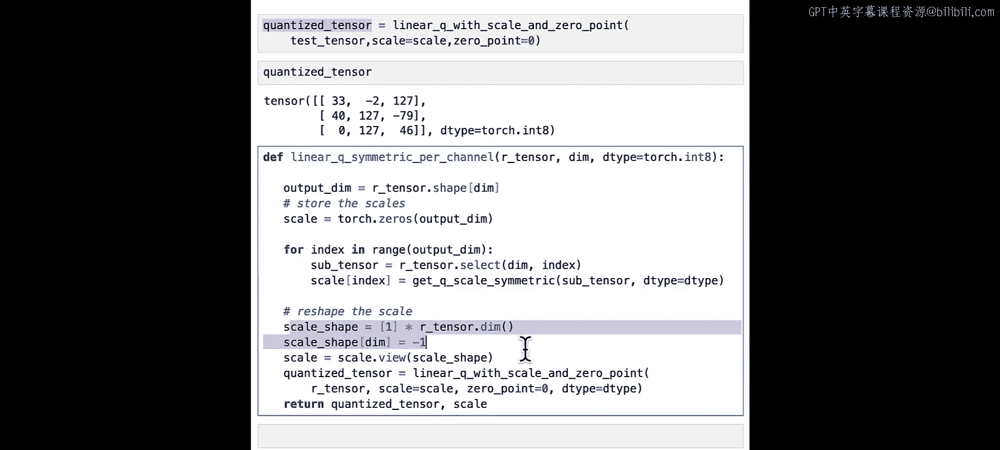

正如你所看到的，我们最终得到了以下量化张量。

现在，让我们把所有我们做的放入一个名为 `linear_Q_symmetric_per_channel` 的函数中。

正如你在这里看到的，我们获取输出维度。我们创建具有输出维度形状的缩放因子张量。我们遍历输出维度，对于每个索引，我们获取子张量，并将缩放因子存储在索引位置，然后我们重塑缩放因子。最后，我们使用 `linear_Q_with_scale_and_zero_point` 函数获取量化张量。

就这样，我们得到了量化张量和缩放因子。

现在，我们有了我们的函数，让我们检查一下我们是否确实能够沿特定维度量化。所以，我将重新粘贴我们之前定义的测试张量，这次我们将沿第一个维度和第二个维度量化，因此我们将有量化张量0和缩放因子0，我们通过使用 `linear_Q_symmetric_per_channel` 函数得到这些，并且我们需要指定我们量化的维度是0。

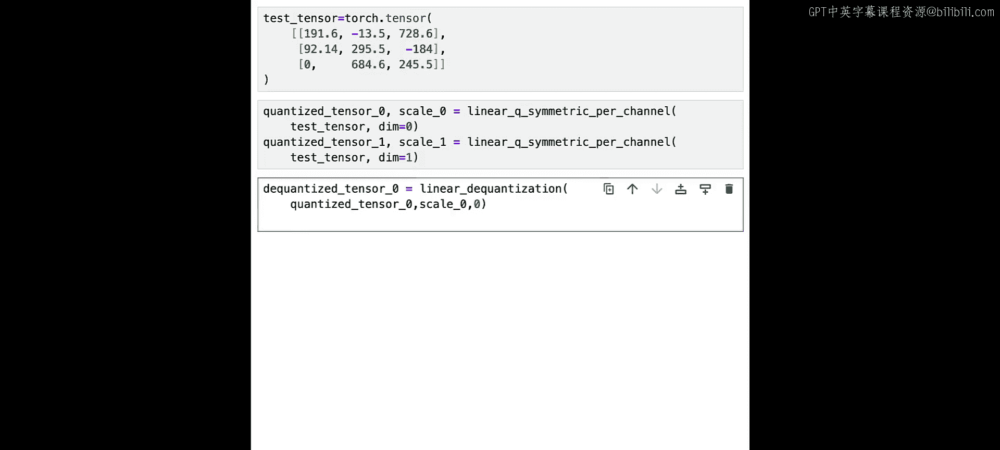

让我们对另一个维度做同样的事情。所以我们将称它为量化张量1和缩放因子1。

为了得到总结，我们还需要对每个张量进行反量化。所以，让我们先做维度等于0的情况。我们有反量化张量和缩放因子0。这等于线性反量化，我们需要指定量化张量_0、它的缩放因子和零点（因为零点等于0）。

现在，我们有了使用 `plot_quantization_error` 函数获取总结所需的一切。

就这样。正如你所看到的，我们确实沿行进行了量化。你可以看到我们在这里有最大量化值127，这里，这里和这里。量化效果相当好，正如你所看到的，原始张量非常接近反量化张量，并且量化误差张量并不那么糟糕。

让我们通过计算量化误差来获得一个更好的度量。我们得到了1.8的量化误差。如果我们还记得，当我们进行逐张量对称线性量化时，量化误差大约在2.5左右。

现在，让我们检查一下如果我们沿列量化会发生什么。我们将做与上面相同的事情，但是使用量化张量_1。所以，正如你在这里看到的，我们通过使用线性反量化定义了反量化张量_1，并传递了量化张量_1和缩放因子1，然后我们绘制了量化误差。这将给我们以下总结。正如你在这里看到的，我们这次确实成功地沿列进行了量化。量化误差甚至更低。你看到在这两种情况下，与逐张量量化相比，我们都得到了更低的量化误差。这是因为异常值只会影响它所在的通道，而不是整个张量。

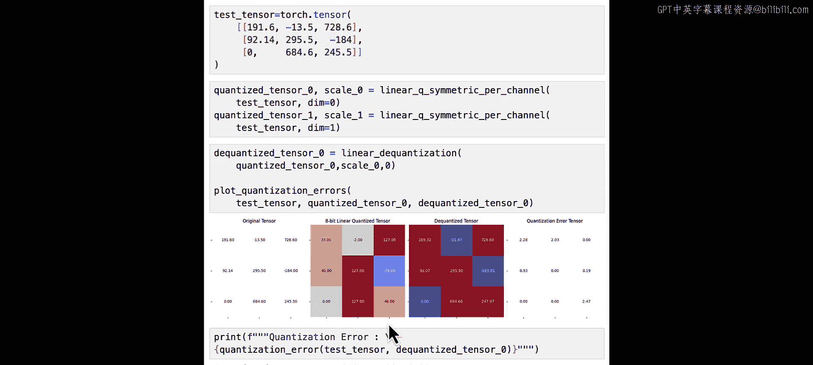

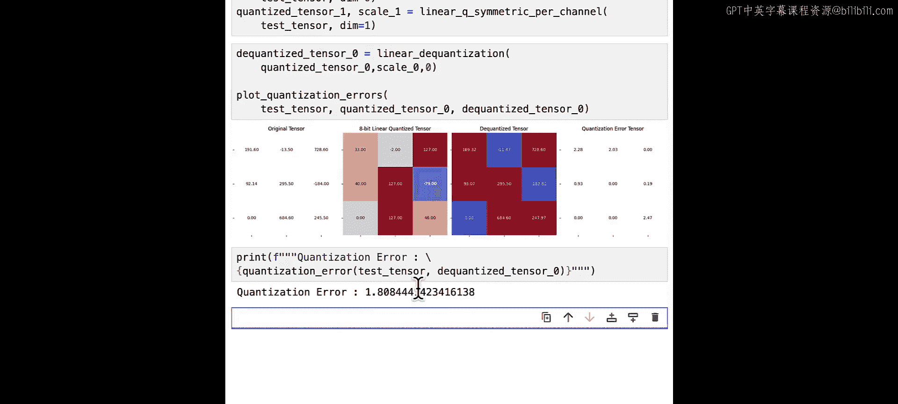

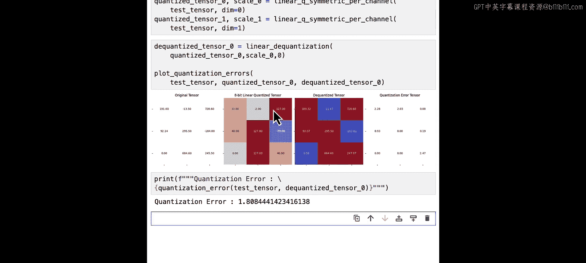

## 总结

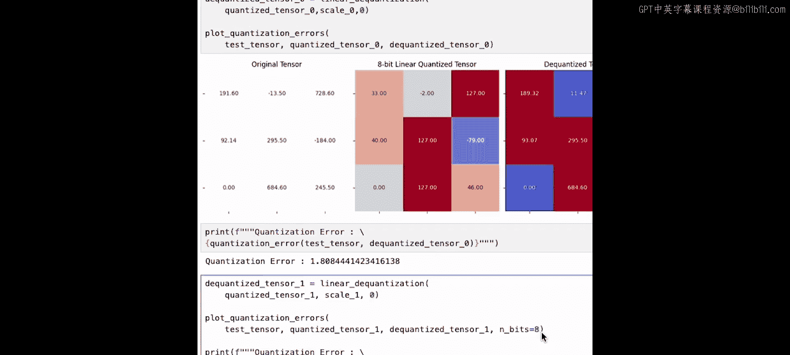

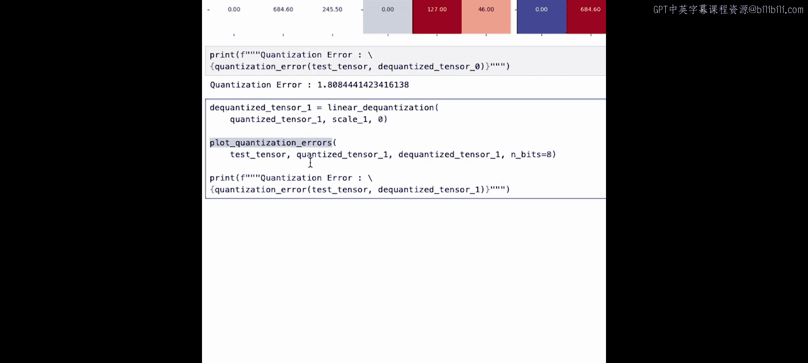

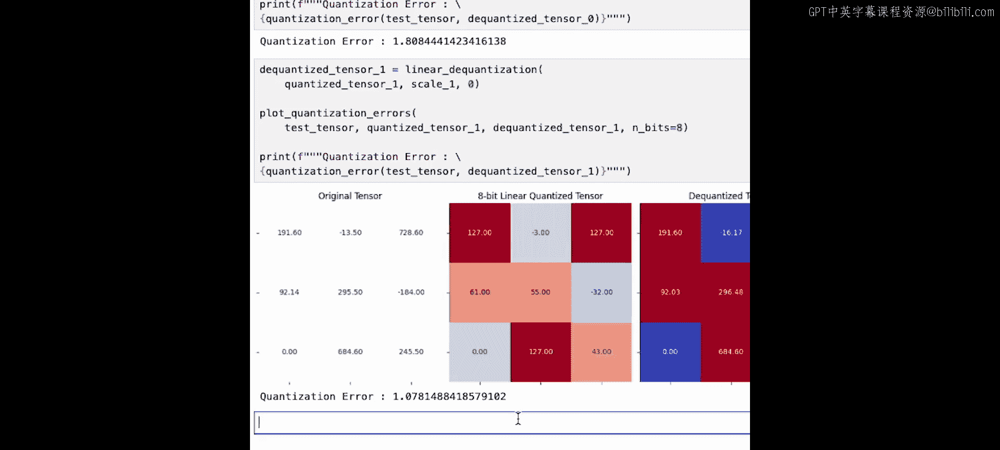

本节课中我们一起学习了逐通道量化的原理与实现。我们了解到，通过为张量的每个通道（行或列）使用独立的缩放因子，可以显著降低量化误差，尤其是当数据中存在异常值时。我们实现了对称模式下的逐通道量化函数，并通过实例验证了其优于逐张量量化的效果。