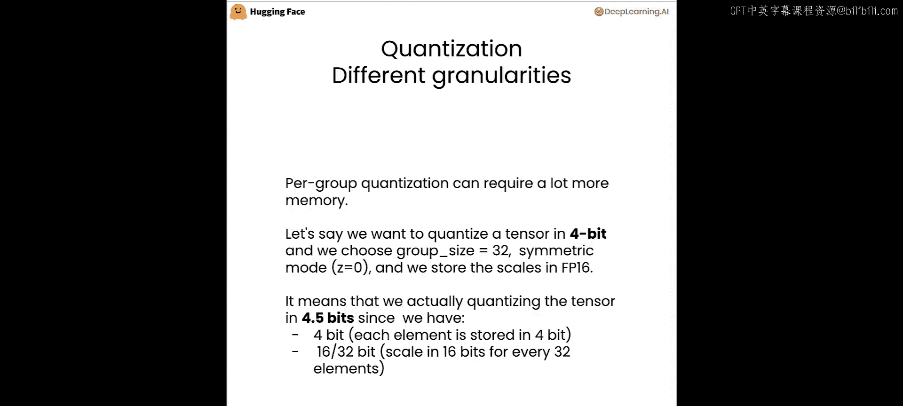
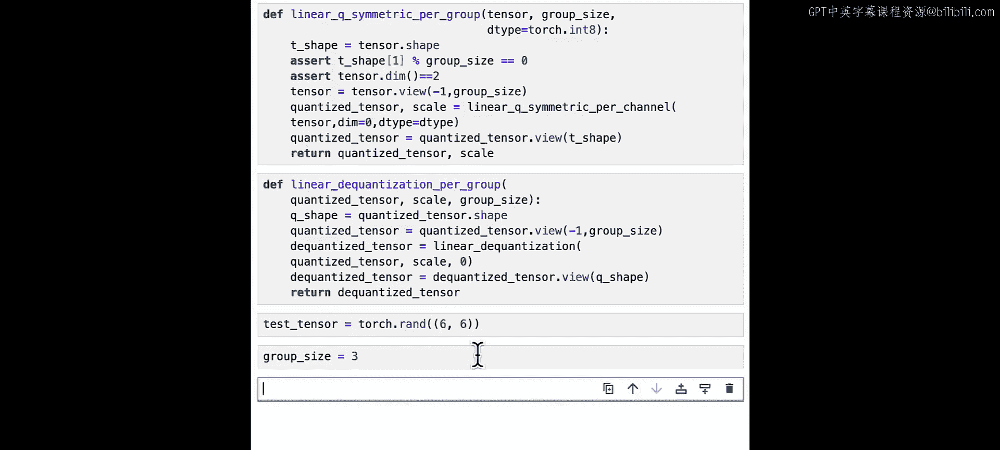
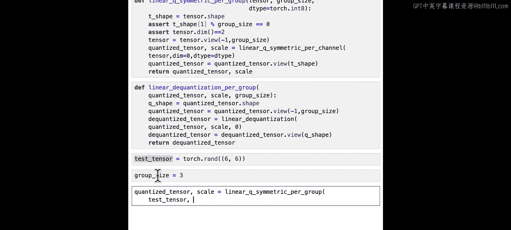
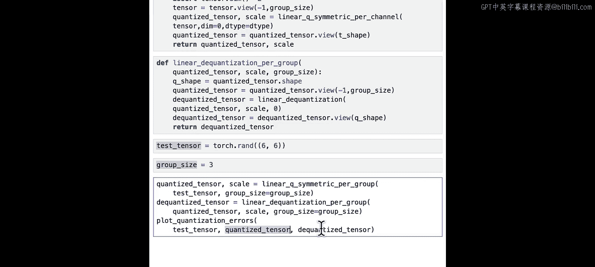
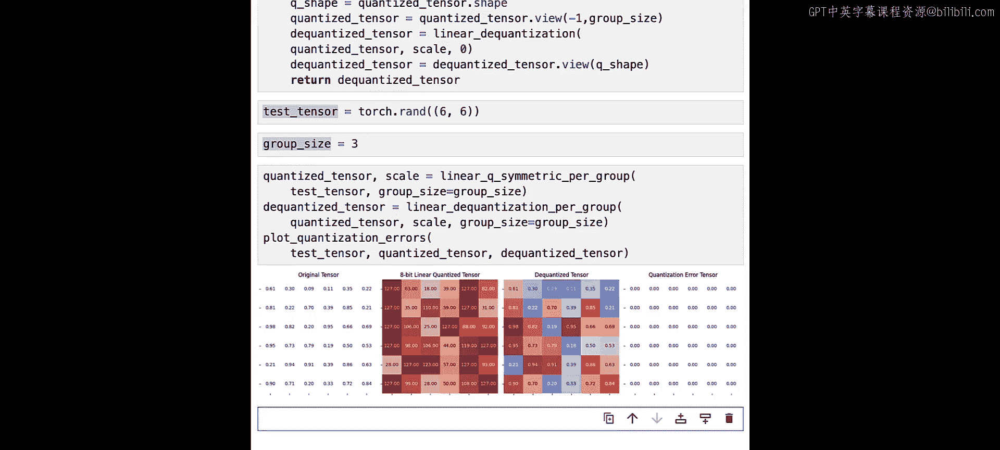
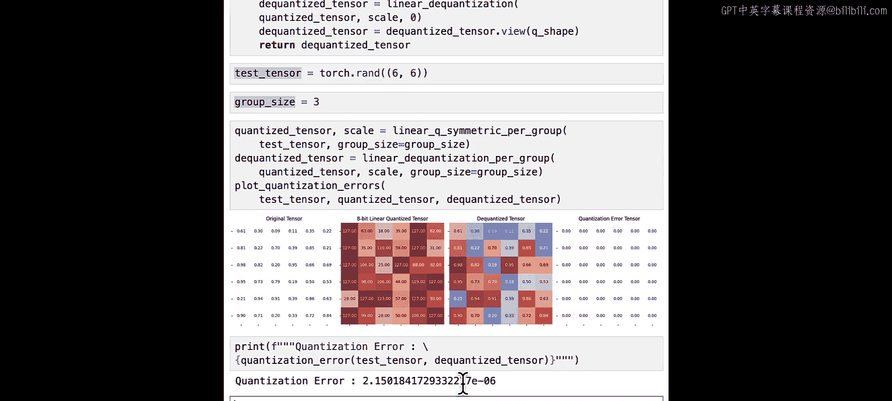
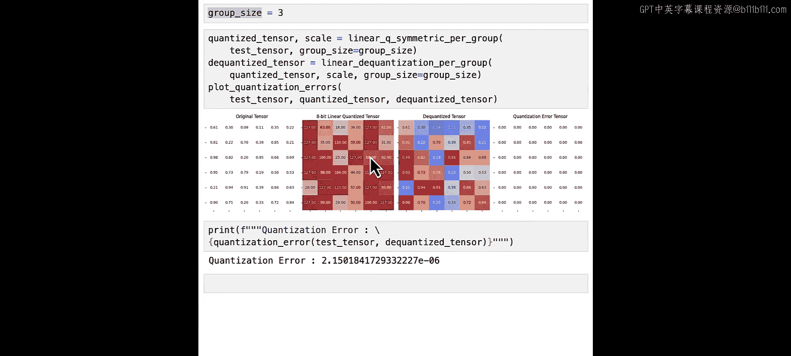
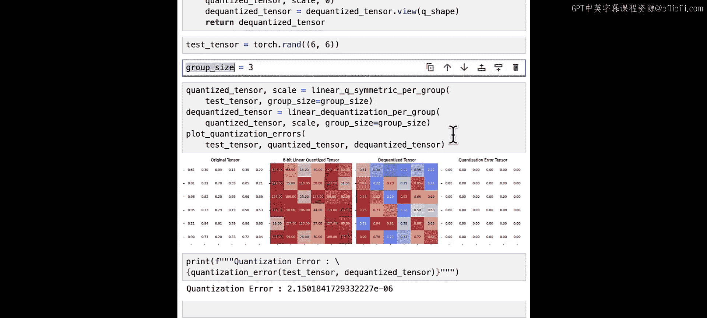

# 008：分组量化 🧩

在本节课中，我们将学习分组量化技术。这是一种更精细的量化方法，通过将张量元素分组并分别进行量化，可以在保持精度的同时，实现更低的存储开销。

上一节我们介绍了逐通道量化，本节中我们来看看如何将量化粒度进一步细化到元素组。

## 分组量化原理

分组量化对张量中每组 `n` 个元素执行量化。常见的 `n` 值为 32、64 或 128。分组量化有时需要较多内存。



假设我们想将一个张量量化为 4 比特，并选择组大小为 32。我们使用对称模式，这意味着零点等于 0。我们将缩放因子存储在 `float16` 格式中。这意味着我们实际上是以 4.5 比特来量化张量，因为每个元素用 4 比特存储，并且每 32 个元素需要存储一个 16 比特的缩放因子。

对于每个元素，你用 4 比特存储它，但你也有量化参数，需要每 32 个元素存储一次 16 比特的缩放因子。所以是每 32 个元素 16 比特。

## 代码实现

现在让我们开始编码。为了简单起见，我们将限制张量为二维，并使用对称模式。你不需要关注这段代码，因为我们将在笔记本中编码。

以下是实现分组量化的函数 `linear_quantize_symmetric_per_group`：

```python
def linear_quantize_symmetric_per_group(tensor, group_size, dtype=torch.int8):
    # 获取张量形状
    original_shape = tensor.shape
    # 确保张量是二维的，且行数能被组大小整除
    assert len(original_shape) == 2, "Tensor must be 2D"
    assert original_shape[1] % group_size == 0, "Row dimension must be divisible by group size"

    # 重塑张量，使每行包含 `group_size` 个元素
    # 使用 -1 让 PyTorch 自动推断第一维的大小
    reshaped_tensor = tensor.view(-1, group_size)

    # 使用之前编写的逐通道量化函数对重塑后的张量进行量化
    # 沿行（维度1）进行量化
    quantized_tensor, scale = linear_quantize_symmetric_per_channel(reshaped_tensor, dim=1, dtype=dtype)

    # 将量化后的张量重塑回原始形状
    quantized_tensor = quantized_tensor.view(original_shape)

    return quantized_tensor, scale
```

现在我们已经编写了分组量化函数，接下来编写分组反量化函数 `linear_dequantize_per_group` 以验证结果。

```python
def linear_dequantize_per_group(quantized_tensor, scale, group_size):
    # 获取量化张量的形状
    quantized_shape = quantized_tensor.shape

    # 重塑量化张量，使每行包含 `group_size` 个元素
    reshaped_quantized = quantized_tensor.view(-1, group_size)

    # 使用之前编写的反量化函数进行反量化
    # 对称量化下零点为0
    zero_point = 0
    dequantized_tensor = linear_dequantize(reshaped_quantized, scale, zero_point)

    # 将反量化后的张量重塑回原始形状
    dequantized_tensor = dequantized_tensor.view(quantized_shape)

    return dequantized_tensor
```

## 测试实现

现在让我们测试我们的实现。我们将测试一个大小为 6x6 的随机张量，并将组大小设置为 3。

```python
# 创建测试张量
test_tensor = torch.randn(6, 6)
group_size = 3

# 执行分组量化
quantized_tensor, scale = linear_quantize_symmetric_per_group(test_tensor, group_size)



# 执行分组反量化
dequantized_tensor = linear_dequantize_per_group(quantized_tensor, scale, group_size)



# 绘制量化误差图以总结量化过程
plot_quantization_error(test_tensor, quantized_tensor, dequantized_tensor)
```

观察量化张量，你会看到每一行中每三个元素的最大值为 127。这表明我们确实成功地沿着行方向对矩阵中每三个元素进行了量化。反量化张量与原始张量几乎相同。

让我们也使用反量化误差函数打印误差：

```python
error = dequantization_error(test_tensor, dequantized_tensor)
print(f"Dequantization error: {error}")
```



确实，我们得到了非常低的量化误差。



现在是暂停视频并尝试一些操作的好时机。你可以尝试更改测试张量，或者更改组大小，以观察组大小对量化过程的影响。

## 总结







本节课中我们一起学习了分组量化技术。我们了解了其基本原理，即对张量元素进行分组并分别量化，从而在比特精度和模型精度之间取得平衡。我们实现了分组量化与反量化的核心函数，并通过实验验证了其有效性，观察到量化误差非常低。你可以通过调整组大小来探索其对量化效果的影响。