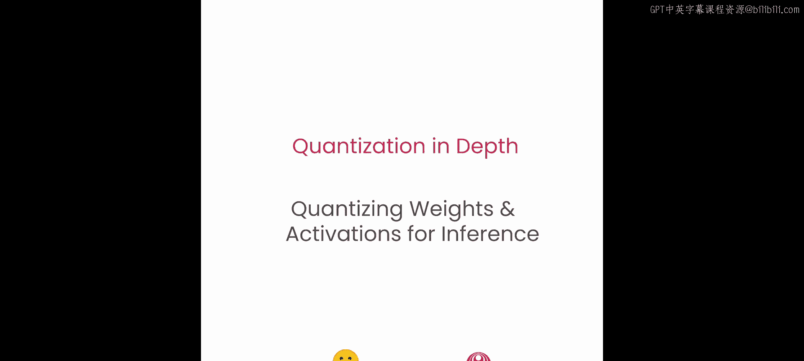
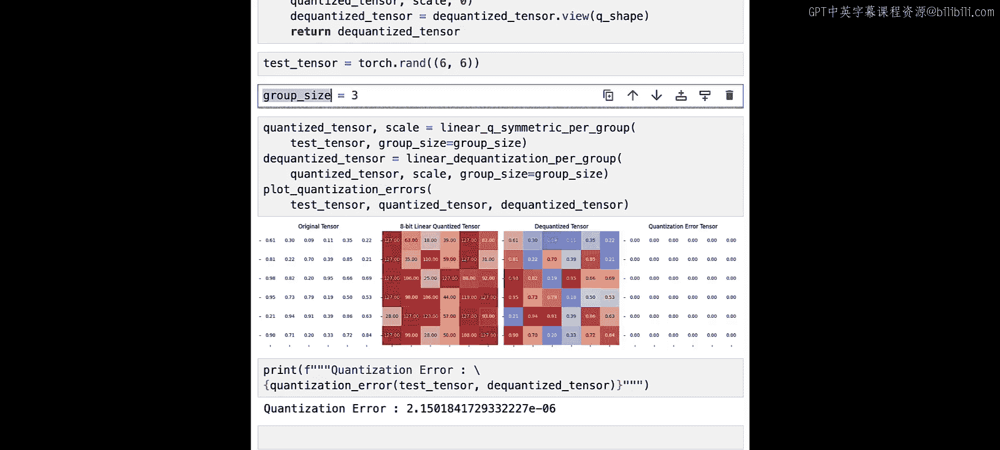
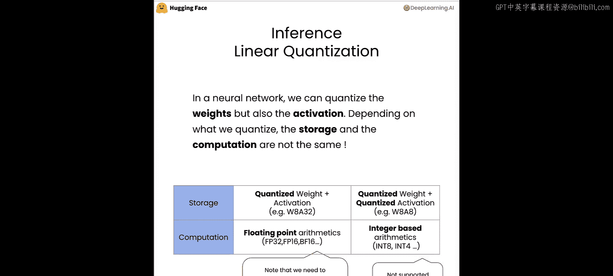
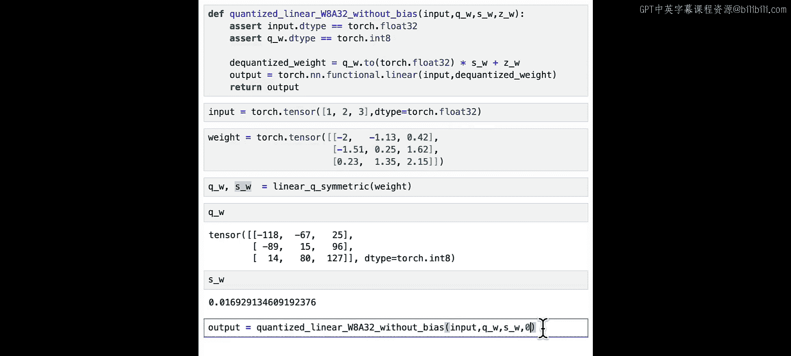
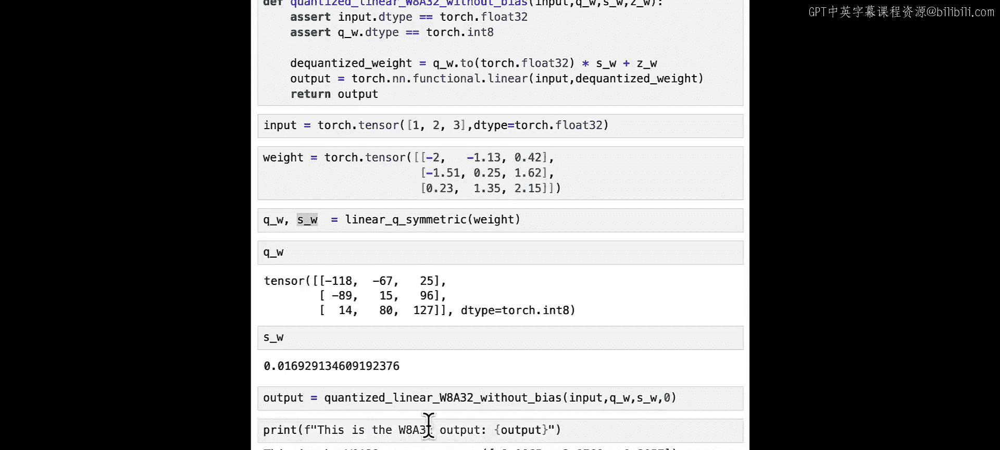
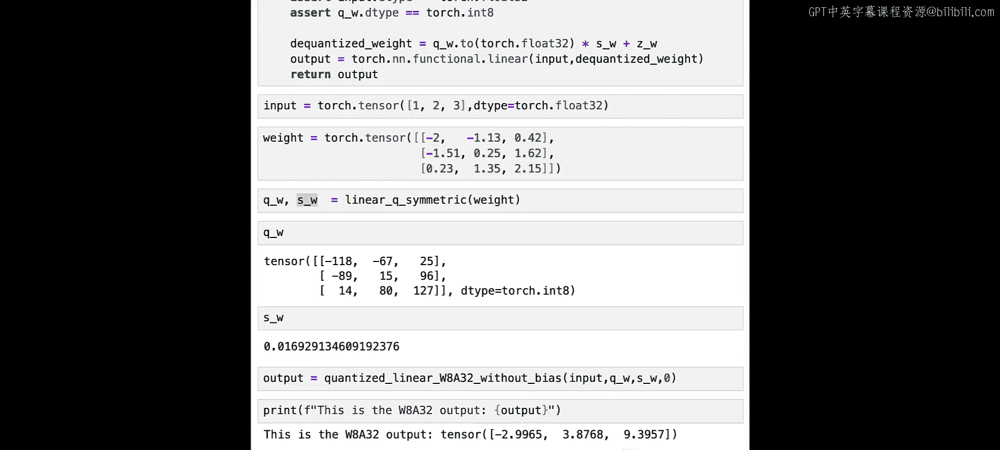
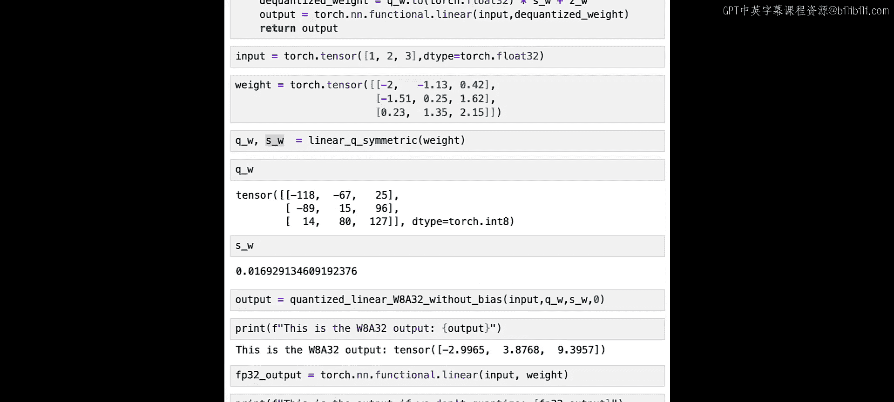
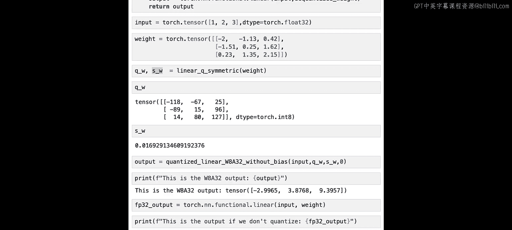

# 009：权重与激活值的量化推理 🧠



在本节课中，我们将学习如何在神经网络推理过程中，对权重和激活值应用线性量化。我们将探讨仅量化权重与同时量化权重和激活值两种场景的区别，并通过代码示例演示如何实现一个无偏置的量化线性层。

---

## 量化推理的两种模式 🔄

上一节我们介绍了线性量化的基本原理，本节中我们来看看如何在神经网络推理中应用它。

对权重和激活值进行量化时，存储和计算的方式并不相同。因此，量化策略主要分为两种模式：

1.  **仅量化权重 (W8A32)**：在这种模式下，模型的权重被量化为8位整数进行存储，但在计算时会被反量化为浮点数。因此，计算过程仍然使用浮点运算（如FP32、FP16或BF16）。
2.  **同时量化权重和激活值 (W8A8)**：在这种模式下，权重和激活值都被量化为8位整数。计算过程可以直接使用整数运算，这能带来更大的加速和内存节省。但请注意，并非所有硬件都支持高效的整数运算。

---

## 实现 W8A32 量化线性层 💻



现在，让我们看看当输入（激活值）保持为32位浮点数，而权重被量化为8位时，如何编写一个线性层。为了简化，我们实现一个无偏置的线性层。



以下是实现一个量化线性层（无偏置）所需的关键步骤：

```python
def quantized_linear_no_bias(input, quantized_weight, scale, zero_point):
    # 输入应为 torch.float32
    # 量化权重应为 torch.int8

    # 1. 将量化后的权重反量化回浮点数
    dequantized_weight = quantized_weight.to(torch.float32) * scale + zero_point

    # 2. 使用反量化后的权重执行标准的线性层计算
    output = torch.matmul(input, dequantized_weight.T)  # 假设权重已转置
    return output
```

**代码解析**：
*   `input`：线性层的输入，数据类型为 `torch.float32`。
*   `quantized_weight`：已量化的权重，数据类型为 `torch.int8`。
*   `scale` 和 `zero_point`：用于权重反量化的比例因子和零点。
*   函数首先将 `int8` 权重重构为 `float32`，然后执行矩阵乘法。

---

## 代码示例与验证 ✅

让我们通过一个简单的例子来验证上述函数。

首先，定义输入和权重：

```python
import torch

# 定义输入和原始权重
input = torch.tensor([[1.0, 2.0, 3.0]])
weights = torch.tensor([[0.1, 0.2], [0.3, 0.4], [0.5, 0.6]])
```

接着，使用对称线性量化对权重进行量化：

```python
# 假设 linear_symmetric_quantize 是一个实现对称量化的函数
quantized_weight, scale = linear_symmetric_quantize(weights)
# 对于对称量化，zero_point 通常为 0
zero_point = 0
```

然后，使用我们的量化线性层函数进行计算：

```python
output_quant = quantized_linear_no_bias(input, quantized_weight, scale, zero_point)
print("量化计算输出 (W8A32):", output_quant)
```



最后，我们使用原始浮点权重进行计算以作对比：

```python
output_fp32 = torch.matmul(input, weights.T)
print("原始浮点计算输出 (FP32):", output_fp32)
```



运行后你会发现，`output_quant` 和 `output_fp32` 的值非常接近，这证明了我们权重量化与反量化过程的有效性。



---

## 总结 📝

本节课中我们一起学习了神经网络推理中的量化应用：
1.  我们区分了 **仅量化权重 (W8A32)** 和 **同时量化权重与激活值 (W8A8)** 两种模式，前者使用浮点计算，后者使用整数计算但需要硬件支持。
2.  我们重点实现了 **W8A32** 模式下的一个无偏置量化线性层。其核心步骤是：将存储的 `int8` 权重通过 `scale` 和 `zero_point` **反量化**为 `float32`，再进行标准的矩阵乘法。
3.  通过一个简单的代码示例，我们验证了量化计算的结果与原始浮点计算的结果基本一致。





在接下来的课程中，我们将利用在此学到的所有知识，构建一个完整的8比特量化器，并将其应用到真实的模型中。