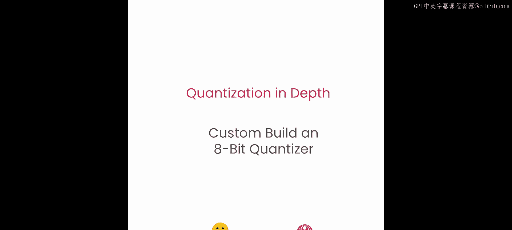
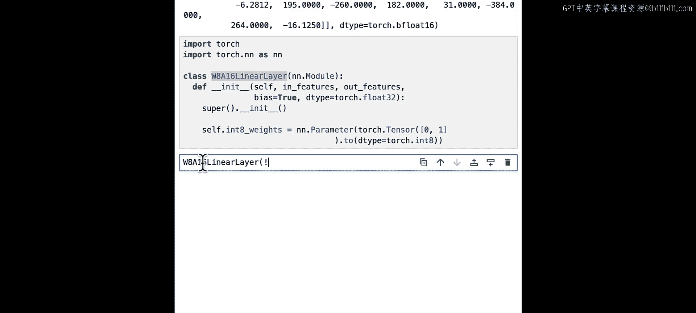
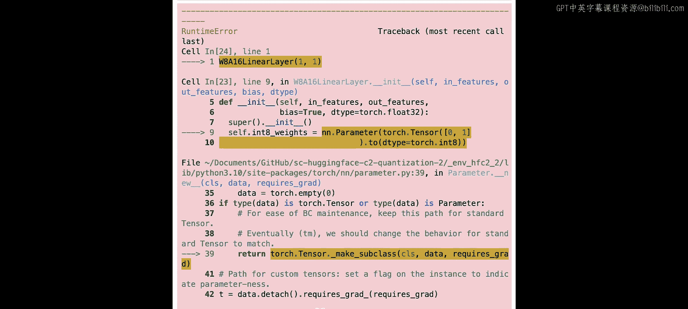
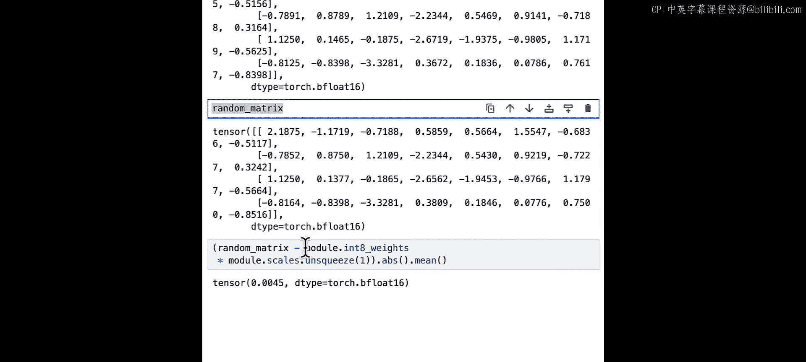

# 010：构建自定义8位量化器 🛠️




在本节课中，我们将学习如何利用之前构建的工具，创建一个自定义的量化器，以便以8位精度量化任何模型。这个量化器是模型无关的，意味着你可以将其应用于视觉、音频、文本甚至多模态模型。让我们开始量化一些模型吧。


## 概述 📋

上一节我们介绍了线性量化的基本概念，本节中我们将动手实践，构建一个完整的量化器。我们将学习如何创建一个W8A16线性层类，用它替换模型中的所有线性层，并最终构建一个端到端的量化器。我们还将测试量化器在不同场景下的效果，并研究8位量化对模型的影响。

## 构建W8A16线性层类 🧱

我们的第一个任务是构建一个名为W8A16的线性层类。W8代表8位权重，A16代表16位激活值。我们将使用这个类来存储8位权重和缩放因子，就像上一课中看到的那样。

### 实现前向传播方法

首先，我们需要构建一个名为 `W8A16_forward` 的方法。这个方法将作为我们线性层前向传播的核心。

以下是该方法需要执行的步骤：
1.  将8位权重转换为与输入相同的数据类型。
2.  执行输入与转换后权重之间的矩阵乘法。
3.  将结果与缩放因子相乘。
4.  可选地加上偏置项。

让我们开始实现。首先导入必要的模块，并定义一些随机输入用于测试。

```python
import torch
import torch.nn.functional as F

def W8A16_forward(input, int8_weights, scales, bias=None):
    # 步骤1：将权重转换为与输入相同的数据类型
    cast_weights = int8_weights.to(input.dtype)
    # 步骤2：执行线性操作（矩阵乘法）
    output = F.linear(input, cast_weights)
    # 步骤3：乘以缩放因子
    output = output * scales.view(1, -1)  # 确保形状可广播
    # 步骤4：可选地加上偏置
    if bias is not None:
        output = output + bias
    return output
```

现在，让我们快速测试一下这个方法在有偏置和无偏置情况下的表现。

```python
# 定义测试数据
batch_size, seq_len, in_features, out_features = 2, 5, 8, 4
hidden_states = torch.randn(batch_size, seq_len, in_features)
int8_weights = torch.randint(-128, 127, (out_features, in_features), dtype=torch.int8)
scales = torch.randn(out_features)
bias = torch.randn(out_features)

# 测试无偏置
output_no_bias = W8A16_forward(hidden_states, int8_weights, scales)
print(f"无偏置输出形状: {output_no_bias.shape}")

# 测试有偏置
output_with_bias = W8A16_forward(hidden_states, int8_weights, scales, bias)
print(f"有偏置输出形状: {output_with_bias.shape}")
```

### 实现线性层类的初始化方法

接下来，我们将利用刚刚创建的方法来构建完整的线性层类。这个类需要存储 `int8` 权重、缩放因子和可选的偏置。

一个关键的注意事项是：在PyTorch中，`int8` 张量目前无法直接计算梯度。因此，我们不能使用 `nn.Parameter` 来存储它们，而应该使用 `register_buffer` 方法。

```python
class W8A16Linear(torch.nn.Module):
    def __init__(self, in_features, out_features, bias=True, dtype=torch.float32):
        super().__init__()
        self.in_features = in_features
        self.out_features = out_features

        # 使用register_buffer存储int8权重和缩放因子
        self.register_buffer("int8_weights", torch.randint(-128, 127, (out_features, in_features), dtype=torch.int8))
        self.register_buffer("scales", torch.ones(out_features, dtype=dtype))

        # 存储偏置
        if bias:
            self.register_buffer("bias", torch.zeros(out_features, dtype=dtype))
        else:
            self.bias = None

    def forward(self, x):
        # 调用我们之前定义的全局前向传播函数
        return W8A16_forward(x, self.int8_weights, self.scales, self.bias)
```

让我们创建一个虚拟实例来验证属性是否正确保存。

```python
dummy_layer = W8A16Linear(8, 4, bias=True)
print(f"权重形状: {dummy_layer.int8_weights.shape}")
print(f"缩放因子形状: {dummy_layer.scales.shape}")
print(f"偏置形状: {dummy_layer.bias.shape}")
```





### 实现量化方法

目前，我们的线性层权重是随机的。为了使其真正有用，我们需要一个 `quantize` 方法，将原始的高精度权重（例如FP16或BF16）量化为 `int8` 并计算相应的缩放因子。

量化的工作流程如下：
1.  获取原始权重并将其转换为FP32以保证稳定性。
2.  使用每通道绝对值最大（AbsMax）量化公式计算缩放因子。
3.  使用缩放因子将权重量化为 `int8`。
4.  将计算出的 `int8` 权重和缩放因子赋值给我们的线性层。

以下是 `quantize` 方法的实现：

```python
def quantize(self, original_weights):
    # 步骤1：将权重转换为FP32
    weights_fp32 = original_weights.to(torch.float32)

    # 步骤2：计算每通道的缩放因子
    # 公式: scale = max(abs(weight)) / 127
    scales = torch.max(torch.abs(weights_fp32), dim=1).values / 127
    scales = scales.to(original_weights.dtype)  # 保持与原始权重相同的数据类型
    self.scales.copy_(scales)

    # 步骤3：量化权重为int8
    # 公式: int8_weights = round(weights / scale)
    int8_weights = torch.clamp(torch.round(weights_fp32 / scales.view(-1, 1)), -128, 127).to(torch.int8)
    self.int8_weights.copy_(int8_weights)
```

现在，我们将这个方法添加到我们的 `W8A16Linear` 类中。

```python
class W8A16Linear(torch.nn.Module):
    def __init__(self, in_features, out_features, bias=True, dtype=torch.float32):
        # ... 初始化代码与之前相同 ...
        pass

    def forward(self, x):
        # ... 前向传播代码与之前相同 ...
        pass

    def quantize(self, original_weights):
        weights_fp32 = original_weights.to(torch.float32)
        scales = torch.max(torch.abs(weights_fp32), dim=1).values / 127
        scales = scales.to(original_weights.dtype)
        self.scales.copy_(scales)

        int8_weights = torch.clamp(torch.round(weights_fp32 / scales.view(-1, 1)), -128, 127).to(torch.int8)
        self.int8_weights.copy_(int8_weights)
```

让我们测试一下量化过程。

```python
# 创建一个线性层实例
layer = W8A16Linear(8, 4, bias=True)
print("量化前的随机权重（部分）:", layer.int8_weights[0, :4])

# 创建一些模拟的“原始”高精度权重
original_weights = torch.randn(4, 8, dtype=torch.float16) * 0.1  # 小权重便于观察

# 执行量化
layer.quantize(original_weights)
print("量化后的权重（部分）:", layer.int8_weights[0, :4])
print("缩放因子:", layer.scales)

# 计算量化误差（反量化后与原始权重的差异）
dequantized_weights = layer.int8_weights.to(torch.float32) * layer.scales.view(-1, 1)
quant_error = torch.mean(torch.abs(dequantized_weights - original_weights.to(torch.float32)))
print(f"平均量化误差: {quant_error.item()}")
```

## 构建端到端量化器 🔄

现在我们已经有了一个功能完整的量化线性层，下一步是构建一个量化器，能够遍历整个模型，将其中的所有 `torch.nn.Linear` 层替换为我们的 `W8A16Linear` 层，并对权重进行量化。

以下是量化器需要执行的步骤：
1.  遍历模型的所有模块。
2.  识别出所有 `torch.nn.Linear` 层。
3.  用 `W8A16Linear` 层替换它们，并复制原有的偏置设置。
4.  调用新层的 `quantize` 方法，传入原始权重。

```python
def quantize_model(model):
    for name, module in model.named_children():
        # 如果当前模块是Linear层，则进行替换
        if isinstance(module, torch.nn.Linear):
            # 创建新的W8A16Linear层，继承原层的配置
            new_layer = W8A16Linear(
                in_features=module.in_features,
                out_features=module.out_features,
                bias=module.bias is not None,
                dtype=module.weight.dtype
            )
            # 如果有偏置，复制偏置值
            if module.bias is not None:
                new_layer.bias.copy_(module.bias)
            # 量化新层的权重
            new_layer.quantize(module.weight.data)
            # 用新层替换原层
            setattr(model, name, new_layer)
        else:
            # 如果当前模块不是Linear层，则递归进入其子模块
            quantize_model(module)
```

## 测试与应用 🧪

现在，让我们在一个简单的模型上测试我们的量化器，并观察其效果。

```python
# 创建一个简单的测试模型
class SimpleModel(torch.nn.Module):
    def __init__(self):
        super().__init__()
        self.linear1 = torch.nn.Linear(10, 20)
        self.relu = torch.nn.ReLU()
        self.linear2 = torch.nn.Linear(20, 5)

    def forward(self, x):
        x = self.linear1(x)
        x = self.relu(x)
        x = self.linear2(x)
        return x

# 实例化模型并转换为半精度（模拟常见场景）
model = SimpleModel().half()  # 转换为FP16
print("量化前模型结构:", model)

# 应用我们的量化器
quantize_model(model)
print("\n量化后模型结构:", model)

# 准备测试输入
test_input = torch.randn(2, 10).half()
# 运行量化后的模型
with torch.no_grad():
    output = model(test_input)
print(f"\n量化模型输出形状: {output.shape}")
```

## 总结 🎯

在本节课中，我们一起学习了如何从零开始构建一个自定义的8位量化器。我们首先深入探讨了如何创建 `W8A16Linear` 类，该类使用 `int8` 权重和 `float16` 激活值。我们解决了存储 `int8` 权重时无法计算梯度的问题，并通过 `register_buffer` 来正确存储它们。

接着，我们实现了关键的 `quantize` 方法，使用每通道AbsMax量化方案将原始高精度权重转换为 `int8` 格式并计算缩放因子。最后，我们构建了一个端到端的模型量化函数，能够自动遍历模型结构，替换线性层并完成权重量化。



通过本节课的学习，你现在已经掌握了构建一个模型无关、支持多种数据类型（FP16/BF16）的8位量化器的核心技能。这个量化器可以应用于视觉、音频、文本等各种模型，为在资源受限的设备上部署模型奠定了基础。