# 011：用量化层替换PyTorch层

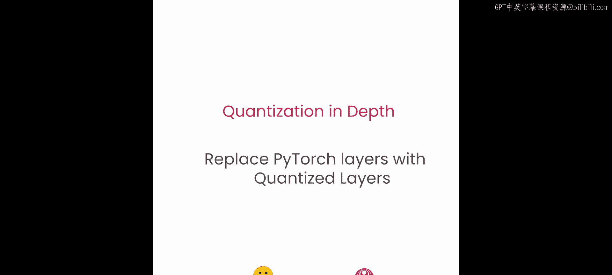


在本节课中，我们将学习如何构建一个量化器。这个量化器将作为一个量化流水线，遍历原始模型中的所有线性模块，并用我们新创建的W8A16线性层模块替换它们，同时使用原始权重对替换后的模块进行量化。让我们一步步来实现这个过程。

## 构建模块替换方法

首先，我们需要构建一个名为 `replace_linear_with_target` 的方法。这个方法将遍历模型，识别出所有属于 `torch.nn.Linear` 类的模块，并用新的模块替换它们。

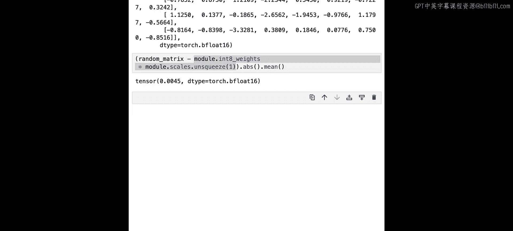

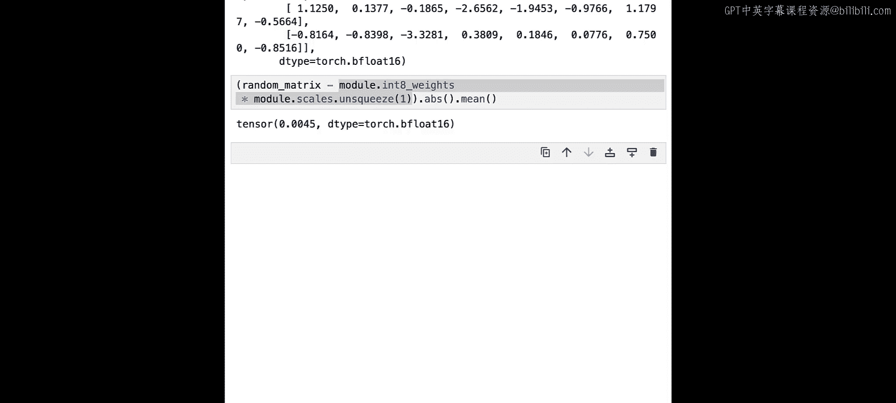

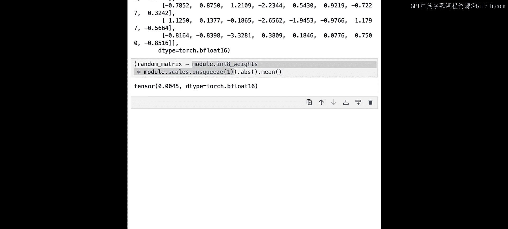

以下是该方法的签名：

```python
def replace_linear_with_target(module, target_class, module_names_to_exclude):
```

*   `module`： 可以是整个模型，也可以是某个子模块。由于该方法将递归调用，所以命名为 `module`。
*   `target_class`： 用于替换原线性层的新类。
*   `module_names_to_exclude`： 一个列表，包含在此替换逻辑中需要排除的模块名称。例如，在语言模型中，为了获得更好的效果，通常需要保持最后一个模块（如语言模型头）不被量化。这个参数将用于处理这类特定用例。

该方法的核心逻辑是遍历模型的所有命名子模块。以下是具体的步骤：

1.  遍历 `module.named_children()`。
2.  如果子模块是 `torch.nn.Linear` 的实例，并且其名称不在 `module_names_to_exclude` 列表中，则执行模块替换。
3.  获取原子模块的偏置（bias），因为创建新模块时需要用到它。
4.  创建新的模块实例：`new_module = target_class(in_features, out_features, bias=old_bias is not None)`。其中，输入特征数、输出特征数与原线性层保持一致。
5.  使用 `setattr(parent_module, name, new_module)` 将父模块中名为 `name` 的属性替换为 `new_module`。
6.  如果原子模块有偏置，则显式地将新模块的偏置设置为 `old_bias`。
7.  如果当前子模块不符合替换条件，则递归地对该子模块调用 `replace_linear_with_target` 方法。

## 测试模块替换方法

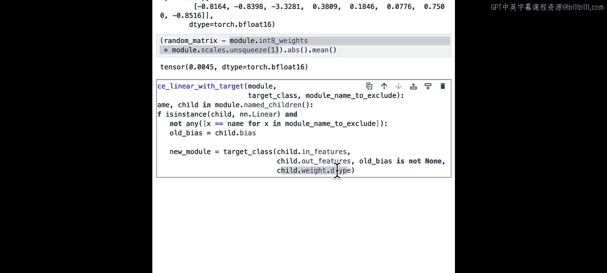

为了测试这个方法，我们创建一个用于测试的虚拟模型，它包含两个线性层和一个语言模型头（LM Head）。语言模型头通常是Transformer模型中的最后一个模块。

由于该方法会就地修改模型，我们将创建两个新模型进行测试：
*   `model1`： 用于测试 `module_names_to_exclude` 功能，我们将排除LM Head。
*   `model2`： 用于测试替换所有线性层实例。

让我们测试第一种情况：

```python
# 假设 LM Head 的名称为 ‘lm_head’
replace_linear_with_target(model1, W8A16Linear, module_names_to_exclude=[‘lm_head’])
```

测试结果表明，我们成功地将除了LM Head之外的所有线性层都替换成了新的量化层。

接下来，测试第二种情况，传入一个空列表：

```python
replace_linear_with_target(model2, W8A16Linear, module_names_to_exclude=[])
```

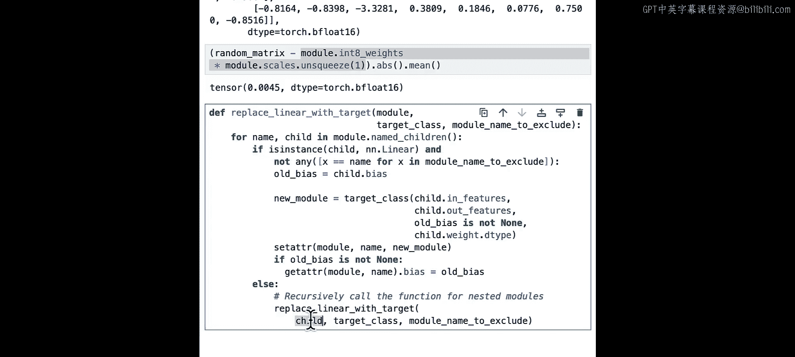

正如预期的那样，第二个模型中的所有线性层实例都被替换成了目标类。

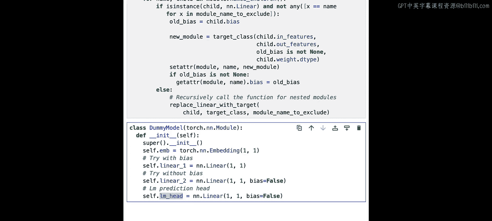

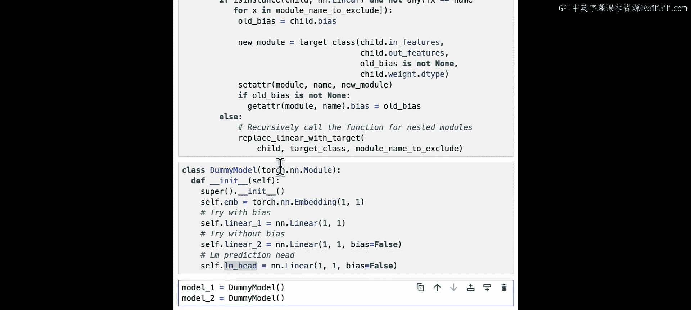

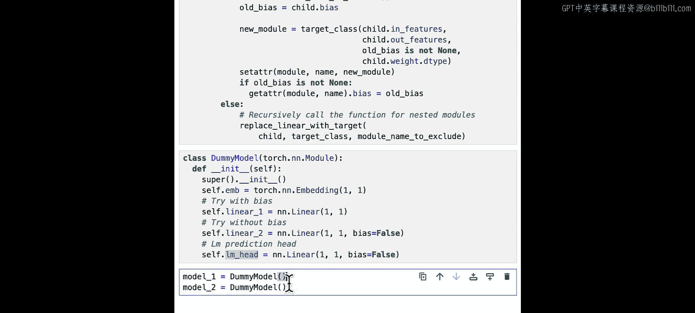

## 集成量化步骤

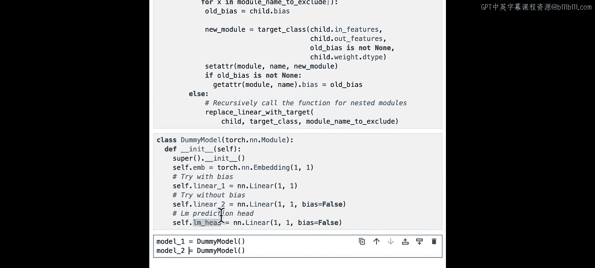

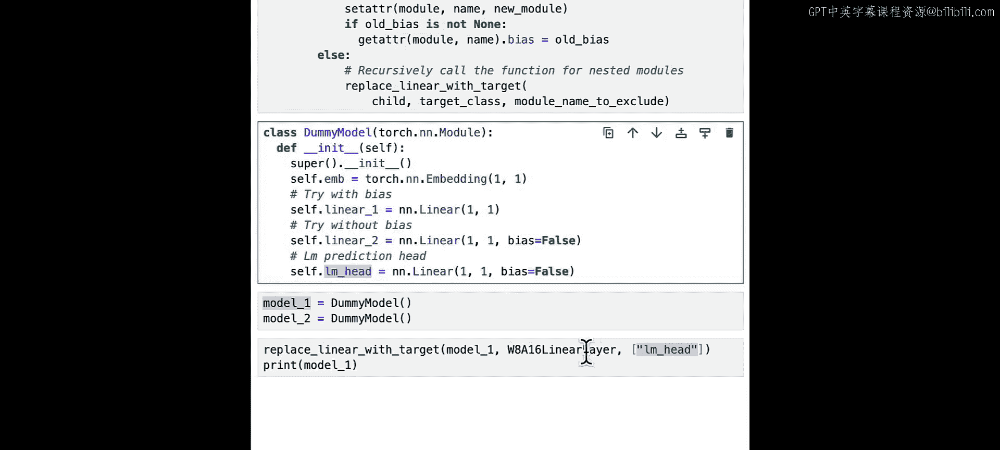

上一节我们成功实现了模块替换。现在，我们需要对这个方法进行一些调整，使其在替换模块后，能立即对新模块进行量化。

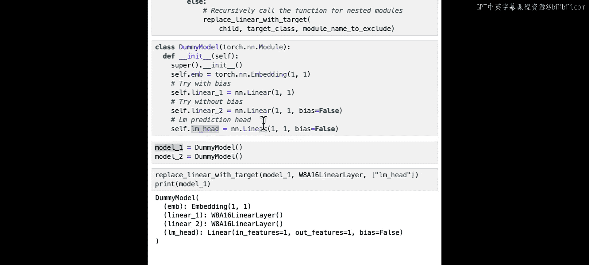

我们对 `replace_linear_with_target` 方法进行修改。在成功替换模块后，我们需要：

1.  通过 `getattr(parent_module, name)` 再次获取刚刚替换进去的新模块。
2.  调用新模块的 `.quantize(old_weight)` 方法，传入原始权重，完成量化。

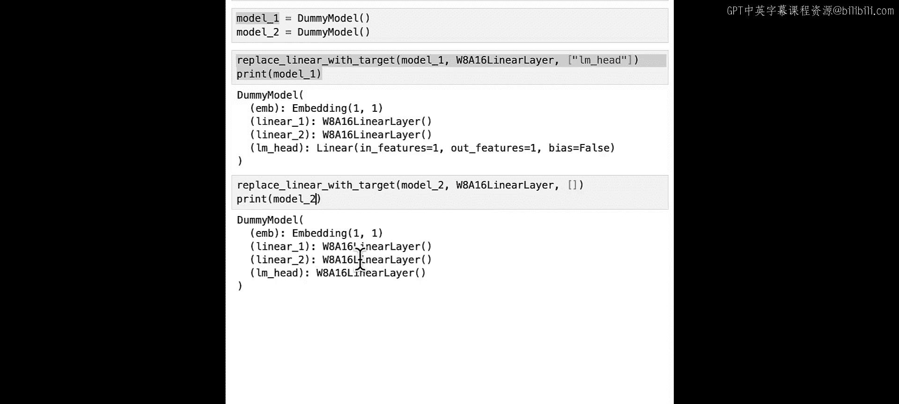

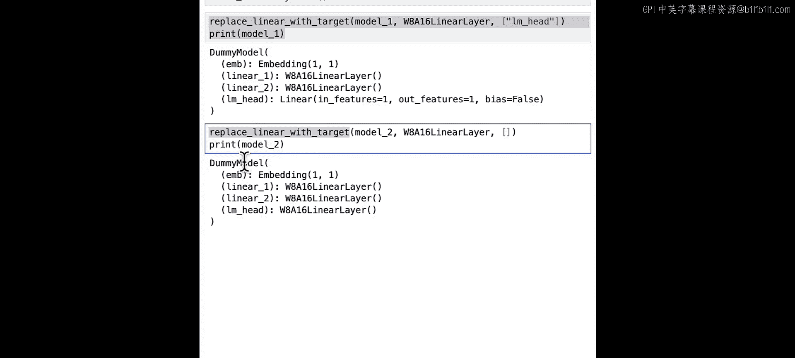

同时，也需要更新递归调用的部分，确保所有层级的替换都包含量化步骤。

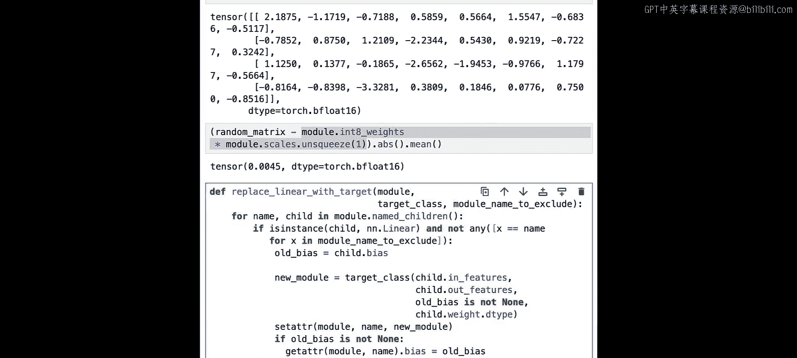

让我们用一个全新的虚拟模型来测试这个集成后的方法：

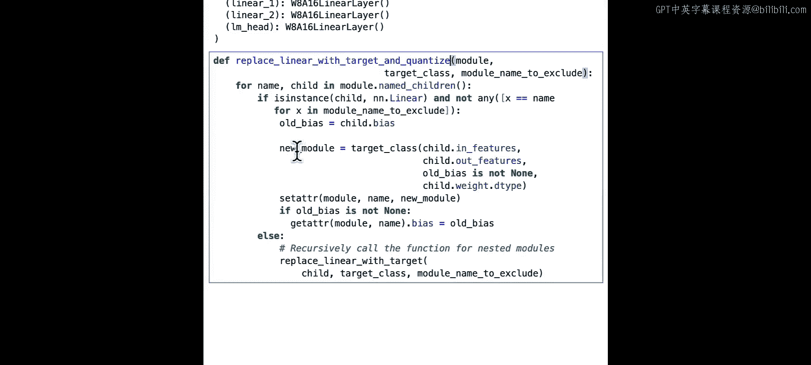

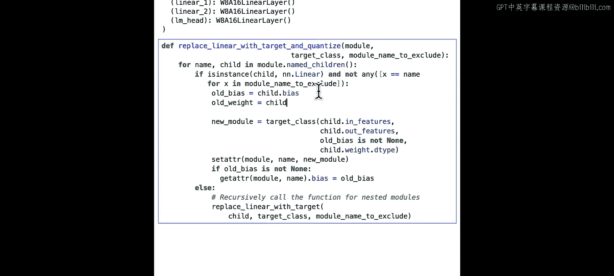

```python
replace_linear_with_target(new_dummy_model, W8A16Linear, module_names_to_exclude=[])
```

测试结果显示，方法运行成功。我们不仅替换了线性层，还完成了权重量化。

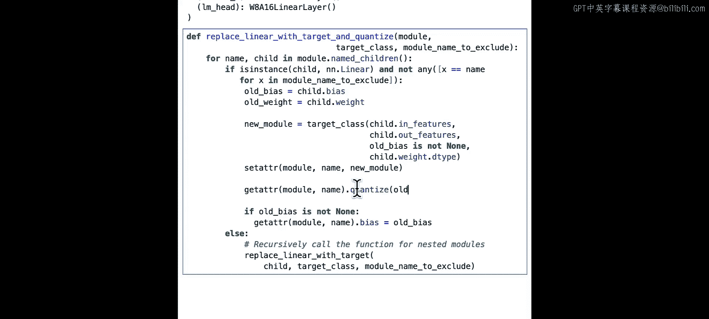

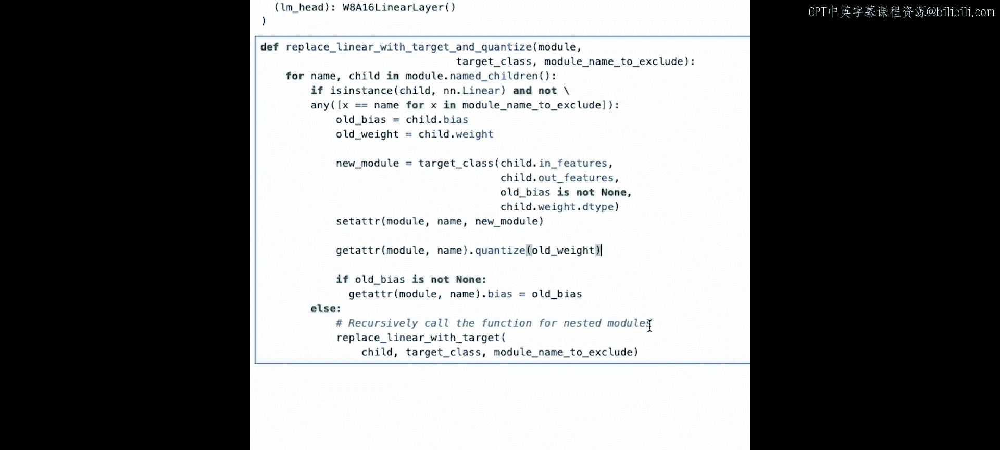

## 总结

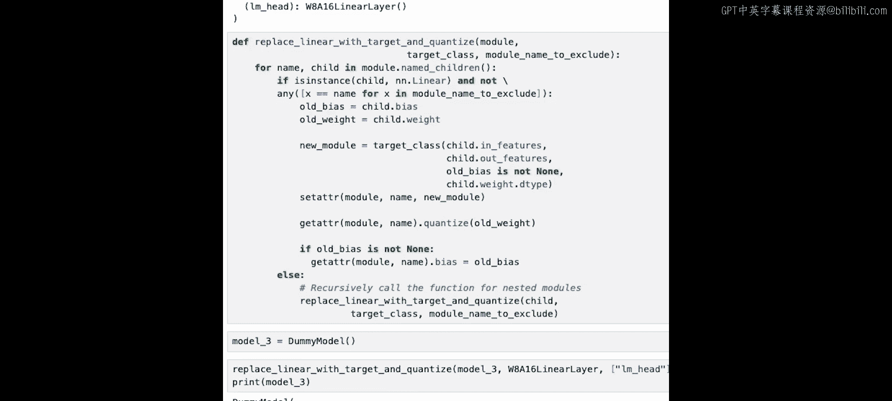

本节课中，我们一起学习了如何构建一个完整的量化流水线。我们首先创建了一个递归方法，用于遍历模型并用自定义的量化线性层替换标准的PyTorch线性层。接着，我们为该功能增加了排除特定模块（如语言模型头）的能力。最后，我们进一步完善了这个方法，使其在替换模块后能自动调用量化函数，从而完成从模块替换到权重量化的完整流程。现在，我们已经拥有了构建量化器所需的所有核心组件。