# 012：量化任意开源PyTorch模型 🚀

在本节课中，我们将学习如何将之前构建的量化器应用于真实、有用的开源模型，而不仅仅是测试用的虚拟模型。我们将以Hugging Face上的语言模型和视觉模型为例，演示完整的量化流程，并评估量化效果。

上一节我们介绍了量化器的核心实现，本节中我们来看看如何将其应用于实际场景。

## 代码生成模型的量化

首先，我们使用一个名为 `Salesforce/CodeGen-350M-mono` 的语言模型进行测试。这是一个拥有3.5亿参数、专门针对代码进行微调的模型。

以下是加载模型和分词器的代码：
```python
from transformers import pipeline, AutoTokenizer, AutoModelForCausalLM

model_name = "Salesforce/CodeGen-350M-mono"
tokenizer = AutoTokenizer.from_pretrained(model_name)
model = AutoModelForCausalLM.from_pretrained(model_name)
```

接着，我们使用文本生成管道进行代码补全任务测试：
```python
pipe = pipeline("text-generation", model=model, tokenizer=tokenizer)
prompt = "def print_hello_world():"
result = pipe(prompt, max_length=50)
print(result[0]['generated_text'])
```
模型成功生成了打印“Hello World”的Python函数，证明了其基础能力。

在量化之前，我们先查看原始模型结构。Transformer架构主要由线性层构成，这些层将是量化的主要目标。

以下是调用我们设计的量化API的代码：
```python
# 假设 quantize_model 是我们之前实现的函数
# 我们不量化语言模型头，以避免自回归生成过程中的误差累积
quantized_model = quantize_model(model, skip_layers=['lm_head'])
```

量化后，我们可以检查模型结构，确认线性层已被替换为 `W8A16Linear` 层，而语言模型头仍保持为原始的 `torch.nn.Linear` 层。

再次使用量化后的模型进行生成测试：
```python
pipe.model = quantized_model
result_quantized = pipe(prompt, max_length=50)
print(result_quantized[0]['generated_text'])
```
量化后的模型依然能够生成正确的代码，但需注意，对于更大的模型（例如超过60亿参数），量化误差在长序列生成中可能会累积，影响性能。这引出了LLM量化中的“精度退化”问题，已有许多论文（如LLM.int8、SmoothQuant、GPTQ等）致力于解决此问题，我们将在后续课程简要介绍其核心思想。

## 目标检测模型的量化

接下来，我们尝试量化其他模态的模型，以目标检测模型DETR为例。工作流程与之前类似。

首先，从Hugging Face加载DETR模型及其处理器：
```python
from transformers import DetrImageProcessor, DetrForObjectDetection

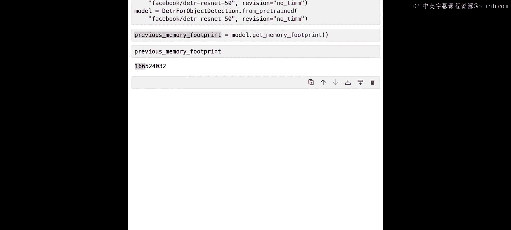

processor = DetrImageProcessor.from_pretrained("facebook/detr-resnet-50")
model = DetrForObjectDetection.from_pretrained("facebook/detr-resnet-50")
```

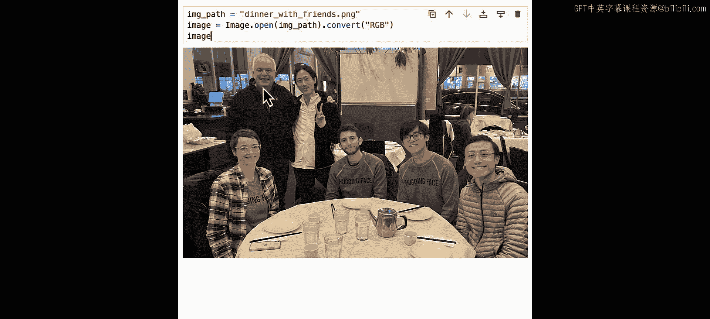

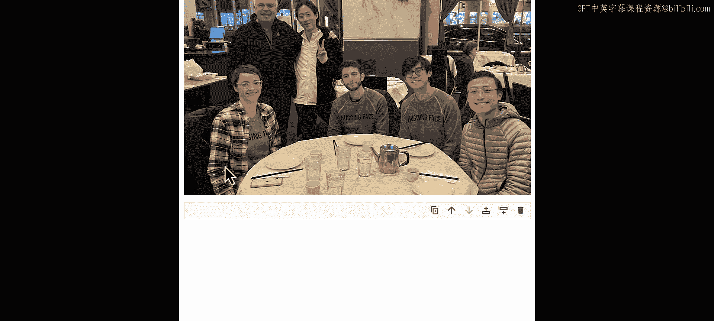

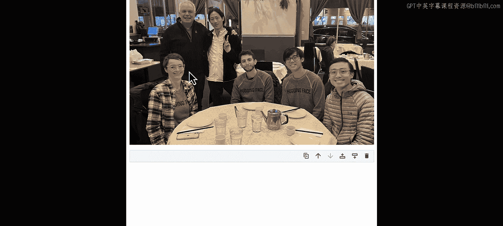

在量化前，我们先获取模型的内存占用并测试其性能。我们使用一张包含多人的晚餐图片进行目标检测。

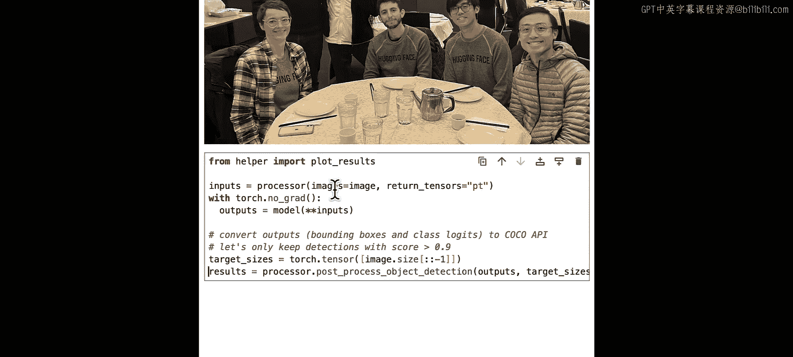

以下是运行检测并可视化结果的代码流程：
```python
image = Image.open("dinner_picture.jpg")
inputs = processor(images=image, return_tensors="pt")
outputs = model(**inputs)
# 后处理并绘制检测框
plot_results(image, outputs)
```
模型成功检测出了图片中的人物、桌子、手机、杯子等多种物体。

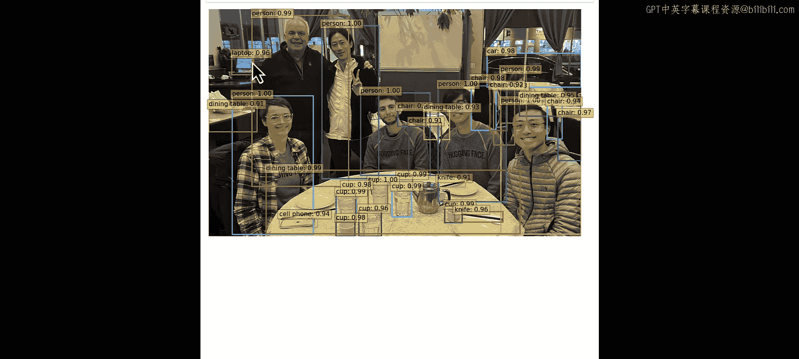

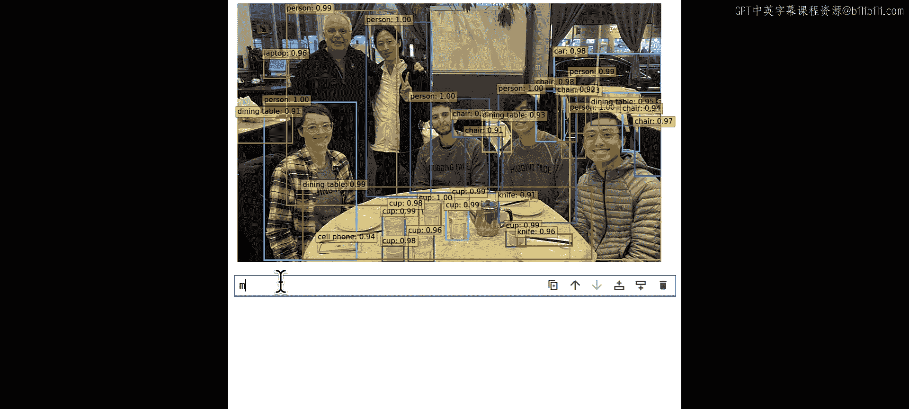

现在，我们来量化这个模型。DETR模型包含大量卷积层和线性层。

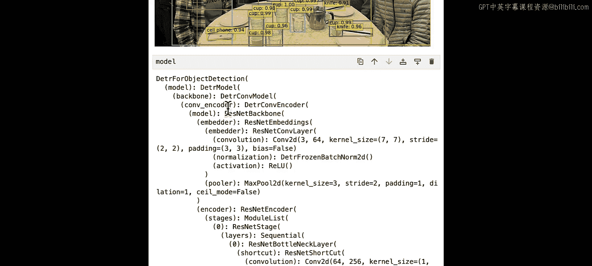

以下是模型结构检查的要点：
*   卷积层不会被量化。
*   编码器和解码器中的线性层将是量化的目标。
*   我们同样会避免量化最后的边界框预测器和分类器，以保持输出精度。

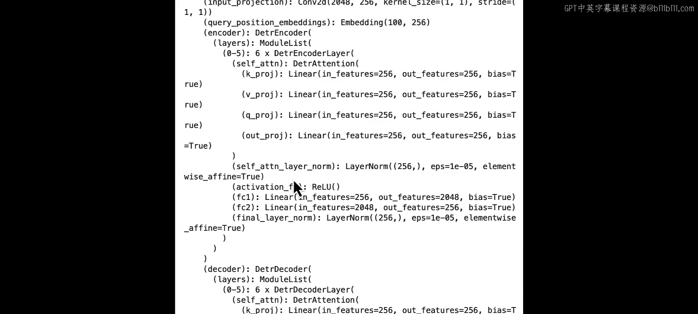

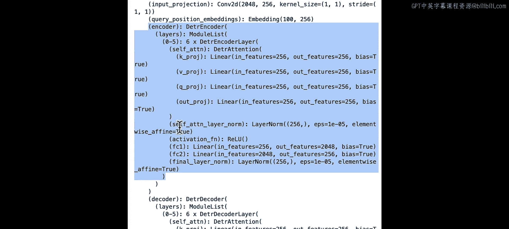

调用量化函数，并指定要跳过的层：
```python
skip_modules = ['bbox_predictor', 'class_labels_classifier']
quantized_detr_model = quantize_model(model, skip_layers=skip_modules)
```

量化后检查模型，确认卷积层保持不变，而编码器/解码器中的线性层已被正确量化。

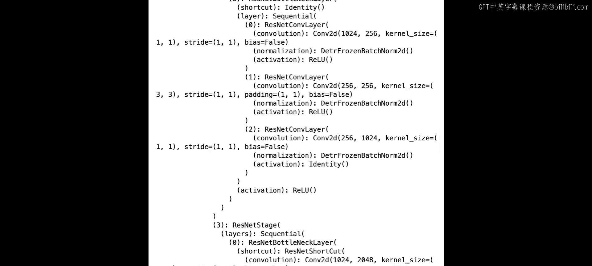

使用量化后的模型再次进行目标检测可视化，结果与原始模型基本一致，成功检测到了相同的物体实例。

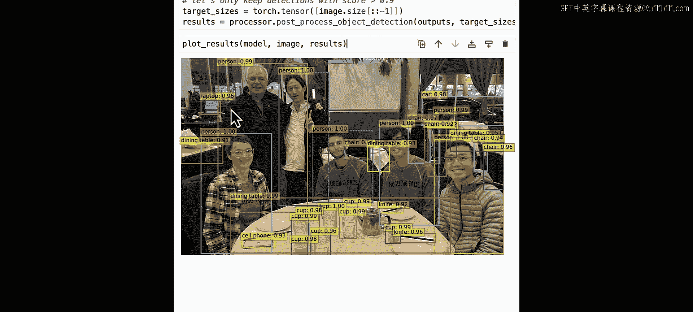

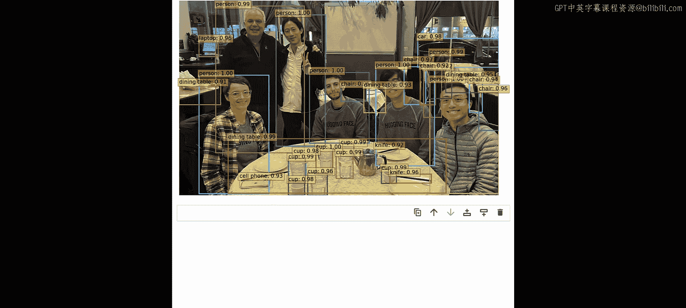

最后，我们对比量化前后的内存占用：
*   **量化前**：约 170 MB
*   **量化后**：约 120 MB

我们成功节省了大约 50 MB 的内存，压缩率约为 25-30%，同时基本保持了模型的性能。

## 实践与探索建议

现在，我邀请您亲自动手尝试。您可以：
1.  将此量化方法应用于其他模型或其他模态（如视觉、音频、多模态模型）。
2.  尝试“破坏”量化器，例如强制量化最后一层，观察这对模型性能有何影响。
3.  请注意，我们的量化API是原地修改模型的。如果您想比较量化前后的版本，需要在量化前保存原始模型状态，或在量化后重新加载原始模型。

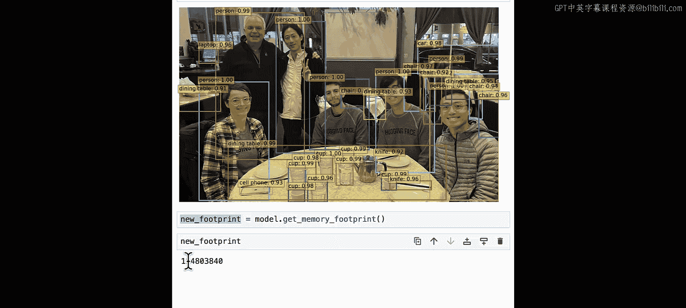

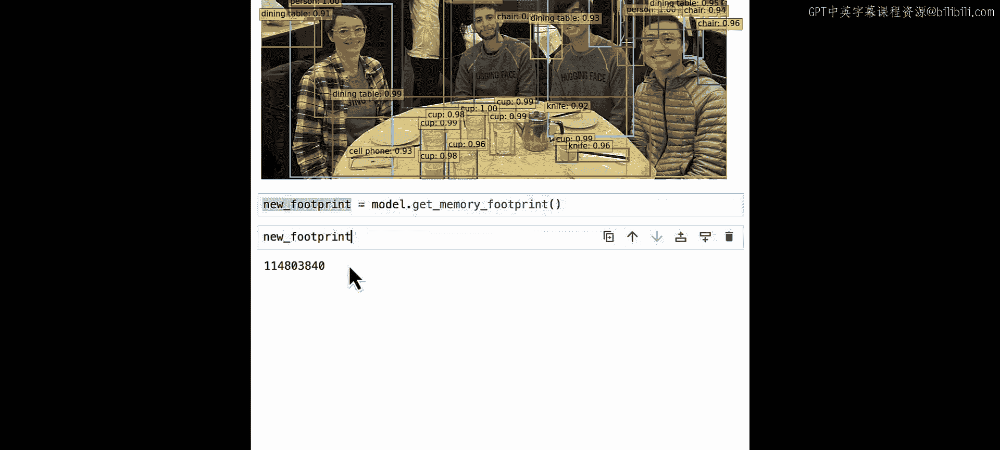

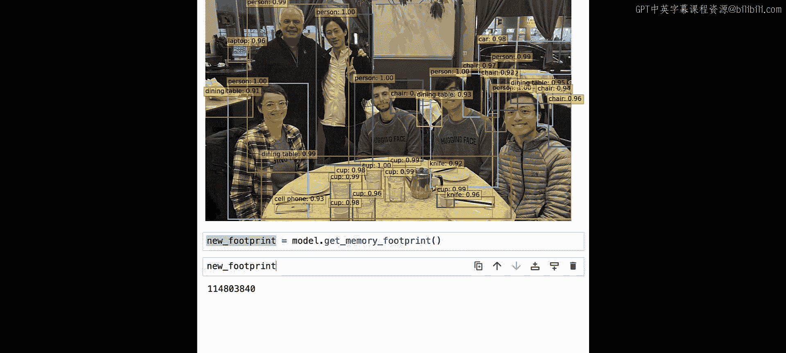

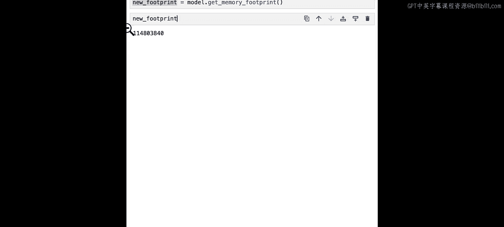

本节课中我们一起学习了如何将量化器应用于真实的开源PyTorch模型，包括代码生成模型和目标检测模型。我们验证了量化在减少内存占用的同时，能够较好地保持模型的核心功能，并指出了在大型语言模型上应用时需要注意的误差累积问题。