# 013：从Hugging Face Hub加载量化权重 🚀

在本节课中，我们将学习一种更优的模型量化部署流程。核心思路是：在一台资源充足的大机器上完成模型的量化，将量化后的权重上传到云端（如Hugging Face Hub），然后在资源受限的本地机器上直接加载量化后的模型，从而避免加载原始高精度模型对内存的巨大需求。

## 概述：优化量化模型部署流程

上一节我们介绍了如何使用量化API对模型进行量化。然而，当前的设计需要先以原始精度加载模型，这并非最优方案，因为它要求分配足够的内存来加载默认数据类型的模型，然后才能进行量化。

理想情况下，我们可以利用一台拥有较大内存的实例（大机器）来完成量化工作。量化完成后，将量化权重推送到云端，例如Hugging Face Hub。之后，便可以在本地机器上直接加载8位甚至更低精度的模型。本节我们将构建一个覆盖此方法的流程。

## 步骤一：在大实例上量化并上传模型

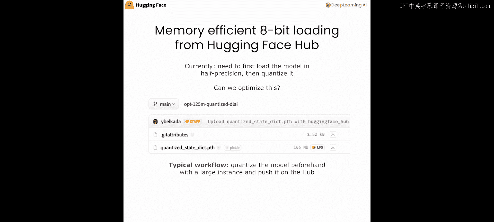

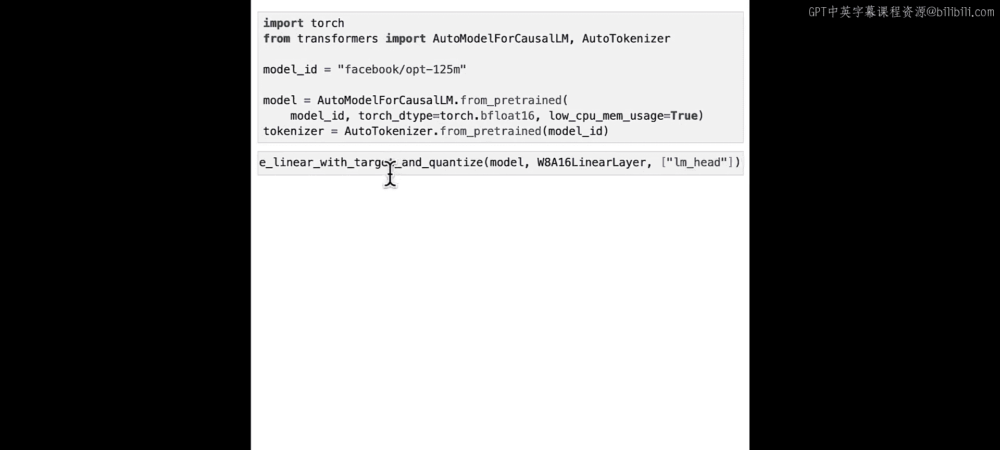

首先，我们假设处在一个拥有足够RAM的大实例中，可以在此量化模型。以下是为演示目的加载一个小模型（如OPT-125M）并进行量化的代码示例。

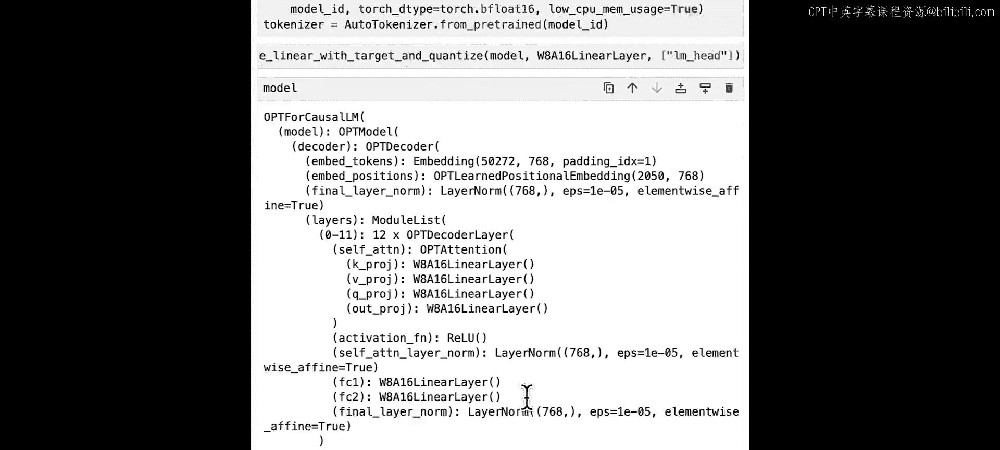

```python
# 加载原始模型
from transformers import AutoModelForCausalLM
model = AutoModelForCausalLM.from_pretrained("facebook/opt-125m")

# 初始化量化器并量化模型
from bitsandbytes.nn import Linear8bitLt
quantizer = ... # 初始化量化器
quantized_model = quantizer.quantize(model)
```

量化完成后，我们可以通过调用 `model.state_dict()` 来获取模型的量化权重字典，并将其保存到本地。

```python
quant_state_dict = quantized_model.state_dict()
torch.save(quant_state_dict, "opt125m_quantized.pt")
```

接下来，使用Hugging Face Hub库的工具方法将这些量化权重推送到Hub上。

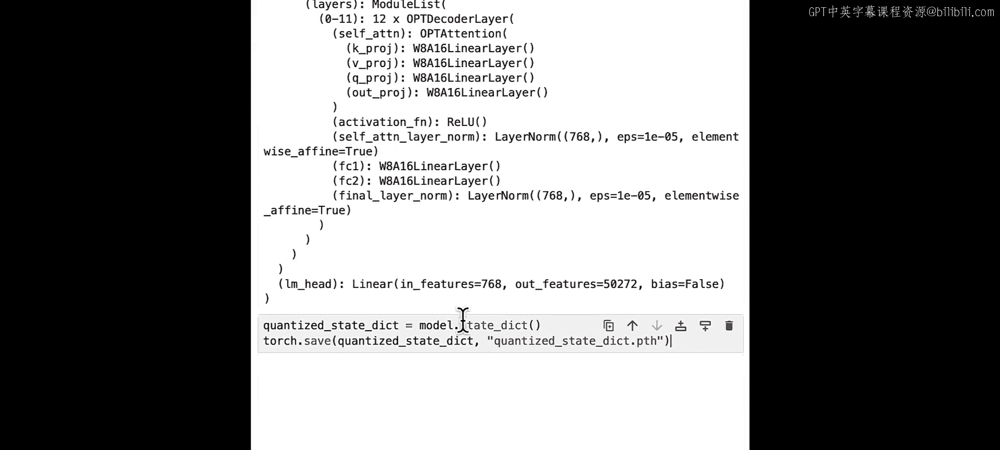

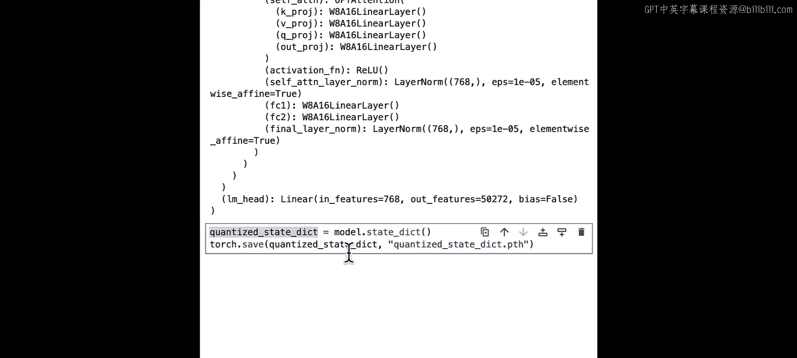

以下是使用API的示例代码：

```python
from huggingface_hub import HfApi, create_repo

api = HfApi()
# 创建仓库（也可通过网站手动创建）
create_repo(repo_id="your-username/opt125m-quantized-deeplearning-ai", private=False)
# 上传文件
api.upload_file(
    path_or_fileobj="opt125m_quantized.pt", # 本地文件路径
    path_in_repo="pytorch_model.bin", # 在仓库中的目标路径
    repo_id="your-username/opt125m-quantized-deeplearning-ai"
)
```

这样，你就在拥有GPU或大内存CPU的大实例上量化了模型，并将其推送到了Hugging Face Hub。

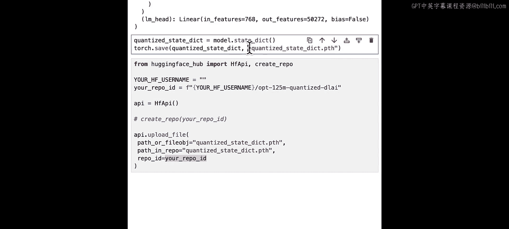

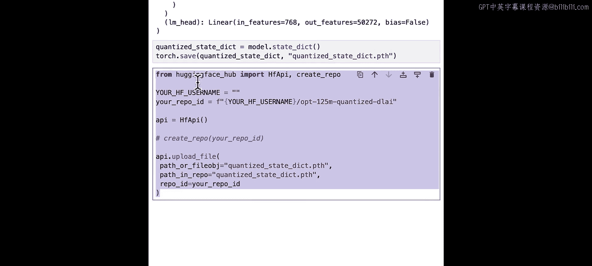

## 步骤二：在本地机器上加载量化模型

现在，转到本地机器。我们的目标是直接加载这些更小的量化状态字典，而无需先加载原始模型。这里将利用PyTorch的一个称为 **meta device** 的特性。

核心思想是：
1.  首先加载模型的“骨架”（即架构），以获取正确的模块结构，但权重不实际初始化（使用meta device）。
2.  将骨架中的所有线性层替换为我们的量化层。
3.  最后，加载量化状态字典，将权重精确分配到对应的模块上。

这种方式节省了内存，因为你无需先加载原始模型，而是直接通过加载状态字典来获得模型的量化版本，同时利用了PyTorch的meta device特性，只需加载模型骨架而非整个模型。

代码实现如下：

首先，加载模型配置以获取架构细节，然后在 `torch.device(‘meta’)` 的上下文管理器中初始化模型。

```python
from transformers import AutoConfig
import torch

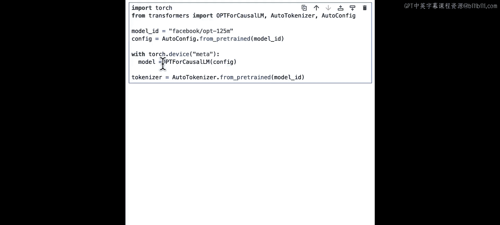

config = AutoConfig.from_pretrained("facebook/opt-125m")
with torch.device('meta'):
    model = AutoModelForCausalLM.from_config(config)
```

此时，如果尝试打印模型参数，你会看到类似下面的输出：

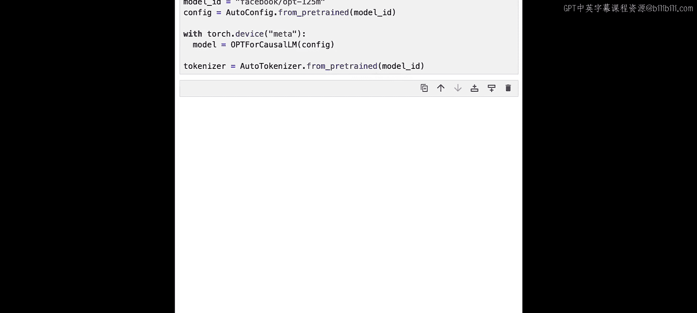

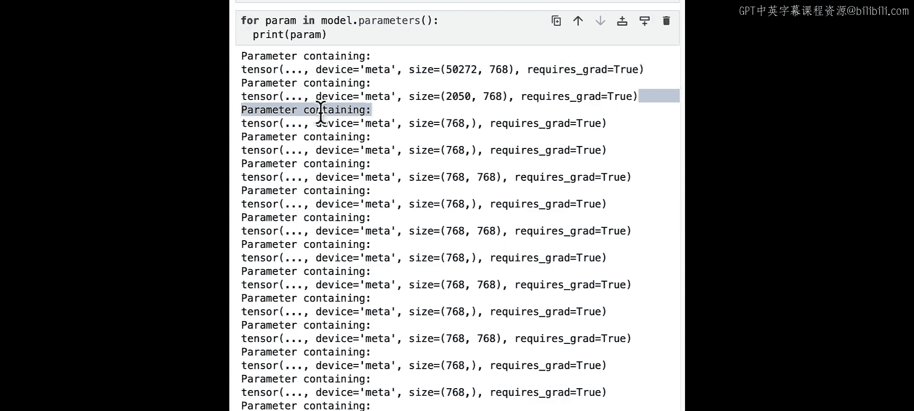

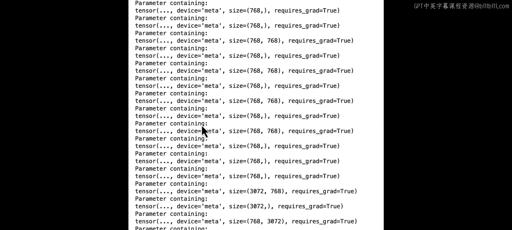

```
Parameter containing:
tensor(..., device='meta', dtype=torch.float32)
```

所有参数都是未初始化的元张量（metatensors），不占用任何RAM。你拥有了关于模型架构的所有信息（骨架），唯独没有权重。

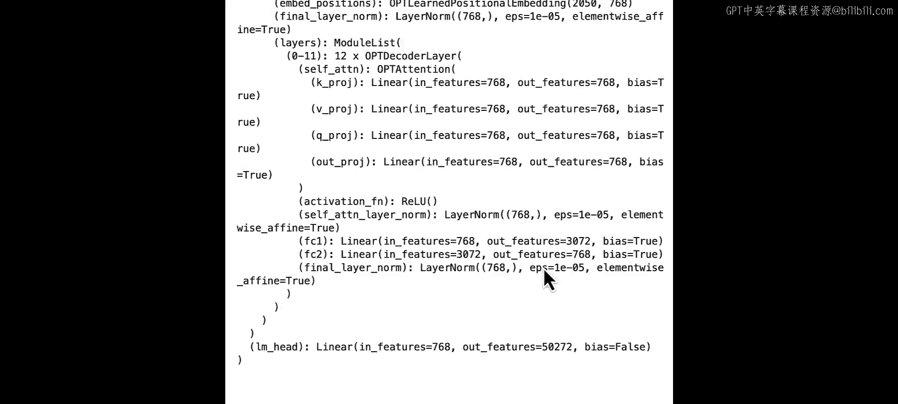

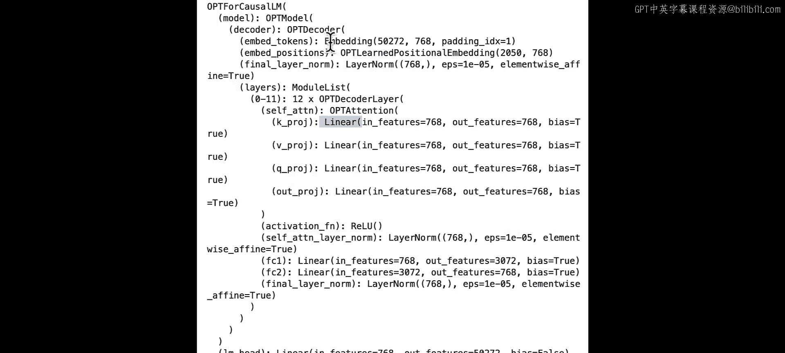

接着，我们将线性层替换为量化层（注意，这里不是调用量化函数，而是替换层类型）。

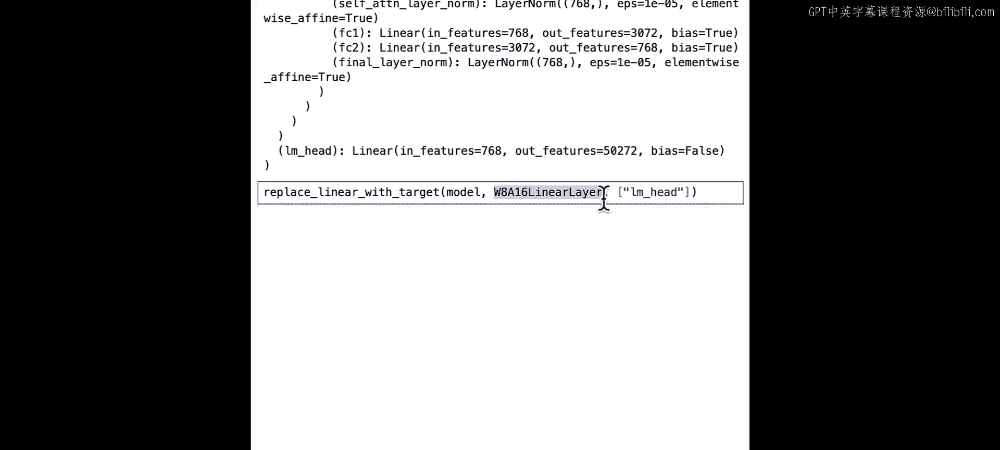

```python
from bitsandbytes.nn import Linear8bitLt

def replace_linear_with_quant(model):
    for name, module in model.named_children():
        if len(list(module.children())) > 0:
            replace_linear_with_quant(module)
        if isinstance(module, torch.nn.Linear):
            # 创建新的量化线性层，保持输入输出特征数不变
            new_layer = Linear8bitLt(module.in_features, module.out_features, bias=module.bias is not None)
            setattr(model, name, new_layer)
    return model

model = replace_linear_with_quant(model)
```

现在，下一步是加载量化状态字典。我们同样使用Hugging Face Hub库来下载文件。

```python
from huggingface_hub import hf_hub_download

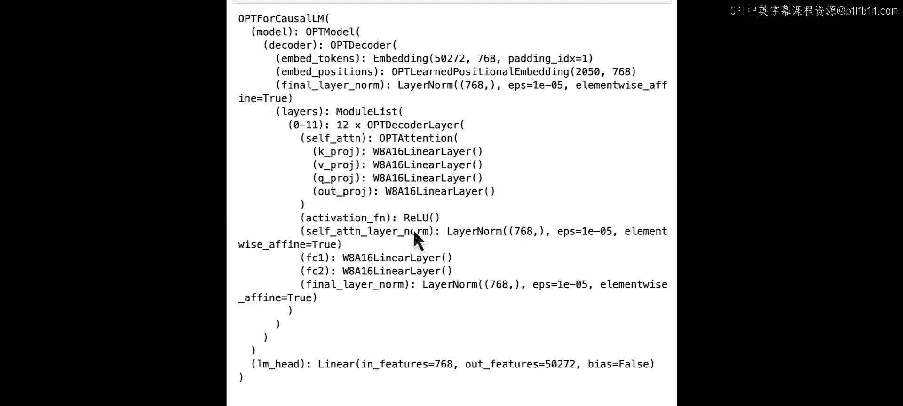

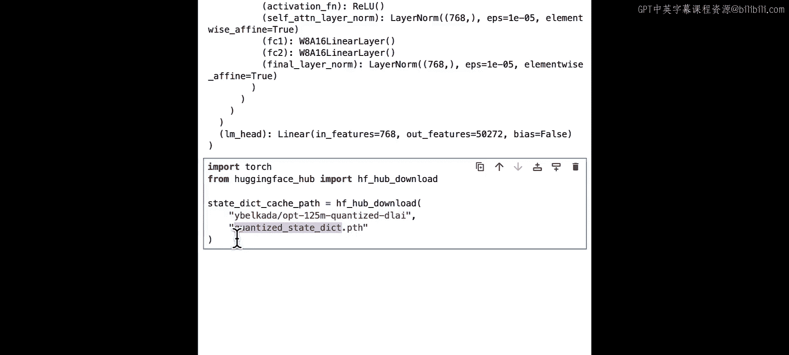

# 指定Hub上文件的路径进行下载，返回缓存路径
model_path = hf_hub_download(repo_id="your-username/opt125m-quantized-deeplearning-ai", filename="pytorch_model.bin")
# 加载状态字典
quant_state_dict = torch.load(model_path, map_location='cpu')
```

请注意，这个状态字典文件只有约166MB。对于一个1.25亿参数的模型，如果以半精度（FP16，每个参数2字节）存储原始状态字典，需要约250MB。而这里只有166MB，是因为大部分权重已被量化为8位精度（每个参数1字节），约125MB，其余部分可能是语言模型头或存储为float16的缩放因子。

由于模型加载在meta device上，我们需要以特定方式加载状态字典。

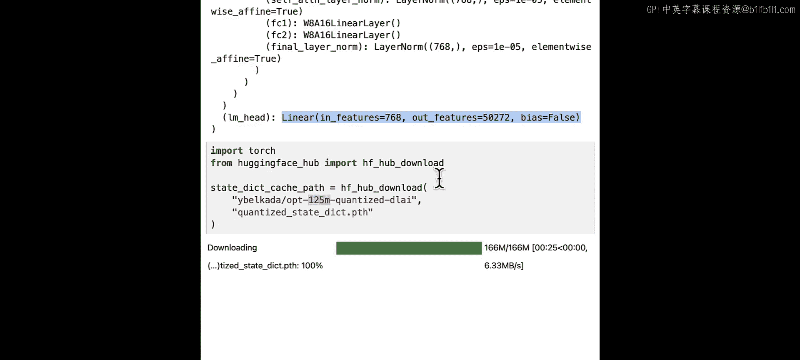

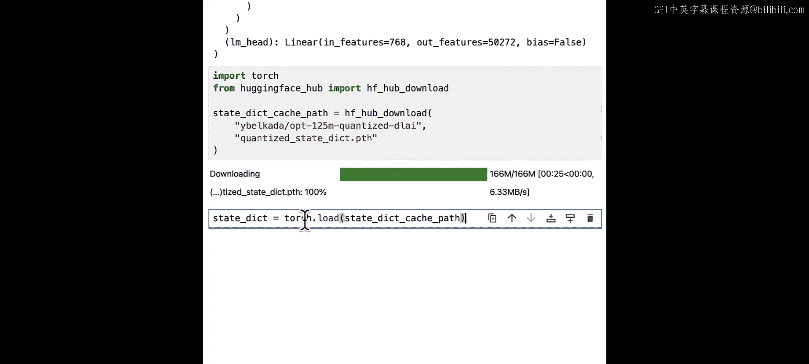

```python
model.load_state_dict(quant_state_dict, strict=True, assign=True)
```

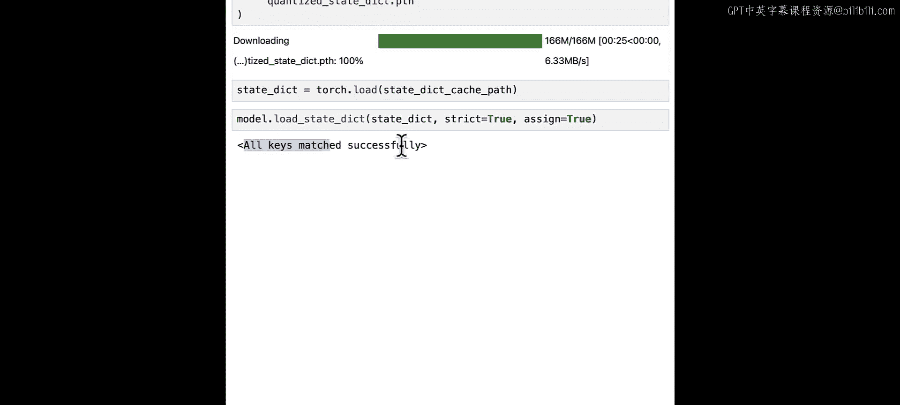

如果看到“All keys matched successfully”的提示，说明模型已成功加载，准备就绪。

现在，模型已经加载完毕，可以用于推理了。例如：

```python
input_text = "Hello today I'm a student of the University of the"
inputs = tokenizer(input_text, return_tensors="pt").to(model.device)
outputs = model.generate(**inputs)
print(tokenizer.decode(outputs[0]))
```

请注意，这是一个小模型，如果上下文提供不足，可能会产生一些重复输出。通过使用采样方法或尝试更大的量化模型，可以获得更好的结果。

## 总结与下节预告

本节课中，我们一起学习了一种高效的模型量化部署工作流。我们利用大机器完成量化，将权重上传至Hugging Face Hub，然后在本地通过 **PyTorch meta device** 加载模型骨架并注入量化权重，从而实现了低内存消耗的模型加载。

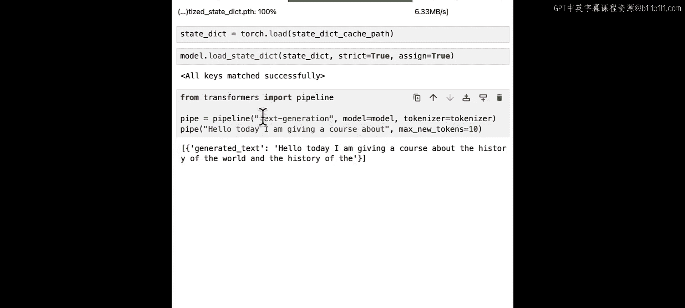

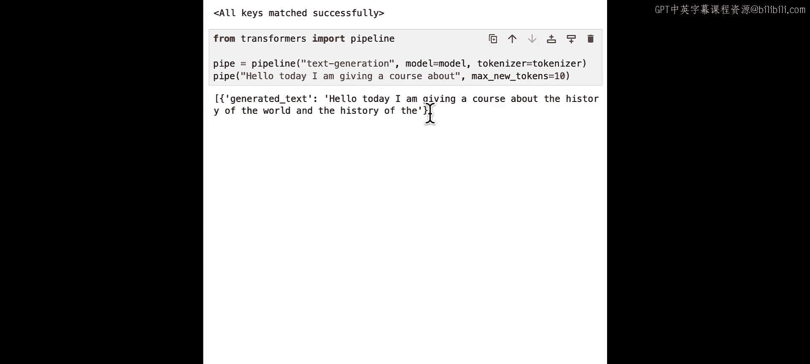

在下一节课中，我们将探讨量化中的一些挑战。例如，我之前提到的大语言模型中的**异常值特征**问题。此外，我们还将学习如何存储更低比特的权重（如2位或4位），动手实践权重打包技术，并介绍当前最先进的方法，以解决在量化大语言模型时遇到的异常值特征挑战。敬请期待下一课！